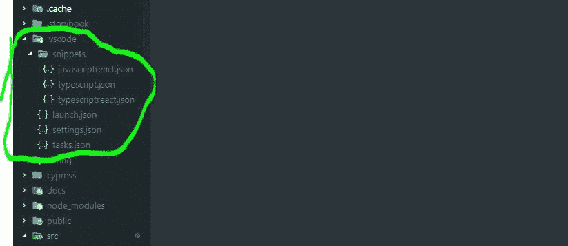

# 使用 Redux 构建 React 应用时不要做的 12 件事

> 原文：<https://betterprogramming.pub/12-things-not-to-do-when-building-react-apps-with-redux-3a278705de93>

## React 应用中的最佳实践

## 根据我在生产部门的工作经验，应该避免什么


当您构建 React 应用程序时，在代码架构方面，小项目通常比大项目更灵活一些。虽然按照适用于大型应用程序的最佳实践来构建小型应用程序并没有什么真正的*错误*，但是可能没有必要应用重大决策。应用程序越小，偷懒就越没问题。

然而，本文中的最佳实践旨在代表任何规模的 React 应用程序。

如果您从未有过在生产环境中构建应用程序的经验，那么这篇文章将帮助您做好准备。可能发生在你身上的最糟糕的事情是在你的工作中构建一个应用程序，却意识到你必须重构大量的代码才能更具可伸缩性和可维护性——尤其是如果你错过了*单元测试*！

相信我。我去过那里。我被无数次地告知要完成 x 乘 y，起初，我认为一切都很顺利，很壮观。我认为仅仅因为我的 web 应用程序*工作*并且感觉*快*，我在开发和维护我的代码方面做得很好。我知道如何使用 Redux，让用户界面组件按照预期的那样相互交互。减少和行动对我来说是一个简单的概念。感觉*无敌*。

*直到未来悄悄来临*。

几个月和 15 个以上的特性之后，事情变得无法控制。我使用 Redux 的代码不再容易维护。

*“为什么？*“你可能会问。

*“你不是无敌的吗？”*

嗯，我也这么想。它最终成为一颗等待灾难发生的定时炸弹。如果在大规模项目中正确使用，Redux 具有惊人的保持事物可维护性的能力。

如果你打算构建可伸缩的 React web 应用程序，请继续阅读，找出*不要做的事情。*

# 1.将动作和常数放在一个地方

你可能会看到一些 Redux 教程把常量和所有的动作放在一个地方。然而，随着应用程序变得越来越大，这很快就会成为一个麻烦。常量应该在一个单独的位置，像`./src/constants`，这样就有一个*位置来搜索，而不是多个位置。*

无论如何，创建一个单独的动作文件来表示*什么*或*如何*它将被使用，封装直接相关的动作，这肯定是*可以的*。如果你正在构建一个新的街机/RPG 游戏，并且包括角色类别*战士*、*女巫、*和*射手*，如果你像这样放置你的动作，它将更易于维护:

> *src/actions/warrior . js
> src/actions/mosfess . js
> src/actions/archer . js*

而不是类似于:

> *src/actions/classes.js*

如果这款应用最终变得越来越大，可能更好的方法是这样做:

> *src/actions/warrior/skills . js
> src/actions/女巫/skills . js
> src/actions/射手/skills.js*

如果这是一个真实的场景，如果我们这样组织它们，更大的画面可能会变成这样:

> src/actions/warrior/skills . js
> src/actions/warrior/quests.js
> src/actions/warrior/equipment . js
> src/actions/女巫/skills . js
> src/actions/女巫/quests . js
> src/actions/女巫/equipment . js
> src/actions/射手/skills . js
> src/actions/射手/quests . js

女巫行动的一个例子是:

> *魔法/动作/女巫/技能*

> *src/动作/女巫/装备*

我们这样做的原因是最有可能的是*总是*有新的特性要添加，并且你必须为它们做好准备，因为你的文件会变得更加臃肿！

开始时可能会觉得多余，但随着项目越来越大，这些方法将开始发光。

# 2.将异径管放在一个地方

当我的减速器看起来像这样:

很明显，很快*就会产生一大堆乱七八糟的东西，所以最好保持你的状态结构尽可能的简单和扁平化，或者试着组合所有的 reducers。*

一个巧妙的技巧是创建一个生成缩减器的高阶缩减器，[将每个包装的缩减器映射到一个从动作类型到处理程序的对象映射](https://redux.js.org/recipes/reducing-boilerplate#generating-reducers)。

# 3.给变量起个糟糕的名字

给变量命名听起来很简单，但实际上这是编写代码时最难做到的事情之一。

这本质上是一种干净的编码实践，这个术语存在的原因是它在实践中的应用非常重要。给你的变量起个糟糕的名字是让你的团队成员和你未来的自己受苦的好方法！

你有没有试过编辑别人的代码，结果却很难理解代码到底想做什么？你有没有运行过别人的代码，而结果却和你预想的不一样？

我敢打赌，代码的作者正在应用*肮脏的代码*实践。

最糟糕的情况是不得不在大型应用程序中经历这种情况，因为它发生在多个领域。

让我给你一个我真实经历过的情况:

当我接到一个在表格列表中添加和显示每个医生的附加信息的任务时，我开始从应用程序代码中编辑一个现有的 React 钩子。当时，当他们选择(点击)一个医生时，医生的信息被保存到某个状态，这样我们就可以在下一次 API 请求时发送信息。

一切都很好，除了我花了比我应该花的更多的时间去寻找*代码中的*部分。

此时，我在脑海中寻找类似于 *info* 、 *dataToSend* 、 *dataObject* 、 *doctorProfile* 或任何与刚刚收集的数据相关的词语。10-15 分钟后，我找到了实现这个流程的部分，它所在的对象被命名为`paymentObject`。当我想到支付对象时，我会想到 CVV、后 4 位数字、邮政编码等。在 11 个属性中，只有*三个*与支付有关:*收费方式*、*支付档案 id* 和*优惠券*。

*更糟糕的是，之后试图融入我的变化实在是太难了。*

简而言之，尽量避免像这样命名函数或变量:

# 4.中途改变数据/类型结构

我犯过的最大的错误之一是在已经建立的应用程序流程中改变数据/类型结构。新的数据结构将是性能的巨大提升，因为它利用对象查找来抓取内存中的数据，而不是映射到数组上。但是已经太晚了。

请不要这样做，除非你真的了解所有将会受到影响的领域。

## 会有哪些后果？

如果某个东西从数组变成了对象，那么应用程序的多个区域都有失去功能的风险。我犯的最大错误是*认为*我已经在脑海中计划好了会受到结构化数据更改影响的应用程序的每个部分，但是*总会有一个地方被遗漏*。

# 6.不使用代码片段进行开发

我曾经是 Atom 的粉丝，但是我转向了 VScode，因为它提供了我认为在开发流程中非常有价值的特性，比如[项目片段](https://marketplace.visualstudio.com/items?itemName=rebornix.project-snippets)。

如果您正在使用 VSCode，我强烈建议您下载它。这个扩展允许您为该项目的每个工作区声明定制的代码片段。它的工作方式与默认情况下 VScode 中内置的[用户片段](https://code.visualstudio.com/docs/editor/userdefinedsnippets)功能完全一样，除了您在项目中创建一个`.vscode/snippets/`文件夹，如下所示:



# 7.忽略单元/e2e/集成测试

随着应用程序变得越来越大，在没有任何测试的情况下编辑现有代码变得越来越可怕。您可能最终编辑了位于 src/x/y/z/的文件，并决定将更改推向生产，但是如果更改影响了您没有注意到的应用程序的另一部分，错误将一直存在，直到真正的用户在浏览时发现它，因为您没有任何测试来提前提醒您。

# 8.跳过头脑风暴阶段

开发人员经常跳过头脑风暴阶段，因为他们不编码，特别是当他们有一周的时间来开发一个功能时。然而，从经验来看，这是最重要的一步，将在未来为您和您的团队节省大量时间。

## 何必头脑风暴呢？

应用程序越复杂，开发人员就越需要管理应用程序的某些部分。头脑风暴有助于减少你重构代码的次数，因为你已经*计划好了*什么会出错。很多时候，开发人员几乎没有时间坐下来应用所有整洁的实践来进一步增强应用程序。

这就是为什么头脑风暴很重要。您考虑架构中的所有代码设计和您需要的增强，这样您就可以从一开始就用一种战略性的方法来处理它们。不要养成过度自信，把一切都计划在脑子里的习惯。如果你这样做，你将无法记住所有的事情。一旦你做错了，更多的事情就会像多米诺骨牌效应一样出错。

头脑风暴也会让你的团队变得更容易。如果他们中的一个人陷入了一项任务，他们可以参考他们从一开始就有的头脑风暴，它可能已经存在了。

你在头脑风暴中做的笔记也可以为你和你的团队提供一个*议程*，并在开发应用程序时帮助你轻松地提供一个你当前进度的一致的感觉。

# 9.没有预先确定 UI 组件

如果你要开始构建你的应用程序，你应该决定你希望你的应用程序是什么样子的。有几个工具可以帮助您创建自己的模型。

我经常听说的一个模型工具是 [Moqups](https://moqups.com/) 。它很快，不需要任何插件，内置于 HTML5 和 JavaScript 中。

完成这一步非常有助于为您提供将要出现在您创建的页面上的信息和数据。开发你的应用程序将变得轻而易举。

# 10.没有规划数据流

几乎应用程序的每个组件都与某种数据相关联。一些将使用他们自己的数据源，但是大多数将从树中更高的位置提供。对于应用程序中与多个组件共享数据的部分，最好将数据放在树中更高的位置，在那里它将充当一个集中的状态树。这就是 [Redux](https://redux.js.org/) 的力量来拯救的地方:)

我建议列出数据将如何在应用程序中流动的列表。这将帮助你为你的应用程序创建一个坚实的心智和书面模型。基于这些值，你的减速器应该很容易建立。

# 11.不使用存取函数

随着应用程序越来越大，组件的数量也越来越多。而且当组件数量增加时，你使用*选择器* (react-redux ^v7.1)或者 *mapStateToProps* 的次数也会增加。如果您发现您的组件或挂钩经常在应用程序的几个部分中选择类似于*use selector((state)=>state . app . user . profile . demographics . languages . main)*的状态片段，那么是时候考虑在一个共享位置创建*访问器函数*，组件/挂钩可以从该位置导入和使用。这些访问函数可以是过滤器、解析器或任何其他数据转换函数。

以下是一些例子:

> *src/访问器*

**连接**版本

> *src/components/view user languages*

**使用选择器**版本

> *src/components/view user languages*

保持这些功能*不变、*不受*副作用的影响*也是非常重要的，正如这里的[所涵盖的](https://redux.js.org/faq/immutable-data#why-is-immutability-required-by-redux)。

作为替代，另一个流行的解决方案是[重新选择](https://github.com/reduxjs/reselect)，正如这里的[所解释的那样](https://redux.js.org/recipes/computing-derived-data)专门为 redux 创建和优化。如果您像上面提到的任何访问函数一样使用它，您将获得计算值被缓存的额外好处——当其中一个参数改变时，这些函数将只*重新计算。组件中的计算越昂贵，这个解决方案就越值得推荐。(感谢 [healqq](https://medium.com/u/3dda21851bf7?source=post_page-----3a278705de93--------------------------------) )。*

# 12.不控制具有析构和传播属性的道具中的流

使用`props.something`相对于`something`有什么好处？

不破坏:

```
const Display = (props) => <div>{props.something}</div>const Display = ({ something }) => <div>{something}</div>
```

有了析构，你不仅使你的代码对你自己和他人来说更可读，而且你还可以直接决定什么该进什么该出。当其他开发人员将来编辑您的代码时，他们不必扫描您的 render 方法中的每一行代码来找到组件正在使用的所有道具。

您还受益于从一开始就声明默认属性的能力，而不必添加任何代码行:

```
const Display = ({ something = 'apple' }) => <div>{something}</div>
```

你以前可能见过这样的东西:

这不仅有点难以阅读，而且在这个组件中还出现了一个无意的错误。如果`App`也渲染孩子，你有*道具.孩子*被渲染两次。这会导致重复。当与除你之外的开发团队一起工作时，这些错误可能会意外发生，特别是如果他们不够小心的话。

相反，通过析构 props，组件可以直奔主题，减少不必要的错误:

阅读:[构建 React 应用时不要做的 10 件事](https://medium.com/@jsmanifest/10-things-not-to-do-when-building-react-applications-bc26d4f38644?source=your_stories_page---------------------------)

# 结论

就这样，伙计们！我希望这些建议对你有所帮助。如有任何问题和/或顾虑，请随时给我发评论/信息！下次见！