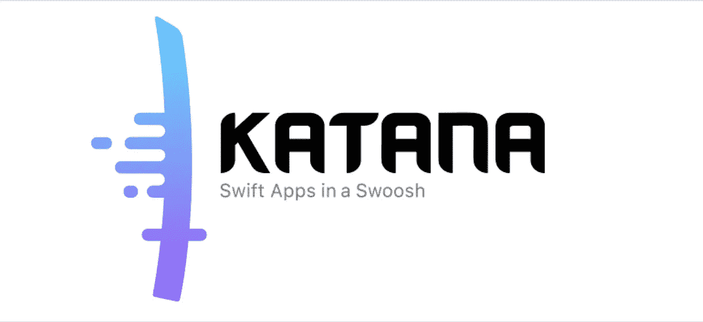
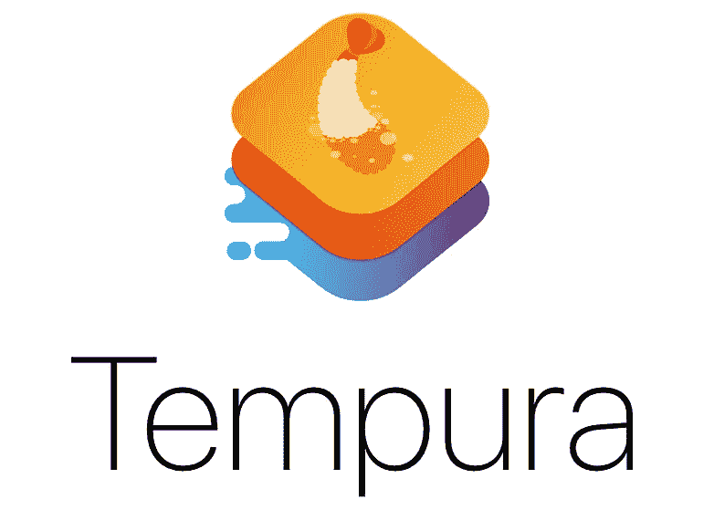
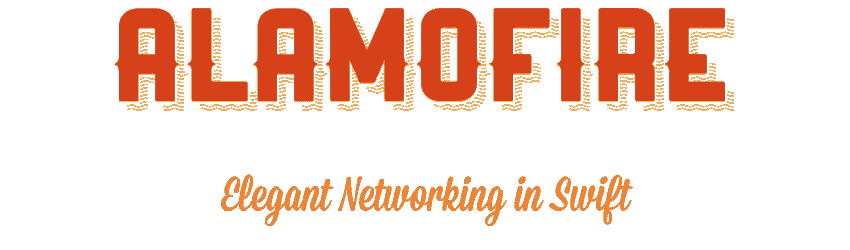
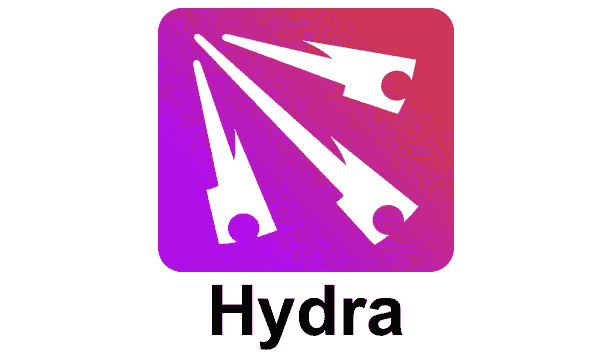
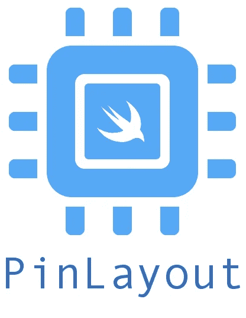
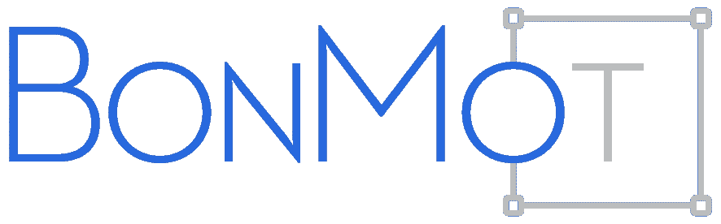
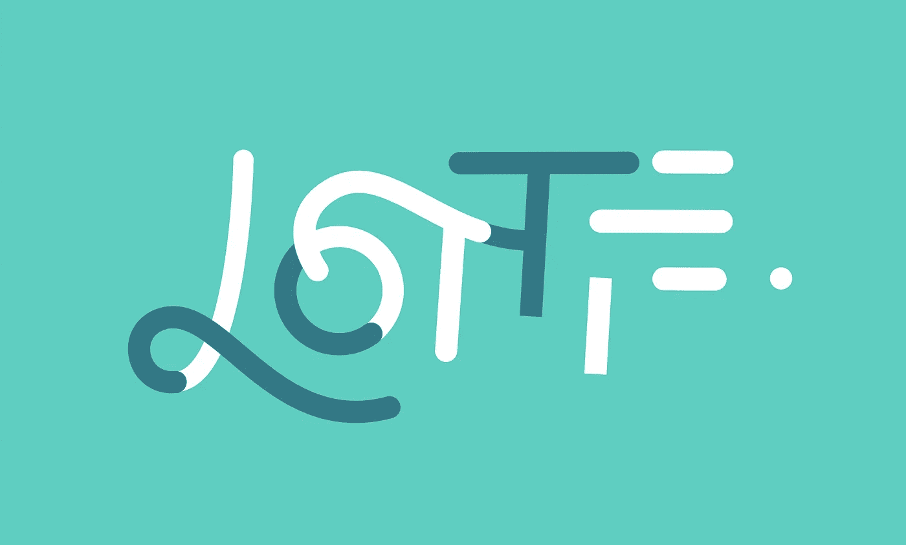
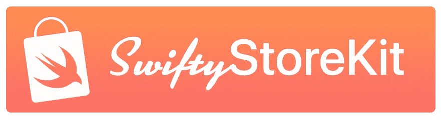
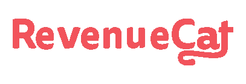
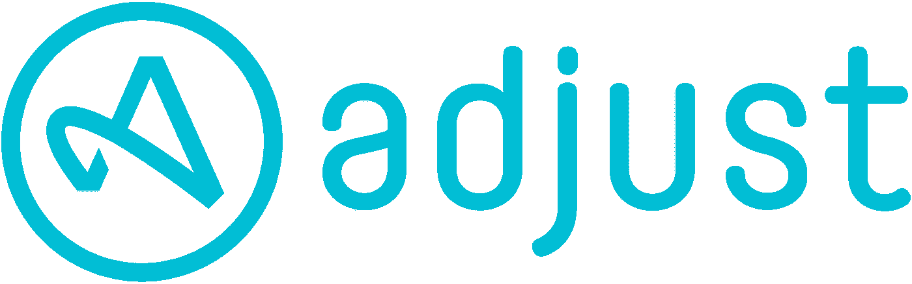

# 您的应用程序的 12 大 iOS 库

> 原文：<https://betterprogramming.pub/12-top-ios-libraries-for-your-app-2e9e9d236d3e>

## 不要多此一举，你的问题已经解决了

照片由[塞缪尔·索萨](https://unsplash.com/@samucabarbosa?utm_source=medium&utm_medium=referral)在 [Unsplash](https://unsplash.com?utm_source=medium&utm_medium=referral) 拍摄

工程学的首要原则之一是不要重新发明轮子。当在一个项目中工作时，每个人都建立在别人写的代码之上。

在非常基础的层面上，我们都使用苹果提供的框架:`Foundation`、`UIKit`、`StoreKit`等等。

最重要的是，每个应用程序都有一层与其他应用程序相同的问题。众所周知的问题由成千上万的开发人员使用的库来解决。这有助于使这些库成为一个健壮的、经过测试的、可靠的软件。多亏了这些库，我们可以专注于应用程序的业务逻辑，不再担心网络和持久性等底层任务。

今天，我想谈谈我们在[Bending soaks](http://bendingspoons.com)使用的最重要的开源库——你也可以使用的库。我将根据它们解决的问题对它们进行分类。所以，我们开始吧！

# 体系结构

我们需要做出的第一个决定是什么是我们应用程序的最佳架构。苹果力推 [MVC](https://en.wikipedia.org/wiki/Model%E2%80%93view%E2%80%93controller) 。虽然这对于小型项目来说是一个不错的选择，但是它的伸缩性不好。对于更大的项目，我们正在习惯于 [MVVM](https://en.wikipedia.org/wiki/Model%E2%80%93view%E2%80%93viewmodel) ，如果可能的话，**单向数据流**。

这种架构伸缩性很好，支持一些高级特性，如模块化和可测试性。然而，它需要一些样板文件。图书馆有助于减少这种样板文件。

## 武士刀和天妇罗

这是我们在 Bending 勺子内部开发的两个库。 [Katana](https://github.com/BendingSpoons/katana-swift) 实现了单向数据流的概念，并提供了让信息从状态流向 UI 的基础设施。[天妇罗](https://github.com/BendingSpoons/tempura-swift)是 MVVM 设计模式的实际实现，非常依赖武士刀。

你可以在本系列文章的[中阅读更多关于如何用武士刀和天妇罗建立一个项目的信息。](https://medium.com/swlh/katana-and-tempura-adding-ui-and-logic-f03026ee47e0?source=your_stories_page-------------------------------------)

## 可组合建筑(TCA)

另一个单向数据流[库](https://github.com/pointfreeco/swift-composable-architecture/)更加关注可组合性和可测试性。它比武士刀和天妇罗更严格地遵循[还原](https://redux.js.org/tutorials/fundamentals/part-2-concepts-data-flow)的方法。然而，就其基本形式而言，它在很大程度上依赖于 Combine，并且附带了对 SwiftUI 的开箱即用支持(尽管您可以通过 UIKit 使用它，编写一个小的包装器)。

你可以在这个[系列文章](https://medium.com/swlh/an-app-with-sca-flow-testing-ada82518d313)中阅读更多关于如何使用这个架构的内容。

# 建立工作关系网

网络是另一个大话题。这个比赛真正的冠军只有一个:[阿拉莫菲尔](https://github.com/Alamofire/Alamofire)。Alamofire 是 AFNetworking 的快速移植，这是一个来自旧 Objective-C 世界的历史库。

它在很大程度上简化了配置网络请求和锁定证书，并且抽象了其他几个任务。从版本 5 开始，它不支持后台下载，但是这个用例出现的频率比您预期的要少。

***注****:2019 年 9 月，苹果发布了 Combine。2020 年 9 月，联合收割机改进了很多。有了这个新框架，对网络库的需求将会有所减弱。如果你打算为 iOS 13 和更高版本创建，那么你可能不需要 Alamofire。*

# 承诺

与网络问题紧密相关的——但不仅仅是这个——是异步代码。闭包是很好的回调——肯定比 Objective-C 的块好——但是它们仍然会产生著名的[回调地狱](http://callbackhell.com/)。

[承诺](https://en.wikipedia.org/wiki/Futures_and_promises)是处理异步代码时使用回调的更好选择。承诺是一个异步调用的包装器，*承诺*最终包含一个预定义类型的值。它们通常带有`async` / `await`关键字(或 Swift 中的方法)——这些关键字让代码等待承诺的执行，并在承诺持有值时让处理继续进行。承诺最好的一点是，它们允许我们将异步代码*写成同步代码*。

你可以在本文中阅读更多高级承诺的设计模式。

**注**:2021 年 9 月，苹果可能会发布一个版本的 Swift，直接支持该语言的`async` / `await`。你可以在这里阅读技术建议书[。如果是这样的话，promises 图书馆可能会在几年内失宠。](https://github.com/apple/swift-evolution/blob/main/proposals/0296-async-await.md)

## 水螅

如果你尝试过我们喜爱的武士刀和天妇罗，你会看到他们下载了一个名为 [Hydra](https://github.com/malcommac/Hydra) 的库。这个库实现了 Promise 模式。它得到了很好的维护，很好的记录，并且易于使用。试试看！

## 谷歌/承诺

[Google/Promises](https://github.com/google/promises) 是另一个知名的 Promises 库。它由 [Firebase](https://firebase.google.com/) 使用，所以如果你已经在使用这种无服务器技术，你可以节省一个依赖。

我只尝试了一次这个库，发现它比 Hydra 稍微难用一点，但是这两者在功能上几乎是一样的。

# 图像加载

迟早，你需要从一个远程 URL 加载一个图像。令人惊讶的是，这是 UIKit 长期缺失的特性，而其他语言提供了原生支持这种行为的组件(无论是 [Flutter](https://api.flutter.dev/flutter/widgets/Image-class.html) 还是 [React Native](https://reactnative.dev/docs/image) 都有可以从远程 URL 加载图像的组件)。

## 阿拉莫菲影像

这是一个额外的框架，如果我们已经在使用 Alamofire，我们可以决定导入它。 [AlamofireImage](https://github.com/Alamofire/AlamofireImage) 依靠 Alamofire 下载并缓存图像。

我从来没有直接使用过这个库，但是它值得一提，因为它与 Alamofire 有着紧密的联系。

## 翠鸟

这是*的*镜像加载[库](https://github.com/onevcat/Kingfisher)，Github 上惊人的 18.1k 星。它拥有加载图像所需的所有功能。完成、取消、自定义转换器、占位符等等。

它非常容易使用，非常容易在你的应用程序中采用——它基于 UIKit 的`UIImageView`！

# 布局

在我个人看来，创建布局是 UI 编码中最无聊的任务之一。由于我们在用代码编写布局时必须处理的抽象层次较低，这项任务甚至更加枯燥。不要让我从约束开始——它们比基于基本`frame`的布局复杂得多，苹果已经创造了一种小型语言来更容易地描述它们！

幸运的是，我们可以利用[引脚布局](https://github.com/layoutBox/PinLayout)。这个库允许我们以声明的方式定义布局，描述视图相对于父视图或其兄弟视图的位置。这个库非常强大，可以轻松实现复杂的布局。

# 属性字符串

`AttributedStrings`是苹果的又一个冗长而繁琐的 API。它们依赖于属性字典来配置字符串的呈现方式，这使得很难记住这些键以及如何使用它们。

此外，如果您需要实现不同样式的标签，普通的`AttributedStrings`API 会强制您处理范围和子范围。这些 API 非常容易出错。

你可以在这篇文章的[中找到所有`AttributedString`属性的列表。](https://medium.com/swlh/nsattributedstring-unveiled-6c8fb5dce86a?source=your_stories_page-------------------------------------)

为了减少冗长和增加安全性，BonMot 是我的首选库。有了这个库，我们可以创建包含样式定义的值，然后我们可以在我们的应用程序中重用这些样式。它支持基于 XML 的语言在相同的字符串中定义不同的样式，从而消除了所有的复杂性！

# **动画**

UIKit 提供了一对很好的 API 来实现动画。我们可以在用于从一个值到另一个值的简单补间的`UIView.animate`和用于更精细调整的方法的`animateKeyframes`之间进行选择。然而，这两种 API 都需要在开发方面做一些工作。此外，复杂的动画可能很难用代码优先的方法实现。

幸运的是，Airbnb 来帮忙了。他们开发了 [Lottie](https://airbnb.design/lottie/) ，一个将 After Effects 的动画集成到我们的应用程序中的库。这些步骤是:

1.  `import Lottie`。
2.  给我们的`UIView`添加一个`AnimationView`组件
3.  加载一个`.json`。
4.  播放`start`(通过调用`play()`方法。)

***注*** *:如果你没有动作设计师，可以从这个* [*网站*](https://lottiefiles.com/featured) *的庞大动画库中选择。*

# InApp 采购

如今，应用内购买(iAP)是一种货币化标准。事实上，许多公司的整个货币化战略都是基于它们。尽管如此，应用内购买还是很难实现。

iAP APIs 不是闹着玩的。您有一个管理器组件(和一个委托)来从 apple 服务器检索产品列表(您只获得它们的 id！).然后，您需要将这些 id 与在 AppStore Connect 上手动创建的一组元信息进行匹配——这些元信息不容易查询。

您还有一个支付队列(与另一个代理一起)来执行购买/恢复，并监听事务状态的变化。

最后，你应该验证购买的食谱。如果我们考虑不同的店面、要交付的特殊内容或必须解锁的应用程序部分，一切都会变得更加复杂。

## SwiftyStoreKit

让我们通过使用 [SwiftyStoreKit](https://github.com/bizz84/SwiftyStoreKit) 来忘记所有 iAP 的复杂性。这是一个 Swift 库，为您处理所有管理人员和代表。几年前，我们在播放服务中使用它来实现支付，该库为我们提供了很好的服务。

# 奖励:收据验证服务

验证收据是一件复杂的事情，出于安全原因，应该在服务器端完成。很可能你没有后端(使用一些无服务器技术，如 Firebase)，或者你不知道如何实现后端。有一些服务提供收据验证功能，因此您不必担心实现它们。

我从来没有使用过这些服务，所以我不能保证它们工作良好。然而，它们看起来很有趣，而且可以让你省去很多 iAP 的麻烦。相信我:每次我们不得不与苹果生态系统的这一部分合作时，它总是一场血战。

## 收入类别

RevenueCat 是一个提供收据验证和一些其他相关服务的服务。它提供了几个集成，免费层允许每月免费处理 10k 笔交易。使用最低层(0.99 美元)，您每月可以免费获得高达 1 万美元的收入。

## 调整

[Adjust](https://help.adjust.com/en/article/purchase-verification-sdk) 是一项主要用于对来自广告的安装进行归因的服务。然而，它也为 iOS 和 Android 提供收据验证服务。

# 结论

在这篇文章中，我展示了一组我们在 [Bending 勺子](http://bendingspoons.com)使用或者曾经使用过的库。它们简化了众所周知的问题，让我们专注于应用程序的业务关键部分。它们是构建强大应用程序的坚实起点。

我认为任何人，甚至是独立开发者，都可以从这些库受益，我很确定还有很多其他非常有用的库可以用来解决常见的问题(例如，[缓存](https://github.com/hyperoslo/Cache))。)

记住:如果你有一个问题，很有可能已经为这个问题开发了一个库。所以，从搜索开始吧！