# 每个 Node.js 开发人员应该知道的 12 个有用的包

> 原文：<https://betterprogramming.pub/12-useful-packages-every-node-js-developer-should-know-2746db760e>

## 让您每天都更有效率的节点包

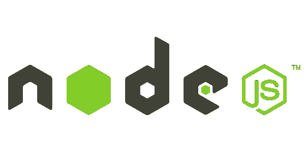

Node.js 非常适合重用代码——重用代码的支柱是 NPM 包。

NPM 包裹节省我们大量的时间和精力。需要一个日期库？有一个包裹。需要一个实用程序库？没问题，安装包就行了。每当你需要用代码解决一个问题时，有可能会有一个适合你需要的软件包。

这里有一个我认为每个 Node.js 开发者都应该知道的包列表。将这些 NPM 套餐视为节省时间和神奇的仙女助手。

# 强壮的

Husky 使得实现 git 挂钩变得很简单。与团队合作，并希望在整个团队中实施编码标准？没问题！Husky 允许您要求每个人在提交或推送到存储库之前自动 lint 和测试他们的代码。

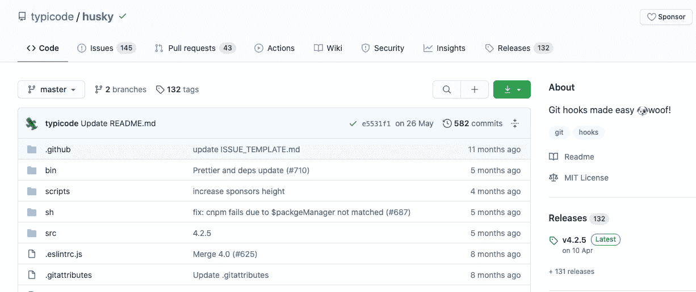

哈士奇—[https://github.com/typicode/husky](https://github.com/typicode/husky)

## 如何安装

```
yarn add husky
```

## 使用

下面是一个如何实现 husky 挂钩的示例:

Husky 挂钩示例

在提交到存储库之前,`pre-commit`钩子将会运行。

在您将代码推送到存储库之前,`pre-push`钩子会运行。

# dotenv

> Dotenv 是一个零依赖模块，它将环境变量从一个`.env`文件加载到`[process.env](https://nodejs.org/docs/latest/api/process.html#process_process_env)`中。将配置存储在独立于代码的环境中是基于[十二因素应用](http://12factor.net/config)方法的。
> 
> [dotenv](https://github.com/motdotla/dotenv)

## 如何安装

```
yarn add dotenv
```

## 使用

在您的应用程序中，尽早要求并配置 dotenv:

```
require('dotenv').config()
```

在项目的根目录下创建一个`.env`文件。以`NAME=VALUE`的形式在新行上添加特定于环境的变量。例如:

```
DB_HOST=localhostDB_USER=rootDB_PASS=s1mpl3
```

`process.env`现在有了您在`.env`文件中定义的键和值:

```
const db **=** require('db')db.connect({ host**:** process.env.DB_HOST, username**:** process.env.DB_USER, password**:** process.env.DB_PASS})
```

# 日期-fns

Date-fns 类似于 lodash，但用于日期。它包括许多实用函数，使日期处理变得更加容易。

> [date-fns](https://github.com/date-fns/date-fns) 为在浏览器& Node.js 中操作 JavaScript 日期提供了最全面、简单和一致的工具集
> 
> [日期-fns](https://date-fns.org/)

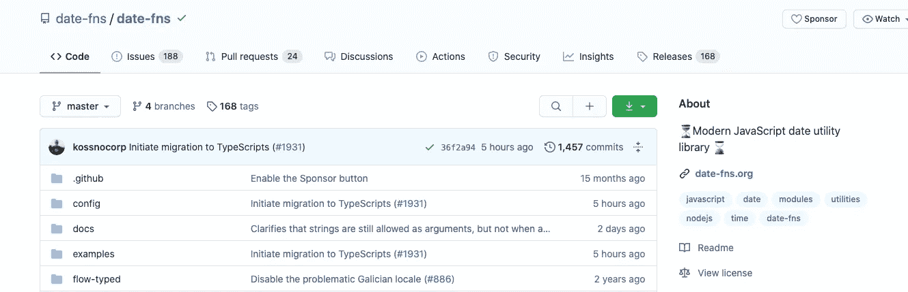

日期-fns—[https://github.com/date-fns/date-fns](https://github.com/date-fns/date-fns)

## 如何安装

```
yarn add date-fns
```

## 使用

下面是 date-fns 库的一个快速示例:

```
import { compareAsc, format } from 'date-fns'

format(new Date(2014, 1, 11), 'yyyy-MM-dd')
//=> '2014-02-11'

const dates = [
  new Date(1995, 6, 2),
  new Date(1987, 1, 11),
  new Date(1989, 6, 10),
]
dates.sort(compareAsc)
//=> [
//   Wed Feb 11 1987 00:00:00,
//   Mon Jul 10 1989 00:00:00,
//   Sun Jul 02 1995 00:00:00
// ]
```

查看[文档](https://date-fns.org/docs/)了解更多示例和用例。

# 班扬

Bunyan 是一个易于掌握的高性能 JSON 节点日志库。

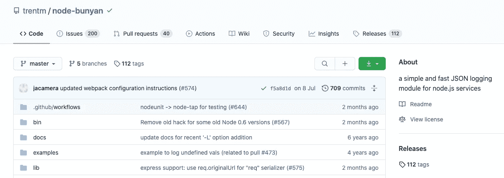

班扬—[https://github.com/trentm/node-bunyan](https://github.com/trentm/node-bunyan)

## 如何安装

```
yarn add bunyan
```

**提示:**`bunyan`CLI 工具被编写为兼容(在合理范围内)所有版本的 Bunyan 日志。因此，您可能希望`yarn add global bunyan`在您的路径上获得 Bunyan CLI，然后在您的应用程序中使用本地 Bunyan 安装的 node.js 库来使用 Bunyan。

## 使用

Bunyan 是一个用于 node.js 服务的简单快速的 JSON 日志库。

```
// hi.jsconst bunyan = require('bunyan');const log = bunyan.createLogger({name: "myapp"});log.info("hi");
```

如果你运行`node hi.js`，下面是返回到控制台的内容。

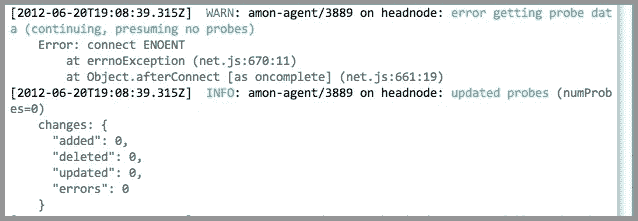

# 拉姆达

Rambda 是一个实用的、功能性的、实用的 JavaScript 程序员库。Ramda 强调更纯粹的功能风格。

不变性和无副作用的功能是 Ramda 设计理念的核心。这可以帮助您用简单、优雅的代码完成工作。

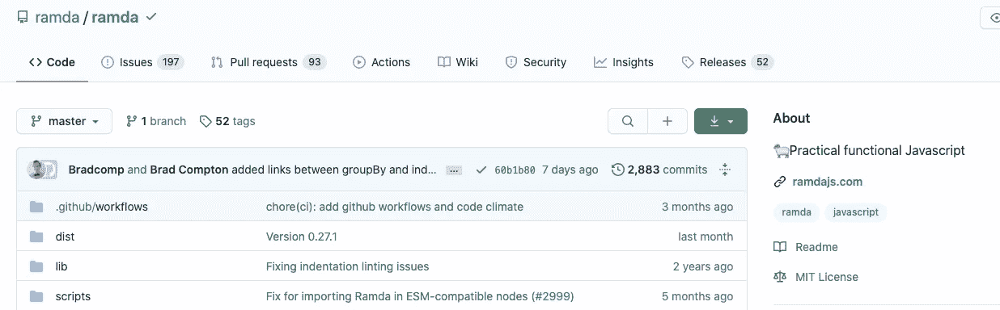

拉姆达—[https://github.com/ramda/ramda](https://github.com/ramda/ramda)

## 如何安装

```
$ yarn add ramda
```

## 使用

```
import * as R from 'ramda'**const** greet = R.replace('{name}', R.__, 'Hello, {name}!'); greet('Alice'); //=> 'Hello, Alice!'
```

[这是上面](https://ramdajs.com/repl/?v=0.27.0#?const%20greet%20%3D%20R.replace%28%27%7Bname%7D%27%2C%20R.__%2C%20%27Hello%2C%20%7Bname%7D%21%27%29%3B%0Agreet%28%27Alice%27%29%3B%20%2F%2F%3D%3E%20%27Hello%2C%20Alice%21%27)的代码示例。

# 调试

Debug 是一个模仿 Node.js core 调试技术的小型 JavaScript 调试工具。

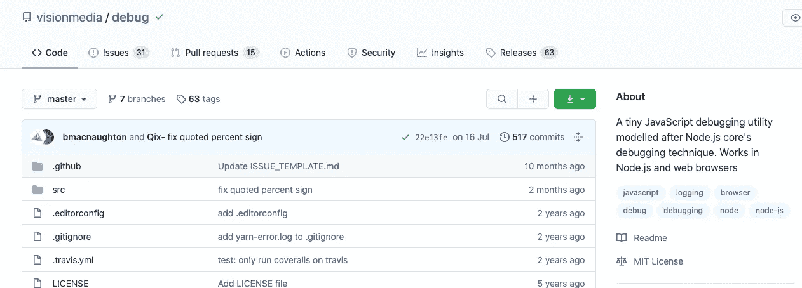

调试—[https://github.com/visionmedia/debug](https://github.com/visionmedia/debug)

## 如何安装

```
$ yarn add debug
```

## 使用

`debug`公开一个函数——只需将你的模块名传递给这个函数，它就会返回一个修饰版的`console.error`,供你传递调试语句。


调试—[https://github.com/visionmedia/debug](https://github.com/visionmedia/debug)

## 如何安装

```
yarn add debug
```

## 使用

调试示例

这将允许您为模块的不同部分以及整个模块切换调试输出。

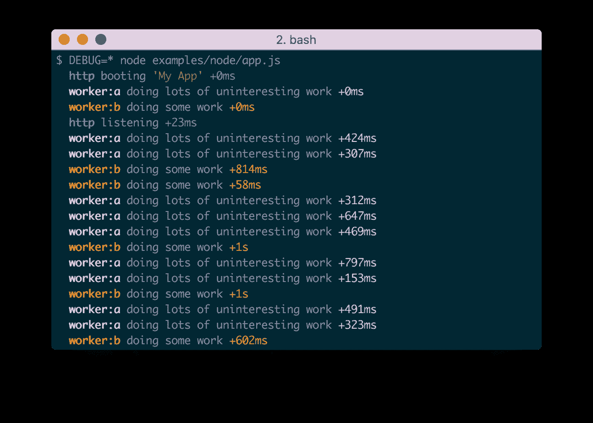

# 平的

flat 接受一个嵌套的 Javascript 对象并将其展平。您也可以取消带有分隔键的对象的展平。

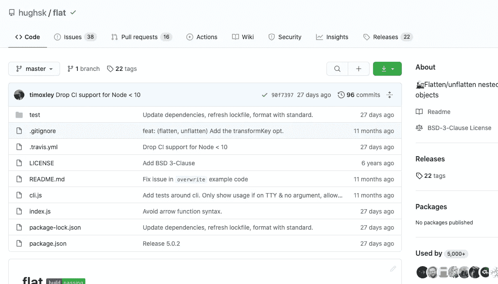

平—[https://github.com/hughsk/flat](https://github.com/hughsk/flat)

## 装置

```
$ yarn add flat
```

## 使用

```
const flatten = require('flat')

flatten({
    key1: {
        keyA: 'valueI'
    },
    key2: {
        keyB: 'valueII'
    },
    key3: { a: { b: { c: 2 } } }
})

// {
//   'key1.keyA': 'valueI',
//   'key2.keyB': 'valueII',
//   'key3.a.b.c': 2
// }
```

# JSON5

> JSON5 数据交换格式(JSON5)是 [JSON](https://tools.ietf.org/html/rfc7159) 的超集，旨在通过扩展其语法来包括来自 [ECMAScript 5.1](https://www.ecma-international.org/ecma-262/5.1/) 的一些产品，从而减轻 JSON 的一些限制。
> 
> [JSON5](https://json5.org/)

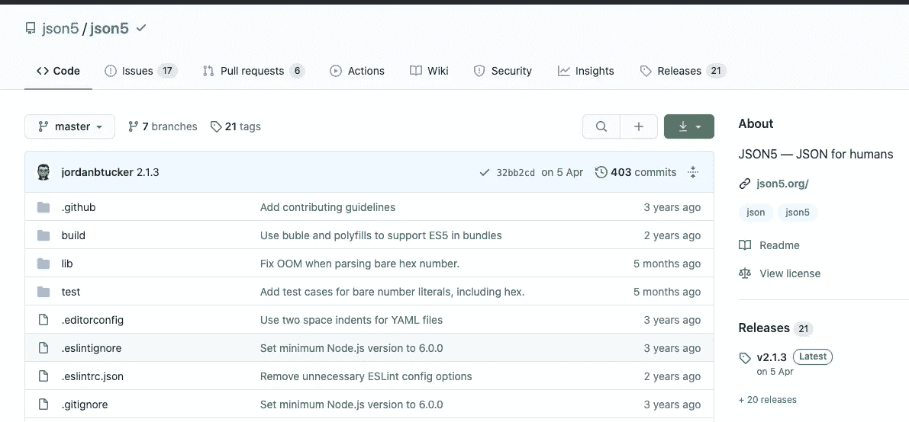

https://github.com/json5/json5

## 如何安装

```
yarn add json5 const JSON5 = require('json5')
```

## 使用

请注意文件扩展名。JSON5 是 JSON 的扩展和超集。

# 埃斯林特

ESLint 对于开发团队来说，是一个避免 bug 和强制编码标准的极好工具。ESLint 是一个工具，用于识别和报告 ECMAScript/JavaScript 代码中的模式。

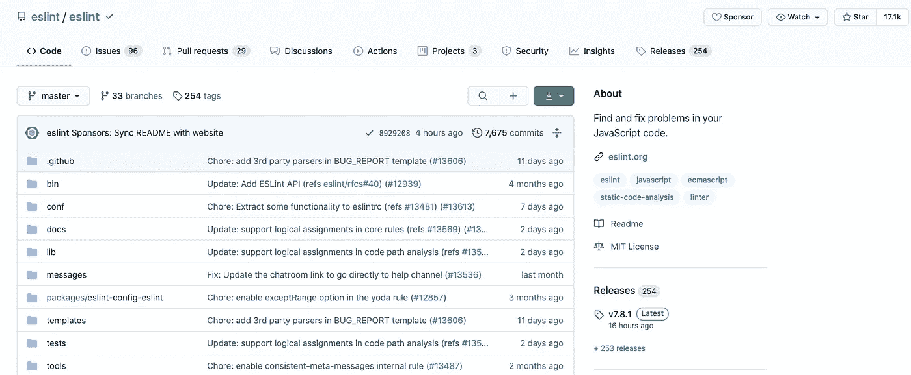

https://github.com/eslint/eslint

## 如何安装和使用

```
$ yarn add eslint
```

然后，您应该设置一个配置文件:

```
$ ./node_modules/.bin/eslint --init
```

之后，您可以在任何文件或目录上运行 ESLint，如下所示:

```
$ ./node_modules/.bin/eslint yourfile.js
```

如需进一步解释，请参考[官方文件](https://eslint.org/)。有很多入门和配置的例子。

# PM2

PM2 是 Node.js 应用程序的生产流程管理器，内置负载平衡器。它允许您保持应用程序永远运行，在不停机的情况下重新加载它们，并简化常见的系统管理任务。

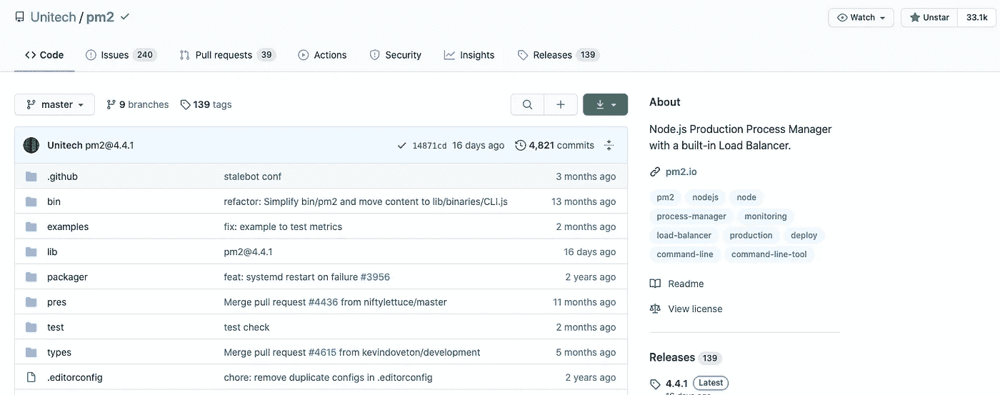

PM2—[https://github.com/Unitech/pm2](https://github.com/Unitech/pm2)

## 安装 PM2

```
$ yarn add global pm2
```

## 启动应用程序

您可以启动任何应用程序(Node.js、Python、Ruby、$PATH 中的二进制文件……)，如下所示:

```
$ pm2 start app.js
```

您的应用程序现已被虚拟化、监控并永远保持活力。[关于流程管理的更多信息](https://pm2.keymetrics.io/docs/usage/quick-start/)。

# 管理应用程序

一旦应用程序启动，您就可以轻松管理它们。以下是列出所有正在运行的应用程序的方法:

```
$ pm2 ls
```

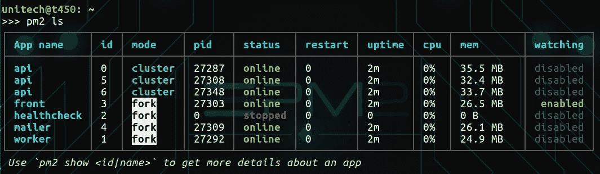

pm2 ls

查看[官方文档](https://pm2.io/)以获得特性和可能性的完整列表。

# 头盔

头盔库通过设置各种 HTTP 头来帮助你保护你的 Express 应用程序。"*不是银弹*，但能帮上忙！"

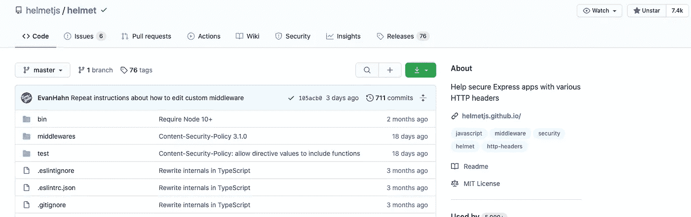

头盔——https://github.com/helmetjs/helmet

## 如何安装

```
yarn add helmet
```

## 使用

头盔是 [Connect](https://github.com/senchalabs/connect) 风格的中间件，兼容 [Express](https://expressjs.com/) 之类的框架。(如需 Koa 支持，见`[koa-helmet](https://github.com/venables/koa-helmet)`。)

```
**const** express **=** require("express");
**const** helmet **=** require("helmet");

**const** app **=** express();

app.use(helmet());
```

顶层的`helmet`函数是 11 个较小中间件的包装器。换句话说，这两件事是等价的:

```
*// This...*
app.use(helmet());

*// ...is equivalent to this:*
app.use(helmet.contentSecurityPolicy());
app.use(helmet.dnsPrefetchControl());
app.use(helmet.expectCt());
app.use(helmet.frameguard());
app.use(helmet.hidePoweredBy());
app.use(helmet.hsts());
app.use(helmet.ieNoOpen());
app.use(helmet.noSniff());
app.use(helmet.permittedCrossDomainPolicies());
app.use(helmet.referrerPolicy());
app.use(helmet.xssFilter());
```

# 压缩

[压缩](https://github.com/expressjs/compression)库是 Node.js 压缩中间件。

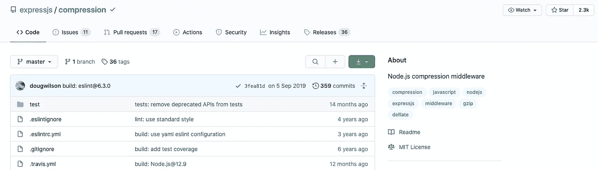

压缩—[https://github.com/expressjs/compression](https://github.com/expressjs/compression)

## 如何安装

```
$ yarn add compression
```

## 使用

当这个模块与 [express](https://github.com/expressjs/express) 或者 connect 一起使用时，只需用 express 中间件调用压缩即可。通过中间件的请求将被压缩。

```
const compression = require('compression')
const express = require('express')const app = express()// compress all responses
app.use(compression())// ...
```

了解我最新内容的最好方式是通过我的[时事通讯](https://wholesomedev.substack.com/welcome)。成为第一个得到通知的人。


我的[简讯](https://wholesomedev.substack.com/welcome)。成为第一个得到通知的人。