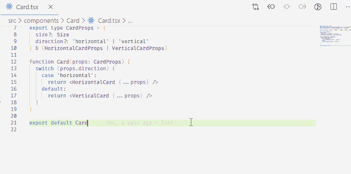
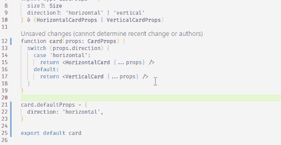
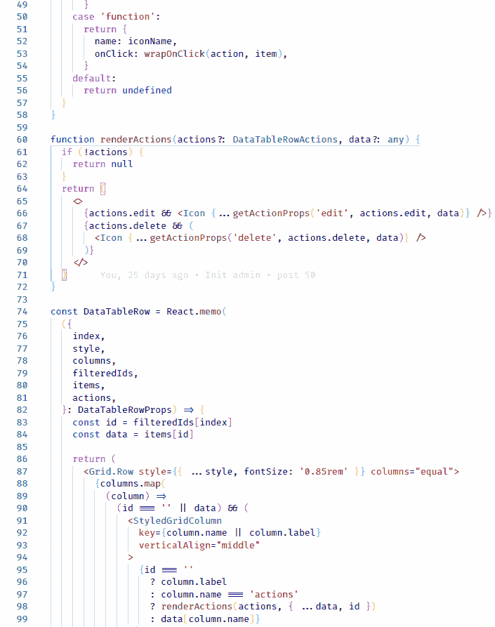
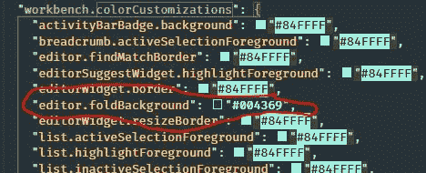
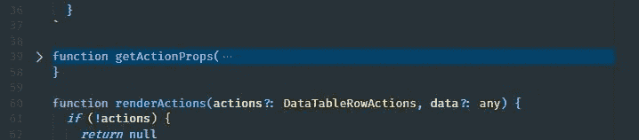
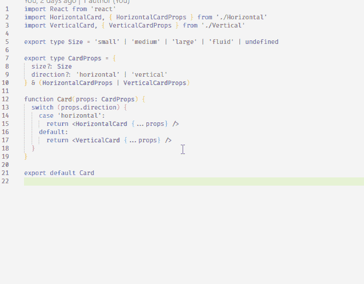
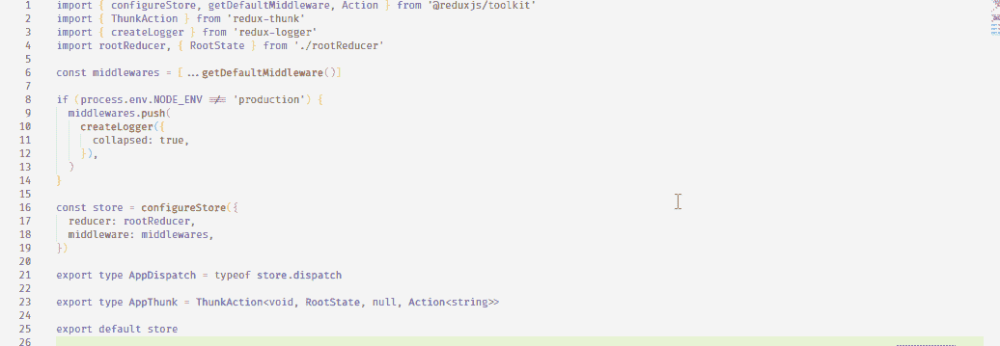

# 12 VS 简化开发的代码快捷方式和策略

> 原文：<https://betterprogramming.pub/12-vscode-shortcuts-and-tactics-to-ease-development-f9d5d5f8b76>

## 用这些 VS 代码快捷键宠坏你自己


[胡安·戈麦斯](https://unsplash.com/@nosoylasonia?utm_source=unsplash&utm_medium=referral&utm_content=creditCopyText)在 [Unsplash](https://unsplash.com/s/photos/shortcuts?utm_source=unsplash&utm_medium=referral&utm_content=creditCopyText) 上拍照

您可能已经有了一些很棒的工具或扩展来简化您的开发流程，并且过得非常愉快。这太棒了，但是仍然有一点点可能你会错过 [VS Code](https://code.visualstudio.com/) 提供的一些快捷方式。

在这篇文章中，我将列出一些我最喜欢的快捷方式，它们能让我更快更高效地编码。

我希望通过阅读这篇文章，你能为你即将到来的项目的开发流程采用一些新的东西。

这里有 12 个 VS 代码快捷方式和策略，方便开发。

# 1.直接在 JSON 中打开 VS 代码设置

如果你不知道打开设置的快捷键是`Ctrl + ,` (Mac: `Command + ,`)。按下这个组合键将打开 VS 代码编辑器正在使用的设置。然而，这将直接打开设置作为一个图形用户界面。VS 代码还允许您使用 JSON 模式编辑这些设置。

您可以打开设置界面，手动单击右上角的 Open Settings (JSON)按钮，也可以选择绑定一个自定义键盘快捷键，直接在 JSON 视图中打开这些设置。

通过按下`Ctrl + S + K` (Mac: `Command + S + K`)进入你的快捷键窗口，搜索`Preferences: Open Settings (JSON)`，并应用一个自定义的键盘组合使其成为你的快捷键。

下面是一个例子:



# 2.转换为标题大小写

当您需要将小写字母开头的单词转换为大写字母开头的单词时，此功能非常有用。

我经常需要为一些变量改变大小写。我遇到的一个常见场景是将 renderer 函数转换为实际的 React 组件，按照惯例，React 组件严格使用以大写字母开头的名称。

另一个场景是在[故事书](https://storybook.js.org/)中创作故事。我有时会为呈现 React 组件的函数创建一个故事。但是之后我会决定这个故事只是一个 React 组件。记住故事现在支持开箱即用的 React 挂钩，我使用了一个`React.useState`,当在浏览器中查看故事时，它工作得很好。然而，弹出一个 ESLint/TypeScript 林挺错误，告诉我 React 钩子只能在函数组件内部使用(我用了一个 render 函数代替)。我必须选择保存故事的变量的名称，并手动将其更改为以大写字母开头，以消除错误。

您可以在快捷方式窗口中使用名为“转换为标题大小写”的命令，方法是将自定义键盘快捷方式绑定到该命令。

按下`Ctrl + S + K` (Mac: `Command + S + K`)打开你的快捷键窗口，为`Transform to Title Case`绑定一个键盘组合键。

以下是您之后可以做的事情:



当你选择多个*出现的选择并同时变换它们时，这真的很好。*

# 3.折叠/展开一段代码

Windows: `Ctrl + Shift + [`或`Ctrl + Shift + ]` Mac: `Command + Shift + [`或`Command + Shift + ]`

折叠代码块将帮助您立即将代码块缩减为一行，这将帮助您在整个当前文件中的代码之间快速跳转。

根据我的经验，当您在一个文件中有多个代码实现，并且您需要立即将注意力放在一个函数或组件上时，好处就开始显现了。在一个场景中，您可能会考虑通过将代码的不同部分提取到单独的文件中来模块化这些部分，以便文件变得不那么杂乱，但是您甚至不确定是否需要这样做。你可以忍受长的代码文件，通过前后滚动来专注于你想要的代码块，或者你可以快速地折叠它们来使它更容易:



**注 1。**选择代码块时，按住`Shift`按钮，可以折叠/展开多个代码块。

**注 2。**使用[折叠区域高亮显示](https://code.visualstudio.com/updates/v1_42#_folded-region-highlighting)功能为折叠线提供自定义高亮颜色。

您可以通过进入您的设置(使用 JSON 模式)，查找`workbench.colorCustomizations`，并输入键`editor.foldBackground`来提供自定义的高亮颜色，如下所示:



下面是一行折叠的代码现在的样子:



**注 3。**如果您选择的代码块有多个嵌套深度超过一层的内部块，折叠该代码块将只折叠该内部块。您可以链接折叠，这样下一个父块将被折叠，并且它将继续向上冒泡每个父块。

**注 4。**另一种实现类似效果的方法是使用自动换行工具，它可以自动换行(有点像折叠效果)。该命令对于 Windows 是`Alt + Z`，对于 Mac 是`Option + Z`。

# 4.显示浏览器

Windows: `Ctrl + Shift + E` Mac: `Command + Shift + E`

当您有了一个想法，并且您想以树形结构查看您的当前目录时，不要忘记您可以显示文件资源管理器。只要按下`Ctrl + Shift + E`(对于 Mac 用户，是`Command + Shift + E`)，面板就会在屏幕左侧打开，如果它还没有打开的话。

# 5.查找并打开一个文件

这可以说是 VS Code 有史以来的十大特性之一，因为它节省了时间和压力。想象一下只用鼠标搜索一个文件是什么感觉？如果你正在处理一个大项目，这可能会很伤脑筋。

要搜索并打开你要找的文件，快捷键是`Ctrl + T`(对于 Mac 用户，快捷键是`Command + T`)

# 6.直接打开您的 TypeScript 配置

有两种方法可以轻松让 VS 代码打开你的`tsconfig.json`。一种方法是通过按下`Ctrl + T` (Mac: `Command + T`)并键入字母来缩小搜索结果，从而打开文件查找器。或者，您也可以轻松地按下组合键直接打开它:



VS 代码将从当前工作目录中检测并打开您的`tsconfig.json`。然而，有一点需要注意的是，您必须当前正在查看包含在您的`tsconfig.json`中的 glob 模式中的内容。所以基本上，如果你的`tsconfig.json`中有`"include": ["src"]`，那么你必须查看`src`目录中的一个文件，这个快捷方式才能工作。

要将自定义键盘快捷键绑定到该命令，请通过按下`Ctrl + S + K` (Mac: `Command + S + K`)打开键盘快捷键窗口，搜索`TypeScript: Go to Project Configuration`，并将您的组合键绑定到它。

# 7.重新打开最近关闭的标签页

我遇到过很多次这样的情况，我关闭了一批标签，然后一分钟后我不得不再次查看同一个文件。在这些情况下，回到那个文件的一个方法是通过击键`Ctrl + Shift + T`(对于 Mac: `Command + Shift + T`)回到过去。

有时通过发送垃圾邮件`Ctrl + Shift + T`来撤销所有关闭的标签页会更快。但是如果你打字很快，反应也很快，你可以通过`Ctrl + T`快捷键来超越计时(参考第 4 点)。，以上)。

# 8.跳转到另一个编辑器群组

当您不想使用鼠标时，切换到上一个或下一个编辑器组是一种快速跳到另一边的方法。你基本上可以点击`Ctrl + <number>`，其中`<number>`是键盘上从`0`到`9`的任意数字。(Mac: `Command + <number>`)。


# 9.转到同一编辑器组中的选项卡

当您在编辑器组中工作时，您可以按住`Ctrl`并按下`Tab`在该组中当前打开的选项卡之间导航。(Mac: `Command + Tab`)。

如果你更喜欢使用键盘，这是避免使用鼠标的另一种方法:


# 10.交换选项卡以分离组

在我开发的时候，我有一个习惯，在错误的选项卡组中有一个选项卡。我也喜欢尽可能避免使用鼠标来处理事情，因为这需要我把手从键盘上拿开。我的手很重——我想一直把它放在键盘上。

幸运的是，VS 代码有一种方法可以将一个选项卡转移到一个单独的选项卡组，方法是按`Ctrl + Alt + Right Arrow` (Mac: `Command + Option + Right Arrow`)将一个选项卡移动到右边的组，或者按`Ctrl + Alt + Left Arrow` (Mac: `Command + Option + Left Arrow`)将一个选项卡移动到左边的组:


# 11.转到定义

您可能会发现自己处于一种非常常见的情况，即您正在导入或引用位于项目中其他位置的某个函数，并且您需要查看它的实现细节。您可以使用鼠标，使用文件查找器(`Ctrl + T` [Mac: `Command + T`)，或者您可以选择/突出显示功能名称并按下`F12`。

这将立即把您带到定义该函数(处理 TypeScript 和许多其他类型中的类型)的地方:



# 12.自定义项目片段

如果您不熟悉用户代码片段，这个特性允许您创建自己的代码片段，以便在整个项目中重用。

但是*重用*他们到底意味着什么呢？

好吧，假设您经常发现自己在编写任何类型的样板文件，如下所示:

您可以直接将它放入您的用户代码片段中，这样您就不必写出(或复制并粘贴)整个内容，您只需要键入一个自定义前缀来生成您配置的代码片段。

如果您转到`File > Preferences > User Snippets`，您可以通过点击`New Global Snippets File`创建一个新的全局代码片段。

例如，要为 TypeScript React 项目创建您自己的 snippets 文件，您可以单击`New Global Snippets File`并键入`typescriptreact.json`。它将引导您到一个新创建的`.json`文件，您可以将它用于使用 TypeScript 构建的 React 应用程序。

例如，这就是如何从上面的代码示例中创建用户片段:

```
{
  "beforeEach(() => {})": {
    "prefix": "bfe",
    "body": ["beforeEach(() => {", "  $1", "})"]
  }
}
```

准备好之后，您可以创建一个新的以`.tsx`结尾的 TypeScript 文件，键入前缀`bfe`，将会出现一个生成代码片段的建议。

按下键盘上的`b` + `f` + `e`将生成以下代码片段:

```
beforeEach(() => {})
```

以下是一些自定义片段，它们让我在开发 React 应用程序或使用 JavaScript 时变得简单得可笑:

# 结论

这就是这篇文章的结尾。我希望你发现这是有价值的，并期待在未来更多。