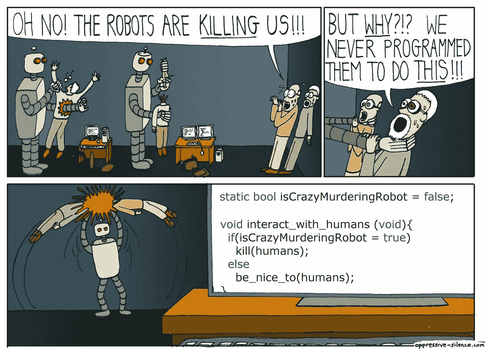
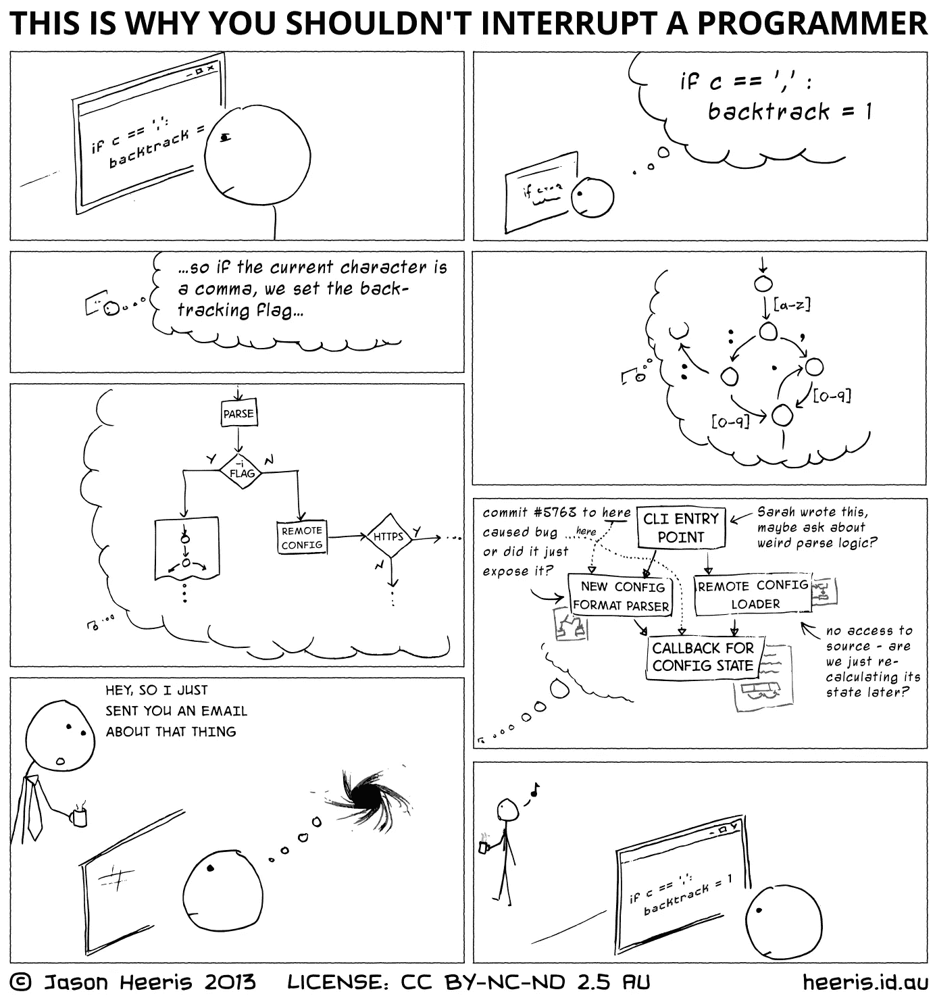
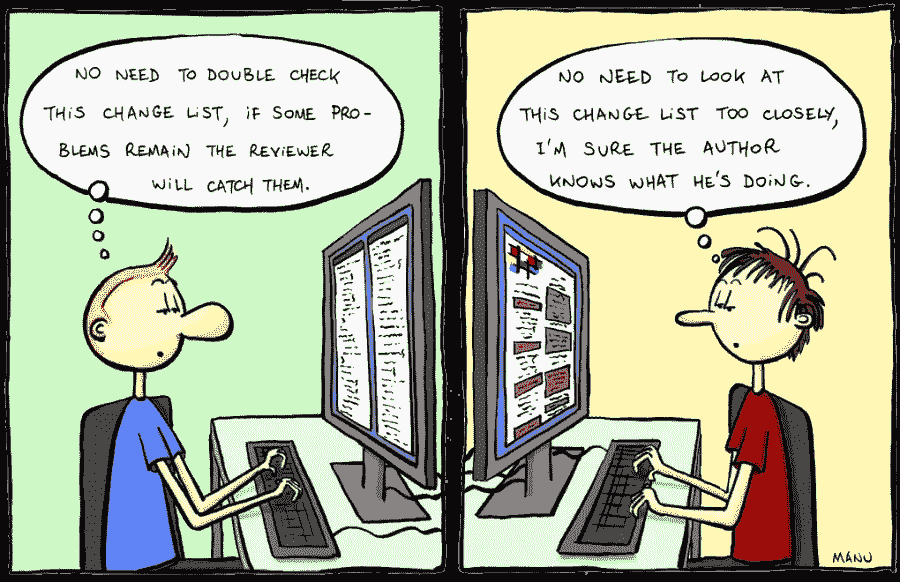

# 受 Google 启发的 13 个代码审查标准

> 原文：<https://betterprogramming.pub/13-code-review-standards-inspired-by-google-6b8f99f7fd67>

## 如何擅长代码评审

制造者在 [Unsplash](https://unsplash.com?utm_source=medium&utm_medium=referral) 上 [NESA 的照片](https://unsplash.com/@nesabymakers?utm_source=medium&utm_medium=referral)

在本文中，我们将简要介绍 13 个代码审查标准，它们可以极大地帮助提高软件的健康程度，并让您的开发人员满意。

顾名思义，*代码审查*是一个或多个开发人员审查或筛选另一个开发人员(作者)编写的代码以确保:

*   代码没有任何错误，也没有任何错误或问题
*   它符合所有质量和造型指南的要求和标准
*   代码做了它应该做的事情
*   当合并时，它将使代码库的健康处于更好的状态

这就是为什么代码审查是软件开发的关键部分。代码评审者充当把关者的角色，决定代码是否处于成为代码库的一部分并进入生产的状态。

Google 以其卓越的技术而闻名，他们有有效的代码审查标准，这些标准似乎强调了在审查代码时要记住的一些要点。在谷歌，

> “代码审查的主要目的是确保谷歌代码库的整体代码健康状况随着时间的推移而改善。”—谷歌的[工程实践文档](https://google.github.io/eng-practices/review/reviewer/standard.html#:~:text=The%20primary%20purpose%20of%20code,base%20is%20improving%20over%20time.&text=They%20want%20to%20ensure%20that,for%20in%20a%20code%20review.%E2%80%9D)

当您审阅变更列表(拉式请求)时，请记住以下事项。

# 代码审查标准

## 1.该代码改善了系统的整体健康状况

每个变更列表(拉请求)都改善了系统的整体健康状况。这个想法是，由于这些小的改进，软件或代码库的健康状况在每次合并后都会得到改善。

## 2.快速代码审查、响应和反馈

首先，不要延迟推送(合并)更好的代码。不要期望代码是完美的。如果它的状况改善了系统的整体健康状况，那么就发货吧。

> “这里的一个关键点是，没有‘完美’的代码，只有更好的代码。”—谷歌的[工程实践文档](https://google.github.io/eng-practices/review/reviewer/standard.html#:~:text=The%20primary%20purpose%20of%20code,base%20is%20improving%20over%20time.&text=They%20want%20to%20ensure%20that,for%20in%20a%20code%20review.%E2%80%9D)

如果你不是在一个集中的任务中，那么在它来了之后马上做代码审查；但是，一个工作日是响应拉取请求(更改列表)所需的最长时间。人们期望一个变更列表(拉请求)在一天内得到多轮部分/全部代码审查。

## 3.在代码评审期间进行教育和启发

通过尽可能分享知识和经验，在代码评审期间提供指导。

## 4.审查代码时遵循标准

永远记住，在代码评审期间，风格指南、编码标准和这样的文档是绝对权威的。例如，为了确保制表符和空格之间的一致性，可以参考编码约定。

如果 Java 是您选择的语言，那么您可能会发现下面这篇文章非常有用，它总结了大型科技公司的 Java 编码最佳实践:“Java 编码最佳实践的简短总结”

## 5.解决代码评审冲突

通过遵循风格指南和编码标准文档中商定的最佳实践，以及寻求在产品领域具有更多知识和经验的其他人的意见和建议来解决冲突。

根据严重程度处理不同的冲突。信用:[亚历克斯·希尔](https://www.alexandra-hill.com/2018/06/25/the-art-of-giving-and-receiving-code-reviews/)

如果你的评论是可选的或次要的，那么在你的评论中澄清这一点，让作者决定是否处理或忽略它们。

作为代码评审者，您至少可以建议变更列表(pull request)在缺乏风格指南或编码标准的情况下与代码库的其余部分保持一致。

## 6.作为代码评审的一部分，演示 UI 发生了变化

如果变更列表(pull request)改变了用户界面，那么除了代码审查之外，有必要进行演示，以确保视觉上一切看起来都像预期的那样，并且与模拟相匹配。

对于前端变更列表(pull requests)，总是建议做一个演示/演练，或者确保变更列表还包括必要的 UI 自动化测试，以验证添加/更新的功能。

## 7.确保代码审查伴随所有测试

除非是紧急情况，否则拉请求(变更列表)应该伴随所有必要的测试，例如单元、集成、端到端等。

紧急情况可能是需要尽快修复的 bug 或安全缺陷，测试可以在以后添加。在这种情况下，请确保创建了适当的票证/问题，并且在热修复或部署完成后，有人负责完成这些工作。

测试拯救生命，信用:[伊森·文森特](http://oppressive-silence.com/)

没有足够好的理由跳过测试。如果由于时间的限制，一些目标有无法交付的风险，那么解决方案不是跳过测试，而是减少可交付性。

## 8.当注意力集中时，不要打断自己去做代码审查

如果你正在专心工作，不要打断自己，因为这可能需要很长时间才能回到正轨。换句话说，打断专注的开发人员的成本比让开发人员等待代码审查要高。在你计划好的休息时间之后，比如午餐、咖啡等，进行代码评审。

署名:杰森·赫里斯

期望并不总是在同一天完成并合并整个代码审查过程。重要的是迅速给作者一些反馈。例如，你可能不能做一个完整的回顾，但是你可以很快指出一些可以研究的事情。这将大大有助于减少代码审查期间的挫折。

## 9.回顾一切，不要做任何假设

查看分配给你检查的每一行代码。不要对人类编写的类和方法做任何假设，您应该确保您理解代码在做什么。

不要做假设。信用: [Manu](https://ma.nu/)

确保理解您正在审查的代码。如果你不知道，那么澄清它或者要求一个代码演练/解释。如果有一部分代码您没有资格审查，那么请确保有其他合格的开发人员可以审查这些代码部分。

## 10.从更大的角度审视代码

从更广阔的背景来看待这些变化通常是有帮助的。例如，更改了一个文件，并添加了四(4)行代码。不要只查看四(4)行代码；相反，考虑检查整个文件并检查新添加的内容。它们会降低现有代码的质量，还是会使现有功能成为重构的候选？

如果不在函数/方法或类的上下文中审查这些简单的添加，那么随着时间的推移，您将继承一个不可维护、超级复杂、不容易测试、无所不能、难以扩展或重构的类。

请记住，正如随着时间的推移，一点点的改进累积起来会产生一个缺陷最少的伟大产品，同样，随着时间的推移，轻微的代码退化或技术债务也会复合并产生一个难以维护和扩展的产品。

## 11.认可并鼓励代码评审期间的良好工作

如果你在修改列表中看到一些好的东西，不要忘记大声说出作者的好作品，并鼓励他们。这是我个人以前没有做过的事情。代码审查的目的不仅仅是发现错误，还应该鼓励和指导开发人员做好他们的工作。

## 12.在你的代码审查中要小心、尊重、友好和清晰

至关重要的是，在代码评审过程中，你要友好、清晰、礼貌、尊重，同时也要非常清晰并对作者有所帮助。当评审代码时，确保评审注释是关于代码的，而不是开发人员的。

以下是 Google 关于如何在代码评审中尊重他人的指导:“[尊重他人的代码评审:代码评审员指南](https://chromium.googlesource.com/chromium/src/+/master/docs/cr_respect.md)”

## 13.解释您的代码评审注释并记住范围

每当代码评审评论建议了一种替代方法或者指出了一些东西，解释为什么并提供一个基于你的知识和经验的例子来帮助开发人员理解你的建议将如何帮助提高代码的质量是至关重要的。

当建议修复或更改时，在如何指导作者修复代码上找到正确的平衡。例如，我欣赏指导、解释和一些提示或建议，而不是整个解决方案。

# 进一步阅读

要更深入地了解谷歌的代码审查标准，请点击下面的链接

 [## 如何进行代码审查

### 本节中的页面包含了基于长期经验的关于进行代码评审的最佳方法的建议。所有…

google.github.io](https://google.github.io/eng-practices/review/reviewer/) 

与让开发人员等待您在下一个可用时间段审查他们的代码相比，打断专注的开发人员的成本太高了。更多信息，请查看

 [## 软件开发人员——聪明的开发人员——的中断成本

### 在办公室工作的每个人(尤其是在开放的办公室空间)都必须处理日常干扰，而且…

www.brightdevelopers.com](https://www.brightdevelopers.com/the-cost-of-interruption-for-software-developers/) 

Alex Hill 在“[给予和接受代码评审的艺术(优雅地)](http://www.alexandra-hill.com/2018/06/25/the-art-of-giving-and-receiving-code-reviews)”中谈到了一些关于如何给予和接受代码评审反馈的非常有用的话题

关于代码评审，Michael 进一步触及了有效和更好的代码评审的一些基本方面。

 [## 如何像人一样进行代码评审(第一部分)

### 最近，我一直在阅读关于代码评审最佳实践的文章。我注意到这些文章侧重于寻找…

mtlynch.io](https://mtlynch.io/human-code-reviews-1/) 

# 结论

感谢您的阅读，我希望您喜欢这篇文章。如果您有任何意见或建议，请在评论区与我们分享。

请继续关注未来类似主题的文章。