# 14 个精彩的 Bash 脚本学习工具和资源

> 原文：<https://betterprogramming.pub/13-fantastic-learning-tools-and-resources-for-bash-scripting-51a6de98015c>

## 您将每天使用的替代 Bash 脚本工具


汤姆·波德莫尔在 [Unsplash](https://unsplash.com?utm_source=medium&utm_medium=referral) 上的照片

[更新:2021–05–10，14 命令行的艺术]

# 介绍

除了官方的 Bash 脚本文档，还有许多优秀的在线学习工具和资源。在这里你可以找到 13 个可以收藏的网站。

# 1.解释外壳

当你遇到一段你不懂的代码时， [explainshell](https://www.explainshell.com/) 可以帮你。你只需要粘贴你想理解的代码。如果不是特定于项目的，它将逐字返回解释。

> “这个站点包含了 29，761 个解析过的联机帮助页，这些联机帮助页来自第 1 节和第 8 节，可以在 [Ubuntu 的联机帮助页存储库](http://manpages.ubuntu.com/)中找到。我们使用了大量的试探法来提取每个程序的参数，到处都有错误，尤其是在非标准布局的联机帮助页中。”— [解释外壳](https://www.explainshell.com/)

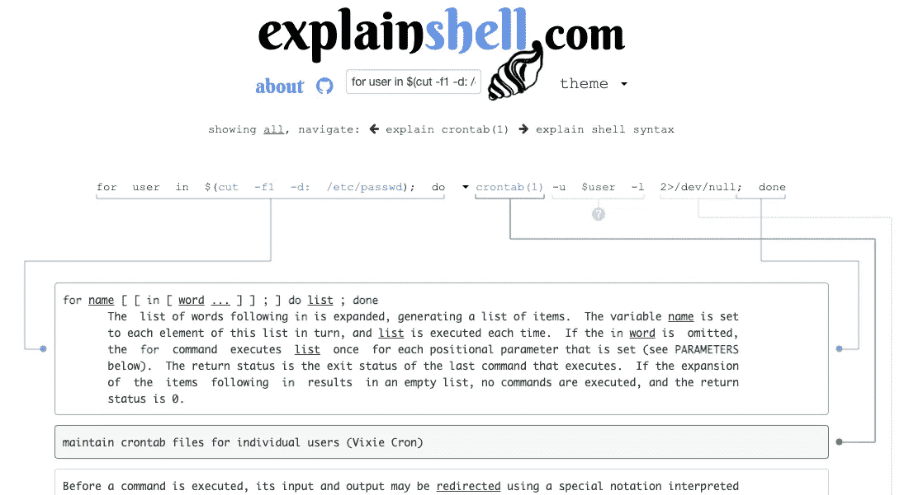

截图来自 [explainshell](https://www.explainshell.com/)

# 2.作弊. sh

[Cheat.sh](https://cheat.sh/) 是一个不需要安装的 cheatsheet 工具。您可以使用`curl`在网站和您的终端上查找备忘单。它涵盖了 56 种编程语言。

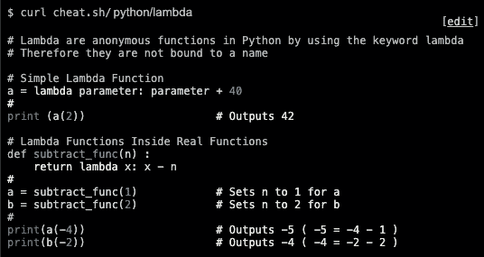

来自 [cheat.sh](https://cheat.sh/) 的 Web 应用结果

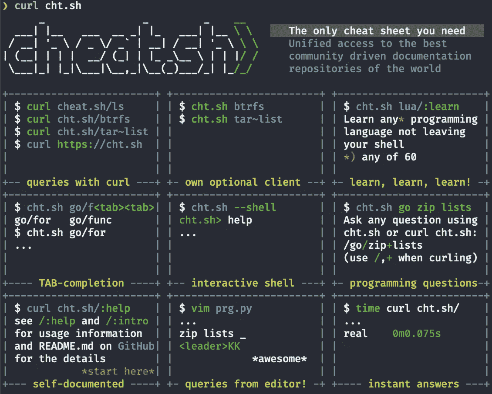

命令行结果:curl cht.sh(图片来自作者)

使用`curl cut.sh/bash/key-word`。

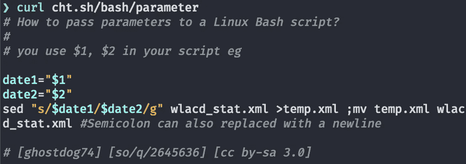

命令行:卷曲 cht.sh/bash/parameter 输出(图片由作者提供)

你可以使用`curl cut.sh/bash/:learn`来显示 Bash 教程。

Cheat.sh 为 Vim、Emacs、VS Code、Sublime、IDEA、Qt Creator 提供了[编辑器集成](https://github.com/chubin/cheat.sh#editors-integration)。

您可以在终端配置文件中添加一个别名，`~/.zshrc`或`~/.bashrc`。

```
# cheat for curl cht.sh/
# usage: cheat bash/sed
cheat(){
    curl cht.sh/"$1" | less
}
```

那么你可以使用它:

```
$ cheat bash/sed
# sed
# A stream editor. Used to perform basic text transformations# Preview a file edit, via substitution.
sudo sed 's/Name=Xfce Session/Name=Xfce_Session/' FILE# Replace the same string more than once per line (g flag)
sudo sed 's/Name=Xfce Session/Name=Xfce_Session/g' FILE
...
$ cheat tar~list
# To list the content of an .gz archive:
tar -ztvf /path/to/foo.tgz# To list the content of an .bz2 archive:
tar -jtvf /path/to/foo.tgzcheat:tarsnap
# List the archives
tarsnap --list-archives
```

您也可以将它用于其他编程语言:

```
$ cheat python/dict
$ cheat rust/:learn
$ cheat go/func
```

# 3.tldr-页数


[摄](https://unsplash.com/@thecreative_exchange?utm_source=medium&utm_medium=referral) [Unsplash](https://unsplash.com?utm_source=medium&utm_medium=referral) 上的创意交流

tldr-pages 是“控制台命令的协作备忘单”安装后，您可以搜索命令，它会返回易于阅读和实用的例子。

> “tldr-pages 项目是一个由社区维护的命令行工具帮助页面的集合，旨在成为传统[手册页](https://en.wikipedia.org/wiki/Man_page)的更简单、更易于使用的补充。”— [*tldr-pages*](https://github.com/tldr-pages/tldr)

```
$ npm install -g tldr
$ tldr rm
```

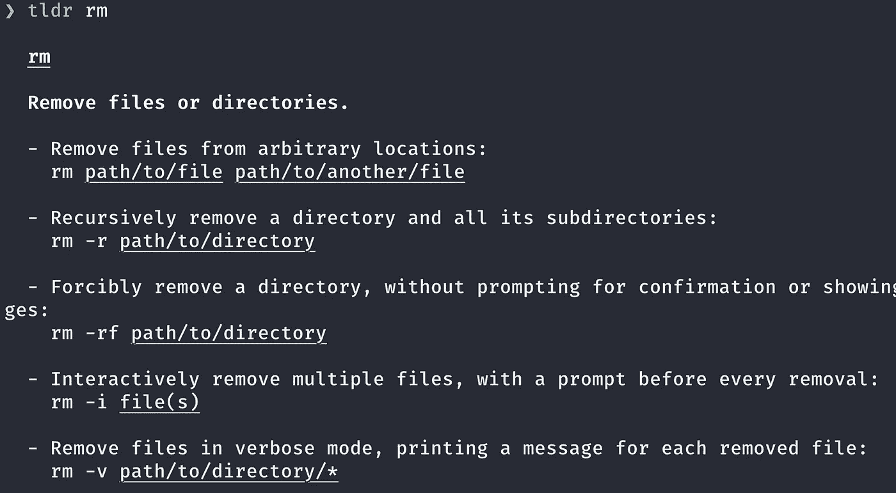

tldr-页面输出(图片由作者提供)

# 4.交互式备忘单工具:navi

[navi](https://github.com/denisidoro/navi) 是一个用于命令行和应用程序启动器的交互式备忘单工具。

在[安装](https://github.com/denisidoro/navi/blob/master/docs/installation.md)之后，你输入`navi`，通过输入关键字进行搜索。

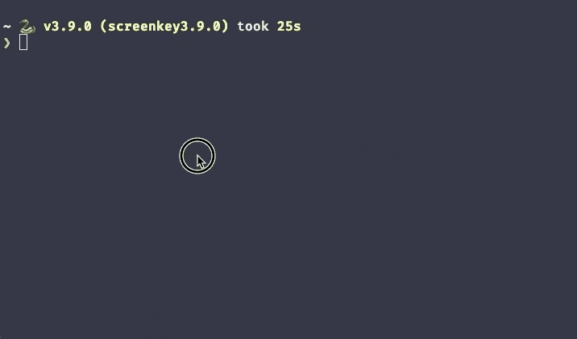

海军在行动(图片由作者提供)

您可以将 navi 与前面提到的 cheat.sh 和 tldr 一起使用。你需要`wget`，所以如果你用的是 macOS，就需要安装。

```
$ brew install wget
```

那么你可以使用:

```
$ navi --cheatsh tar
$ navi --tldr find
```

# 5.外壳检查

[ShellCheck](https://www.shellcheck.net/) 在你的 shell 脚本中发现 bug。ShellCheck 提供本地安装，您的编辑器可能有扩展/插件。

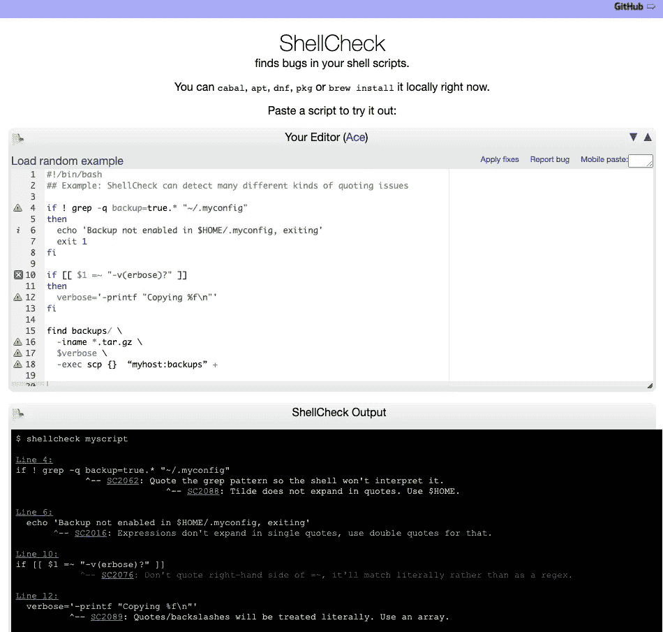

[炮弹检查](https://www.shellcheck.net/)在行动

在您的编辑器上，ShellCheck 为 bash/sh shell 脚本提供警告和建议。

> ShellCheck 的目标是:
> ——指出并澄清典型的初学者语法问题，这些问题会导致 shell 给出模糊的错误消息。
> ——指出并澄清典型的中级语义问题，这些问题会导致 shell 行为怪异且违反直觉。
> ——指出可能导致高级用户的工作脚本在未来环境中失败的微妙警告、死角和陷阱
> — [外壳检查](https://github.com/koalaman/shellcheck)

# 6.谷歌外壳风格指南

[谷歌有一个外壳风格指南](https://google.github.io/styleguide/shellguide.html)。它解释了诸如使用哪个 shell、何时使用 shell、文件扩展名、环境、注释、格式、特性和错误等主题。

它建议对各种实用程序脚本使用 shell 脚本，并进行相对较少的数据操作。它为 Bash 脚本程序员提供了有用的信息。

> “如果你正在写一个超过 100 行的脚本，或者使用了不简单的控制流逻辑，你应该用一种更结构化的语言*重写，现在是*。请记住，脚本是会增长的。尽早重写你的剧本，以避免日后更费时的重写。”— [谷歌外壳风格指南](https://google.github.io/styleguide/shellguide.html)

# 7.GitHub Bash 类别

在 [Github 中搜索“Bash”](https://github.com/search?q=bash)会返回超过 95，000 个存储库，并且有大量优秀的免费资源可供您挖掘。按“最多明星”和“最多分叉”排序，会返回流行的 Bash 脚本指南。

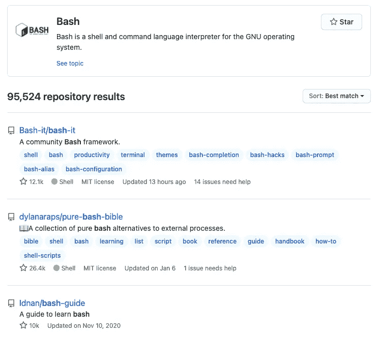

来自[GitHub“Bash”搜索结果](https://github.com/search?q=bash)

# 8.超棒的贝壳

[Awesome-shell](https://github.com/alebcay/awesome-shell) 整理了一个列表，您可以在其中找到命令行工具、目录导航工具、定制提示、主题、开发工具、系统实用程序、shell 包管理等等。

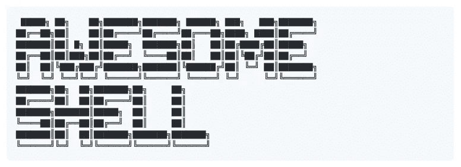

来自 [Awesome-shell GitHub 页面](https://github.com/alebcay/awesome-shell)

> “一个令人敬畏的命令行框架、工具包、指南和小发明的精选列表。灵感来自牛逼——PHP。”— [牛逼壳](https://github.com/alebcay/awesome-shell)

# 9.纯粹的狂欢圣经

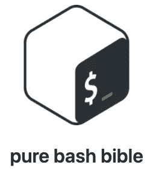

来自[纯 Bash 圣经 GithHub 页面](https://github.com/dylanaraps/pure-bash-bible)

纯 bash 圣经是外部过程的纯 Bash 替代品的集合。您可以找到许多有用的代码示例和函数，供您的项目使用。

> “本书的目标是记录仅使用内置`bash`功能完成各种任务的众所周知和鲜为人知的方法。使用《圣经》中的片段可以帮助删除脚本中不必要的依赖，在大多数情况下会使脚本运行得更快。”[纯粹的痛击圣经](https://github.com/dylanaraps/pure-bash-bible)

# 10.Bash 片段

根据[Linux Links](https://www.linuxlinks.com/links/Software/Utilities/Scripts/),“[Bash-Snippets](https://github.com/alexanderepstein/Bash-Snippets)是一个面向重度终端用户的小型 Bash 脚本集合，没有依赖性。”通过阅读维护良好的代码，可以学到很多东西。

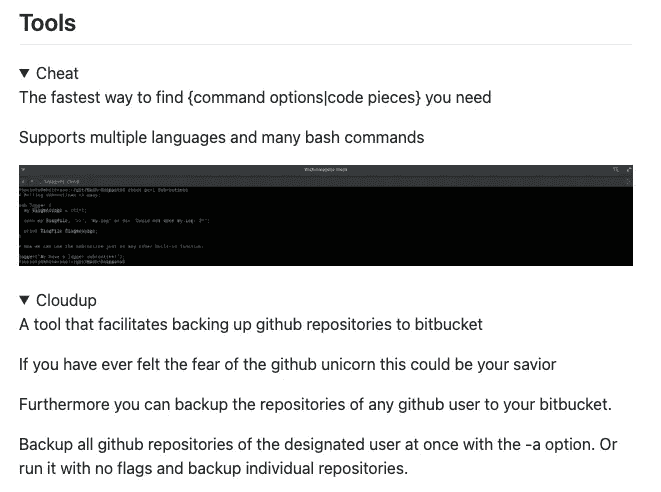

来自 [Bash-Snippets GitHub 页面](https://github.com/alexanderepstein/Bash-Snippets)

# 11.出版物资源

一些出版商在 GitHub 上保存他们的图书代码。通过阅读这段代码，你可以学到很多东西。如果你喜欢它，请购买这本书。其中一些证据充分，易于阅读。

*   Pro Bash 编程
*   Packt 出版公司的[学习 Linux Shell 脚本第二版](https://github.com/PacktPublishing/Learning-Linux-Shell-Scripting-Second-Edition)

# 12.Bash 常见问题

Greg 的 Wiki 提供了丰富的 Bash 常见问题、Bash 缺陷、Bash 指南、Bash 快速参考等等。他详细解释了为什么某些事情不能用简单的英语来做。

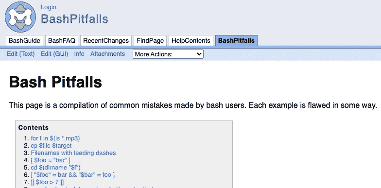

截图来自[http://mywiki.wooledge.org/BashPitfalls](http://mywiki.wooledge.org/BashPitfalls)

# 13.bash-one line

Bash-Oneliner 是终端技巧和终端命令的集合。

> “这篇博客将重点介绍我在工作和 LPIC 考试中获得的用于解析数据和 Linux 系统维护的简单 Bash 命令。”— [痛打一顿](https://onceupon.github.io/Bash-Oneliner/)

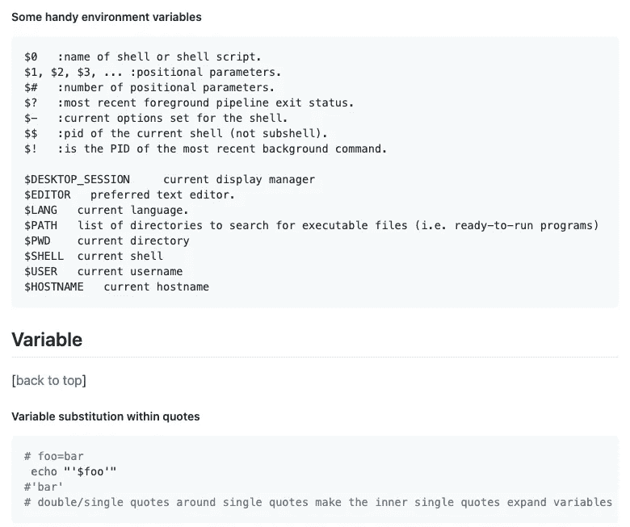

来自 [Bash-Oneliner](https://onceupon.github.io/Bash-Oneliner/) 页面。

# 14.命令行的艺术

Joshua Levy 在他的 [Github repo](https://github.com/jlevy/the-art-of-command-line) 中收集了一系列命令行技巧。包括 [Meta](https://github.com/jlevy/the-art-of-command-line#meta) 、[基础知识](https://github.com/jlevy/the-art-of-command-line#basics)、[日常使用、](https://github.com/jlevy/the-art-of-command-line#everyday-use)、[处理文件和数据](https://github.com/jlevy/the-art-of-command-line#processing-files-and-data)、[系统调试](https://github.com/jlevy/the-art-of-command-line#system-debugging)、[小程序](https://github.com/jlevy/the-art-of-command-line#one-liners)等等。

# 结论

我们可以从阅读维护良好的 Bash 脚本中学到很多东西。我希望这些工具和资源对您有用，并能每天使用它们。

您最喜欢的 Bash 脚本工具和资源是什么？如果我错过了什么，请让我知道。

快乐编码。

**通过** [**成为**](https://blog.codewithshin.com/membership) **会员，获得媒体上所有故事的访问权限。**


[https://blog.codewithshin.com/subscribe](https://blog.codewithshin.com/subscribe)

[](https://towardsdatascience.com/comparing-sh-bash-ksh-and-zsh-speed-82a72bbc20ed) [## 比较上海、巴什、KSH 和 ZSH 的速度

### 获胜者去…击鼓

towardsdatascience.com](https://towardsdatascience.com/comparing-sh-bash-ksh-and-zsh-speed-82a72bbc20ed) [](https://medium.com/better-programming/the-ultimate-programmers-guide-to-bash-scripting-2d11d4e6e978) [## Bash 脚本编程的终极程序员指南

### 深入探究 Bash 脚本，帮助您自动化任务

medium.com](https://medium.com/better-programming/the-ultimate-programmers-guide-to-bash-scripting-2d11d4e6e978) [](https://medium.com/better-programming/27-simple-bash-scripting-tips-for-beginners-d6764c977546) [## 初学者的 27 个简单 Bash 脚本技巧

### 不要害怕 Bash 脚本。看完这些提示会更容易

medium.com](https://medium.com/better-programming/27-simple-bash-scripting-tips-for-beginners-d6764c977546)