# Web 开发人员必备的 13 个浏览器扩展

> 原文：<https://betterprogramming.pub/13-must-have-browser-extensions-for-web-developers-7f4f3b1c623d>

## Redux 和 Vue 开发工具、CSS 扫描、JSONView 等等

克里斯多夫·高尔在 [Unsplash](https://unsplash.com?utm_source=medium&utm_medium=referral) 上拍摄的照片。

这篇文章最初发表在智能编码器的[上。](https://thesmartcoder.dev/13-must-have-browser-extensions-for-web-developers/)

像 Google Chrome 这样的现代浏览器不仅为访问网站提供了很好的体验，还为 web 开发人员提供了很好的工具来构建令人敬畏的应用程序。人们可以从各种伟大的浏览器扩展中进行选择，所以我收集了一些最好的，将有助于软件工程师更有效率，更快地开发应用程序，或找到错误。

# React/Redux 和 Vue 开发工具

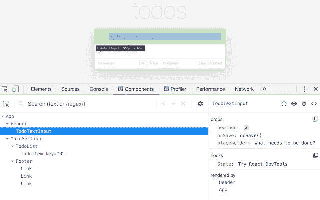

React.js 和 Vue.js 都是很棒的 JavaScript 框架。但是为了充分利用它们的能力，你应该使用它们各自的浏览器扩展。

React 开发者工具适用于谷歌 Chrome，并扩展了你的开发工具。您可以检查 React 组件、道具和状态。对 React.js 开发真的很有帮助！

如果你曾经遇到过应用程序状态的问题， [Redux DevTools](https://chrome.google.com/webstore/detail/redux-devtools/lmhkpmbekcpmknklioeibfkpmmfibljd) 可以帮你解决。它可以用于任何处理架构的状态，尤其是与 Redux 一起工作。专业提示:在 Chrome 中激活扩展，访问 Airbnb.com 等网站。Airbnb 使用 React/Redux，您可以了解他们如何使用 DevTools 构建状态管理。很酷，对吧？

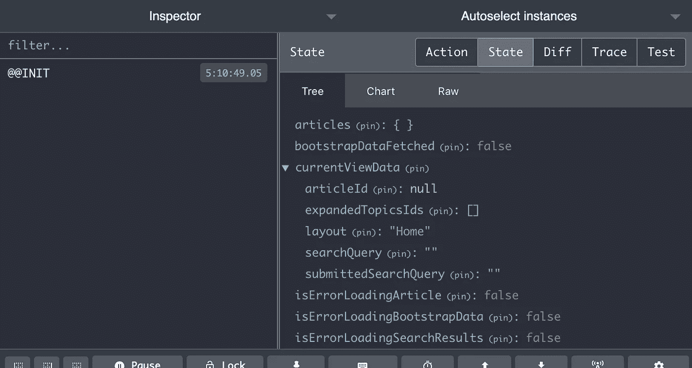

[Vue.js devtools](https://chrome.google.com/webstore/detail/vuejs-devtools/nhdogjmejiglipccpnnnanhbledajbpd) 是相当于 React Dev 工具的 Vue。它对于调试 Vue 组件非常方便，是 Vue 开发者的必备工具。

# JSONView

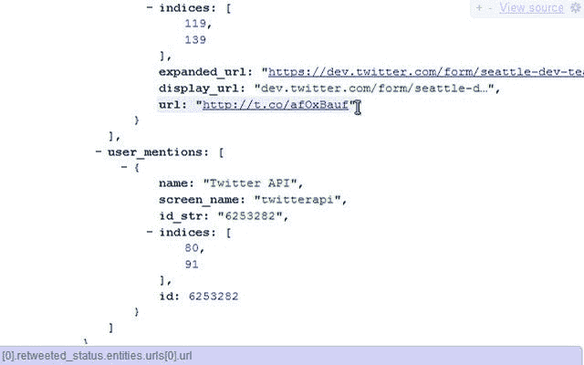

有没有想过为什么 JSON 数据在别人的浏览器中看起来如此漂亮，而在你的浏览器中却不是这样？这可能是因为他们为 Chrome 使用了 [JSONView](http://chrome.google.com/webstore/detail/jsonview/chklaanhfefbnpoihckbnefhakgolnmc) 扩展。它很好地格式化了 JSON，几乎是瞬间完成的。这绝对是我最喜欢的扩展之一！

# 图书馆嗅探器

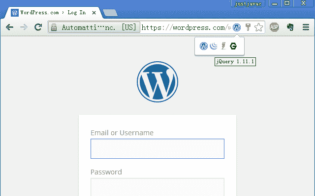

如果你想快速找到一个 web 应用程序运行在什么框架或库上，库嗅探器是一个很好的工具。例如，你可以检测一个网站是否基于 WordPress 或 Drupal，或者它是否是用 React.js、Vue.js 或 AngularJS 构建的…

# CSS 扫描 2.0

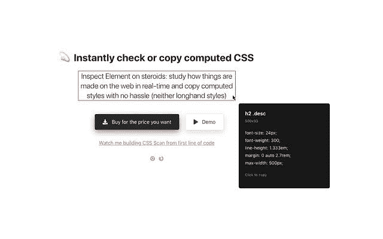

[CSS 扫描 2.0](https://chrome.google.com/webstore/detail/css-scan/gieabiemggnpnminflinemaickipbebg) 是一个很好的扩展，可以通过悬停在任何元素上来检查和复制 CSS。但是它有一个警告:它需要购买许可证。

一个免费的选择是 [CSS Peeper](https://chrome.google.com/webstore/detail/css-peeper/mbnbehikldjhnfehhnaidhjhoofhpehk) ，它让你专注于设计而不是钻研代码。

# Web 开发人员

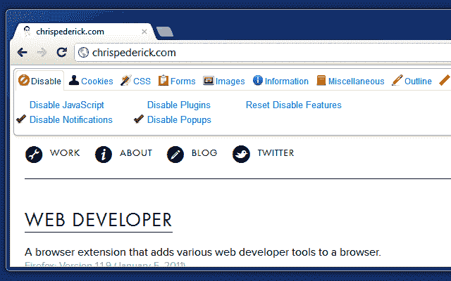

Web Developer 扩展为你的浏览器添加了一个带有各种开发者工具的工具栏。您可以禁用 JavaScript、更改页面布局、处理图像等等。Chrome 和 Firefox 都有！

# 什么字体

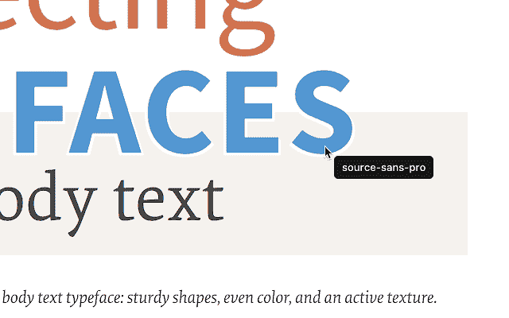

WhatFont 是一个相当小的扩展，为你识别网站上使用的字体。你所需要做的就是启用扩展并将鼠标悬停在文本上。就这么简单！Chrome 和 Firefox 都有。

# 色彩奇拉

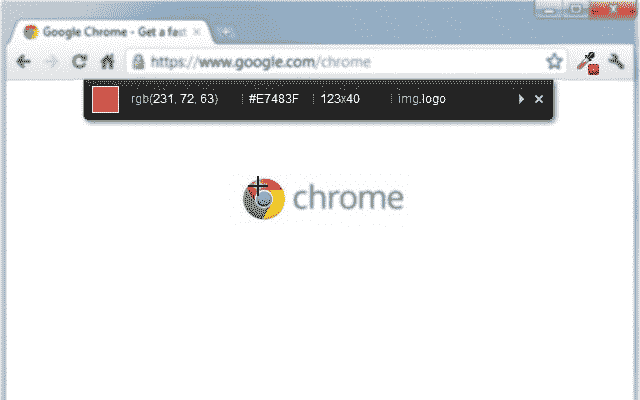

[ColorZilla](https://chrome.google.com/webstore/detail/colorzilla/bhlhnicpbhignbdhedgjhgdocnmhomnp) 可用于 Chrome 和 Firefox。它提供了一个高级吸管，颜色选择器，渐变发生器，等等。例如，你可以在网站上获得任何像素的颜色。它还带有一个颜色历史和调色板浏览器。

# 范围

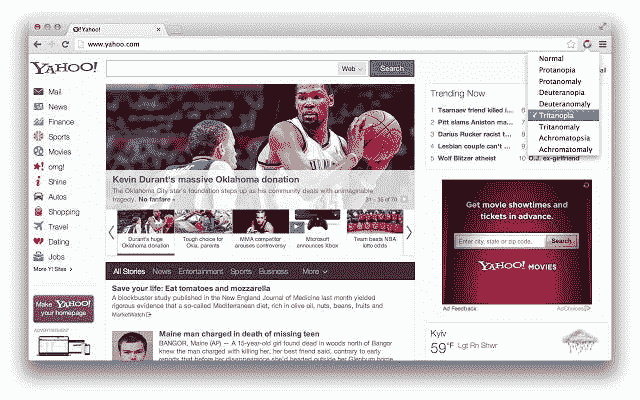

可访问性是现代 web 开发的一个重要方面，因为很多人在使用网站和应用程序时都有障碍。色觉缺陷(CVD)就是一个影响人们辨别某些颜色能力的例子。有了 [Spectrum](https://chrome.google.com/webstore/detail/spectrum/ofclemegkcmilinpcimpjkfhjfgmhieb) ，你就可以针对不同类型 CVD 的人测试网站。

# 网站调色板

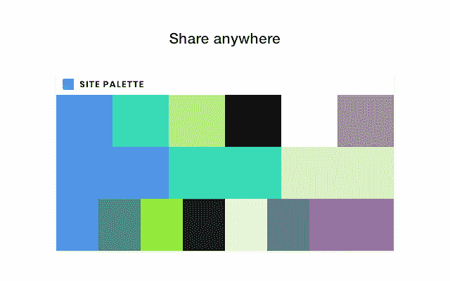

这个[扩展](https://chrome.google.com/webstore/detail/site-palette/pekhihjiehdafocefoimckjpbkegknoh)可以让你从任何网站提取颜色作为调色板。它支持几个调色板生成器，创建可共享的链接，以 PDF 格式打印或保存调色板，等等。

# 托比

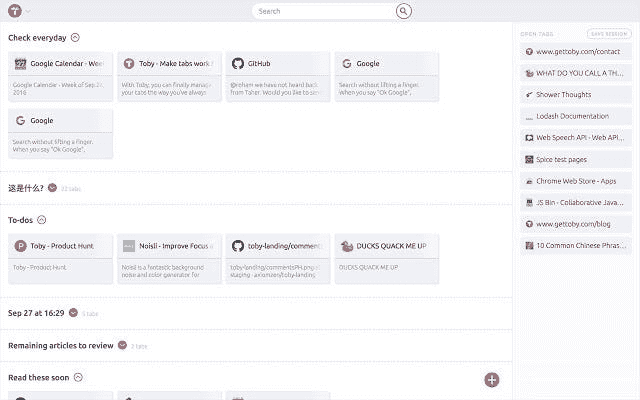

[托比](https://chrome.google.com/webstore/detail/toby-for-chrome/hddnkoipeenegfoeaoibdmnaalmgkpip)这是一个可视化的工作空间，存在于每个新标签上，你可以通过拖放来添加内容。这真的能帮助你变得更有效率。

# Talend API 测试器

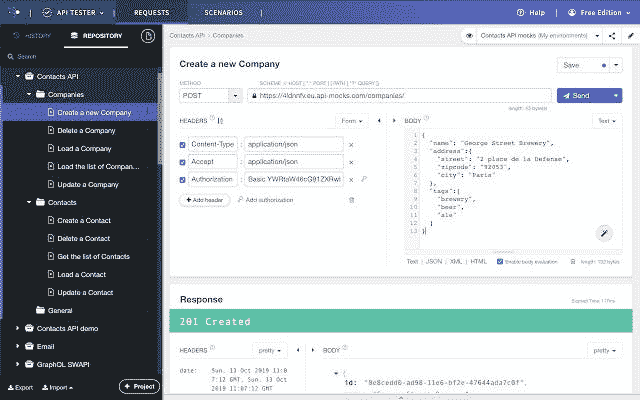

Talend API Tester 是一个很棒的扩展，可以让你在浏览器中与 REST、SOAP 和 HTTP APIs 进行交互——例如，类似于 Postman。免费版可以处理各种 HTTP 请求，还支持安全性和身份验证。

# 整页截屏

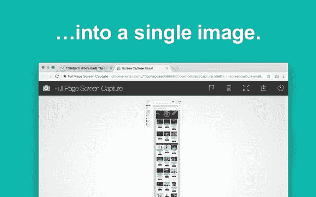

你有没有想过在不请求任何额外权限的情况下，完整地截取当前页面的截图？那么[全页截屏](https://chrome.google.com/webstore/detail/full-page-screen-capture/fdpohaocaechififmbbbbbknoalclacl) 可能就是你合适的扩展。只需点击扩展图标或使用快捷方式，并转移到一个新的标签，在那里您可以下载图像或 PDF 格式的结果。它甚至可以使用可滚动元素或 iframes！

这是我收集的伟大的浏览器扩展。我真的希望你作为一名开发人员可以在日常工作中使用其中的一个或多个。