# 13 个 Xcode 快捷方式提高您的工作效率

> 原文：<https://betterprogramming.pub/13-xcode-shortcuts-to-boost-your-productivity-329c90512309>

## 助理编辑，小地图，SwiftUI 预览，修复所有错误，多光标，等等

[胡安·戈麦斯](https://unsplash.com/@nosoylasonia?utm_source=unsplash&utm_medium=referral&utm_content=creditCopyText)在 [Unsplash](https://unsplash.com/s/photos/shortcut?utm_source=unsplash&utm_medium=referral&utm_content=creditCopyText) 上拍照

开发人员通常将大部分工作时间花在 IDE 上。如果你是 iOS、macOS、tvOS 或 watchOS 的开发者，你可能会比工作中的其他任何东西更接近你的 Xcode IDE。

我经常听到开发人员在刚开始的时候为没有学习 Xcode 快捷键找借口。在他们的辩护中，他们有一个有效的论点:

*如果你不记得快捷方式，使用鼠标至少可以帮助你快速完成工作。此外，学习捷径就像一条额外的学习曲线，尤其是当你开始学习的时候。*

为了阐明键盘快捷键对开发人员工作效率的影响，我想与他们分享一项研究的发现:

*如果您的工作需要您每天使用 IDE 工作八个小时，那么使用键盘快捷键可以为您每年节省八个工作日***。**

*八天是很长的时间。只要每天花几个小时，你就能熟练使用 Xcode 中的快捷键，省下一周的时间。通过快捷方式提高工作效率可以让你专注于手头更大的任务，加速你的开发和工作流程。*

*在接下来的几节中，我们将浏览许多我认为有用的 Xcode 键盘快捷键。我希望它们也能帮助你提高开发效率。*

*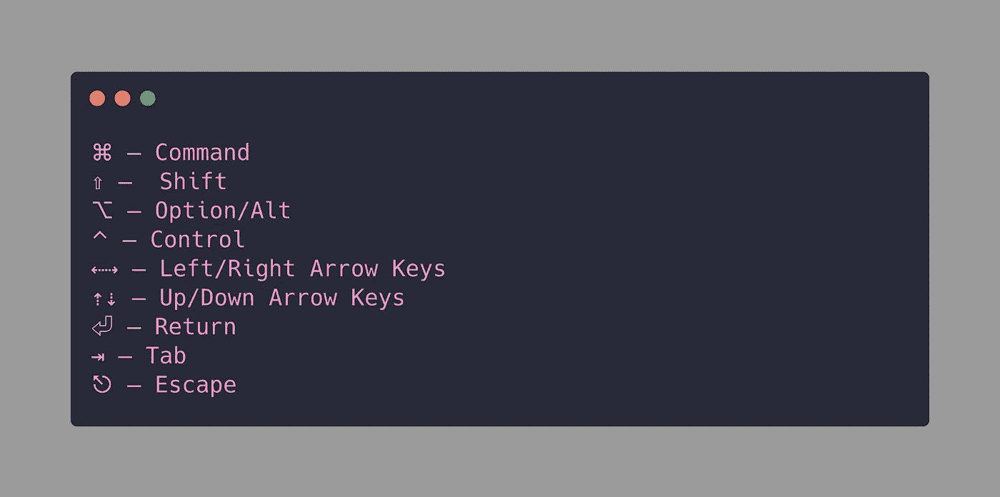*

*你不需要记住这个列表来坚持到底。我在符号旁边添加了命名的快捷方式。*

# *基本快捷方式*

*以下是 Xcode 中最常用的快捷键列表:*

*   *建造:⌘ + B*
*   *跑步:⌘ + R*
*   *测试:⌘ + U*
*   *停止:⌘ +。*
*   *干净:⌘ + ⇧ + K*
*   *清理构建文件夹:⌘ + ⇧ + ⌥ + K*
*   *快速打开:⇧ + ⌘ + O*
*   *代码完成:⌃ +空格*

# *助理编辑快捷方式*

*Xcode 11 给他们的助理编辑带来了很多改变。现在，您可以添加任意数量的编辑器，在当前编辑器上切换焦点模式，或者在隐藏其他编辑器的同时聚焦当前编辑器。此外，引入了一个新按钮，允许您设置相对于当前编辑器的辅助编辑器的位置。*

## ***添加二级编辑***

*以下快捷方式允许您添加辅助编辑器。如果您处于焦点模式，新的编辑器不会反映在您的屏幕上。*

***快捷键:⌃ + ⌘ + T** (控制+命令+ T)*

*通过悬停在“添加新编辑器”按钮上并按住**选项**键，我们可以将新编辑器的位置切换到右侧或底部。*

## ***聚焦当前编辑***

*要隐藏除当前编辑器之外的所有编辑器，请使用以下组合键:*

***快捷键:⇧+⌃+⌘+↩** (shift+control+command+enter)*

**

## *在助理编辑器中手动打开文件*

*Xcode 11 助手编辑器的一大变化是没有手动选项。为了在二级编辑器中打开一个目标文件，做一个 **Shift + Command + O** 到做一个快速打开，并在选择文件的同时按下 option 键，如图所示:*

***捷径:⇧ + ⌘ + O 后接⌥***

*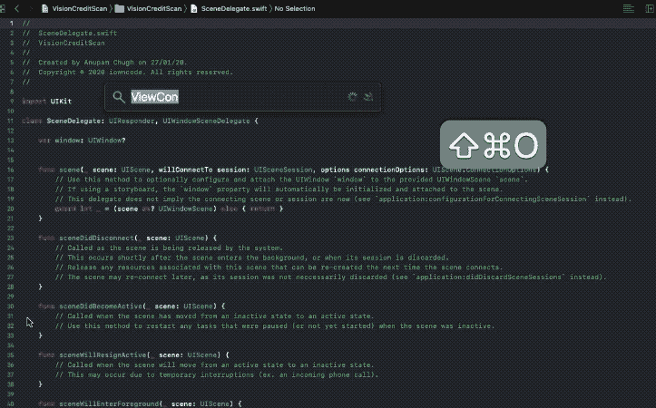*

## *编辑器之间的导航*

*当使用多个助理编辑并且您需要在它们之间切换时，使用触控板会打断流程。以下是允许您处理跨多个编辑器导航的快捷方式:*

***高亮编辑:⌘ + J** (Command + J)*

*一旦当前编辑器突出显示，您可以使用箭头键在助理编辑器之间导航，并按下新编辑器上的 **Return** 使其成为活动编辑器。*

*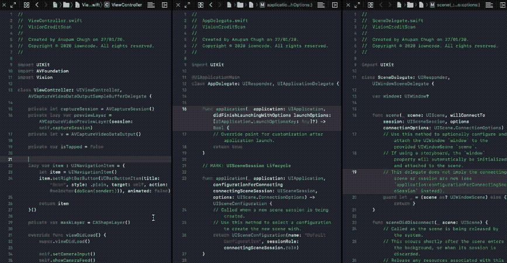*

# *修复范围内的所有错误*

*我经常遇到 Xcode 向我抛出大量错误的情况，特别是与 Swift 语法相关的错误——这在您跨不同版本迁移时很常见。*

*幸运的是，Fix-it All at once 选项对大多数一般性错误都很有效，节省了我们很多时间，尤其是在大型项目中。*

## *捷径:⌃+ ⌥ + ⌘ + F*

*(Control + Option + Command + F)*

*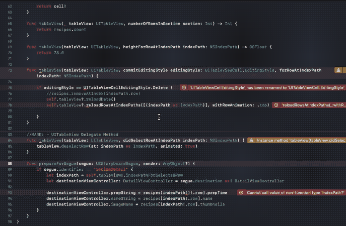*

# *多重选择上的多个光标*

*通常，需要使用多个光标来避免在不同的行上输入/复制相同的内容。我们可以通过选择当前单词并按 Alt + Command + E 来选择下一个出现的单词。这将在单词上放置多个光标，并允许我们一起编辑它们。*

## *捷径:⌥ + ⌘ + E*

*(选项+命令+ E)*

*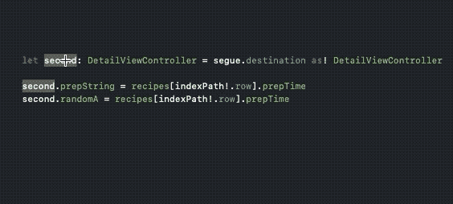*

*要选择上一次出现，请使用 Shift + Option + Command + E。*

# *重构范围内的所有内容*

*重构不可避免。这使得在作用域中编辑变量和方法成为一个至关重要的工具。以下快捷方式让我们可以同时编辑范围内的所有内容:*

## *捷径:⌃ + ⌘ + E*

*(控制+命令+ E)*

*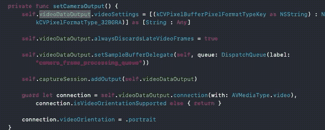*

# *跳转到方法*

*为了查看您的文件的轮廓，方法出现，只需按下 Command + 6。它会打开一个跳转栏，您可以从这里搜索所需的方法并直接跳转到该方法。*

## *快捷方式:⌃+ 6*

*(控制+ 6)*

*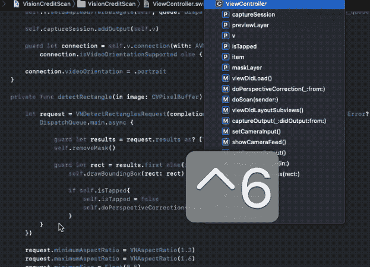*

# *跳到定义*

*从 Xcode 9 开始，command+click 不会直接带你去定义。相反，它会向您显示一个带有选项列表的弹出提示。为了直接跳到定义而不看到弹出窗口，请使用以下快捷方式:*

## *捷径:⌃ + ⌘ + J*

*(控制+命令+ J)*

*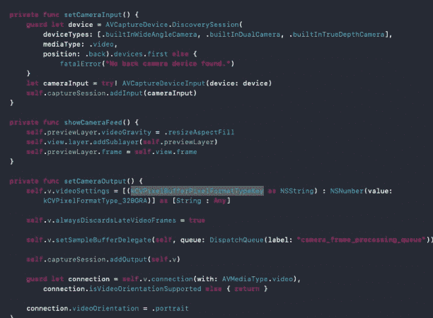*

# *折叠和展开方法*

*当您的文件大小超出界限时(理想情况下不应该超出界限)，有一个方便的快捷方式可以让您进行代码折叠，并折叠所有方法/选择性方法。*

*它在每个封闭块上放置一个代码带。以下是不同情况下的快捷方式:*

## ***全部折叠:⇧ +⌥ + ⌘ + ←***

*(Shift + Option + Command +左箭头键)*

## ***全部展开:⇧ +⌥ + ⌘ + →***

*(Shift + Option + Command +右箭头键)*

## ***折叠当前块:⌥ + ⌘ + ←***

*(Option + Command +左箭头键)*

*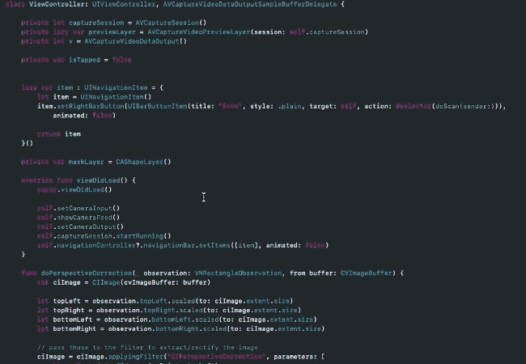*

# *关闭标签*

*Xcode 有很多快捷键，可以让您选取想要关闭的标签页。可以是当前的一个，也可以是除当前之外的所有。每个用例的快捷方式如下所示:*

## ***关闭标签:⌘ + W***

*(Command + W)*

## ***关闭其他标签页:⌘ + ⌥ + W***

*(Command + Option + W)*

# *重新排序语句*

*要更改语句的顺序并在语句之间移动，可使用以下快捷方式:*

## *快捷方式:⌘ + ⌥ + ( ]或[)*

*(Command + Option +方括号)*

*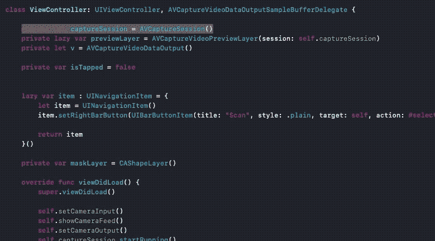*

# *查找呼叫层次结构*

*要快速找到所选符号的调用层次结构，无论是方法还是实例，只需使用下面的快捷方式。它在项目导航器中打开调用层次结构。*

## *捷径:⇧ + ⌃ + ⌘ + H*

*(Shift + Control + Command + H)*

*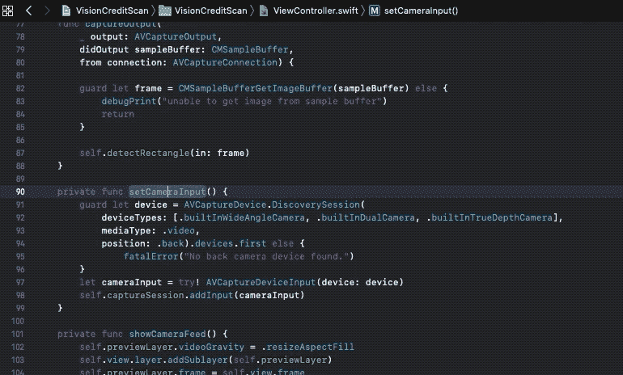*

# *全局搜索和或替换*

*Xcode IDE 能够进行快速的全局搜索，甚至能够替换任何地方的符号(小心处理)。*

## ***全项目搜索:⇧ + ⌘ + F***

*(Shift + Command + F)*

## ***搜索&替换整个项目:⇧ +⌥ + ⌘ + F***

*(Shift + Command + Option + F)*

*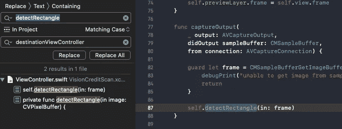*

# *SwiftUI 预览*

*SwiftUI 改变了我们思考和构建 UI 的方式。有了 Xcode 内置的画布预览，通过代码或直接在预览中构建 UI 变得简单多了。快捷方式只是加速你开发过程的锦上添花。*

## *切换画布*

*如果你想在代码中快速构建一个原型，而不让实时预览分散你的注意力，这是一个方便的快捷方式。*

## *Shortcut:⌥ + ⌘ + ↩*

*(Option + Command + Enter)*

## *恢复自动预览*

*自动预览经常会暂停，需要我们手动恢复。Xcode 11 很乐意为此提供一个快捷方式。*

## *捷径:⌥ + ⌘ + P*

*(选项+命令+ P)*

*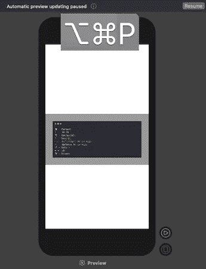*

# *迷你地图快捷方式*

*Xcode 11 给了我们小地图。ide 右侧有一个非常需要的代码概要视图。将鼠标悬停在它上面，您可以导航到代码的任何部分。*

*在重要的快捷方式中，一个让您切换小地图视图，而另一个显示文件中所有属性、方法、类和代码块的概要:*

## ***切换小地图** : **⇧ + ⌃ + ⌘ + F***

*(Shift + Control + Command + F)*

## ***小地图大纲** : **⇧ + ⌃ + ⌘***

*(Shift + Control + Command)*

**

# *结论*

*我们已经快速浏览了许多 Xcode 快捷方式，它们可以大幅提高您的工作效率和速度。Xcode 11 引入了一些方便的实用工具和快捷方式，应该只会帮助您加快工作速度。*

*对于开始使用快捷方式的开发人员，我建议慢慢来。选择一些快捷方式，并将它们包含在你的日常使用案例中，以建立肌肉记忆。试图一次记住所有东西并不是掌握键盘快捷键的最佳方式。*

*这一篇就到此为止——感谢阅读！*