# 获得灵感的 14 个最佳网站开发者作品集

> 原文：<https://betterprogramming.pub/14-best-web-developer-portfolios-to-get-inspiration-8fbce0f75320>

## 让这些令人兴奋的投资组合启发你的下一个投资组合

Emile Perron 在 [Unsplash](https://unsplash.com?utm_source=medium&utm_medium=referral) 上的照片

对于 web 开发人员来说，个人作品集页面就像一份简历。你可以用个人作品集来证明你的能力，而不是用传统的方式在简历上列出你的技能。

当人们或潜在雇主看到你的投资组合时，他们可以瞥见你的技能。因此，在线作品集是展示你的作品和技能的好方法。

然而，创建一个网上投资组合并不是对每个人都直截了当。例如，您可能会纠结于以下问题:

*   我应该在我的投资组合中添加什么？
*   我应该如何构建它？
*   我应该使用什么技术来构建它？

因此，我想帮助你回答你可能有的任何问题。在这篇文章中，你可以从网上看到我最喜欢的网络开发者作品集。希望他们能回答你的问题，并启发你创建自己的在线作品集。

# 1.杰克·杰兹纳赫

Jack Jeznach 是一名前端开发人员和 WordPress 专家。在他的投资组合页面上，您可以找到以下信息:

*   杰克是谁
*   他的工作经历
*   他的技能是什么
*   关于技术的文章

杰克的作品集非常吸引眼球！颜色组合非常好，动画也配合得天衣无缝。

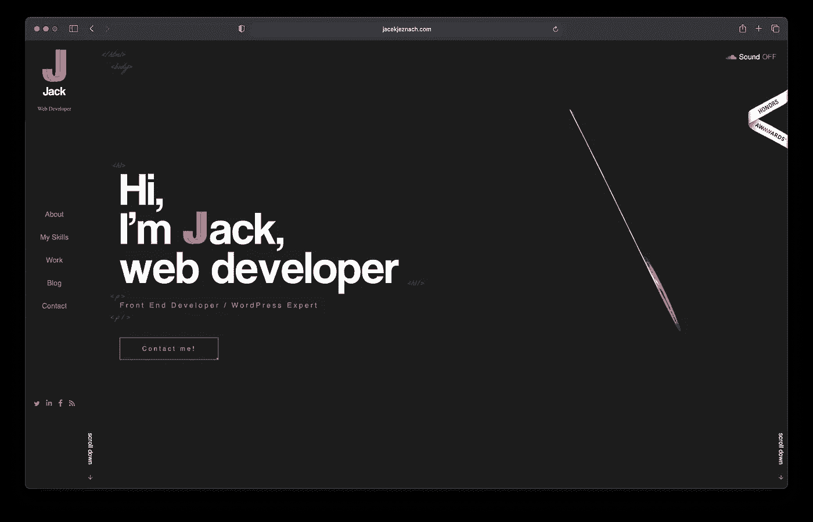

由于你无法在一张截图中理解所有的东西，我建议你查看一下[杰克的作品集](https://jacekjeznach.com/)。

# 2.林恩·费希尔

根据林恩的投资组合，她是一名开发人员、数字插画师和 UI/UX 设计师。

在 Lynn 的页面上，您可以了解更多关于她的信息以及她所做的工作。她还写文章，你可以向她学习！

关于林恩的投资组合，一个有趣的事实是，它每年都在变化。如果您转到[归档页面](https://lynnandtonic.com/archive/)，您可以看到所有以前的迭代。

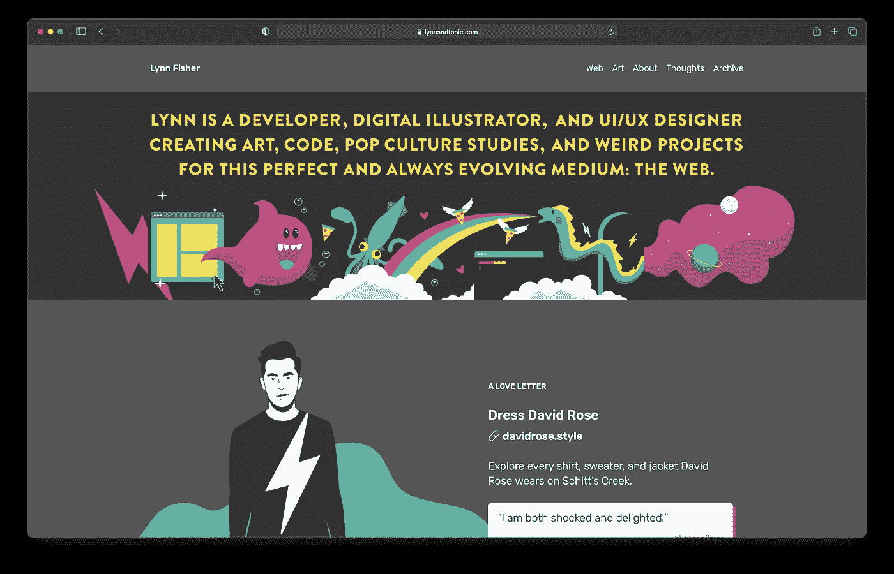

我想突出显示存档页面中的一些内容。如果您访问该页面，您应该会看到以下内容:

> 我称之为我的“年度投资组合更新”,并把它作为尝试新事物和继续学习的机会。

这是我们都应该记下来的事情！我们应该利用让我们学到东西的机会，永远不要停止学习。话虽如此，请看 [Lynn 的作品集第](https://lynnandtonic.com)页。

# 3.布鲁诺·西蒙

布鲁诺·西蒙(Bruno Simon)曾是多家公司的首席开发人员，但现在他是一名自由职业者和教师。

布鲁诺的作品集页面其实是一个互动游戏。您使用吉普车浏览网页，可以看到如下信息:

*   工作经验
*   个人项目
*   他活跃的社交媒体网站

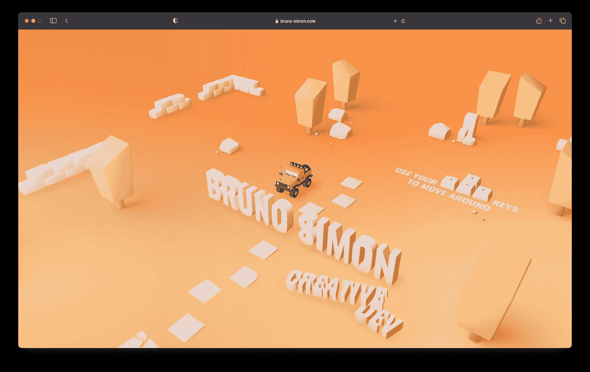

这张图片对他的作品集页面不公平！我建议你去查看一下他的页面。

# 4.礼物 Egwuenu

Gift Egwuenu 是一个前端开发者和内容创建者。她在技术领域有着丰富的经验，曾作为开发人员在该领域工作了数年。

在她的作品集页面上，你可以看到更多关于 Gift 和她的工作经历。你也可以及时了解她写的文章。

该组合仅由几种颜色和动画组成，使其简单而优雅美丽！

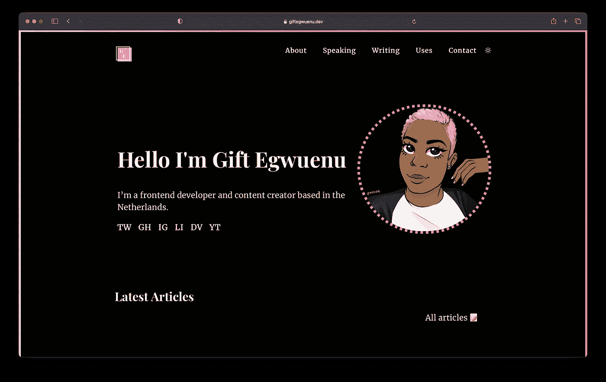

我建议你亲自查看一下 [Gift 的作品集](https://www.giftegwuenu.dev)，看看它有多棒！

# 5.杰森·伦斯托夫

Jason 是一名经验丰富的软件开发人员、软件架构师和内容创建者。他在软件开发方面有着丰富的经验，这在他的作品集页面上有所体现。

杰森的作品集是最有创意的在线作品集之一。颜色、动画和声音都很到位！

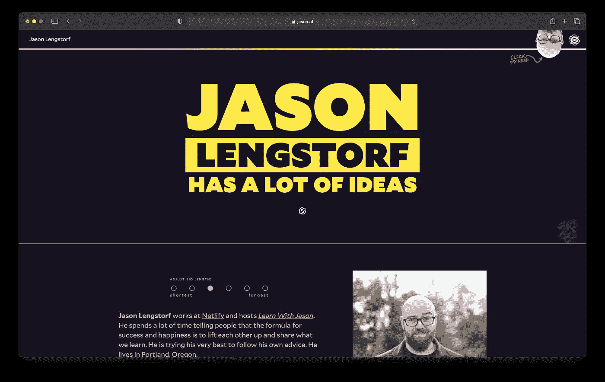

看[他的作品集](https://www.jason.af/)在行动！

# 6.布列塔尼·蒋

Brittany 是一名软件工程师，她的作品集已经是经典作品了！我毫不怀疑你已经在网上看到了。

她的作品集突出了布里特妮的身份和她的工作经历。此外，你还可以看到她从事的项目。

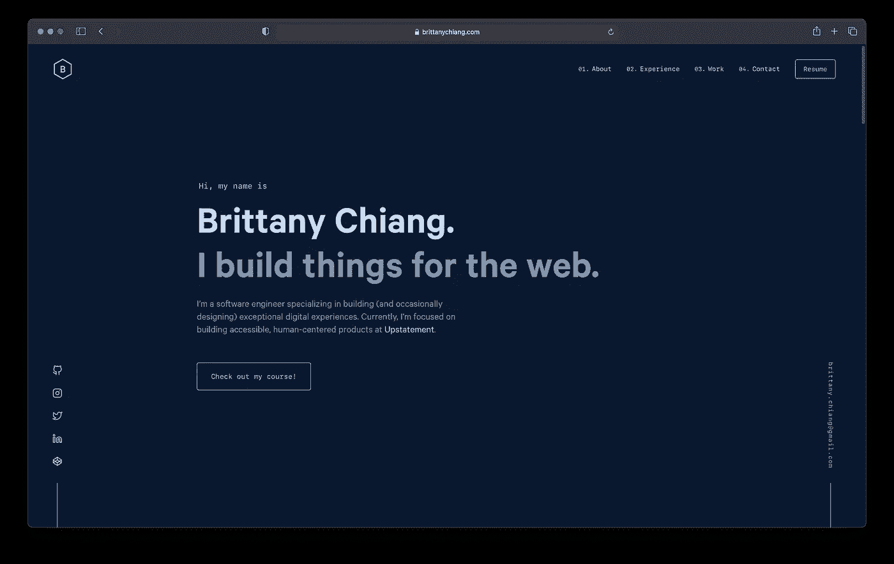

浏览布列塔尼的网页是一种享受。去[参观一下](https://brittanychiang.com/)说服自己！

# 7.奥卢瓦凯米·阿德莱克

Oluwakemi 是一名前端开发人员和 UI/UX 设计师。她的作品在各方面都很出色，我尤其喜欢它的色彩组合。

Oluwakemi 的投资组合页面包含一些信息，例如:

*   她是谁
*   她的服务是什么
*   她正在使用的工作流程
*   项目组合

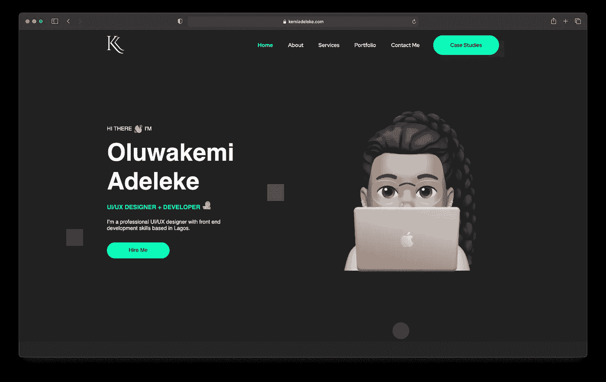

查看 [Oluwakemi 的作品集](https://www.kemiadeleke.com/)。

# 8.马克斯·博克

Max 是一名前端开发人员和设计师，拥有 15 年的行业经验。

马克斯的作品集看起来很简单，但却非常时尚。有时候，少即是多，这个作品集就证明了这一点。

在他的作品集页面上，你可以读到 Max 是谁，你也可以了解他的最新文章。

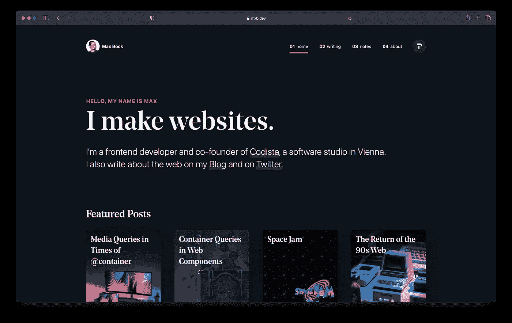

浏览 [Max 的作品集页面](https://mxb.dev)。

# 9.奥卢瓦达尔·奥卢瓦塞伊

Oluwadare 是一名前端开发人员，他的作品集页面是最好看的页面之一。他的投资组合布局和设计真的与众不同，独一无二。

在他的作品集页面上，你可以读到更多关于奥卢瓦代尔和他的工作经历。

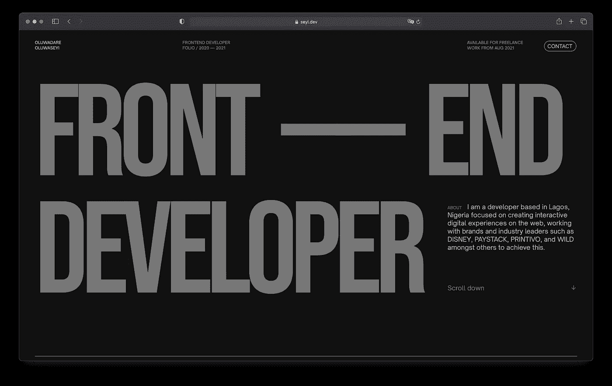

玩玩 [Oluwader 的作品集](https://www.seyi.dev)看看它有多棒！

# 10.安妮·邦妮

安妮以前是一名设计师，但她转行成为了一名开发人员。看她的作品集，你可以看到她以前是一名设计师，因为它看起来很漂亮！

安妮的作品集色彩缤纷，个性十足。尽管它使用了多种颜色，但它们配合得很好。

我喜欢但在其他投资组合中看不到的一件事是推荐。安妮附上了与她合作的人的证明。这是建立信誉和证明你能力的好方法。

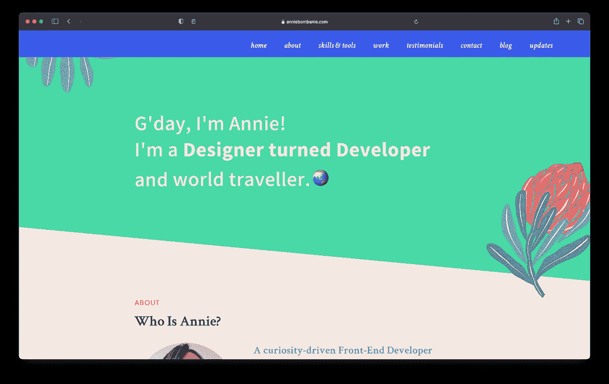

话虽如此，你自己去查查[安妮的作品集](https://anniebombanie.com)。

# 11.杰·汤普金斯

Jhey 是一名在 web 开发领域拥有丰富经验的 web 开发人员。他还在这个 [Codepen profile](https://codepen.io/jh3y) 上创建了许多 CSS 演示。

Jhey 的作品集包含了很多信息，但是有一种愉悦的感觉。感觉一切都在该在的地方。

在他的投资组合页面上，您可以找到以下信息:

*   他们是谁
*   他写的文章
*   他的工作经历
*   他用什么设备

他的投资组合既简单又复杂。真的很好看！

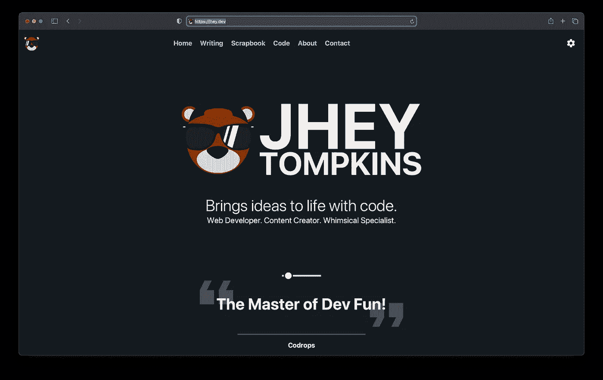

你可以点击访问 Jhey 的作品集页面[。](https://jhey.dev)

# 12.罗伯·欧文

Robb 是一名开发人员和设计师，他有大约 20 年的技术经验。

罗柏的作品集各方面都很棒。动画、色彩、结构和其他一切都无可挑剔。

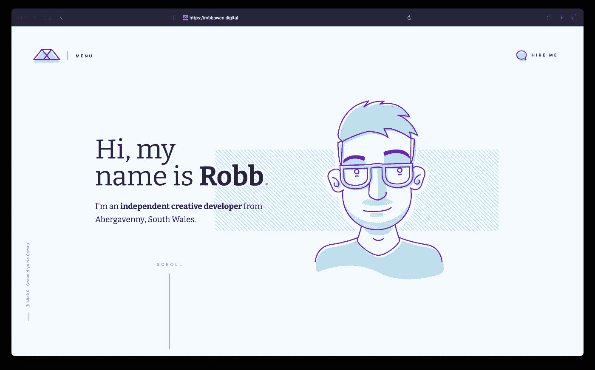

查一下[罗柏的作品集](https://robbowen.digital)看看有多好！

# 13.奥拉卢奥拉武义

Olaolu 是一名前端开发人员和 UX 工程师，他拥有丰富的开发经验。

Olaolu 的作品集生动活泼，色彩丰富，使其与众不同。滚动效果和汉堡菜单也非常好。

投资组合结构很好，突出了他是谁，以及他作为开发人员的工作经验。

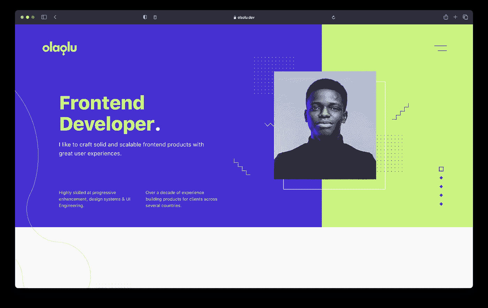

[Olaolu 的作品集](https://olaolu.dev/)很优秀，推荐去看看！

# 14.乔希·科莫

Josh 的博客一定不能错过！尽管它是一个博客，我还是想把它列入这个列表，因为它做得真的很好。

该博客有许多微妙但惊人的动画，使浏览网站成为一种乐趣。颜色组合在黑色和白色模式下看起来都很好。

总的来说，博客真的很好，值得一去！

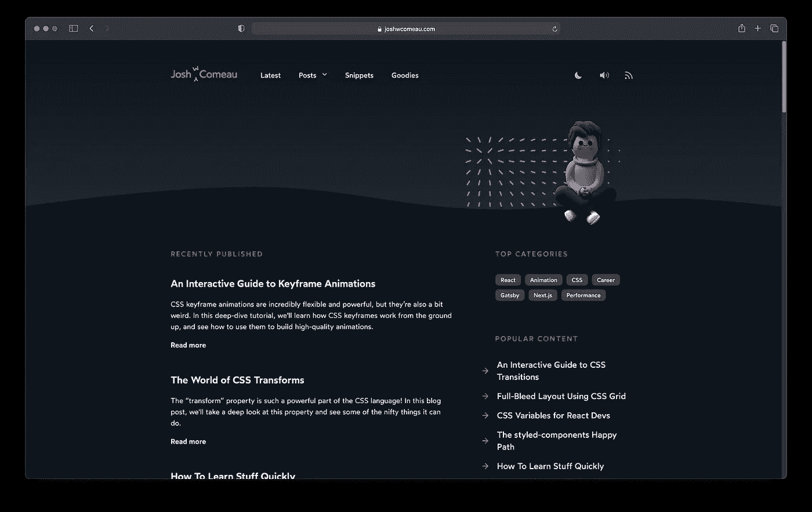

你可以在这里看到 Josh 的博客[。](https://www.joshwcomeau.com/)

# 结论

不要忘记作品集是展示你的作品和技能的好地方！此外，在建造它的时候，你可能会学到一些新的东西！

我希望这些投资组合有助于激发灵感，并且你已经准备好建立你的新投资组合。或者改进现有的。

>*通过* [*完整网络&手机设计师课程*](https://rli.to/1Jxng) *学习如何建立一个像上面这样的令人敬畏的作品集。*

你可以在这里阅读原文— [web 开发者作品集](https://catalins.tech/14-best-web-developer-portfolios-to-get-inspiration/)。