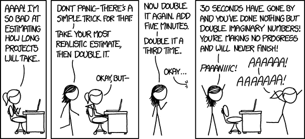

# 每个开发人员都应该遵守的 14 条规则

> 原文：<https://betterprogramming.pub/14-rules-that-every-developer-should-stick-to-14ee267052ca>

## #7:不知道一切也没关系

图片由 [Unsplash](https://unsplash.com?utm_source=medium&utm_medium=referral) 上的 [Alexandru Acea](https://unsplash.com/@alexacea?utm_source=medium&utm_medium=referral) 拍摄

有一套规则可以帮助你更好地工作，因为你提前做决定，而不是匆忙做出所有这些决定。作为一名开发人员，正确的规则集可以作为提高自己的工具。

在本文中，我们将讨论 14 条规则(尽管其中一些看起来更像是指导方针),每个开发人员都应该遵守这些规则来帮助自己成长。尽管坚持所有这些规则可能很难，但你至少应该坚持其中的几条。

# 1.功能战胜优雅

功能性代码十有八九胜过优雅的代码。例如，仅仅因为设计模式很优雅就将其添加到代码库中，这并不是实现它的好理由。尤其是当解决这个问题的替代方法可以通过几行简单的代码实现时。

尽管设计模式可能是更好的解决方案，但是它增加了项目的技术负担，并且需要更多的时间来构建和测试。

# 2.不要过度设计

过度工程化是许多开发人员的坏习惯之一。当查看代码库时，您会经常发现过度设计的代码片段。

过度工程基本上可以归结为，你使产品的设计比必要的更健壮或更复杂。过度工程引入代码库的一种方式是当开发人员已经在添加他认为将来可能有用的代码时。

这段额外的代码被添加到代码库中，但它可能永远不会被使用。发生这种情况的主要原因是基于投机。也许解释过度工程的最佳方式是，它是解决不存在的问题的代码。

只构建需求中所要求的东西，不要预测可能的新特性——大多数时候是不必要的——特性。

# 3.虚心接受反馈和批评

你应该接受反馈和批评，尤其是在团队中工作的时候。当涉及到自己的能力时，不要过于自信。一旦你开始变得过于自信，你很可能会忽视你得到的反馈和批评。

感谢人们愿意给你反馈——不管是谁给你的。将收到的反馈作为成长的机会。这是了解你需要改进的地方的简单方法。

# 4.在评估的时候要现实

让我们面对现实吧——估计某些任务花费多少时间是软件开发中最困难的事情之一。有时候需求没有被很好的定义。其他时候，需求似乎永远不会停止变化。

很高兴知道错过你的估计经常发生。在评估的时候要现实一点，要知道你有时会大错特错。这没什么——估计只是估计。这不是你承诺的最后期限。

比良好的评估更重要的是良好的沟通。每当你在某项任务上花费的时间比你预计的要多的时候，交流一下。

[来源](https://imgs.xkcd.com/comics/estimating_time_2x.png)

# 5.创建一个计划

永远不要没有计划就开始编码。在你开始写代码的第一个字母之前，你应该知道它应该做什么。否则，你打算编码什么？如果没有一个计划，你的代码很可能没有经过深思熟虑，结果代码变得不必要的复杂。

在你深入编码之前，你应该问自己一些问题。你如何解决这个问题？你将实现什么样的结构？你正在实现的总体目标是什么？

在你开始编码之前，这些都是很好的问题。这些问题可以让你更加意识到在编写代码之前有很多事情需要考虑。

# 6.测试您自己的代码

没有什么比您的代码刚部署到测试环境就失败更让测试人员沮丧的了。为了防止这种情况发生，您应该测试自己的代码。最好是通过编写自动化测试，但是如果这超出了你的理解范围，至少要确保手动测试。

开发人员对测试懈怠的主要原因是大多数开发人员不喜欢测试。他们宁愿花费大量的时间和精力来为新特性编写代码。

尽管事实上测试不是他们最喜欢的工作部分，但是每个开发人员都明白为什么应该这样做。尊重测试人员的时间；他们的时间和你自己的时间一样宝贵。因此，您应该遵守测试自己代码的规则。

# 7.不知道一切也没关系

重要的是要意识到这样一个事实，即不可能知道软件开发世界中发生的所有事情。简直太过分了。

意识到你并不知道所有的事情是你可以利用的优势。你要知道这不是软弱的表现。知道你不知道的事情可以帮助你专注于你知道的事情。

比什么都懂更重要的是快速学习东西的能力。你不必记住某个框架中所有可用的方法。一旦你阅读了一个框架的文档，能够快速上手就更有价值了。

# 8.努力保持事情简单

很容易理解为什么您应该在代码中尽可能保持简单，但是将它付诸实践是非常困难的。甚至有一个专门的编码原则——接吻原则。KISS 代表“*保持简单，笨蛋*”

这种代码被认为是简单明了的，甚至可能是愚蠢的代码。然而，编写简单的代码是开发人员在编程方面最重要的素质之一。

代码应该只做它需要做的事情，而不需要大量的抽象和继承。写代码不要花里胡哨！

如果你设法让你的代码尽可能的简单，你会在可读性和可维护性方面体验到很多好处。

# 9.一致性

谈到软件开发，一致性确实是关键。不一致的问题来自于时间摧毁软件这一不可避免的事实。一个软件存在的时间越长，使用它的人越多，混乱就越多。

只要你坚持不懈，你做什么都没关系。你在 camel case 中声明你所有的变量了吗？只要你坚持用那种方式来声明你的变量，那就很好。不要开始用 snake case 来声明你的变量，因为你认为这样更容易阅读。

这也意味着您必须尊重现有项目中的约定。不要将代码库中使用的约定与您自己的偏好混淆。

# 10.有时捷径是必要的

一个优秀的开发人员知道什么时候可以走捷径。尽管这听起来可能违反直觉，但编写次优的代码可能是非常好的。

在某些情况下，快速和肮脏可能是首选方式。例如，当代码的生存期很短时。大多数情况下，如果从长远来看不需要代码，您可以证明快速而肮脏的解决方案是正确的。这可能是在一个代码库中，您将在不久的将来替换它，或者计划使用一次代码。

请记住，当您长期需要代码时，快速而肮脏地修复东西会反过来伤害您。知道什么时候应用快速和肮脏的解决方案是一项可以节省你很多时间的技能。

# 11.为你的错误负责

错误随时随地都会发生。尤其是当你在团队中工作的时候。犯错是不可避免的，它不应该太困扰你。犯错误其实没什么，只要你从中吸取教训。这是作为开发人员最常见的成长方式。

只要确保你对自己的错误负责。

当事情变糟时，试着给出选项而不是借口。想想你如何弥补你的错误，讨论可能的解决方案，不要推卸责任。

# 12.一路上学习新的东西

新技术每天都在涌现，有时似乎很难跟上所有的最新趋势。尽管你不应该停止学习。因为你停止学习的那一天就是你停止成长的那一天。

在我们生活的这个不断变化的技术时代，学习新事物是保持相关性的唯一途径。

> "学习是一个不断发现的过程，一个没有终点的过程."——李小龙

# 13.自动化重复性任务

除了做重复性的工作很无聊之外，你还应该珍惜你的时间。自动化所有重复的任务可以帮助你腾出大量的时间来做其他的事情。这应该是尽可能自动化的主要动机。

最重要的是，自动化重复性任务消除了人的因素，从而减少了出错的可能性。

# 14.掌握你使用的工具

每种手艺都有一套完成工作所需的工具。在软件开发中尤其如此。杰夫·贝索斯有一句名言:“我们首先改变我们的工具，然后我们的工具改变我们。”没有工具，开发人员就无法高效地完成工作。

知道使用什么工具以及如何正确使用它们可以帮助你更快地完成工作。您应该花一些时间来了解可用的不同工具。

从浏览器插件到您的 IDE 和命令行工具，在选择您的工具集时需要做出很多决定。一旦你精心挑选了一套工具，就花时间去试验它们，并尽可能快地掌握它们。