# 每个 React 开发者都应该知道的 14 个有用的包

> 原文：<https://betterprogramming.pub/14-useful-packages-every-react-developer-should-know-55b47a325d3>

## 使用这些软件包提高您的开发效率


React(或任何其他前端框架)是一个非常强大的工具。在构建前端界面时，React 为开发团队和个人节省了大量时间。

当涉及到开发人员的生产力和快乐时，npm 包是最重要的。当你可以节省时间时，为什么要花几个星期重新发明轮子呢？很有可能有人已经用 npm 包解决了你面临的问题。

话不多说，这里有一个包的列表，我相信每个 React 开发者都应该知道。这些软件包可以节省大量时间——尽可能使用它们，并且经常使用！

# 1.反应测试库

[React 测试库](https://github.com/testing-library/react-testing-library)是一个用于测试 React 组件的轻量级解决方案。该库在`react-dom`和`react-dom/test-utils`之上提供了轻量级实用函数。

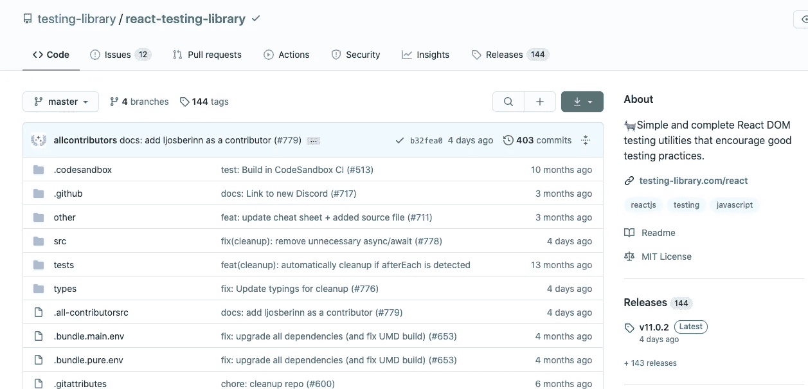

反应-测试-库—[https://github.com/testing-library/react-testing-library](https://github.com/testing-library/react-testing-library)

## 装置

这个模块通过 [npm](https://www.npmjs.com/) 包分发。

```
yarn add --dev @testing-library/react
```

图书馆有`react`和`react-dom`的`peerDependencies`列表——确保你已经安装了它们。

## 快速示例

这里有一个 React 组件，它根据其内部状态显示一条消息。您可以打开和关闭消息。

下面是如何用`react-testing-library`测试`HiddenMessage` React 组件的方法。

查看[官方文档](https://testing-library.com/docs/react-testing-library/intro)获取更复杂的示例。

# 2.框架运动

成帧器运动是 React 的一个生产就绪的运动库。运动和动画由成帧器库提供支持。

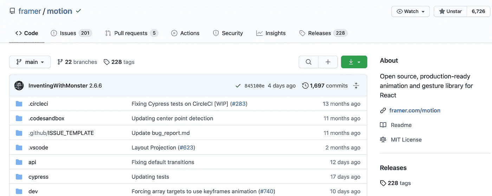

成帧器运动—[https://github.com/framer/motion](https://github.com/framer/motion)

成帧器运动包括以下内容:

*   春季动画
*   简单的关键帧语法
*   手势(拖动/点击/悬停)
*   布局和共享布局动画
*   SVG 路径
*   退出动画
*   服务器端渲染
*   跨组件编排动画的变体
*   CSS 变量


## 入门指南

通过纱线安装:

```
yarn add framer-motion
```

下面是如何在 React 组件中使用帧运动。

```
import { motion } from "framer-motion"export const MyComponent = ({ isVisible }) => (
    <motion.div animate={{ opacity: isVisible ? 1 : 0 }} />
)
```

如果你对更多的例子感兴趣，[看看我之前写的关于框架运动的文章](https://medium.com/better-programming/smooth-animations-with-react-and-framer-motion-c272b6f22f67)。你也可以看看更多的[例子](https://framer.com/motion)来获得灵感。

阅读[文档](https://framer.com/api/motion)中的指南和完整的 API 参考。

# 3.样式组件

styled-components 允许您编写实际的 CSS 代码来样式化您的 React 组件。它还删除了组件和样式之间的映射。使用组件作为底层样式构造再简单不过了。

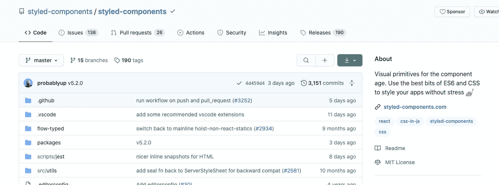

样式组件—[https://github.com/styled-components/styled-components](https://github.com/styled-components/styled-components)

## 快速示例

这是一个用样式组件库设计的 React 组件。

您将在浏览器中看到:


Hello World，styled-组件

利用[标记的模板文字](https://www.styled-components.com/docs/advanced#tagged-template-literals)(JavaScript 的新功能)和 CSS 的[功能，我们可以编写下面的代码。](https://www.styled-components.com/docs/api#supported-css)

```
const Button = styled.button`
  color: grey;
`;
```

或者，您可以使用[样式对象](https://www.styled-components.com/docs/advanced#style-objects)。这允许从内联样式轻松移植 CSS，同时仍然支持更高级的样式化组件功能，如组件选择器和媒体查询。

```
const Button = styled.button({
  color: 'grey',
});
```

相当于:

```
const Button = styled.button`
  color: grey;
`;
```

有关使用样式化组件的更多信息，请参见 styled-components.com/docs[的文档。](https://www.styled-components.com/docs)

# 4.柏树

Cypress 是一个快速、简单、可靠的测试库，适用于在浏览器中运行的任何东西。Cypress 解决了开发人员和 QA 工程师在测试现代应用程序时面临的关键痛点。

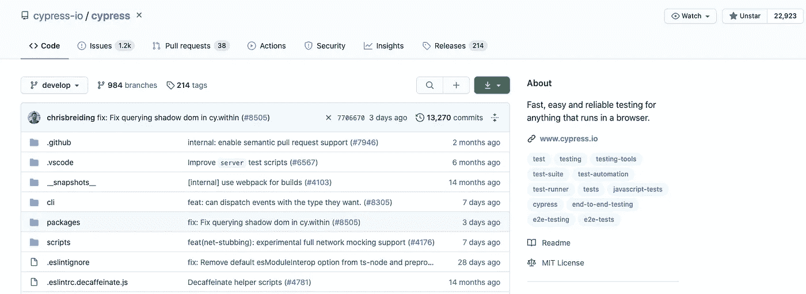

柏树—[https://github.com/cypress-io/cypress](https://github.com/cypress-io/cypress)

赛普拉斯让我们有可能:

*   [设置测试](https://docs.cypress.io/guides/overview/why-cypress.html#Setting-up-tests)
*   [写测试](https://docs.cypress.io/guides/overview/why-cypress.html#Writing-tests)
*   [运行测试](https://docs.cypress.io/guides/overview/why-cypress.html#Running-tests)
*   [调试测试](https://docs.cypress.io/guides/overview/why-cypress.html#Debugging-tests)

柏树最常被比作硒。然而，柏树从根本上和建筑上都是不同的。

## 安装

安装 Cypress for Mac、Linux 或 Windows，然后[开始使用](https://docs.cypress.io/guides/getting-started/installing-cypress.html)。

```
yarn add cypress --dev
```

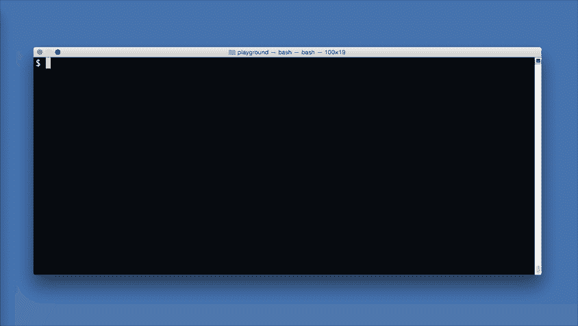

安装和运行 cypress 测试

## 添加测试文件

假设您已经成功地[安装了测试运行程序](https://docs.cypress.io/guides/getting-started/installing-cypress.html#Installing)并且[打开了 Cypress 应用程序](https://docs.cypress.io/guides/getting-started/installing-cypress.html#Opening-Cypress)，现在是时候编写您的第一个测试了。您将:

1.  创建一个`sample_spec.js`文件
2.  观看 Cypress 更新我们的规格列表
3.  启动赛普拉斯测试赛

让我们在为我们创建的`cypress/integration`文件夹中创建一个新文件:

```
touch {your_project}/cypress/integration/sample_spec.js
```

一旦我们创建了这个文件，我们应该看到 Cypress 测试运行器立即将它显示在集成测试列表中。

Cypress 会监控您的等级库文件的任何更改，并自动显示任何更改。

尽管您还没有编写任何测试——没关系——让我们点击`sample_spec.js`,看看 Cypress 启动您的浏览器。

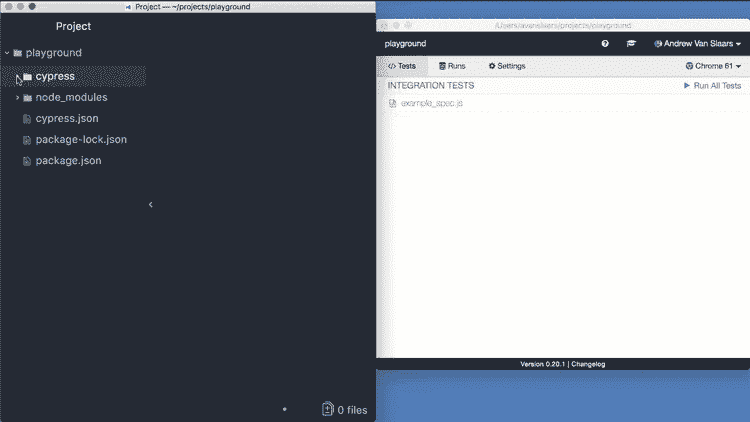

运行 cypress 示例测试

我们现在正式进入[柏树测试赛](https://docs.cypress.io/guides/core-concepts/test-runner.html)。这是您将花费大部分时间进行测试的地方。

## 编写您的第一个测试

现在是时候编写您的第一个测试了。您将:

1.  编写您的第一个通过测试
2.  编写你的第一个失败的测试
3.  实时观看 Cypress 重新加载

当您继续保存您的新测试文件时，您将看到浏览器实时自动重新加载。

打开您最喜欢的 IDE，将下面的代码添加到您的`sample_spec.js`测试文件中。

```
describe('My First Test', () => {
  it('Does not do much!', () => {
    expect(true).to.equal(true)
  })
})
```

保存该文件后，您应该会看到浏览器重新加载。

虽然它没有做任何有用的事情，但是这是你第一次通过测试！✅

在[命令日志](https://docs.cypress.io/guides/core-concepts/test-runner.html#Command-Log)中，您会看到 Cypress 显示了套件、测试和您的第一个断言(应该是绿色的)。

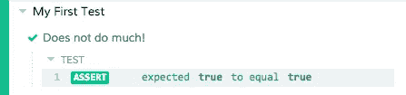

柏树测试通过

查看官方 Cypress 文档进行深入研究。

# 5.较美丽

漂亮是一个固执己见的代码格式化程序。通过解析你的代码并使用它自己的规则重新打印它，漂亮地执行一个一致的风格。

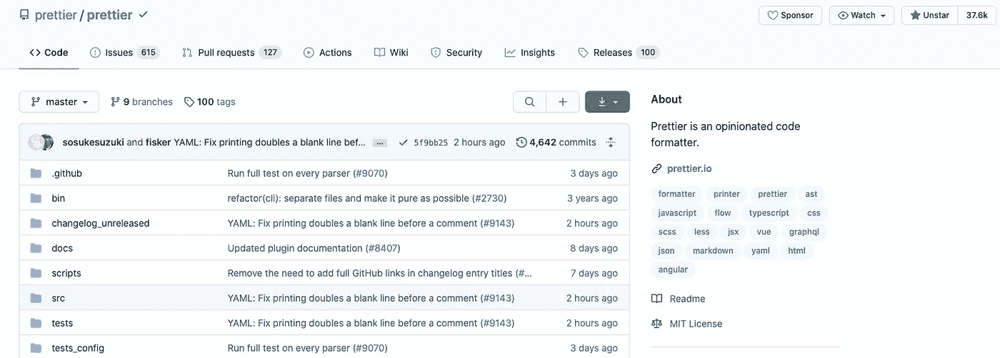

更漂亮——【https://github.com/prettier/prettier 

对于想要在整个团队中实施编码标准的大型开发团队来说，Prettier 是必备的。

目前，漂亮支持以下文件扩展名:

*   JavaScript(包括实验特性)
*   [JSX](https://facebook.github.io/jsx/)
*   [有角度的](https://angular.io/)
*   [Vue](https://vuejs.org/)
*   [流量](https://flow.org/)
*   [打字稿](https://www.typescriptlang.org/)
*   CSS、[减去](http://lesscss.org/)和 [SCSS](https://sass-lang.com/)
*   [HTML](https://en.wikipedia.org/wiki/HTML)
*   [JSON](https://json.org/)
*   [图表 QL](https://graphql.org/)
*   [降价](https://commonmark.org/)，包括 [GFM](https://github.github.com/gfm/) 和 [MDX](https://mdxjs.com/)
*   [YAML](https://yaml.org/)

## 更漂亮的快速演示

假设我们有一个函数，它有很多长名字的参数。

**输入**

```
foo(reallyLongArg(), omgSoManyParameters(), IShouldRefactorThis(), isThereSeriouslyAnotherOne());
```

**输出**

```
foo(
  reallyLongArg(),
  omgSoManyParameters(),
  IShouldRefactorThis(),
  isThereSeriouslyAnotherOne()
);
```

漂亮使代码可读性更强，格式更好。

可以在你的编辑器保存时、在[预提交钩子](https://prettier.io/docs/en/precommit.html)或在 [CI 环境](https://prettier.io/docs/en/cli.html#list-different)中运行[，以确保你的代码库具有一致的风格，而开发人员再也不用对代码审查发表吹毛求疵的评论了！](http://prettier.io/docs/en/editors.html)

## 安装

首先，在本地安装更漂亮的:

```
yarn add --dev --exact prettier
```

然后创建一个空的配置文件，让编辑器和其他工具知道您正在使用更漂亮的:

```
echo {}> .prettierrc.json
```

接下来，创建一个`[.prettierignore](https://prettier.io/docs/en/ignore.html)`文件，让漂亮的 CLI 和编辑器知道哪些文件不能格式化。这里有一个例子:

```
# Ignore artifacts:
build
coverage
```

如果你的项目还没有准备好格式化，比如 HTML 文件，添加`*.html`。

## 用更漂亮的格式格式化所有文件

```
yarn prettier --write .
```

`prettier --write .`是格式化一切的好工具，但是对于一个大项目来说，可能需要一点时间。您可以运行`prettier --write app/`来格式化某个目录，或者运行`prettier --write app/components/Button.js`来格式化某个文件。

## 和你的编辑一起布置得更漂亮

从命令行格式化是一个很好的开始方式，但是你可以从你的编辑器中运行它，无论是通过键盘快捷键还是在你保存文件时自动运行。

当一行代码变得太长以至于不适合你的屏幕时，只需按一个键就可以看到它神奇地被包装成多行！或者当你粘贴一些代码时，缩进变得一塌糊涂，让漂亮地为你修复它，而不用离开你的编辑器。

参见[编辑器集成](https://prettier.io/docs/en/editors.html)了解如何设置您的编辑器。如果你的编辑器不支持更漂亮，你可以用文件监视器来代替[运行更漂亮。](https://prettier.io/docs/en/watching-files.html)

# 6.埃斯林特

ESLint 是一个用于识别和报告代码中发现的错误的工具。ESLint 与 prettier 类似，但是 ESLint 包不是格式化代码，而是分析您的代码，并让您知道是否存在任何错误或警告。

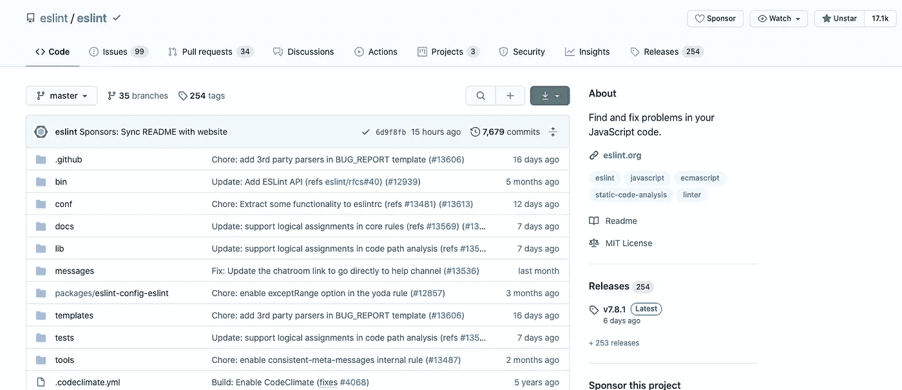

https://github.com/eslint/eslint

ESLint 被设计为完全可配置的，这意味着您可以关闭每个规则，只运行基本的语法验证，或者混合和匹配捆绑的规则和您的自定义规则，使 ESLint 非常适合您的项目。

## 安装和使用

您可以使用 Yarn 安装 ESLint:

```
$ yarn add eslint --dev
```

然后，您应该设置一个配置文件:

```
$ ./node_modules/.bin/eslint --init
```

之后，您可以在任何文件或目录上运行 ESLint，如下所示:

```
$ ./node_modules/.bin/eslint yourfile.js
```

## 配置

运行`eslint --init`之后，您的目录中会有一个`.eslintrc`文件。在其中，您会看到一些规则配置如下:

```
{
    "rules": {
        "semi": ["error", "always"],
        "quotes": ["error", "double"]
    }
}
```

名称`"semi"`和`"quotes"`是 ESLint 中[规则](https://eslint.org/docs/rules)的名称。第一个值是规则的错误级别，可以是下列值之一:

*   `"off"`或`0` —关闭规则
*   `"warn"`或`1` —打开规则作为警告(不影响退出代码)
*   `"error"`或`2` —将规则作为错误打开(退出代码为 1)

这三个错误级别允许您对 ESLint 如何应用规则进行细粒度控制。(有关更多配置选项和细节，请参见[配置文档](https://eslint.org/docs/user-guide/configuring)。)

阅读[官方 ESLint 文档](https://eslint.org/docs/user-guide/configuring)了解更多信息。

# 7.Redux

Redux 是 JavaScript 应用程序的可预测状态容器。Redux 帮助您编写行为一致、在不同环境中运行且易于测试的应用程序。

Redux 还提供了很好的开发者体验，比如结合了时间旅行调试器的[实时代码编辑](https://github.com/reduxjs/redux-devtools)。

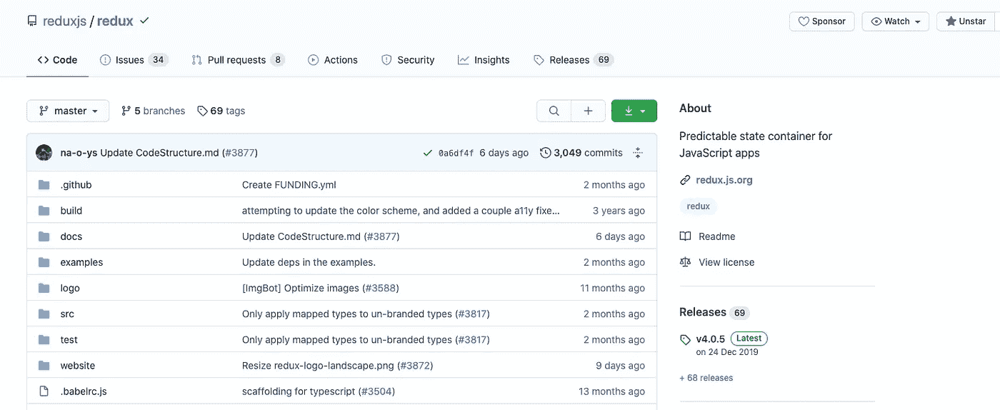

https://github.com/reduxjs/redux

## 装置

```
yarn add @reduxjs/toolkit react-redux
```

更多详细信息，请参见[安装文档页面](https://redux.js.org/introduction/installation)。

## 入门指南

你的应用程序的整个状态存储在一个单独的*商店*的对象树中。

改变状态树的唯一方法是发出一个*动作*，一个描述发生了什么的对象。

要指定动作如何转换状态树，您需要编写纯*reducer*。

不是直接改变状态，而是通过称为动作的普通对象来指定想要发生的改变。然后你写一个叫做 reducer 的特殊函数来决定每个动作如何转换整个应用程序的状态。

对于一个计数器应用程序来说，这种架构可能看起来有些矫枉过正，但是这种模式的美妙之处在于它能够很好地扩展到大型复杂的应用程序。它还启用了非常强大的开发工具，因为有可能跟踪每一个突变到导致它的动作。您可以记录用户会话，并通过重放每个动作来重现它们。

## 证明文件

Redux 文档位于以下链接:

*   [简介](http://redux.js.org/introduction/getting-started)
*   [食谱](http://redux.js.org/recipes/recipe-index)
*   [常见问题解答](http://redux.js.org/faq)
*   [API 参考](https://redux.js.org/api/api-reference)

# 8.Redux Thunk

对于普通的基本 Redux 存储，您只能通过分派一个动作来进行简单的同步更新。

Redux Thunk [中间件](https://redux.js.org/advanced/middleware)扩展了商店的功能，并允许您编写与商店交互的异步逻辑。

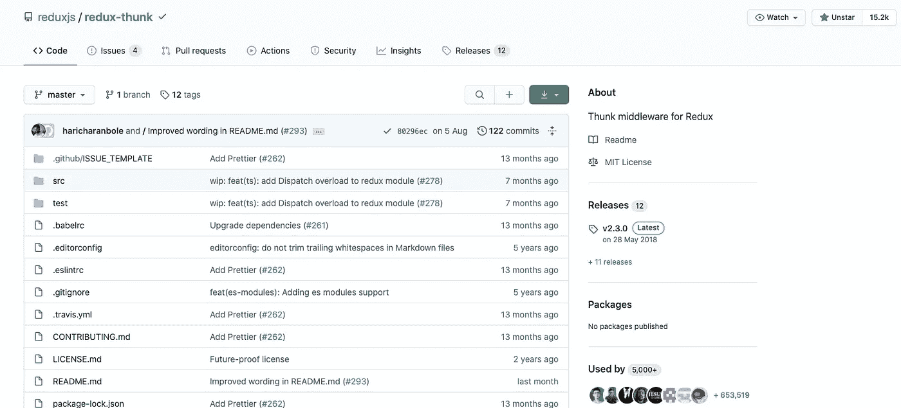

https://github.com/reduxjs/redux-thunk

## 装置

```
yarn add redux-thunk
```

然后，要启用 Redux Thunk，使用 Redux 库中的`[applyMiddleware()](https://redux.js.org/api/applymiddleware)`。

```
import { createStore, applyMiddleware } from 'redux';
import thunk from 'redux-thunk';
import rootReducer from './reducers/index';// Note: this API requires redux@>=3.1.0
const store = createStore(rootReducer, applyMiddleware(thunk));
```

## 什么是 thunk？！

一个 [*thunk*](https://en.wikipedia.org/wiki/Thunk) 是一个包装表达式以延迟其求值的函数。

```
// calculation of 1 + 2 is immediate
// x === 3
let x = 1 + 2;// calculation of 1 + 2 is delayed
// foo can be called later to perform the calculation
// foo is a thunk!
let foo = () => 1 + 2;
```

术语[起源于](https://en.wikipedia.org/wiki/Thunk#cite_note-1)，是*思考*的幽默过去式版本。

Redux Thunk 中间件允许您编写返回函数而不是动作的动作创建器。thunk 可用于延迟动作的调度，或者仅在满足特定条件时才进行调度。

内部函数接收存储方法`dispatch`和`getState`作为参数。

返回执行异步分派的函数的动作创建器:

```
const INCREMENT_COUNTER = 'INCREMENT_COUNTER';function increment() {
  return {
    type: INCREMENT_COUNTER,
  };
}function incrementAsync() {
  return (dispatch) => {
    setTimeout(() => {
      // Yay! Can invoke sync or async actions with `dispatch`
      dispatch(increment());
    }, 1000);
  };
}
```

阅读 [Github 库](https://github.com/reduxjs/redux-thunk)进行深入研究。

# 9.福米克

Formik 会处理重复和烦人的事情——跟踪值/错误/访问过的字段、编排验证和处理提交——所以您不必这样做。

这意味着您花更少的时间连接状态和更改处理程序，而花更多的时间关注您的业务逻辑。

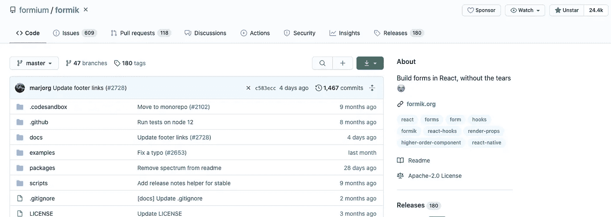

福米克—[https://github.com/formium/formik](https://github.com/formium/formik)

## 装置

可以用 [npm](https://www.npmjs.com/) 或[纱线](https://yarnpkg.com/)安装 Formik。

```
yarn add formik
```

Formik 与 React v15+兼容，可与 ReactDOM 和 React Native 配合使用。

你也可以在 CodeSandbox 上尝试 Formik 的[演示。](https://codesandbox.io/s/zKrK5YLDZ)

## 入门指南

Formik 跟踪表单的状态，然后通过`props`将它和一些可重用的方法和事件处理程序(`handleChange`、`handleBlur`和`handleSubmit`)暴露给表单。

`handleChange`和`handleBlur`完全按照预期工作——它们使用一个`name`或`id`属性来决定更新哪个字段。

使用 Formik 库对组件进行反应

查看[官方 Formik 文档](https://formik.org/docs/overview)了解更多信息。

# 10.雷查尔兹

Recharts 是用 [React](https://facebook.github.io/react/) 和 [D3](http://d3js.org/) 构建的图表库。Recharts 库的主要目的是帮助您在 React 应用程序中毫无痛苦地编写图表。


https://github.com/recharts/recharts

## 装置

```
yarn add recharts
```

## 例子

下面是一个如何使用 Recharts 库呈现 React 组件的示例。

这是返回给浏览器的内容。

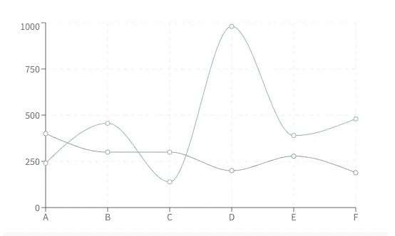

Recharts 演示图表

查看[再 chart 文档](http://recharts.org/en-US/api)进行深入研究。

# 11.Docz

编写代码文档是开发软件时最重要也是最耗时的过程之一。Docz 使得为您的代码编写和发布漂亮的交互式文档变得容易。

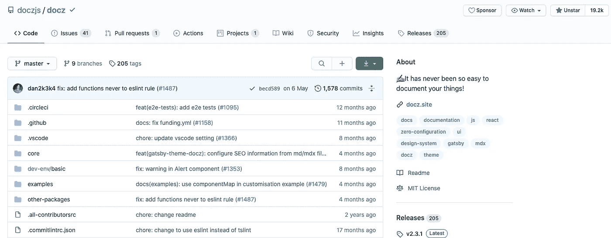

https://github.com/doczjs/docz

通过利用 [Gatsby](https://www.gatsbyjs.org/) 和 [Gatsby 主题阴影](https://www.gatsbyjs.org/docs/themes/shadowing/)，Docz 使您能够使用 MDX 快速创建实时重载、SEO 友好、生产就绪的文档站点，并在需要时定制外观、感觉和行为。

## 入门指南

使用 [create-docz-app](https://www.npmjs.com/package/create-docz-app) 快速开始。create-docz-app 是 [create-next-app](https://github.com/zeit/next.js/tree/canary/packages/create-next-app) 的一个分支，适用于 docz。

```
 # or
yarn create docz-app my-docz-app --example typescript
```

接下来，将`.mdx`文件添加到项目中的任何位置。

```
---
name: Button
route: /
---import { Playground, Props } from 'docz'
import Button from './Button'**# Button**<Props of={Button} />**## Basic usage**<Playground>
  <Button type="submit">Click me</Button>
  <Button>No, click me</Button>
</Playground>
```

还有一个按钮组件`Button.jsx`，就像这样:

```
import React from 'react'
import t from 'prop-types'const Button = ({ children, type }) => <button type={type}>{children}</button>Button.propTypes = {
  /**
   * This is a description for this prop.
   * Button type.
   */
  type: t.oneOf(['button', 'submit', 'reset']),
}
Button.defaultProps = {
  type: 'button',
}
export default Button
```

最后，运行 Docz 脚本:

```
yarn docz dev
```

这将启动一个本地开发服务器，并在浏览器中打开您的文档站点。

您可以在 GitHub 中查看[DocZ 示例完整列表](https://github.com/doczjs/docz/tree/master/examples)，更多信息请访问官方 [docz.site](https://docz.site/) 网站。

# 12.反应-i18next

正如[文档](https://react.i18next.com/)中所指出的，“react-i18next 是一个强大的国际化框架，它基于 [i18next](http://i18next.com/) ”。

I18next 是一个用 JavaScript 编写的国际化框架。但远不止如此。

i18next 不仅仅是提供标准的 i18n 特性，比如复数、上下文、插值、格式。它为您提供了一个完整的解决方案，将您的产品从网络本地化到移动和桌面。

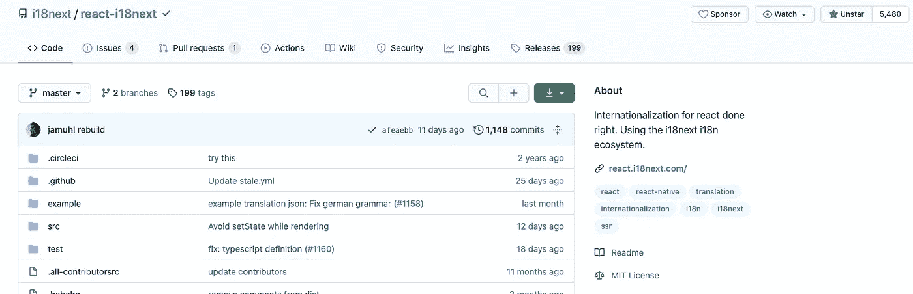

反应-i18next—[https://github.com/i18next/react-i18next](https://github.com/i18next/react-i18next)

## 装置

i18next 是提供所有翻译功能的核心，而 reactor-i18next 则为使用 reactor 提供了一些额外的功能。

```
yarn add react-i18next i18next
```

## 入门指南

创建包含以下代码的新文件`i18n.js`:

我们将`i18n`实例传递给 reaction-i18next，它将通过上下文 API 提供给所有组件。

然后在`index.js`里面导入`i18n`文件:

## 翻译您的内容

`t`功能是 i18next 中翻译内容的主要功能。阅读[文档](https://www.i18next.com/translation-function/essentials)了解所有选项。

了解更多关于`[useTranslation](https://react.i18next.com/latest/usetranslation-hook)`挂钩的信息。

# 13.以打字打的文件

TypeScript 为 JavaScript 添加了可选类型，这些类型支持用于任何浏览器、任何主机、任何操作系统的大型 JavaScript 应用程序的工具。

TypeScript 编译成可读的、基于标准的 JavaScript。在[游乐场](https://www.typescriptlang.org/play/)试试吧。

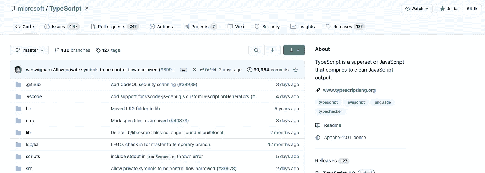

打字稿—[https://github.com/microsoft/TypeScript](https://github.com/microsoft/TypeScript)

## 安装

对于最新的稳定版本，通过 Yarn 安装。

```
yarn add global typescript
```

## 设置项目以发出. d.ts 文件

要在您的项目中添加`.d.ts`文件的创建，您将需要执行多达四个步骤:

*   将 TypeScript 添加到开发依赖项中。
*   添加一个`tsconfig.json`来配置 TypeScript。
*   运行 TypeScript 编译器为 JS 文件生成相应的`d.ts`文件。
*   (可选)编辑您的`package.json`来引用类型。

## 添加 TypeScript

您可以在[安装页面](https://www.typescriptlang.org/download)上了解如何操作。

# 14.TSConfig

TSConfig 是一个 json5 文件，它配置编译器标志并声明在哪里可以找到文件。在这种情况下，您需要一个如下所示的文件:

```
{
  // Change this to match your project
  include: ["src/**/*"], compilerOptions: {
    // Tells TypeScript to read JS files, as
    // normally they are ignored as source files
    allowJs: true,
    // Generate d.ts files
    declaration: true,
    // This compiler run should
    // only output d.ts files
    emitDeclarationOnly: true,
    // Types should go into this directory.
    // Removing this would place the .d.ts files
    // next to the .js files
    outDir: "dist",
  },
}
```

你可以在 [tsconfig 参考](https://www.typescriptlang.org/tsconfig)中了解更多选项。使用 TSConfig 文件的替代方法是 CLI。这与 CLI 命令的行为相同。

```
npx typescript src/**/*.js --declaration --allowJs --emitDeclarationOnly --outDir types
```

## 运行编译器

您可以在[安装页面](https://www.typescriptlang.org/download)上了解如何操作。如果您的项目的`.gitignore`中有这些文件，您希望确保这些文件包含在您的包中。

接下来，您可以编写带有类型的 React 组件。这里有一个简单的例子。

请查看我的打字稿系列以进行深入研究。这里有一个 [cheatsheet](https://github.com/typescript-cheatsheets/react) 用于打字和反应。

# 结论

谢谢你坚持到最后。编码快乐！

了解我最新内容的最好方式是通过我的新闻简报。成为第一个得到通知的人。


我的[简讯](https://wholesomedev.substack.com/welcome)。成为第一个得到通知的人。