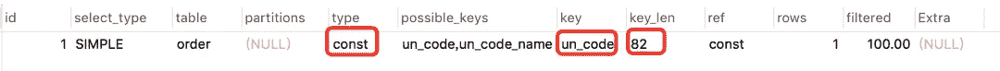

# SQL 优化的 15 个最佳实践

> 原文：<https://betterprogramming.pub/15-best-practices-for-sql-optimization-956759626321>

## 提升 SQL 的性能


由 [Kam Idris](https://unsplash.com/@ka_idris?utm_source=medium&utm_medium=referral) 在 [Unsplash](https://unsplash.com?utm_source=medium&utm_medium=referral) 上拍摄的照片

SQL 优化是大家关心的热点话题。无论是面试还是工作，都有可能遇到。

如果有一天你负责的一个在线接口出现了性能问题，你需要对它进行优化。那么你的第一个想法很可能是优化 SQL 语句，因为它的转换成本比代码小得多。

那么，如何优化 SQL 语句呢？

今天我就来分享一些 SQL 优化的小技巧，希望对你有帮助。

# **1。避免使用** `**select ***` **。**

很多时候，我们在写 SQL 语句的时候，为了方便，喜欢直接用`select *`一次性找出表中所有列的数据。

```
# incorrect example
select * from user where id = 1;
```

在实际的业务场景中，也许我们真的只需要使用其中的一两列。我查了很多数据，没有，浪费数据库资源，比如内存或者 CPU。

此外，在通过网络 IO 传输数据的过程中，数据传输时间也会增加。

另一个最重要的问题是:`select *`不会使用覆盖索引，并且会有大量的返回表操作，导致查询 SQL 性能低下。

那么，如何优化呢？

```
# correct example
select name, age from user where id = 1;
```

查询 SQL 语句时，只检查需要使用的列，多余的列根本不需要签出。

# **2。将** `**union"**` **替换为** `**union all"**` **。**

我们都知道在 SQL 语句中使用 union 关键字后，可以获得重新排序后的数据。

如果使用 union all 关键字，可以获得所有数据，包括重复数据。

```
# incorrect example
(select * from user where id=1) 
union 
(select * from user where id=2);
```

重新排序的过程需要遍历、排序和比较，比较耗时，消耗更多的 CPU 资源。

所以如果可以用 union all，尽量不要用 union。

```
# correct example
(select * from user where id=1) 
union all
(select * from user where id=2);
```

除非有一些特殊的场景，比如`union all`之后，结果集中出现重复数据，业务场景不允许出现重复数据，那么可以使用`union`。

# **3。小桌子带动大桌子。**

小表驱动大表，即小表的数据集驱动大表的数据集。

如果有两个表，order 和 user，`order`表有 10000 条数据，`user`表有 100 条数据。

此时，如果您想查看所有有效用户的订单列表。

这可以通过使用`in`关键字来实现:

```
select * from order
where user_id in (select id from user where status=1)
```

这也可以通过使用`exists`关键字来实现:

```
select * from order
where exists (select 1 from user where order.user_id = user.id and status=1)
```

在上面提到的业务场景中，使用 In 关键字来实现业务需求更加合适。

为什么？

因为`in`一个关键字包含在 SQL 语句中，它将首先执行子查询语句`in`，然后执行 outside in 语句。如果数据量`in`小，作为条件查询速度更快。

如果 SQL 语句包含`exists`关键字，它首先执行`exists`左边的语句(主查询语句)。

然后用它作为条件匹配右边的语句。如果匹配，就可以查询数据了。如果不匹配，则过滤掉数据。

在这个需求中，`order`表有 10000 条数据，`user`表有 100 条数据。

`order`是大桌子，`user`是小桌子。

如果`order`在左边，最好使用`in`关键字。

总之:

*   `in`适用于左边的大桌子和右边的小桌子。
*   `exists`适用于左边的小桌子和右边的大桌子。

# **4。批量操作。**

如果业务处理后有一批数据需要插入怎么办？

```
# incorrect example
for (Order order: list) {
   orderMapper.insert(order);
}
```

在循环中逐个插入数据。

```
insert into order(id,code,user_id) 
values(123,'001',100);
```

该操作需要对数据库进行多次请求，才能完成这批数据的插入。

但是众所周知，在我们的代码中，每次远程请求数据库，都会消耗一定的性能。

而如果我们的代码需要多次请求数据库来完成这个业务功能，必然会消耗更多的性能。

正确的做法是提供一个批量插入数据的方法。

```
# correct example
orderMapper.insertBatch(list);# insert into order(id,code,user_id) 
# values(123,'001',100),(124,'002',100),(125,'003',101);
```

这样你只需要远程请求数据库一次，SQL 性能就会提高。数据越多，提升越大。

但需要注意的是，不建议一次批量操作太多数据。如果数据太多，数据库响应会非常慢。

批量操作需要把握一个度，建议每批数据尽量控制在 500 以内。如果数据超过 500，则分多批处理。

# **5。使用限制。**

有时候，我们需要查询一些数据的第一项，比如:查询一个用户下的第一笔订单，想看看他第一笔订单的时间。

```
# incorrect example
select id, create_date 
 from order 
where user_id=123 
order by create_date asc;
```

根据用户 id 查询订单，按订单时间排序，先找出用户的所有订单数据，得到一个订单集。

然后在代码中，获取第一个元素的数据，也就是第一个订单的数据，得到第一个订单的时间。

```
List<Order> list = orderMapper.getOrderList();
Order order = list.get(0);
```

这种方式虽然在功能上没有问题，但是效率非常低。它需要先查询所有的数据，有点浪费资源。

那么，如何优化呢？

```
# correct example
select id, create_date 
 from order 
where user_id=123 
order by create_date asc 
limit 1;
```

使用 limit 1 仅返回用户订购时间最短的数据。

另外，在删除或修改数据时，为了防止误操作，导致删除或修改无关数据，也可以在 SQL 语句的末尾加上`limit`。

```
update order set status=0,edit_time=now(3) 
where id>=100 and id<200 limit 100;
```

这样即使误操作比如 id 错了也不会影响太多数据。

# **6。不要在** `**in**` **关键字中使用太多的值。**

对于批量查询界面，我们通常使用 in 关键字过滤掉数据。比如我想通过一些指定的 id 批量查询用户信息。

SQL 语句如下所示:

```
select id,name from category
where id in (1,2,3...100000000);
```

如果不加任何限制，查询语句可能一次查询很多数据，很容易造成接口超时。

那我们该怎么办？

```
select id,name from category
where id in (1,2,3...100)
limit 500;
```

您可以使用 SQL 中的 limit 来限制数据。

但是，我们更多的是给业务代码添加限制。伪代码如下:

```
public List<Category> getCategory(List<Long> ids) {
   if(CollectionUtils.isEmpty(ids)) {
      return null;
   }
   if(ids.size() > 500) {
      throw new BusinessException("too many")
   }
   return mapper.getCategoryList(ids);
}
```

另一种解决方案是:如果 ids 中的记录超过 500 条，可以使用多线程来批量查询数据。每批只检查 500 条记录，最后将查询到的数据汇总返回。

不过这只是权宜之计，不适合 id 太多的场景。因为 id 太多，即使能快速检测到数据，如果返回的数据量太大，网络传输非常耗费性能，接口性能也好不了多少。

# **7。增量查询。**

有时，我们需要通过远程接口查询数据，然后将其同步到另一个数据库。

```
# incorrect example
select * from user;
```

如果直接获取所有数据，那么就同步。虽然这样很方便，但是带来了一个非常大的问题，就是如果数据量很大，查询性能会很差。

那我们该怎么办？

```
select * from user 
where id>#{lastId} and create_time >= #{lastCreateTime} 
limit 100;
```

按 id 和时间升序排列，每次只同步一批数据，这批数据只有 100 条记录。每次同步完成后，保存 100 条数据中最大的 id 和时间，以便在同步下一批数据时使用。

这种增量查询方式可以提高单次查询的效率。

# **8。高效分页。**

有时候在列表页面查询数据时，为了避免一次返回太多数据，影响界面性能，我们一般会对查询界面进行分页。

MySQL 中分页常用的`limit`关键字:

```
select id,name,age 
from user limit 10,20;
```

如果表中的数据量很小，使用 limit 关键字进行分页没有问题。但是如果表中有大量的数据，就会出现性能问题。

例如，分页参数现在变成了:

```
select id,name,age 
from user limit 1000000,20;
```

MySQL 会找到 1，000，020 条数据，然后丢弃前 1，000，000 条数据，只检查后 20 条数据，很浪费资源。

那么，如何对这些海量数据进行分页呢？

优化 SQL:

```
select id,name,age 
from user where id > 1000000 limit 20;
```

首先找到上次分页的最大 id，然后使用 id 上的索引进行查询。但是，在这个方案中，要求 id 是连续有序的。

您还可以使用`between`来优化分页。

```
select id,name,age 
from user where id between 1000000 and 1000020;
```

需要注意的是，between 应该在唯一索引上分页，否则会出现每页大小不一致的情况。

# **9。用连接查询替换子查询。**

如果需要在 MySQL 中查询两个以上表的数据，一般有两种实现方法:子查询和连接查询。

子查询的示例如下:

```
select * from order
where user_id in (select id from user where status=1)
```

子查询语句可以通过 in 关键字实现，一个查询语句的条件落在另一个 select 语句的查询结果中。程序首先运行嵌套的最内层语句，然后运行外层语句。

子查询语句的优点是，如果涉及的表数量很少，它就简单且结构化。

但缺点是 MySQL 执行子查询时，需要创建临时表。在查询完成后，需要删除这些临时表，这有一些额外的性能消耗。

这时可以改成连接查询。

```
select o.* from order o
inner join user u on o.user_id = u.id
where u.status=1
```

# **10。连接表不应太多。**

```
# incorrect example
select a.name,b.name.c.name,d.name
from a 
inner join b on a.id = b.a_id
inner join c on c.b_id = b.id
inner join d on d.c_id = c.id
inner join e on e.d_id = d.id
inner join f on f.e_id = e.id
inner join g on g.f_id = f.id
```

如果`join`太多，MySQL 在选择索引时会非常复杂，很容易选错索引。

而如果没有命中，嵌套循环 join 就是从两个表中读取一行数据进行两两比较，复杂度为 **n** 。

所以要尽量控制连接表的数量。

```
# correct example
select a.name,b.name.c.name,a.d_name 
from a 
inner join b on a.id = b.a_id
inner join c on c.b_id = b.id
```

如果在业务场景的实现中需要查询其他表中的数据，可以在 a、b、c 表中有冗余的特殊字段，例如表 a 中冗余的 d_name 字段来保存要查询的数据。

但是，我之前见过一些 ERP 系统。并发量不大，但业务相对复杂。它需要连接十几个表来查询数据。

因此，连接表的数量应根据系统的实际情况来确定。不能一概而论。越少越好。

# **11。内部联接注释。**

当涉及到多个表的查询时，我们通常使用 join 关键字。

最常用的连接是`left join`和`inner join`。

*   `left join`:求两个表的交集加上左表的剩余数据。
*   `inner join`:查找两个表格交集的数据。

使用`inner join`的例子如下:

```
select o.id,o.code,u.name 
from order o 
inner join user u on o.user_id = u.id
where u.status=1;
```

如果使用`inner join`关联两个表，MySQL 会自动选择两个表中的小表来驱动大表，所以在性能上不会有太多问题。

使用`left join`的例子如下:

```
select o.id,o.code,u.name 
from order o 
left join user u on o.user_id = u.id
where u.status=1;
```

如果两个表使用`left join`关联，默认情况下 MySQL 将使用 left join 关键字驱动右边的表。如果左表中有大量数据，就会出现性能问题。

需要注意的是，使用`left join`查询时，左边用小表，右边用大表。如果能使用`inner join`，尽量少用`left join`。

# **12。限制索引的数量。**

众所周知，索引可以显著提高查询 SQL 的性能，但是索引的数量并不是越多越好。

因为当表中增加新数据时，需要同时为其创建索引，索引需要额外的存储空间和一定的性能消耗。

单个表中的索引数应尽可能控制在 **5** 以内，单个索引中的字段数不应超过 **5** 。

MySQL 用来保存索引的 B+树的结构，B+树索引需要在插入、更新和删除操作中进行更新。如果索引太多，会消耗很多额外的性能。

所以，问题是，如果表中的索引太多，超过 5 个怎么办？

这个问题需要辩证看待。如果你的系统并发低，表中数据量不太多，其实 5 个以上都可以，只要不超过太多。

但是对于一些高并发系统，一定要遵守单个表上不超过 5 个索引的限制。

那么，高并发系统如何优化索引的数量呢？

如果可以建立联合索引，不要建立单一索引，可以删除无用的单一索引。

将一些查询功能迁移到其他类型的数据库，如 Elastic Seach、HBase 等。，只需要在业务表中建立几个关键索引。

# **13。选择适当的字段类型。**

`char`表示固定的字符串类型，该类型字段的存储空间是固定的，会浪费存储空间。

```
alter table order 
add column code char(20) NOT NULL;
```

`varchar`表示一种变长字符串类型，这种类型的字段存储空间会根据实际数据的长度进行调整，不会浪费存储空间。

```
alter table order 
add column code varchar(20) NOT NULL;
```

如果是固定长度的字段，比如用户的手机号，一般是 11 位，可以定义为长度为 11 字节的 char 类型。

但如果是企业名称字段，如果定义为`char`类型，就有问题了。

如果长度定义太长，比如定义为 200 字节，实际企业长度只有 50 字节，就会浪费 150 字节的存储空间。

如果长度定义太短，比如定义为 50 字节，但实际企业名称有 100 字节，就不会存储，会抛出异常。

因此，建议将企业名称改为`varchar`类型。变长字段的存储空间较小，可以节省存储空间，对于查询来说，在相对较小的字段中搜索效率明显更高。

当我们选择字段类型时，我们应该遵循以下原则:

如果可以使用数字类型，就不需要字符串，因为字符处理起来往往比数字慢。

尽可能使用小类型，比如用`bit`存储布尔值，`tinyint`存储枚举值等。

固定长度的字符串字段，类型为`char`。

类型为`varchar`的可变长度字符串字段。

`decimal`用于金额字段，避免精度损失的问题。

# **14。**提高效率`**group by**`

我们有许多业务场景需要使用`group by`关键字。它的主要功能是去重复和分组。

通常与`having`配合使用，意思是将数据分组，然后按照一定的条件进行过滤。

```
# incorrect example
select user_id,user_name from order
group by user_id
having user_id <= 200;
```

这种书写方法性能很差。它首先根据用户 id 对所有订单进行分组，然后过滤用户 id 大于或等于 200 的用户。

分组是一个比较耗时的操作，为什么不先缩小数据再分组呢？

```
# correct example
select user_id,user_name from order
where user_id <= 200
group by user_id
```

分组前使用 where 条件过滤掉冗余数据，这样分组时效率会更高。

其实这是一种思路，并不局限于`group by`的优化。在我们的 SQL 语句做一些耗时的操作之前，尽可能的缩小数据范围，这样可以提高 SQL 的整体性能。

# **15。索引优化。**

在 SQL 优化中，有一个非常重要的内容:**索引优化**。

很多情况下，使用索引和不使用索引时，SQL 语句的执行效率差别很大。所以索引优化是 SQL 优化的首选。

索引优化的第一步是检查 SQL 语句是否被索引。

那么，如何检查 SQL 是否去了索引呢？

你可以使用`explain`命令来查看 MySQL 的执行计划。

```
explain select * from `order` where code='002';
```



我会单独写一篇博客来解释具体的详细参数。

以下是索引失败的一些常见原因:

*   不满足最左前缀原则。
*   范围索引列没有放在最后。
*   已用`select *`。
*   有对索引列的计算。
*   索引列上有函数。
*   不带引号的字符串类型。
*   用过的`like %`。
*   错误使用`is null`。
*   错误使用`or`。

如果不是以上原因，还需要进一步调查其他原因。

另外，你有没有遇到过这样的情况:明明是同一个 SQL，只是输入参数不一样。有时候指数 a 走，有时候指数 b？

是的，有时候 MySQL 会选错索引。

如果有必要，可以使用`force index`强制查询 SQL 转到某个索引。

*感谢您阅读本文。*

*敬请期待更多。*