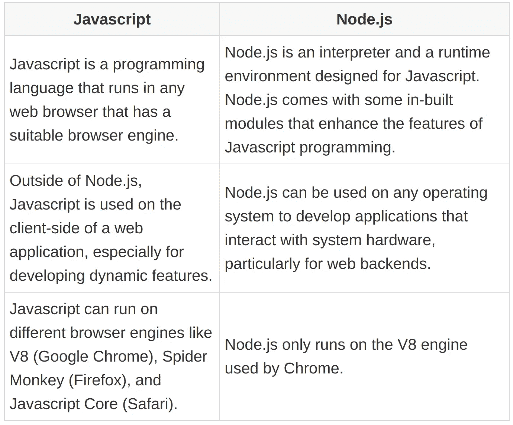

# 15 个常见的面试问题

> 原文：<https://betterprogramming.pub/15-commonly-asked-nodejs-interview-questions-2b0254700f80>

## 面试问题

## 熟悉下一次面试中你可能会遇到的问题


作者图片

对于一次成功的编程面试来说，准备和知识一样重要。准备让你有信心参加面试，没有不确定的紧张。如果是人生第一次面对编程面试，更是如此。

为了帮助 Node.js 开发人员为面试做好必要的准备，我列出了 15 个与 Node.js 和 web 开发相关的常见面试问题。这些问题和答案也将促使你在大面试前温习任何你觉得需要改进的地方。

在本文中，我们将重点关注与 Node.js 相关的问题。但是，请记住，关于 JavaScript 的问题在 Node.js 面试中非常常见，因此，您也可以准备一些这样的问题。我们不久前写了一篇关于[常见 JavaScript 面试问题](https://livecodestream.dev/post/20-common-javascript-interview-questions/)的文章，涵盖了所有这些基础。

现在，让我们来看看你在下次面试中可能会被问到的与节点相关的问题。

# Node.js 和 Javascript 有什么不同？



# 什么时候该用，什么时候不该用 Node.js？

Node.js 是异步的、事件驱动的、非阻塞的、单线程的。它使 Node 成为开发以下类型应用程序的完美候选:

*   实时应用程序，如聊天和提供实时更新的应用程序。
*   向大量观众播放视频或其他多媒体内容的流媒体应用程序。
*   其他 I/O 密集型应用，如协作平台。
*   遵循微服务架构的 Web 后端。

然而，Node.js 的独特品质使得它对于其他类型的应用程序来说并不是理想的选择。执行 CPU 密集型任务(如复杂的数学计算)的应用程序不能很好地使用 Node.js，因为它是单线程执行的。

如果你想了解更多，请查看我们的文章 [Node.js 架构以及何时在项目中使用 node . js](https://livecodestream.dev/post/when-you-should-and-should-not-use-nodejs-for-your-project/)。

# EventEmitter 是做什么的？

Node.js 中每个能够发出事件的对象都是`EventEmitter`类的成员。`http`模块就是这样一个例子。

所有的`EventEmitter`类都可以使用`eventEmitter.on()`函数将事件监听器附加到事件上。然后，一旦捕捉到这样的事件，它的侦听器就会被同步调用，一个接一个。

```
const events = require("events");
const eventEmitter = new events.EventEmitter();const eventListener = function(){
    console.log("event triggered");
}eventEmitter.on("emitted", eventListener);eventEmitter.emit("emitted");
```

# Node 的事件循环是什么？

由于 Node.js 是单线程的，所以它必须是非阻塞的，以防止线程在需要很长时间才能完成的任务上花费太多时间。事件循环负责实现这种非阻塞行为。它的工作是使用应用程序线程调度未完成的任务。

我们知道，节点使用回调来处理异步函数在其任务完成时返回的响应。与创建任务的事件类似，任务的完成也会发出一个事件。Node.js 将需要处理的事件添加到事件队列中。

事件循环遍历事件队列中的事件，并调度何时执行它们相关的回调函数。

# 什么是节点流？

流是从源读取或写入数据并将其传输到连续流目标的管道。有四种类型的流:

*   可读。
*   可写。
*   双工(可读和可写)。
*   转换(一种双工流。使用输入计算输出)。

每个流也是一个`EventEmitter`。这意味着当流中没有数据时，当流中有数据时，或者当流中的数据从程序中刷新时，流对象可以发出事件。

```
const fs = require("fs");
const readableStream = fs.createReadStream("test.txt");
let content = "";readableStream.on("data", (chunk) => {
  content += chunk;
});readableStream.on("end", () => {
  console.log(content);
});
```

# Readfile 和 Createreadstream 函数有什么区别？

`readFile`函数异步读取文件的全部内容，并在传递给用户之前将其存储在内存中。

`createReadStream`使用一个可读的流来逐块读取文件，而不是将整个文件存储在内存中。

`createReadStream`与`readFile`相比，优化了文件读取操作，使用的内存更少，速度更快。如果文件相当大，用户不需要等待很长时间就可以获得全部内容，因为用户在阅读文件时会收到小块内容。

```
const fs = require("fs");fs.readFile("test.txt", (err, content) => {
  console.log( content);
});
```

# 如何处理 node.js 中未捕获的异常？

我们可以在应用程序的进程级捕捉应用程序中抛出的未捕捉到的异常。为此，我们给`process`全局对象附加了一个监听器:

```
process.on("uncaughtException", (err) => {
  console.log("exception caught: ", err);
});
```

# 节点能充分利用多处理器系统吗？

节点应用程序总是单线程的。因此，自然地，应用程序只使用单个处理器，即使运行在多处理器系统上。

但 Node 的核心模块之一 Cluster 为节点应用程序提供了支持，以利用多个内核。它允许我们创建多个工作进程，这些工作进程可以在几个内核上并行运行，并共享一个端口来侦听事件。

这里，每个进程使用 IPC 与主线程通信，并根据需要将服务器句柄传递给其他进程。主进程可以自己监听端口，并将每个新连接循环传递给子进程，或者将端口分配给子进程，以便子进程监听请求。

# node.js 中使用的反应器设计模式是什么？

反应器模式用于维护 Node.js 中的非阻塞 I/O 操作。它为每个 I/O 操作附加一个回调函数(一个处理程序)。然后，在创建请求时，将处理程序提交给多路分解器。

多路分解器收集应用程序中发出的每个 I/O 请求，并将它们作为事件排列在队列中。这个队列就是我们所说的事件队列。事件排队后，解复用器返回应用程序线程的控制权。

同时，事件循环遍历事件队列中的每个事件，并调用附加的回调来处理事件响应。

这是 Node.js 使用的反应器模式。

# 单线程 Web 后端相对于多线程有什么好处？

尽管 Node 是单线程的，但大多数用于后端开发的编程语言都提供了多线程来处理应用程序操作。

为什么只有单线程有利于后端开发？

*   开发人员更容易实现应用程序。我们的应用程序在生产过程中没有突然遇到意外竞争情况的风险。
*   单线程应用程序很容易扩展。
*   它们可以在没有太多延迟的情况下同时处理大量的用户请求。相比之下，当流量较高时，多线程后端必须等待线程池中的一个线程空闲，以服务于用户请求。由于节点的非阻塞特性，用户请求不会在单线程上停留太长时间(只有在操作不是 CPU 密集型的时候才会这样)。

# 节点中的 REPL 是什么？

REPL 代表读取-评估-打印-循环。这是一个虚拟的环境，你可以在其中轻松地运行编程语言。Node 带有一个内置的 REPL 来运行 JavaScript 代码。它类似于我们在浏览器中用来运行 JavaScript 代码的控制台。

要启动节点 REPL，只需在命令行上运行命令 Node。然后，一旦在一行中编写了一行 JavaScript 代码，就可以在下一行中看到它的输出。

# process.nexttick 和 Setimmediate 函数有什么区别？

传递给`setImmediate`函数的回调在事件队列上事件循环的下一次迭代中执行。

另一方面，传递给`process.nextTick`的回调在事件循环的下一次迭代之前执行，并且在程序中当前运行的操作完成之后执行。在应用程序启动时，它的回调在事件循环开始遍历事件队列之前被调用。

因此，`process.nextTick`的回调总是在`setImmediate`的回调之前被调用。

如果我们考虑下面的代码片段:

```
setImmediate(() => {
  console.log("first");
})process.nextTick(() => {
  console.log("second");
})console.log("third");
```

输出按以下顺序打印。

```
third
second
first
```

# 什么是存根？

测试应用程序时会用到存根。它们模拟给定组件或模块的行为，以便您可以专注于您想要测试的代码部分。通过使用存根代替与测试无关的组件，您不必担心外部组件会影响结果。

例如，如果您正在测试的组件在您期望测试的部分之前有一个文件读取操作，您可以使用一个存根来模拟该行为并返回一个模拟内容，而不实际读取文件。

在 Node 中，我们使用像 Sinon 这样的库来实现这个目的。

# 为什么在 Express 中将“应用程序”和“服务器”分开是一种好的做法？

通过在 Express 中分离`app`和`server`，我们可以将 API 实现与网络相关的配置分离开来。这允许我们在不执行网络调用的情况下执行 API 测试。这也保证了更快的测试执行和更好的代码覆盖度量。

为了实现这种分离，您应该在单独的文件中声明 API 和服务器。这里我们使用两个文件:`app.js`和`server.js`:

```
//app.js
const express = require("express");
const app = express();app.use("/", index);
app.use("/contact", contact);
app.use("/user", user);module.exports = app; //server.js
const http = require("http");
const app = require("/app");app.set('port', process.env.PORT);const http = http.createServer(app);
```

# 什么是 Yarn 和 Npm？为什么要使用纱线而不是 Npm？

`npm`是 Node.js 发布的默认包管理器。它有一个大型的公共和私有包库，存储在一个名为 emp registry 的数据库中，用户可以通过 npm 的命令行客户端访问该数据库。在 npm 的帮助下，用户可以轻松地管理项目中使用的依赖关系。

`yarn`也是一个软件包管理器，它的发布是为了解决 npm 的一些缺点。然而，yarn 依赖 npm 注册表来为用户提供对包的访问。因为 yarn 的底层结构是基于 npm 本身的，所以如果您从 npm 迁移到 yarn，您的项目结构和工作流不必经历重大的改变。

就像我之前提到的，在某些情况下，yarn 提供了比 npm 更好的功能。不像 npm，它缓存你下载的每一个包，所以你不必在需要的时候重新下载。

它还通过使用校验和来验证包的完整性，从而提供了更好的安全性。它保证了在某个系统上工作的包在其他系统上的工作方式完全相同。这些就是为什么你会选择纱线而不是 npm 进行包装管理的原因。

# 结论

在这篇文章中，我们讨论了 15 个最常见的 Node.js 面试问题，以帮助你更好地准备下一次面试。知道你可能会被问到的问题类型，知道他们的答案，会给你自信去回答面试问题，而不会感到怀疑和紧张。

无论你何时面对这个重要的面试，我们都祝你好运，并祝你成功！