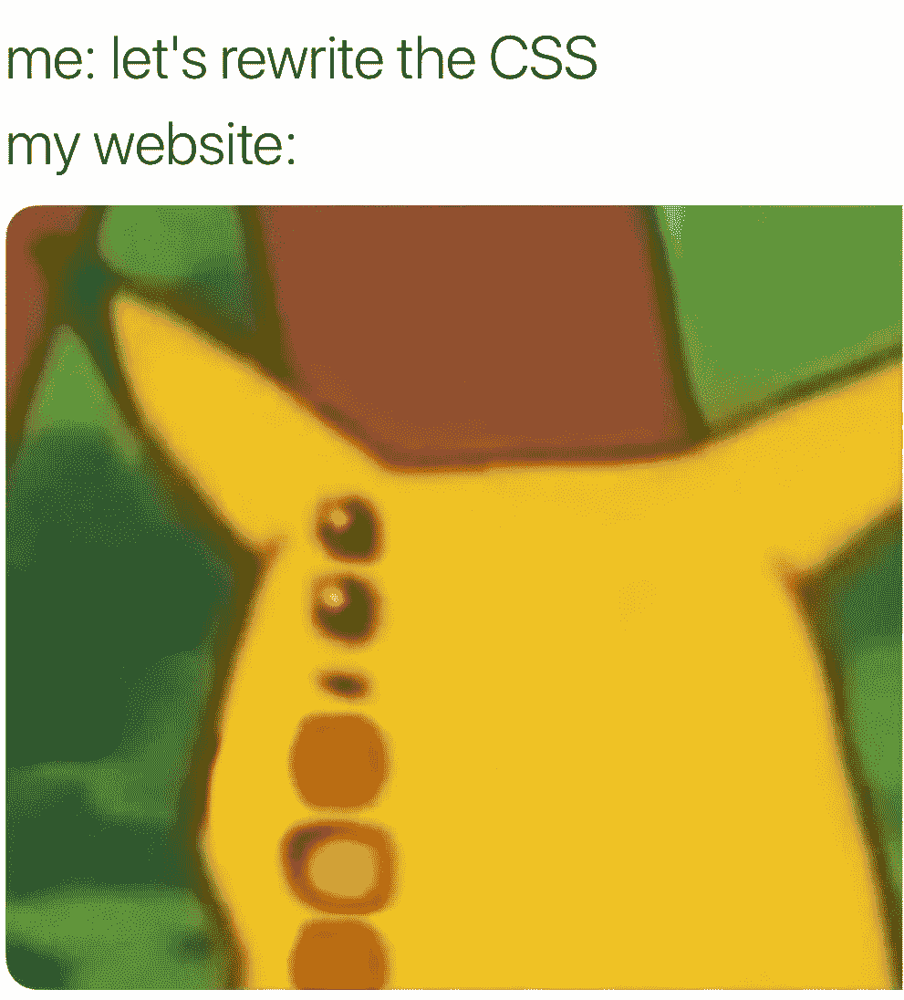
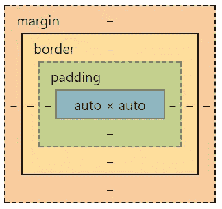
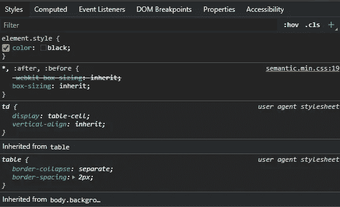
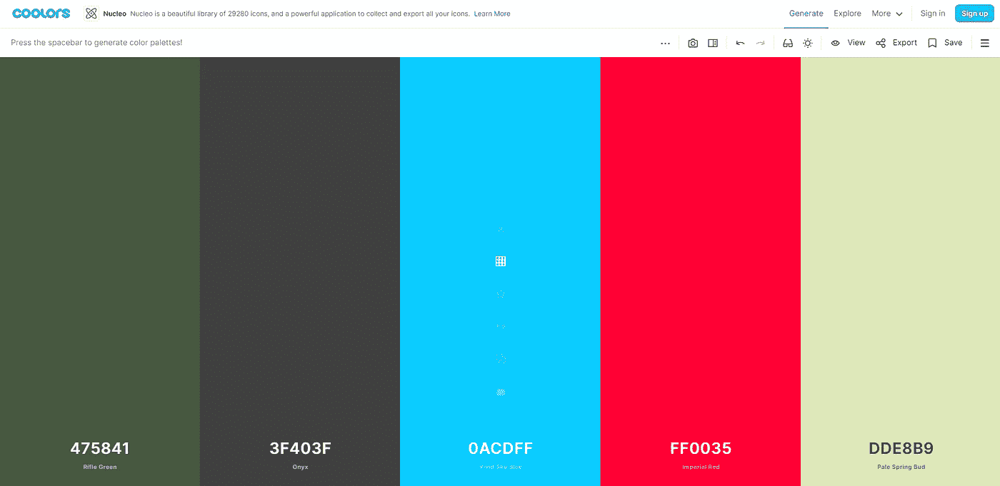
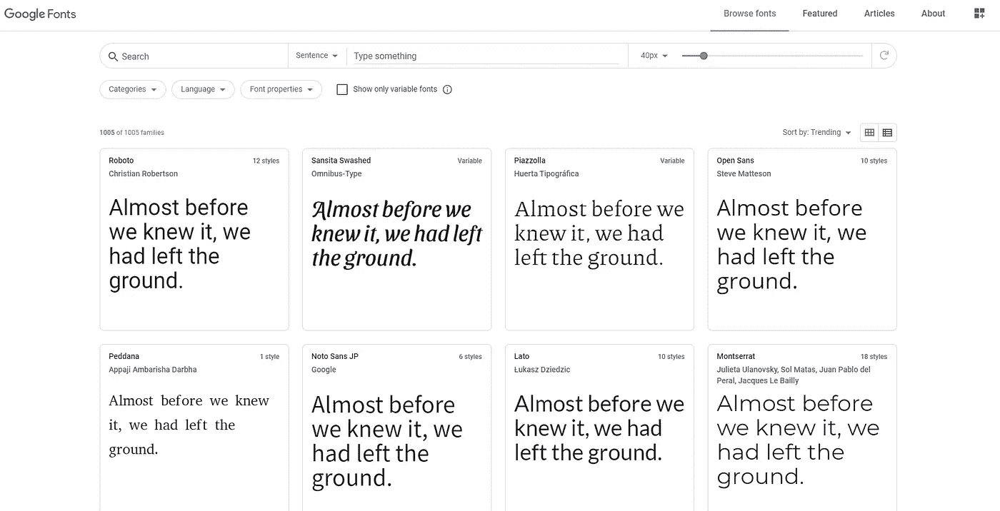
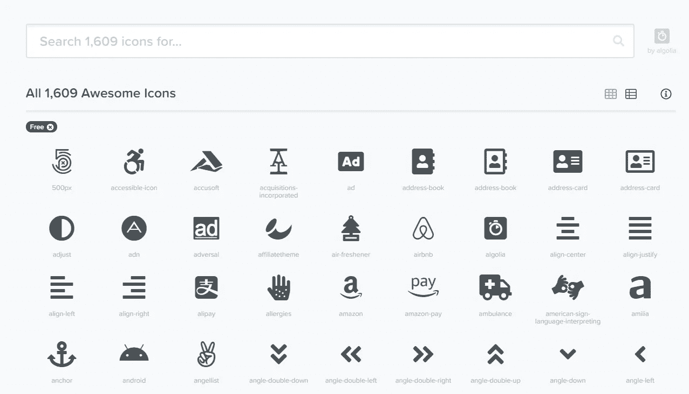

# 面向初学者的 15 个 CSS 提示、指南和代码片段

> 原文：<https://betterprogramming.pub/15-css-tips-guides-and-code-snippets-for-beginners-efde96fb0aee>

## CSS 可能很棘手。从这里开始



图片来源: [CSS 迷因](https://me.me/t/css)

CSS 可能是一种很难掌握的语言；网页设计和用户互动本身就是一种艺术形式，需要一丝不苟的努力。许多初学 CSS 的人很容易使用专业设计和管理 DOM 元素的框架。我过去用过[引导](https://getbootstrap.com/)和[语义 UI](https://semantic-ui.com/) ，必要时会再次使用。

然而，有时你想定制那些预建的卡片和按钮，设计你自己的网页，并想出如何使你的网站看起来专业。这篇文章是我希望在开始我的 CSS 之旅时就知道的技巧、指南和一些代码的分类。

# 他的基础知识

我如何开始使用 CSS？我应该怎么想？

CSS 用于样式化 HTML 中存在的元素。如果没有 CSS，网站将是白底黑字，所有的 DOM 元素都垂直堆叠在右上角。每个网站都是这样开始的，所以不要担心你的网站是不是这样！

## 提示:给每个元素加上边框

你如何知道你所有的元素在哪里，或者它们如何与其他元素相关联？第一件事是在所有东西周围放一个[边框](https://www.w3schools.com/css/css_border.asp)！

```
border: 1px solid black;
```

上面的代码将在你的元素周围添加一个边框，直观地告诉你它占用了多少空间。如果你有不同的宽度、风格或颜色来帮助你区分不同的元素，这是加分的。这些边界的存在是为了知道元素相对于页面的位置，并且是理解 DOM 节点和规划最终设计的好方法。还有一些插件，比如 Chrome 扩展[杀虫剂](https://chrome.google.com/webstore/detail/pesticide-for-chrome-with/neonnmencpneifkhlmhmfhfiklgjmloi)，会给现有网页添加边框。

**为什么有用**:不能可视化你的 CSS 变化会妨碍你理解 HTML 元素所占的空间。尤其是当你改变元素的宽度/高度，用`position: absolute;`将它们移出 DOM 层次结构，或者当你使用 Flexbox 或 Grid 在应用程序的结构中移动时(更多细节见下文！).在元素周围使用边框也有助于可视化盒子模型！

## 指南:盒子模型

盒子模型定义了 DOM 元素的布局:它是一个由同心盒子组成的盒子。DOM 元素的内容由*内容框*组成。内容框被*填充框*包围，这在内容和*边框*之间增加了额外的空间。在 DOM 元素的边界之外是*边距框*，它增加(或减少)这个元素和其他相邻元素之间的空间。

如果你忘记或者需要一个可视化，打开你的开发工具(Chrome:PC 上的 Crl+Shift+i，Mac 上的 Cmd+Opt+i)，进入元素标签。靠近底部(如果不在那里，单击 Computed 选项卡)是您碰巧看到的任何元素的盒子模型。



Auto 是由填充、边框和边距包围的内容。Auto 是内容的默认宽度和高度。在这种情况下，没有内容！

**为什么有用:**当调整内容的宽度或高度以及填充、边框和边距的值时，您应该知道您在更改什么。我经常发现自己想要改变元素之间的间距，我调整了填充而不是边距。注意:设置元素的宽度和高度只会改变内容框，而不是所有的元素。如果您的 DOM 元素具有这种样式:

```
width: 150px;
height: 200px;
padding: 10px 20px;
border: 3px solid blue;
margin: 25px 30px;
```

这个元素的总高度是 200 + 10 + 3 + 25 = 238px，总宽度是 150 + 20 + 3 + 30 = 203px，这明显大于您预期的高度和宽度。查看[箱子尺寸](https://www.w3schools.com/css/css3_box-sizing.asp)以了解替代箱子模型的更多详情。

## 切线尖端:Divitis

虽然这个技巧是关于 HTML 的，但 CSS 实际上只是 HTML 的应用。当你构建你的网站时，你可能会尝试使用`div`标签(division)作为你的 HTML 元素，因为这是你在样本代码、YouTube 视频或其他 HTML 快速解释中看到的。然而，在每种情况下都使用`div`标签不仅会损害用户对网站的[可访问性](https://www.w3.org/WAI/fundamentals/accessibility-intro/)，还会导致你在设计时编写不必要的代码。

**为什么有用:** `Div`标签是自动设计有`display: block;`的，这使得元素占据了页面的宽度，并强制其前后的元素用换行符隔开。使用其他元素不会限制元素的默认样式为块格式。查看这个 [HTML5 周期表](https://websitesetup.org/html5-periodical-table/)以获得 HTML 选项的图形显示，以及这篇由 [MDN 撰写的关于盒子模型和显示类型](https://developer.mozilla.org/en-US/docs/Learn/CSS/Building_blocks/The_box_model)的优秀文章。

# 尝试造型

上面的技巧概述了 CSS 的理论，但是它们对在你的项目中应用 CSS 没有帮助。就像任何其他编程语言一样，我建议你用谷歌搜索你的问题；许多设计师问“如何将一个元素居中”，所以如果你也必须这样做，不要感到羞愧。然而，这里有一些提示可以帮助你的旅程。

## 指南:开发工具

如果你想直接与你的网站互动，看看个人风格做什么(或不做)，做现场直播！打开您的开发工具，转到 Elements 选项卡，检查一个特定的元素。在 HTML 布局下面，您应该会看到 Styles 选项卡，并且可以查看`element.style {}`输入字段。就在这个空间中，您可以调整所选元素的 CSS 并实时查看变化。



顺便说一下，文本颜色已经是黑色了

你可以输入属性，Chrome 会自动为该属性填充一个值。您可以使用箭头键在不同的值之间切换，或者使用滚轮来调整数值。如果你的风格有状态，比如`hover`或`active`，你也可以打开它们，看看风格是如何变化的。如果您还没有，请浏览此选项卡。

**为什么有用:**我最喜欢用这种方式来理解 CSS 的部分是，你可以输入你认为可能需要的任何内容，Chrome 会自动为你完成选项。想调整一下宽度吗？输入`width`作为属性，你会得到几十个选项。这是一种偶然接触新技术的奇妙方式。小心:如果你刷新页面，你所有的风格都会消失；在刷新之前，将它们复制到您的 CSS 文件中！

**题外话:**我看过几篇关于 Firefox 的开发者工具的文章，以及它们与 Chrome 相比有多膨胀。我没有花太多时间使用这些工具，但我建议检查一下。Mozilla 做了很多伟大的工作来保持互联网的感官(你可以感谢他们为你所有的 MDN 搜索)。看看这些博客:[Dennis Gaebel 的 Firefox dev tools](https://blog.logrocket.com/firefox-devtools-for-css-authors-1511f41d1e3/)和[Victoria Wang 的 Firefox 中新的和实验性的 CSS DevTools 指南](https://www.smashingmagazine.com/2019/10/guide-new-experimental-css-devtools-firefox/)。

## 提示:从其他网站窃取

你是否羡慕导航条设计得有多好，或者想知道文章边框的背景颜色？您可以从其他网站获取 CSS 来检查、调整或简单地复制到您的项目中。同样，所有这些魔术都可以在开发工具中完成。

转到 Styles 选项卡旁边的 Computed 选项卡，可以看到给定元素上所有样式的顶点。如果您不确定某个东西的作用，请尝试在“样式”标签中调整或移除它。

**为什么有用:**如果你想模仿专业网站的专业设计或设计工具，如[语义 UI](https://semantic-ui.com/) ，检查这些元素，看看它们是如何工作的。你可以拿你喜欢的，真正检查组成元素总和的部分。分解好的设计是学习的好方法。

# CSS 201:扩展您的工具集

你已经花了一些时间涉猎 CSS，走出你的舒适区。让我们探索一些更复杂的 CSS 特性，它们会改变你对网页布局的看法。

## 代码:Flexbox，或者，如何使任何东西居中

如果你有任何关于 Flexbox 的问题，请联系 css-tricks.com/snippets/css/a-guide-to-flexbox。我一直在使用它，因为它分解了如何为元素和元素的子元素使用它，所有都有图片。Flexbox 为您提供

> “一种更有效的方式来布局、对齐和分配容器中项目之间的空间，即使它们的大小是未知的和/或动态的(因此单词‘flex’)”——[CSS 技巧:Flexbox 完全指南](https://css-tricks.com/snippets/css/a-guide-to-flexbox/)

想让你的元素居中吗？Flexbox。

```
.parent-container {
    display: flex;
    justify-content: center;
}
.child-elements {
    align-self: center;
}
```

想要显示均匀分布在网页上的卡片列表吗？Flexbox。

```
.parent-container {
    display: flex;
    flex-direction: row;
    flex-wrap: wrap;
}
```

**为什么这个有用:** Flexbox 很容易实现，有成千上万的关于如何使用它的指南，上面写的一些代码是默认设置的，所以你甚至不需要在你的 CSS 文件中添加很多行。

## 代码:网格——感觉我在作弊

如果你想让你的网站响应不同的屏幕尺寸，需要经常调整 HTML 元素的位置，或者喜欢用乐高积木编码，Grid 就是为你准备的。也被称为 CSS-Grid，这是我最喜欢的网页设计方式。在 Grid 中有很多工具可以用来格式化你的网页，下面只是其中一种方法。

网格的一个例子，使用网格模板区域

当我第一次开始使用 Grid 时，我通过声明它们的`grid-row-start`和`end`以及它们的`grid-column-start`和`end`来构造我所有的 DOM 元素。然而，自从我发现这个来自[莫滕·兰德-亨德里克森](https://www.youtube.com/watch?v=7kVeCqQCxlk)的演讲视频，我就一直在使用`grid-template-areas`来定义我的 HTML 元素应该放在哪里。

**为什么有用:**使用 Grid 可以很容易地重构整个 DOM 树，而且实现起来很快。此外，如果您不确定元素的位置，重新调整布局会容易得多。考虑到 Grid 的布局结构如此简单，如果您打算根据设备的不同使用不同的显示，我强烈建议您使用 Grid。使用 Grid 可以很容易地重构你的元素，而不仅仅是缩放它们。我强烈推荐观看前面提到的[演讲视频](https://www.youtube.com/watch?v=7kVeCqQCxlk)，因为它分解了你可以用这个 CSS 特性做的所有事情。

## 提示:Sass——嵌套代码

[Sass](https://sass-lang.com/) 是 CSS 的一个版本，旨在使 CSS 更加简单和模块化。任何写在`.sass`或`.scss`文件中的代码都被解释成 CSS。关于 Sass，有很多很酷的东西我只是浅尝辄止，比如变量和 mixin(CSS 的类)，但是现在最容易实现的是嵌套样式。

```
.container {
    color: maroon;
    border-radius: 10px;
    .children {
        margin-left: 1em;
    }
}
```

为什么有用:嵌套你的 CSS 使得样式之间的关系更容易编码，更重要的是，更容易阅读。当你的样式文件开始变得很长的时候，很难知道某些样式在哪里。嵌套您的数据是一种非常简单的方式，使样式比以往任何时候都更容易。此外，Sass 还有许多其他特性，您可以探索了解。从嵌套代码开始，然后探索其他特性。

# 我的代码片段帮助您开始

每当我开始一个新项目，我总是知道有一些设计，我会想用以前的应用程序。这里有一些我自己的代码样本，我在每个项目中都回去参考。你可以直接在代码笔中随意调整它们。

## 代码:简单的按钮

这里是我在一个老项目中开发的一些按钮，我总是会回去。我喜欢用户悬停时的颜色反转、`border-radius`属性(使边框的角变圆)和增加深度的`box-shadow`属性。

专为赛博朋克主题应用打造

## 代码:使图像适合容器和样本卡

这是一个二合一:样本卡，以及如何将一个图像放入一个容器。有两种不同类型的卡片:一种只是带有标题的图片，另一种包含附加信息。尝试通过改变中的`height`和`width`来调整尺寸。动态卡片类。

如果需要的话，可以添加`object-fit: cover;`和`overflow: hidden;`来使图像适合容器而不扭曲。

为您自己的使用调整秤

## 代码:简单翻译动画

动画是 CSS 的一个非常有趣的方面，可以为你的项目增加额外的魅力。这个示例只是一个简单的+1/-1 动画，它只是平移了一个元素的位置并衰减了它的不透明度。制作动画的方式还有很多很多，所以我鼓励你去尝试。

尝试调整移动数字的位置

## 代码:弹出窗口

这与 CSS 关系不大，并且确实包括 JavaScript，但是我已经在许多项目中使用不同种类的弹出窗口向用户显示数据。下面的代码展示了自定义模式、工具条和工具提示的例子。你可以在我的[模态、工具条、工具提示中获得更多信息。](https://medium.com/better-programming/modals-sidebars-tooltips-oh-my-36573209282c)文章。

文章:[https://medium . com/better-programming/modals-sidebars-tooltips-oh-my-36573209282 c](https://medium.com/better-programming/modals-sidebars-tooltips-oh-my-36573209282c)

# 额外资源

有这么多的资源可以更好地帮助你设计你的网站。我列出了一些我经常使用的著名网站。

## 指南:用酷酷的颜色挑选一个配色方案



我喜欢蓝色和红色相邻

Coolors 一次显示五种颜色，并允许您通过触摸空格键立即查看颜色。您可以访问该颜色的十六进制代码，可以调整色调，查看不同种类的色盲的颜色，等等。您可以锁定单个颜色，这样当您重新生成时，该颜色将保留到下一轮。自己试试吧！

将鼠标悬停在一种颜色上以锁定它、四处移动它等。，只需按空格键生成新的颜色。

## 提示:谷歌字体



您可以键入想要显示的文本

当你设计网站结构时，你使用的字体可能并不在你的考虑范围之内。它真的可以改变你的字体，并且[谷歌字体](https://fonts.google.com/)可以很容易地浏览不同的字体。他们的指示也很容易遵循。

## 提示:SVG 图标



您可以在字体 Awesome 上调整字体样式或颜色。

添加图标也可以为你的应用程序设计增加一个维度。用 SVG 图标替换加载窗口、按钮提示和编辑工具。我已经使用过[字体牛逼](https://fontawesome.com/icons)很多次了，但是看看其他网站，比如[名词项目](https://thenounproject.com/)或者 [Flaticon](https://www.flaticon.com/) 。查看他们的文档，了解如何在您的项目中启用图标。

CSS 还有很多东西，这只是我目前为止所知道的一个例子。当你建立网站时，设计是令人兴奋的，也是重要的。我鼓励你收集自己的笔记、工具、技巧和代码，这样你就可以在未来的项目中参考你所获得的知识，或者帮助和教导他人。