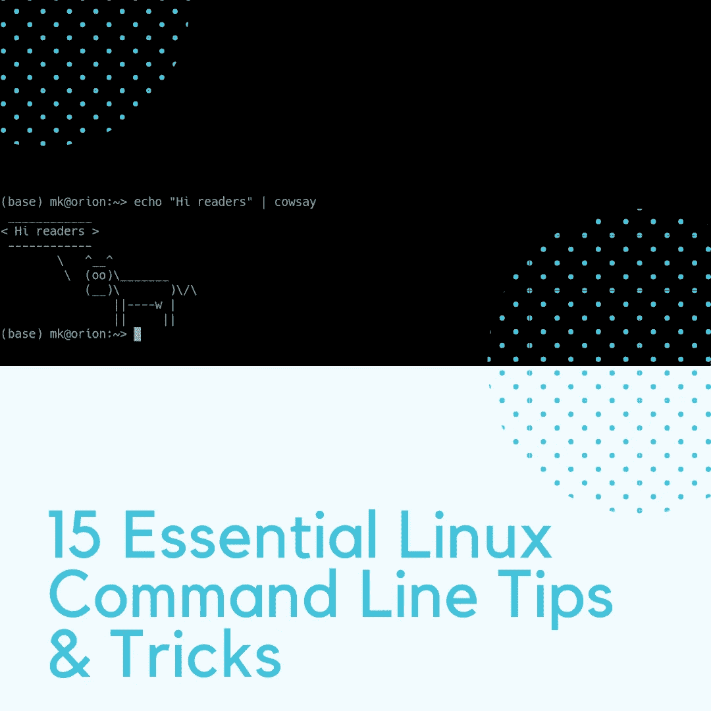
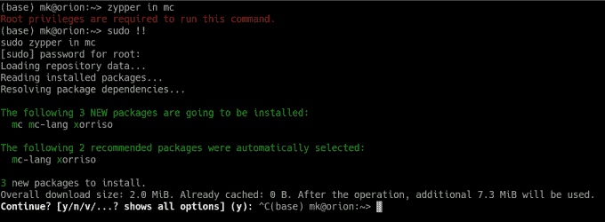
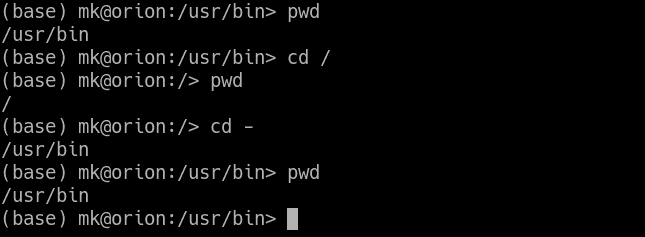
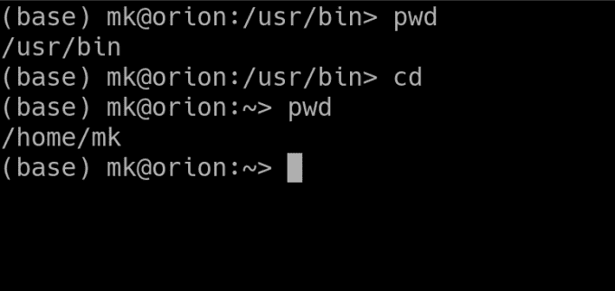
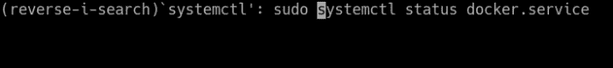
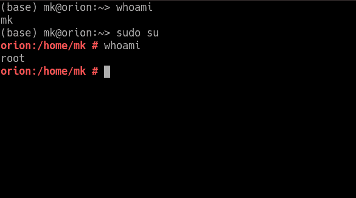
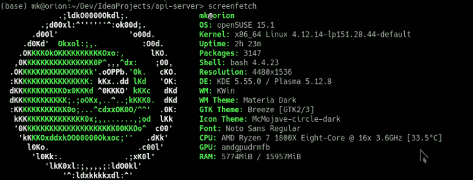
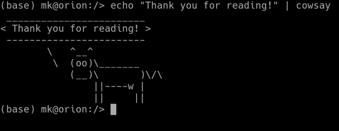

# 15 个基本的 Linux 命令行提示和技巧

> 原文：<https://betterprogramming.pub/15-essential-linux-command-line-tips-and-tricks-95e2bfa2890f>

## 充分利用支持互联网的操作系统



Linux 是支撑网络的操作系统。对于一个软件开发人员来说，至少了解 Linux 如何工作以及如何使用它是很重要的。在本文中，您会发现对 Linux 命令行的一些见解。

在我们继续之前，我将假设您正在使用`bash`。这是所有主要发行版默认附带的命令解释器。除非你手动修改过，否则应该是`bash`。

# 1.的！！

在你身上发生过几次？在输入并运行一个长命令后，你发现你忘了在开头加上`sudo`。嗯，你只需输入`sudo !!`，命令行将用你试图运行的最后一个命令替换`!!`:



# 2.回去

每个人都知道使用`cd ..`可以上一个目录，但几乎没有人知道使用`cd -`可以回到上一个目录:



# 3.回家

您可能知道`~`是您的个人文件夹的快捷方式。但是有一个技巧几乎没有人知道:如果你输入`cd`后没有任何东西，它仍然会把你带到你的主目录:



# 4.搜索

众所周知，你可以用箭头来翻阅你的历史。开发人员太懒了，我们宁愿按下向上箭头 15 次来发现`ls`我们已经在某个地方。但这可以通过反向搜索功能更容易地实现。按下`Ctrl+R`并开始输入命令，反向搜索填充查找最近历史中最接近的匹配:



# 5.重复使用一个论点

另一个方便的技巧是`!$`快捷键。它将被前一个命令的参数替换。例如，当您创建一个文件夹并希望`cd`进入其中时，这很有用:


# 6.复制并粘贴

您可能已经注意到`Ctrl+C`和`Ctrl+V`在 Linux 终端中不能正常工作。最常见的是，它们被替换为`Ctrl+Shift+C`和`Ctrl+Shit+V`。这是因为`Ctrl+C`已经被保留用于终止当前运行的程序。

# 7.无需密码即可通过 SSH 验证

如果您经常登录某个 SSH 服务器，每次都必须输入密码可能会很烦人。如果您的主机和服务器交换证书，您可以跳过它。

首先，您必须生成一个。运行命令`ssh-keygen`。这会创建一个私有/公共密钥对，并将其保存到`~/.ssh/id_rsa`。现在您需要用这个命令将公钥复制到服务器:`ssh-copy-id [[email protected]](https://everyday.codes/cdn-cgi/l/email-protection)_host`。将提示您输入服务器的密码，公钥将被复制。现在，您可以从这个特定的系统登录到这个服务器，而不需要密码。

注意:这种方法的安全性绝不亚于常规身份验证。如果您的本地系统是安全的，它甚至可能更安全。除非您泄露了私钥，否则将无法登录 SSH。

# 8.让你的程序在后台运行

如果您在终端中运行一个程序，一旦您结束这个终端会话，它就会被杀死。为了防止这种情况并保持程序运行，使用`nohup`命令——它代表“不挂断”

例如，要使用`scp`在服务器之间传输文件，同时确保即使您意外关闭了终端窗口，传输也会继续，请使用以下命令:

```
nohup scp very-big-file.mkv [[email protected]](https://everyday.codes/cdn-cgi/l/email-protection):~/very-big-file.mkv
```

`nohup`还创建一个名为`nohup.out`的文件来保存命令的输出。

# 9.回答是

如果您编写 bash 脚本来自动化某些任务，您可能会因为在运行的每个命令中输入`yes`而感到沮丧。要跳过它并回答任何命令的`yes`，在它前面加上`yes |`，就像这样:

```
yes | apt-get update
```

如果你想改为回答`no`，在前面加上`yes no |`。

# 10.以 Root 用户身份登录

这不是最佳实践，但有时别无选择。然而，下一个最好的选择是使用`sudo su`。`su`命令以 root 用户身份登录，而`sudo`将以 root 用户身份执行。因此，您不需要它的 root 密码。此外，有些发行版禁用 root 密码，所以这是您唯一的选择:



# 11.注销

从 SSH、SFTP、root 或终端会话注销的最快方式是`Ctrl+D`快捷方式。当您处理大量 SSH 连接或者无法进入`exit`时，它就派上了用场。

# 12.粉碎文件

如果你重视隐私，这是给你的。`rm`命令被广泛用于删除文件，但它不能完全删除文件。即使在删除之后，也可以使用特殊软件提取数据。要完全删除文件并用零填充它所占用的空间，使用`shred`命令。像这样使用它:`shred -zvu <filename>`。

# 13.VIM 中的密码保护文件

如果你是使用 Vim 的人之一，我钦佩你。您会很高兴地了解到，您可以在 Vim 中使用`vim +X filename`命令或直接在 Vim 中使用`:X`命令对文件进行密码保护。

# 14.列出用户

如果您有隐私方面的顾虑，您可能希望随时检查谁登录了系统。您可以使用`w`命令列出当前系统中的所有用户。此外，您可以编写一个脚本，按照计划运行这个命令，如果有什么不正常的地方，您会收到电子邮件。

# 15.显示系统信息

为了以一种漂亮的方式显示您的系统信息，安装并使用命令`screenfetch`:



# 16.奖金

如果你感到孤独，Linux 可以生出一头可以和你说话的牛。以说 *Hello world* 为例，用`echo "Hello world" | cowsay`:



# 结束语

感谢阅读，我希望你喜欢这篇文章。在评论中让我知道你最喜欢的 Linux 黑客吧！

# 资源

*   [Bash 文档](https://devdocs.io/bash/)
*   [Bash 脚本备忘单](https://devdocs.io/bash/)
*   [为什么要用 Linux？](https://medium.com/javascript-in-plain-english/no-you-do-not-need-windows-or-mac-to-develop-with-javascript-460e1ac9e494)