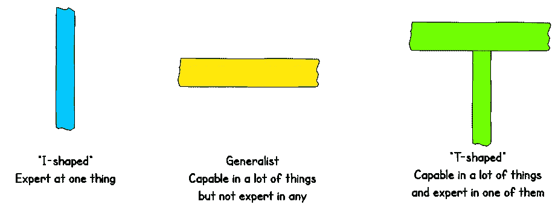
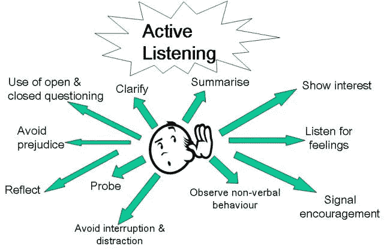

# 帮助软件开发人员成功的 15 个技巧

> 原文：<https://betterprogramming.pub/15-helpful-tips-for-software-developers-to-succeed-9174c485399e>

## 如何成为更好的开发人员

克里斯·库里在 [Unsplash](https://unsplash.com?utm_source=medium&utm_medium=referral) 上的照片

在本文中，我们将浏览一系列习惯和技巧，它们可以帮助开发人员在个人和技术上成为更好的自己，并在他们的角色中取得成功。

这些是成为高级开发人员时需要知道的基本习惯和事情。

# 1.专注于成为一名 T 型开发人员

知道很多东西，对那些东西中的几个有深入的了解。

t 形工程矩阵。图片由 Jason Jip 提供。

我用 Java 做后端开发很多年了。是的，我可以在 React 或 Terraform 中完成工作，但我在这两方面都不是专家。

通过[“‘T 型’工程师”](https://www.asee.org/file_server/papers/attachment/file/0005/4534/The_T-Shaped_Engineer.pdf)(下载 PDF)阅读更多关于这个话题的内容。

# 2.依靠问答网站上的文档

在我开发生涯的早期，我严重依赖问答网站，如 Stack Overflow，来寻找答案。

然而，随着时间的推移，我转向了文档优先的方法。

# 3.选择质量而不是速度和数量——注重简单

把你的关注点从速度和数量转移到质量上，遵循软件开发最佳实践，比如[实](https://scotch.io/bar-talk/s-o-l-i-d-the-first-five-principles-of-object-oriented-design)、[亲](https://en.wikipedia.org/wiki/KISS_principle)、[干](https://wiki.c2.com/?DontRepeatYourself)。

> "简单是最高级的复杂。"
> 
> —莱昂纳多·达芬奇

总是努力编写非常简单的代码，易于阅读、理解和维护。

Rails Conf 2012:“简单至关重要”

# 4.总是测试

一个有经验的开发人员知道测试的重要性，并且会一直支持它。

> "所有代码都是有罪的，直到被证明是无辜的."
> 
> —匿名

单元测试间接地强制编写可测试的代码——换句话说，就是低耦合和高内聚的代码。

# 5.为开发人员的快乐做出贡献，并指导初级开发人员

主动提高代码库的质量，并为其他开发人员的幸福做出贡献——例如，添加代码覆盖工具或 linter 自动化繁琐的手动流程，如部署或备份；将复杂的过程文档化；修复间歇性失败的测试；等等。

作为一名高级开发人员，当与初级开发人员一起工作时，利用你的知识和经验来帮助指导他们成为更好的开发人员。例如，文章“[作为开发人员，我希望早点知道的关键习惯和事情](https://codeburst.io/key-habits-and-things-i-wish-i-knew-earlier-as-a-developer-43c9466a0407)”强调了一些基本的习惯和技能，可以帮助开发人员在他们的工作中变得更好。

# 6.组织一对一；给予和接受反馈

*一对一(1:1)* 是一种非正式的循环会议，通常持续 30-45 分钟。通常是两周一次或每月一次，日程灵活或没有。

这种会议可以在任何环境下进行，可以用来提供和接受反馈；进行同步；谈论工作、生活、工作中的挑战等等。

**注:**值得一提的是，提供反馈是一个敏感的过程，了解接收者希望如何获得反馈非常重要。

# 7.参与产品发布

在一些公司，产品的发布是由 CI/CD 管道 100%自动化的，而在其他地方，它要么是半自动的，要么是手动的过程。

如果您工作的地方，发布、修补或回滚过程是手动或半自动的，那么表现出参与其中的兴趣。

# 8.加入面试小组

根据你的公司如何进行面试，如果可能的话，进入面试小组。

参加面试小组可以学到很多东西。做采访不容易。确保受访者感到放松，找到你的问题的答案，并有机会了解你和公司。给受访者留下美好而积极的体验。

# 9.记录有用的知识和发现

可以记录的东西有很多——例如，您对某个主题的调查结果或研究，服务或产品如何工作，或者其他开发人员可能会发现有帮助或弥补知识差距的任何东西。

文档可能是一项单调乏味的工作，但是当一个新的团队成员加入时，它起着至关重要的作用。

# 10.做更好的代码审查

当审阅一个拉式请求时，不要忘记对作者的辛勤工作感同身受，并总是留下有帮助和有思想的审阅意见。

信用: [CommitStrip](https://www.commitstrip.com/en/2019/05/29/its-an-art/?)

“[受 Google](https://medium.com/better-programming/13-code-review-standards-inspired-by-google-6b8f99f7fd67) 启发的 13 个代码评审标准”和“[如何做好代码评审](https://medium.com/swlh/how-to-do-a-good-code-review-c2cab4ef32bf)”这两篇文章可以帮助你更好地评审代码。

# 11.拥抱错误，写出更好的 Git 提交

欢迎有机会调查、理解和修复错误。除了学习和发展解决问题的技能，你还会得到同伴的欣赏和尊重。

作为开发人员，通过将您的更改组织成有意义的提交，在合并之前压缩冗余的提交，并编写有意义的提交消息，将您的 Git 提交提升到下一个级别。

文章“ [Git 教程——最常用 Git 命令的初学者指南](https://codeburst.io/git-tutorial-a-beginners-guide-to-most-frequently-used-git-commands-2ab92bd22787)”列出了 20 个 Git 命令，可以满足人们日常的大部分 Git 需求。

# 12.尽可能重构代码

总是有重构和提高代码质量的空间。例如，删除死的或未使用的代码和库，升级过时的依赖项，重构违反编码标准的代码，重新访问代码中的待办事项，使代码易于阅读和理解。

任何提高代码库质量的努力都是徒劳的。

# 13.为开源项目和博客做贡献

为开源项目做贡献并不是任何角色的要求，但它有助于你成为一名更好的开发人员。文章“[如何为开源做出贡献](https://medium.com/swlh/how-to-contribute-to-open-source-6ece27476671)”强调了如何开始，并提供了这样做的原因和好处列表。

与开源贡献类似，博客不是任何角色都需要的，但它是一种知识共享的形式，表明你有能力足够好地解释主题，并在必要时指导其他开发人员。

# 14.更好的沟通和积极的倾听

作为一名高级开发人员，能够轻松地向技术和非技术受众传达您的想法并有效地解释主题是非常关键的。

积极倾听。图片由[杂交育儿](http://hybridparenting.org/how-to-use-active-listening-with-children/)提供。

除了更好的沟通，始终练习积极倾听，并对正在讨论的话题表现出真正的兴趣。如果可能的话，避免使用手机或笔记本电脑，如果你用电脑做笔记，那么提前通知与会者。

# 15.跨团队协作和影响范围

参与涉及与其他团队的开发人员合作的项目，因为这展示了你的团队合作和跨越跨团队障碍的能力——以及你的影响范围有多大。