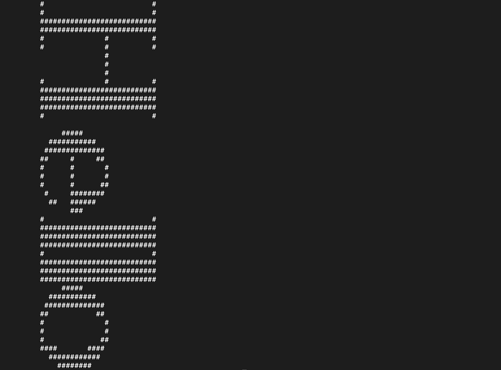
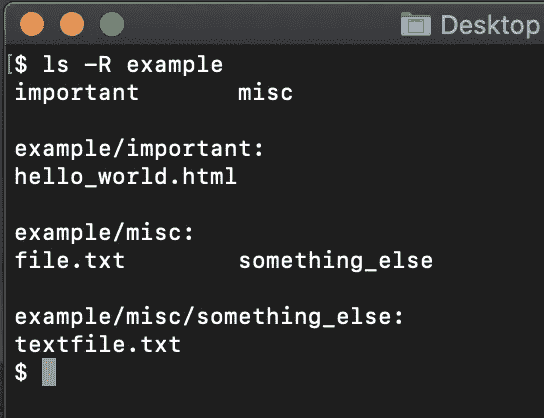

# 面向高级用户和开发人员的 15 个 macOS 终端提示和技巧

> 原文：<https://betterprogramming.pub/15-macos-terminal-tips-and-tricks-for-power-users-and-developers-2123c31995b2>

## 节省时间，提高生产力，给你的朋友留下深刻印象


照片由 [Jonny Gios](https://unsplash.com/@supergios?utm_source=medium&utm_medium=referral) 在 [Unsplash](https://unsplash.com?utm_source=medium&utm_medium=referral) 拍摄。

# 1.为命令创建别名

您可以为终端命令创建速记替身。

例如，让我们创建一个在默认浏览器中打开媒体的`blog`别名。

首先，您可以使用`open [URL]`通过终端在浏览器中打开媒体:

```
open [https://www.medium.com](https://www.medium.com)
```

为这个命令创建`blog`别名:

1.  打开你的`.bash_profile`:

```
open ~/.bash_profile
```

2.通过在`.bash_profile`中添加下面一行来创建一个名为`blog`的新别名:

```
alias blog='open [https://www.medium.com'](https://www.medium.com')
```

3.点击“保存”并重启终端。

4.打开一个新的终端窗口。

5.Run `blog`和 Medium 将在您的默认浏览器中打开。

# 2.查看您的命令历史记录

通过打开终端窗口并运行以下命令，查看您的命令历史:

```
history
```

# 3.查找忘记的命令

当您不记得过去的某个重要命令时，这可以节省大量时间。

给找过去一个命令:

1.  打开终端。
2.  键入 Ctrl-R。
3.  开始键入一些内容(例如，您从正在搜索的命令中记住的字母)。
4.  当您键入时，终端会不断建议过去的命令，这些命令与您键入的内容最匹配。要执行建议的命令，只需按 enter 键。

# 4.显示隐藏的文件和文件夹

通过运行以下两个命令显示隐藏的文件和文件夹:

```
defaults write com.apple.finder AppleShowAllFiles -bool TRUEkillall Finder
```

小心点就好。文件被隐藏可能是有原因的。不要删除任何你不确定要删除的东西。

要隐藏文件，运行上面的命令，将`TRUE`替换为`FALSE`。

# 5.将文件从一个文件夹复制粘贴到另一个文件夹

使用`ditto`将文件从一个文件夹复制粘贴到另一个文件夹:

```
ditto [original_folder][new_folder]
```

例如，如果您有`folder1`并且想要创建一个名为`folder2`的新文件夹并将`folder1`的内容复制粘贴到那里，运行:

```
ditto folder1 folder2
```

# 6.不使用浏览器下载

终端可以帮助你不用浏览器下载数据。下载的文件将保存在你当前所在的目录中。如果您希望它在`Downloads`中结束，请在下载前更改目录:

```
cd ~/Downloads/
```

要下载文件，使用`cURL -O [URL_OF_THE_FILE]`命令。例如:

```
curl -O [https://www.medium.com/example_download.txt](https://www.medium.com/example_download.txt)
```

# 7.让您的 Mac 保持清醒

通过运行以下命令来禁止 Mac 进入睡眠状态:

```
caffeinate
```

停止与 Ctrl-C 组合键咖啡因。

如果只在一定时间内含有咖啡因，请使用`caffeinate -u -t [n_seconds]`。例如，让我们摄入咖啡因十分钟:

```
caffeinate -u -t 600
```

# 8.按住一个键重复字符

按住一个键来重复字符可能是你所熟悉的。默认情况下，这在 Mac 中是禁用的。幸运的是，有一个简单的方法可以实现它:

```
defaults write -g ApplePressAndHoldEnabled -bool FALSE
```

要恢复这一更改，只需运行上面的命令并用`TRUE`替换`FALSE`。

# 9.隐藏特定的文件或文件夹

要隐藏特定的机密文件或文件夹，请使用以下命令:

```
chflags hidden [path_of_the_folder]
```

要使其再次可见，请使用:

```
chflags nohidden [path_of_the_folder]
```

例如:

```
chflags hidden ~/Desktop/important
```

请记住，这不会完全隐藏文件。例如，你仍然可以运行`ls`来查看隐藏的内容。

# 10.编写 Ascii 图片

显示一些看起来很酷的 ASCII 图片:

```
banner -w [banner_width][banner_text]
```

举个例子，我们把`"Hello"`打印如下:

```
banner -w 50 Hello
```



# 11.更频繁地检查 macOS 更新

若要将 Mac 检查 macOS 更新的频率从每周一次更改为每天一次，请键入:

```
defaults write com.apple.SoftwareUpdate ScheduleFrequency -int 1
```

# 12.列出文件夹及其子文件夹的内容

命令列出了一个目录的内容。但是你知道你可以添加一个`-R`来让它列出子文件夹的内容吗？

```
ls -R [path_to_folder]
```

例如，如果在我的当前目录中有一个名为`example`的文件夹，我可以用以下命令列出它的所有内容:

```
ls -R example
```



# 13.无需打开文件即可查看其内容

使用`cat [path_to_file]`查看文件内容，无需“打开”文件。

假设您在当前目录中有一个`example.txt`文件，您想检查其中的内容。要在终端中做到这一点，只需运行:

```
cat example.txt
```

# 14.安排关机

要计划在 60 分钟后关闭 Mac，请运行:

```
sudo shutdown -h +60
```

要取消计划的关闭，请运行:

```
sudo killall shutdown
```

# 15.让您的 Mac 说话

运行`say [something]`让您的 Mac 说话。

例如，要让您的 Mac 显示“`Hello World`”，请运行以下命令:

```
say Hello World
```

# 结论

感谢阅读。我希望你喜欢这篇文章。

我很想加入你的 LinkedIn 网络。请随意连接 [Artturi Jalli](https://www.linkedin.com/in/artturi-jalli-29619413a) 。

# 你可能会发现这很有见地

[](/5-must-have-homebrew-packages-for-command-line-lovers-d3d18c48199a) [## 命令行爱好者必备的 5 个自制软件包

### 使用这些神奇的命令行工具，让您的编码生活更加轻松

better 编程. pub](/5-must-have-homebrew-packages-for-command-line-lovers-d3d18c48199a)