# 我使用 Emacs 和 gif 的 15 个原因

> 原文：<https://betterprogramming.pub/15-reasons-why-i-use-emacs-with-gifs-5b03c6608b61>

## VS 代码在 Emacs 上什么都没有

[https://unsplash.com/photos/vc3iVL_znJ8](https://unsplash.com/photos/vc3iVL_znJ8)

# 1.组织模式

你可能以前见过/用过[降价](https://daringfireball.net/projects/markdown/)。Org 模式有类似的语法，也受 GitHub READMEs 支持，但与 Markdown 不同，它只有一个规范，没有数百种风格。

请继续阅读，看看实际上可以做些什么，或者跳到以下章节:

*   3.将组织导出到演示文稿和文档。
*   5.编辑内[乳胶](https://www.latex-project.org/)预览。
*   6.组织议程
*   9.执行代码块。
*   11.组织表。

# 2.Vim 绑定

[Doom Emacs](https://github.com/hlissner/doom-emacs) 有很棒的 [Vim](https://www.vim.org/) 绑定，所以，这么多优秀的领袖特性开箱即用。

与 VS 代码不同，Vim bindings 插件并不慢，感觉和原生代码一样快，更不用说它们可以在任何地方工作；终端、打开文件、搜索和替换，等等，稍后会详细介绍。

# 3.将组织导出到演示文稿和文档

得益于许多组织模式扩展，您可以将文档导出到:

*   LaTeX PDF
*   [Beamer](https://www.overleaf.com/learn/latex/beamer)/[reveal . js](https://revealjs.com/)演示
*   超文本标记语言
*   iCalendar
*   降价

而且转化过程几乎是瞬间的。

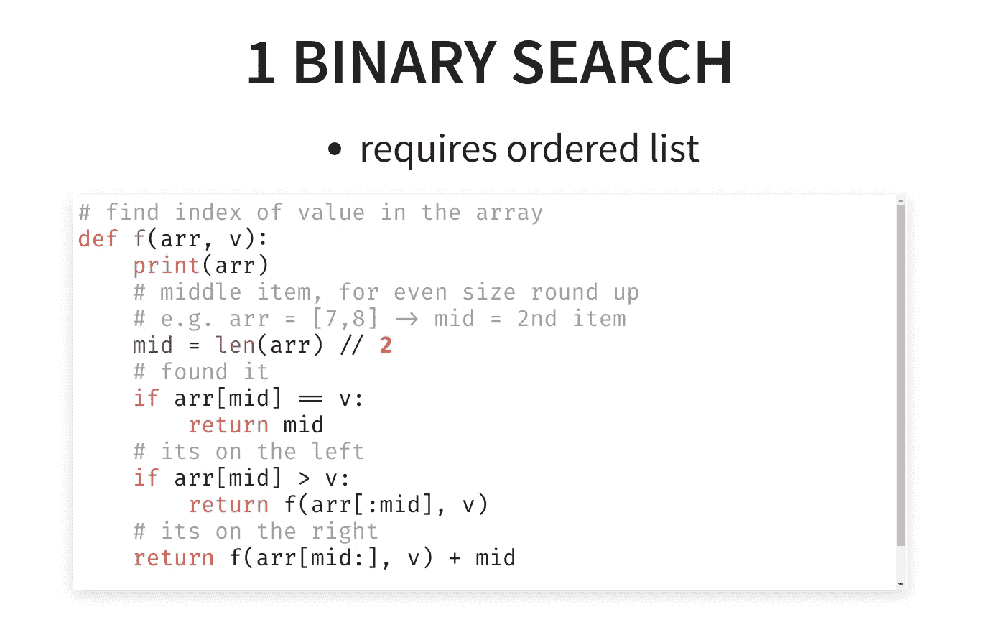

reveal.js 预览

# 4.在 Emacs 内部搜索

[Swiper](https://swiperjs.com/) 可用于文件内部的模糊搜索，并实时高亮显示所选行。

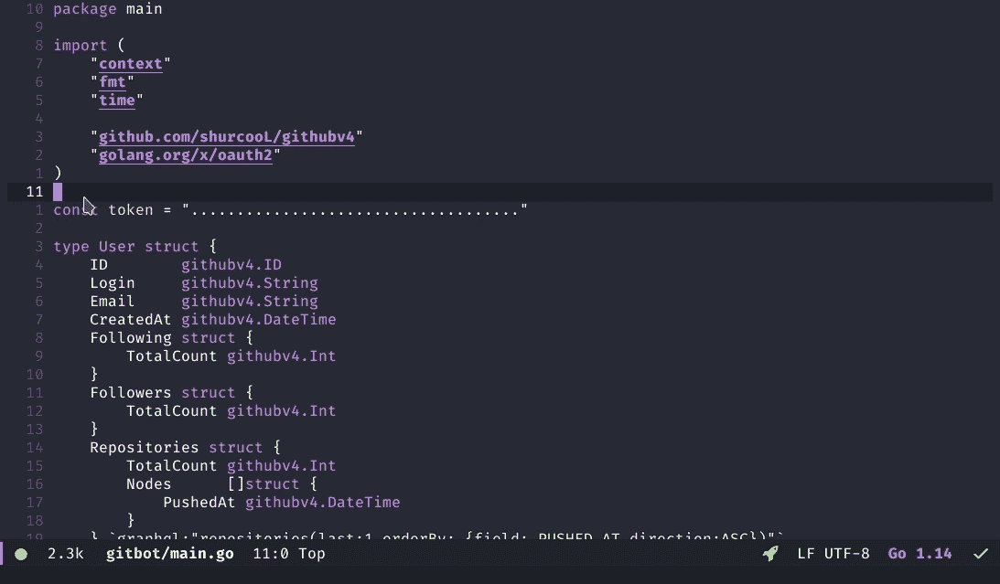

SPC s s

# 5.编辑器内 LaTeX 预览

你可以按`C-c-x-l`或`Enter`在编辑器中预览你的 LaTeX 代码(假设你已经安装了 TexLive):

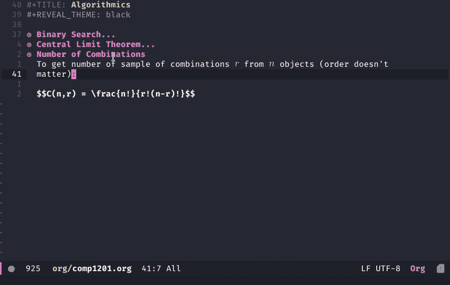

你不再需要在 LaTeX 中预览你的笔记

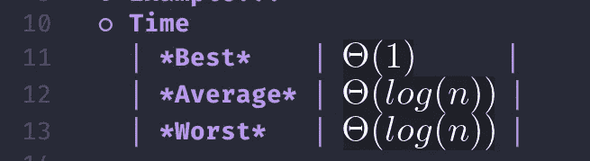

# 6.组织日程待办事项

## 添加新的待办事项

Emacs 允许您使用`Alt+Shift+Enter`添加新的组织模式任务，以及以下内容:

*   `C-c-d`添加截止日期。
*   `C-c-s`添加预定日期。
*   `C-c-t`改变/切换任务的状态(如`TODO`、`DONE`)。

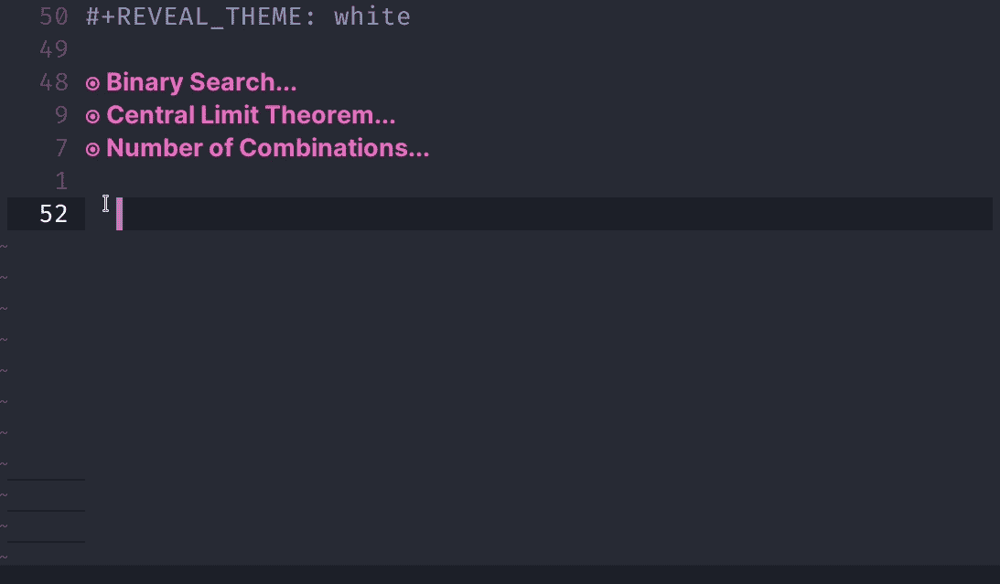

## 查看您的议程

你可以把它设置成包括你的大学时间表，当前任务，甚至重复的习惯任务的 iCalendar 文件。

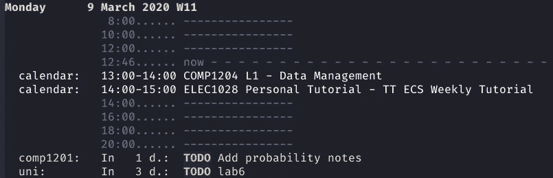

SPC o A a 显示您的组织议程

# 7.集成终端

## 切换终端而不终止命令

“SPC o e”切换终端

## 用鼠标调整终端的大小

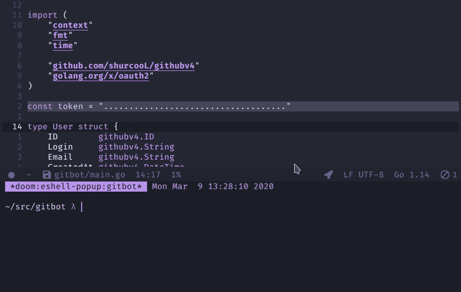

但是即使你可以，也不意味着你应该这样做

# 8.LSP 支持

我知道，这些功能被大多数其他像样的编辑器所覆盖，甚至 Vim(与 Vim 只适合编辑基本文本/脚本的流行观点相反)，这都要归功于微软引入的 LSP 标准。

## 跳转定义

*   本地定义
*   全局定义的定义

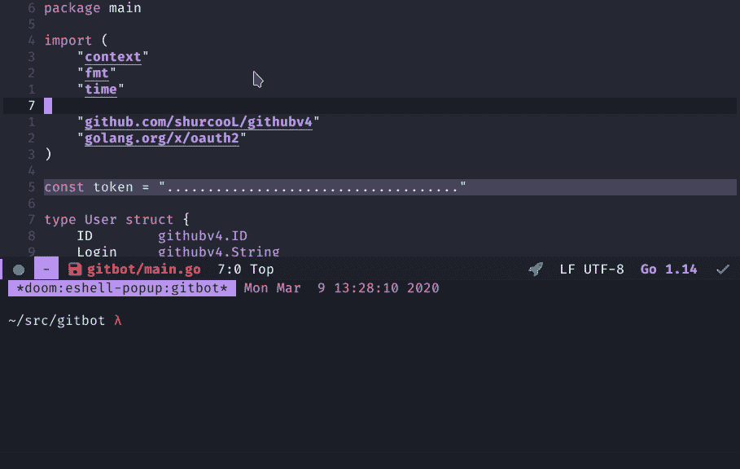

跳转到带有“gd”的定义

## 折叠/展开代码

你可以切换`za`，打开`zo`，或者关闭`zc`一段代码。

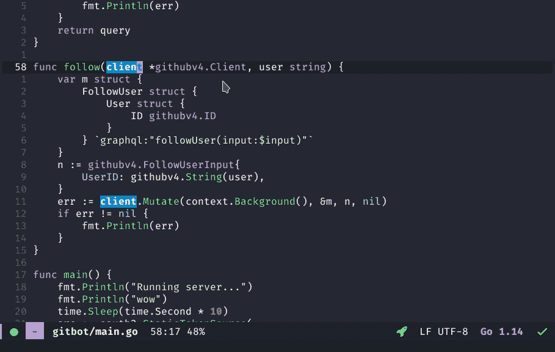

用“za”折叠/展开代码

## 自动完成

Emacs 还拥有异常快速的自动完成支持，这要归功于其完善的 LSP 扩展。

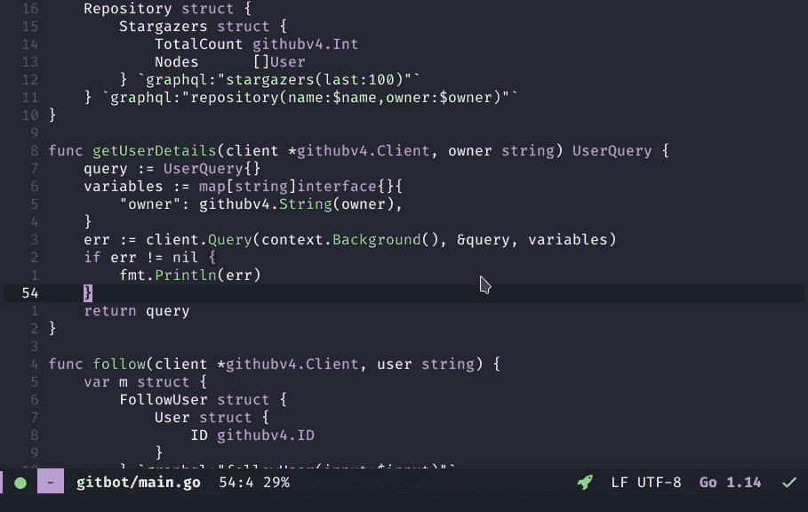

自动完成(使用公司 lsp)

# 9, 10.执行代码块和代码符号

Org-mode 允许你执行 [Lisp](https://lisp-lang.org/) ，Python， [Bash](https://www.gnu.org/software/bash/) ，JavaScript 等语言的代码块，甚至允许你在代码块之间保存会话变量。

另外，请注意替换常用关键字的符号。这就是漂亮代码在 Doom Emacs 中的作用。

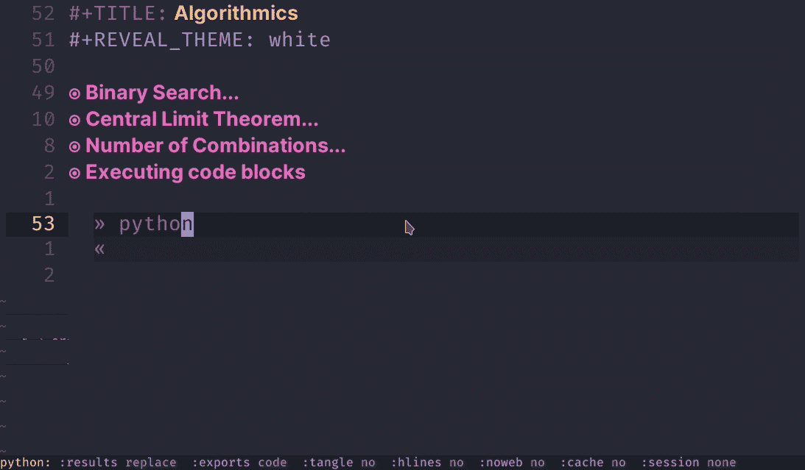

输出结果

# 11.组织表

表格会自动为您格式化，因此您不必处理那些难看的、未对齐的减价表格。

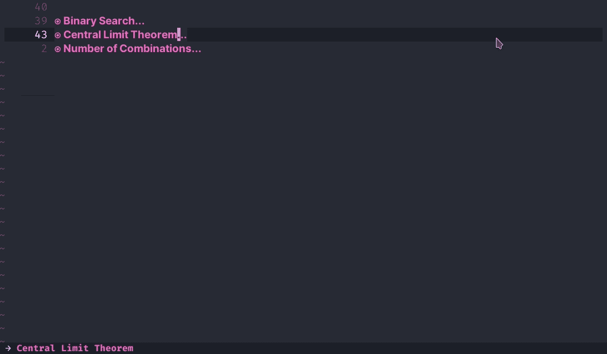

按 TAB 键转到新列，按 ENTER 键转到新行

# 12.禅宗模式

在 Doom Emacs 中，你可以用`SPC t z`切换 zen 模式。它只是将你的代码居中，使其稍微变大，并用无衬线字体替换一些文本以提高可见性。

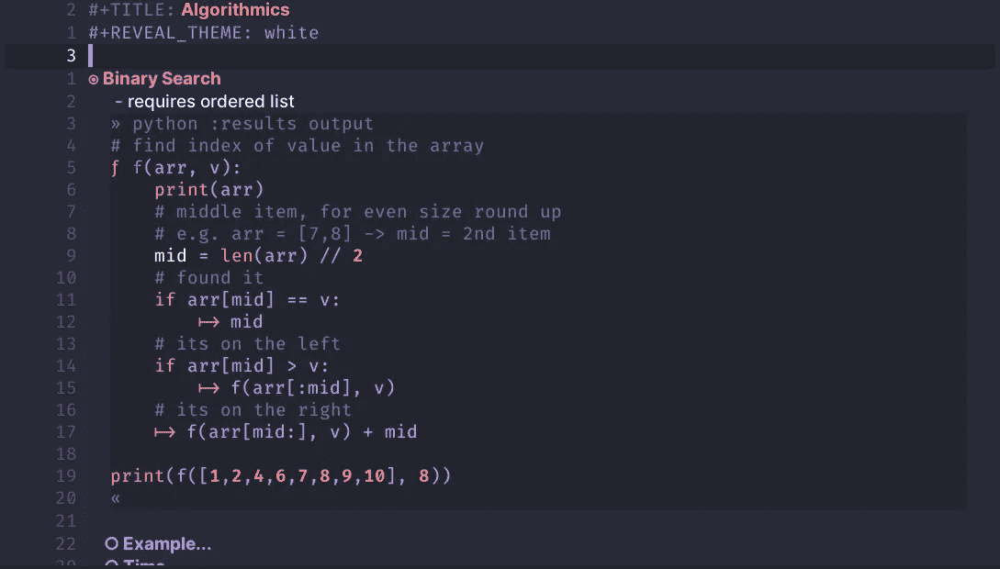

# 14.magit——我用过的最好的 Git CLI

它可以做这么多，而不是试图在这篇文章中展示一切，你绝对应该只是看上面的视频。

TL/DR；登台、取消登台、分支、推、拉、提交等等，所有这些都从您的编辑器中完成，只需击几个键。

在 Doom Emacs 中， [Magit](https://magit.vc/) 可以和`SPC g g`一起发射。

# 15.注释掉多行

您可以简单地使用`M-;`来切换所选行上的注释。

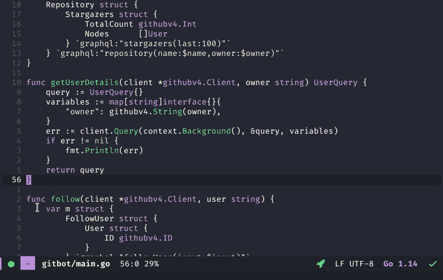

m-；

# 额外收获:资源使用

如果在使用 Linux 和低端桌面环境的情况下，内存经常不足，您可能会注意到 VS 代码使用的内存比操作系统本身还多。Emacs 虽然比 Vim 或 [Nano](https://www.nano-editor.org/) 更重，但比 VS Code 或 [IntelliJ](https://www.jetbrains.com/idea/) 领先数英里。

如果你还没有，我个人会推荐 Doom Emacs，因为开箱即用的纯 Emacs 根本不好。

然而，如果你不是那么喜欢 Vim 绑定，但是你仍然想要一个很好的开箱体验，那么试试 [Centaur Emacs](https://github.com/seagle0128/.emacs.d) 。