# 15 个有用的 VS 代码快捷方式来提高你的工作效率

> 原文：<https://betterprogramming.pub/15-useful-vscode-shortcuts-to-boost-your-productivity-415de3cb1910>

## 提高你的编码速度

保罗·埃施-洛朗在 [Unsplash](https://unsplash.com?utm_source=medium&utm_medium=referral) 上拍摄的照片

VS Code 是 web 开发中最流行的编辑器之一。在编写代码时，我们经常需要某些格式化操作，其中很多都是由 VS 代码本身支持的。虽然大多数操作都可以从菜单选项中找到，但拥有实用的键盘快捷键可以帮助您大大提高编码速度。

以下是一些我已经使用了一段时间并发现非常有用的快捷方式。

# 1.打开调色板以搜索文件

MAC:CMD+P
Windows/Linux:CTRL+P

浏览文件是最常见的选项之一，这个命令非常方便。您可以在搜索框中键入文件的名称，并通过在搜索结果上单击或按 enter 打开文件来选择文件

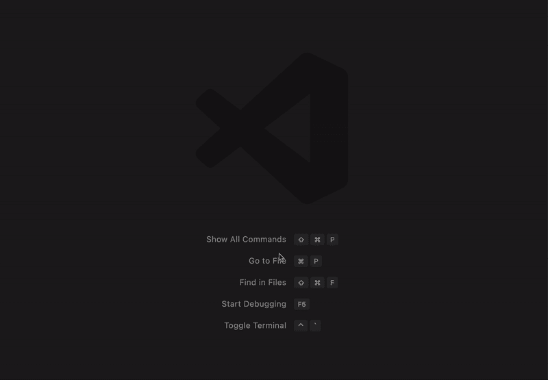

# 2.将光标添加到所有匹配的选择

MAC:CMD+SHIFT+L
Windows/Linux:CTRL+SHIFT+L

VS 代码中我最喜欢的一个特性是多游标。它们允许您替换文本或追加更多文本，而无需复制粘贴或要求您一次更改一个文本。

使用此命令，您可以将光标添加到文档中所有匹配的选择中

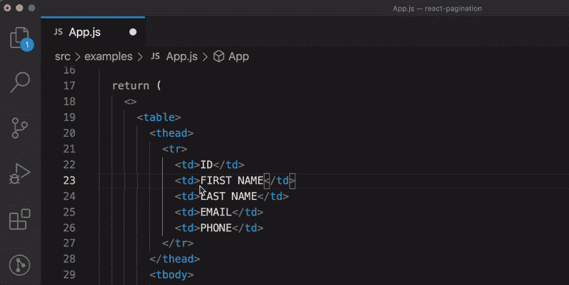

# 3.将光标添加到下一个匹配的选择

MAC:CMD+D
Windows/Linux:CTRL+D

和上面的命令一样，这也用于添加光标，但是通过它，你可以将光标添加到下一个匹配的选择中。当您不想同时选择所有事件时，这尤其有用

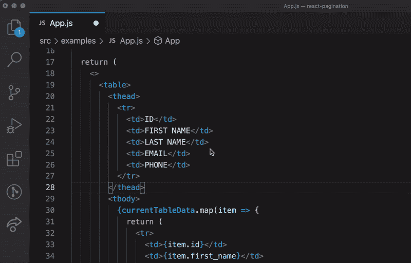

# 4.撤消上一次光标操作

MAC:CMD+U
Windows/Linux:CTRL+U

如果您需要在选择了过多光标的情况下撤销光标选择，或者将光标重置到先前的位置，您可以使用此命令撤销上一次光标操作

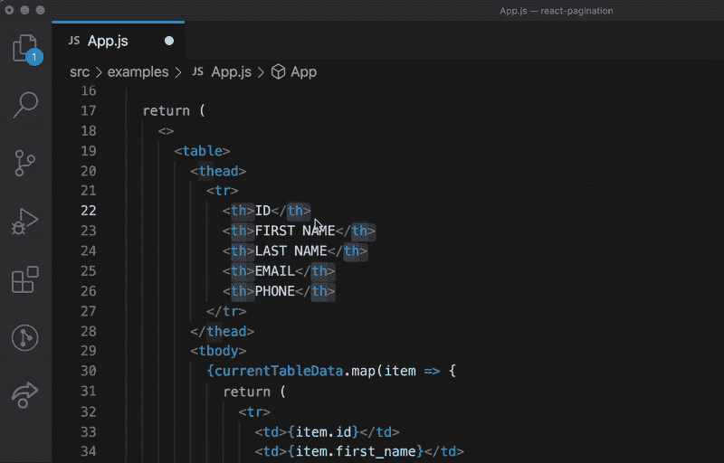

# 5.选择当前行

MAC:CMD+L
Windows/Linux:CTRL+L

通常我们使用鼠标拖动来选择文本，但是如果我们想要选择整行，我们可以使用这个命令

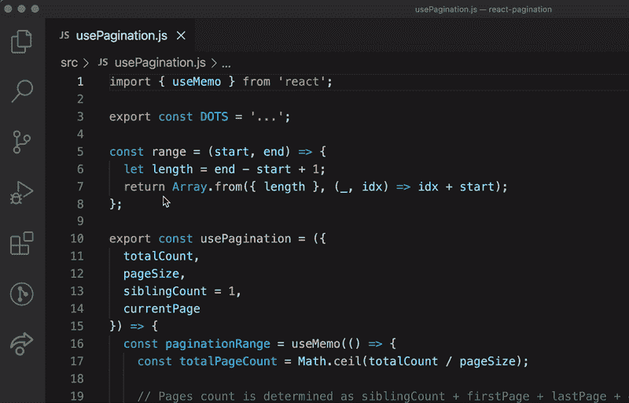

# 6.转到特定行

MAC:CTRL+G
Windows/Linux:CTRL+G

通过使用这个简单的命令并输入行号，我们可以导航到文档的特定行。

这在错误堆栈跟踪为我们提供文件的行号并且我们的文件很大的情况下尤其有用。

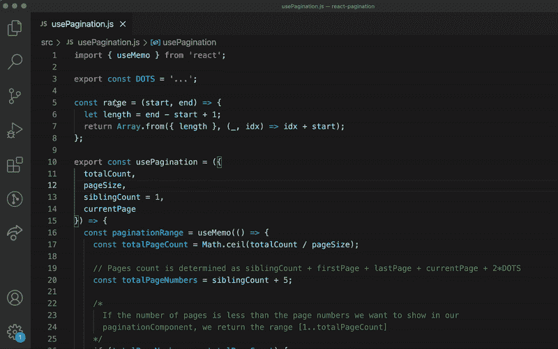

# 7.关闭所有打开的编辑器选项卡

MAC:CMD+K+W
Windows/Linux:CTRL+K+W

当我们想要清除所有选项卡时，此命令非常有用。

通常在调试或开发时，我会打开许多选项卡，当我想改变上下文或重新开始时，这个命令会非常方便

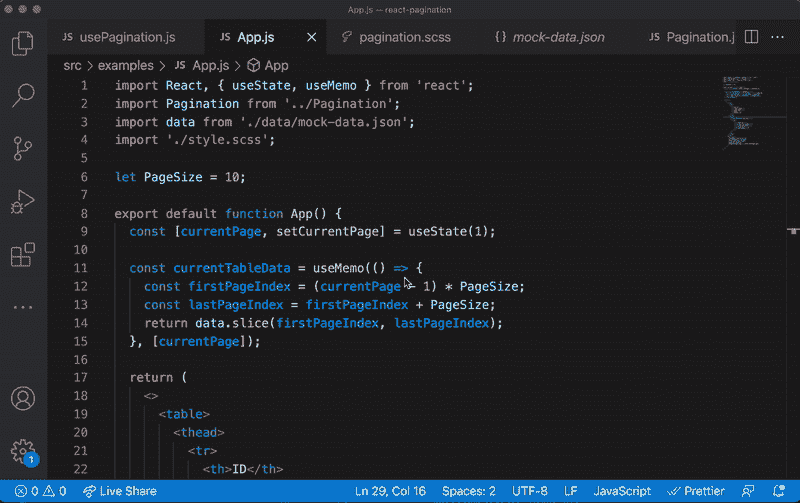

# 8.切换块注释

MAC:SHIFT+OPTION+A
Windows:SHIFT+ALT+A，Linux: CTRL+SHIFT+A

此快捷方式还允许我们添加新的块注释或切换现有的块注释。

我们用`/* */`括起一段 Javascript 代码来添加块注释。但是，通过这个快捷方式，我们可以添加或删除所选代码块的注释，或者添加新的注释。

可以使用`CMD + / (Windows/Linux: CTRL + /)`切换行注释

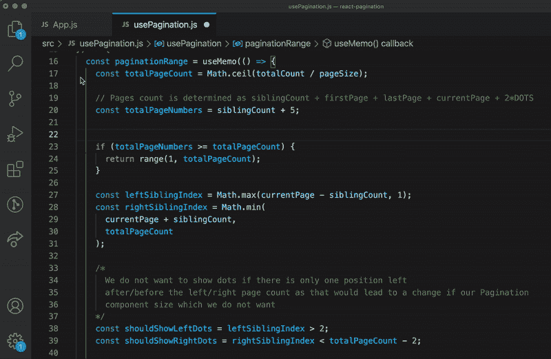

# 9.折叠代码块

MAC:CMD+OPTION+[
Windows/Linux:CTRL+SHIFT+[

当我们想要关注代码的特定区域，从而忽略一些代码块时，这个命令特别有用。这将折叠离光标最近的块。

你可以用`CMD + OPTION + ] (or Windows/Linux: CTRL + SHIFT + ] )`展开代码块

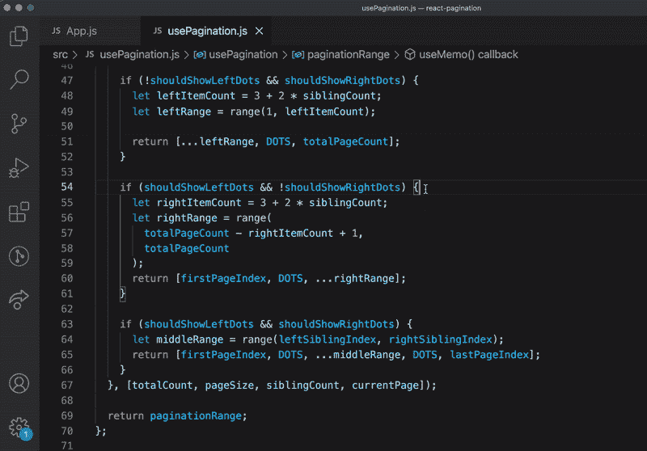

# 10.向上或向下移动线条

Mac: OPTION +向上/向下
Windows/Linux: ALT +向上/向下

当你想上下移动一段代码，例如一个变量声明，你可以剪切并粘贴到适当的位置，但是如果重新调整是为了几行，你可以使用这个命令上下移动当前行/选择

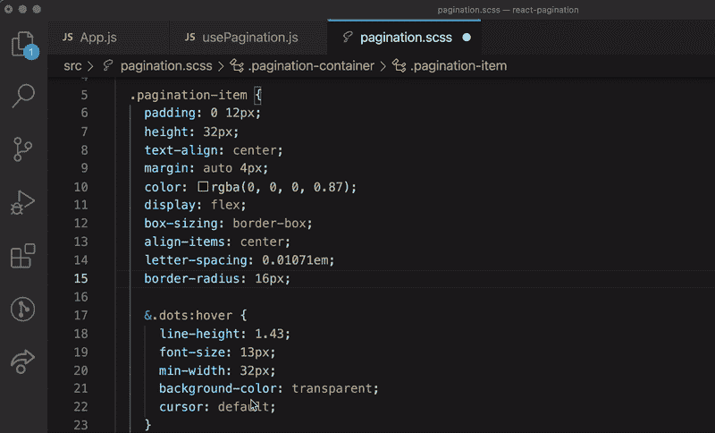

# 11.开放式综合终端

MAC:CTRL+`
Windows/Linux:CTRL+`

VS 代码最令人惊奇的特性之一是它支持一个集成的终端，你可以像使用普通终端一样使用它来运行代码或执行其他操作。这个命令帮助您在需要时打开终端

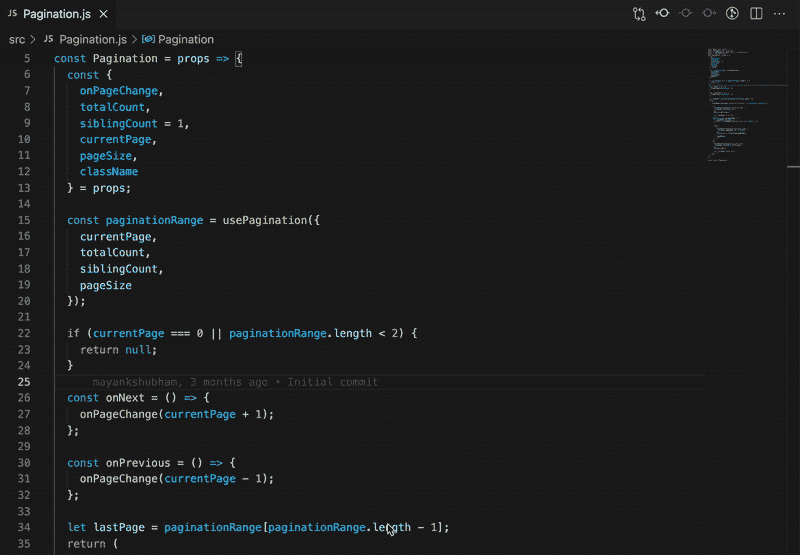

# 12.拆分编辑器视图

MAC:CMD+\
Windows/Linux:CTRL+\

您可以拆分编辑器视图以同时打开多个文件。

当您想在一个文件中编码时引用另一个文件中的内容时，这尤其有用。

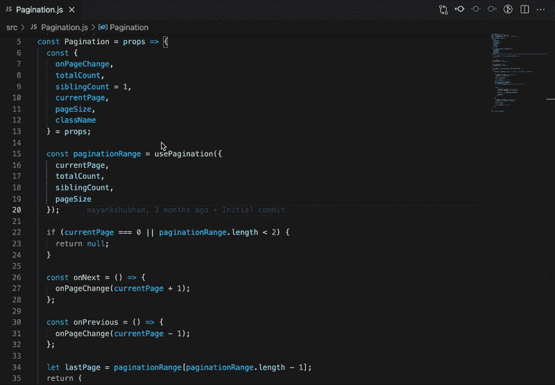

# 13.格式化文档

MAC:SHIFT+OPTION+F
Windows:SHIFT+ALT+F，Linux: CTRL+SHIFT+I

通常我们会启用扩展或配置设置来在保存时格式化文档，但有时我们希望控制何时格式化文档。这就是这个命令的用武之地。

它允许我们根据配置的设置格式化当前文档。

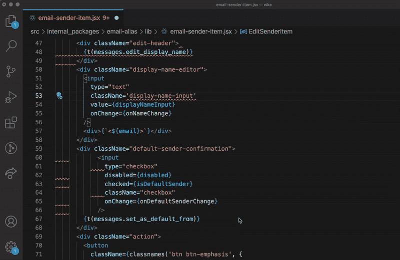

# 14.向上或向下复制选择

Mac: OPTION + SHIFT +上/下
Windows/Linux:SHIFT+ALT+上/下

使用此命令，您可以在当前代码的上方或下方复制选定的代码。

我喜欢在一些功能几乎相同的时候使用它，除了一些我在复制之前的实现后做的小改动

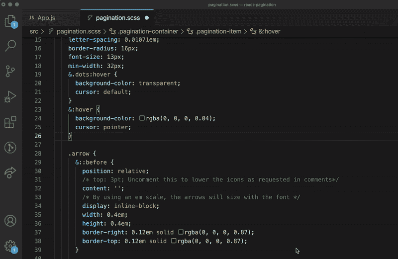

# 15.切换边栏

MAC:CMD+B
Windows/Linux:CTRL+B

您可以使用此命令切换侧边栏，以便在需要时为您的文件视图腾出更多空间。

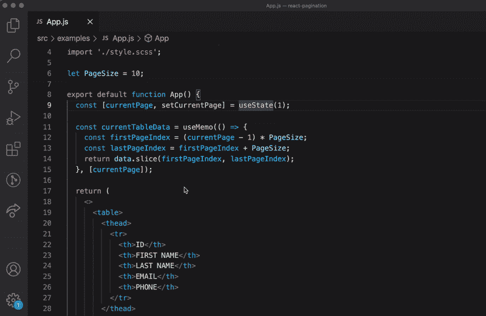

# 蛋糕上的樱桃

`**code .**`从终端打开 VS 代码

虽然这不是一个键盘快捷键，但是当您使用终端并想要在 VS 代码中打开一个目录时，它非常有用:

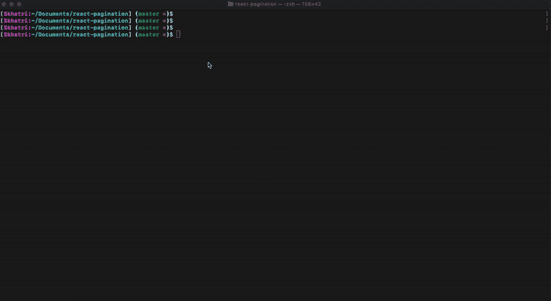

> **P.S.** 如果还没有配置，你可以在 VS 代码中用`CMD+SHIFT+P`打开命令面板，输入`shell`，然后从选项中选择`Shell Command: Install ‘code’ command in PATH`来配置。

# 摘要

在本文中，我介绍了一些常见的、不常见的和有用的快捷方式。

还有其他快捷键也很有用，比如`CMD+SHIFT+F`用于搜索，`CMD+SHIFT+P`用于显示命令面板，`CMD+/`用于切换行注释，等等。

感谢您的阅读。

如果你觉得这篇文章有帮助，一定要喜欢并与你的同事和朋友分享。如果有什么建议，欢迎在评论里补充。