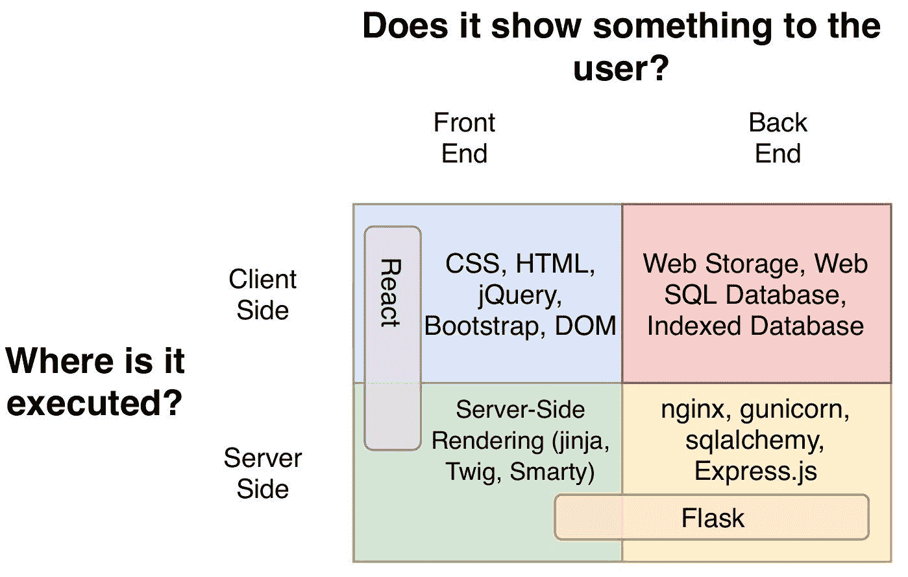
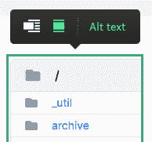
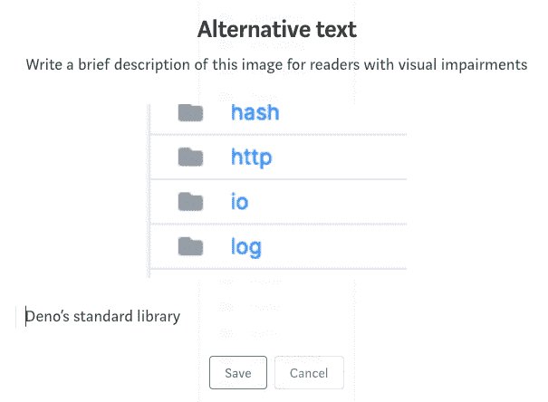
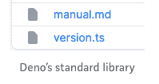

# 如何提高你的技术文章的 15 节写作课

> 原文：<https://betterprogramming.pub/15-writing-lessons-on-how-to-improve-your-technical-articles-60609c40bea4>

## 如何写出更好的编程文章的技巧


达米尔·斯班尼克在 [Unsplash](https://unsplash.com?utm_source=medium&utm_medium=referral) 上拍摄的照片

```
**Table of Contents**[**Introduction**](#b63c)1\. [Terms](#3278)
2\. [Use acronyms properly](#5565)
3\. [Pay attention to disambiguate pronouns](#de7c)
4\. [Prefer active voice to passive voice](#7787)
5\. [Use strong verbs](#69cf)
6\. [Avoid filler words](#d649)
7\. [Minimize adjectives and adverbs](#676a)
8\. [Focus on a single idea](#c558)
9\. [Reduce subordinate clauses](#4f4e)
10\. [that and which](#13f6)11\. [Parallel and numbered lists](#ec24)
12\. [Create helpful tables](#9516)
13\. [Image alt text and caption](#292b)
14\. [Table of contents (TOC)](#a4e9)
15\. [Paragraphs](#b7ef)[**Conclusion**](#cac1)
```

# 介绍

程序员和数据科学家写文章，需要很多技巧。不仅是编码技巧、语法和词汇，还有技术写作技巧。

你可以在媒体上找到很多写作建议[。我喜欢读它来提高我的写作。尽管这些是针对一般写作的，但它们对编程文章也非常有用。](https://writingcooperative.com/protips/home)

但是对于程序员和数据科学作家来说，这就足够了吗？

我正在从谷歌的技术写作课程中学习技术写作。这是一个旨在改进技术文档的课程和学习资源的集合。尽管这些课程是为专业软件工程师和学生开设的，但编程和数据科学作者可以吸收许多有用的观点。

以下是我从这门课和其他专业作家那里学到的 15 条经验。

# 1.条款

我经常假设我的读者知道我所知道的。我没有解释就引入了新的术语。我写过没有链接的不熟悉的缩写，使用过没有足够研究的术语。

有些术语令人困惑。你曾经用“服务器端”来表示后端，或者用“前端”来表示客户端吗？



图片[信用](https://softwareengineering.stackexchange.com/questions/188521/is-the-term-front-end-synonymous-with-client-side-if-so-is-this-always-the)

当你在写作中使用新的或不熟悉的术语时，如果它们很短，你可以在文章中定义它们，或者添加这些术语的链接。

为了避免这个陷阱，你也可以在引言中指出你写作的水平。

例如:

> 本文假设您已经熟悉 JupyterLab 的基本操作。
> 
> 本文假设您已经用另一种编程语言编写了代码。

# 2.正确使用缩写

当你使用一个不熟悉的首字母缩写词时，拼出完整的术语，然后将首字母缩写词放在括号中并加粗。如果你经常使用这个词，使用缩写。

例如:

> 一个**应用编程接口(API)** 是一个计算接口，它定义了当你使用 API…
> API…

# 3.注意消除代词的歧义

消歧代词有 **it，them，them，thes，this** 和 **that** 。

你应该在介绍完名词后使用它们，并把它们放在尽可能靠近所指名词的地方。

例如，如果你正在使用 **it** :

> Python 是一种像 JavaScript 和 Closure 一样的动态类型语言。**它**支持多个…

“ **It** 是指 Python 还是 JavaScript 或者闭包？

以上应该是:

> Python 是一种像 JavaScript 和 Closure 一样的动态类型语言。Python 支持多种…

# 4.喜欢主动语态而不是被动语态

Shaunta Grimes 写了关于被动语态和主动语态的文章。

被动语态的形式是 be-动词+过去分词动词。

比如:**是生成**，**是形成**。

我经常发现自己使用被动语态的句子。我得好好想想怎么把它们改成主动语态的句子。

例如:

> 编译器没有对标志**进行解析**。
> 
> 编译器**没有解析**这些标志。

因为人类的大脑直接接收主动声音的动作，所以它比被动声音更容易处理信息。

最好的办法是大部分时间使用主动语态，少用被动语态。

# 5.使用强动词

Shaunta Grimes 也写了关于强动词 T21 的文章。

强动词是精确而具体的词，弱动词是通用词，如**是、是、曾是、曾是、发生、发生**等。

不要使用一般的动词，而是在相关的编程手册或指南中找到一个特定的单词。解释特定动词背后的概念。

例如，用**发生**为**触发**，**生成**为**发生**，**确保**为**为**。

> 点击按钮时**会出现错误**。
> 
> 点击按钮**触发**错误。

其他强动词有:

指定、声明、生成、发布、省略、调用、执行、调试、实例化、调用、迭代

类属词和类属动词配对的一个例子是“**有/有”。**

你可以替换句子中的主语和动词。

例如:

> **几乎没有什么比创建一个好的用户界面的正确工具更重要的了。**
> 
> 创建良好用户界面的正确工具很重要。

# 6.避免填充词

当我在别人面前说话的时候，我会用很多“啊啊啊”、“嗯啊啊”。这些是我说的填充词。

写作中的填充词有 **so，that，very，just，really，highly，**等。

当我写作时，我的初稿充满了填充词。我编辑的时候必须找到那些词。

瑞切尔·霍普写了关于[的填充词](https://writingcooperative.com/12-filler-words-to-eliminate-from-your-writing-a459a5f2a589)。

> “如果简明清晰地交流是你的目标，去除填充词是剔除你不需要的内容的简单方法。”雷切尔·霍普

一些关于如何避免在文章中使用填充词的例子:

*   在这个时间点使用**现在**为
*   **使用**查找**的**确定**的位置**
*   **使用**可以将**换成**可以将****
*   **将**至**用于**以便****
*   **最终消除**中的**和**基本上消除****
*   **关于/参考使用**关于/关于**用于**

# ****7.尽量减少形容词和副词****

****形容词是修饰名词的单词或短语，例如红色的线。副词是修饰动词的单词短语，例如，慢行**。******

******除非你的写作风格友好或有创意，否则你的读者更喜欢小形容词和副词。他们能使你的陈述含糊不清。******

> ******编译器超级慢。
> 编译器慢了两倍。******

******你需要尽量减少形容词和副词。******

# ******8.专注于一个想法******

******程序员推崇最短的代码。它易于阅读和维护，不容易出错。******

******同样的规则也适用于编程文章。短句的文章更容易理解。******

******当你使用短句时，它会自动聚焦在一个想法上。******

******如果我写了一个长句子，但没有意义(不幸的是，这种情况经常发生)，我会把它分成几个小句子。******

# ******9.减少从句******

******一个从句包含一个主语和一个动词。从句没有主句重要。******

******下列单词引导从句:******

*   ******哪个******
*   ******那******
*   ******因为******
*   ******谁的******
*   ******直到******
*   ******除非******
*   ******因为******

******较少的从句使句子清晰易懂。******

# ******10.那个和哪个******

> ******在美国，把 which 留给不重要的从句，把 that 用在句子离不开的重要从句。在'**前加逗号，其中'**；不要在“**之前放置逗号，否则会导致“**”。—技术写作******

******当我使用“ **which** ”时，[语法上](https://www.grammarly.com/)建议使用“ **that** ”。但是我不确定这是否区分了我的从句是不重要的还是重要的。如果我能去掉从句，那么我用带逗号的 which。******

****例如:****

> ****但是如果我们使用不同的结构，**每个**都有自己的类型…
> 下面的结构可以保存与前面的枚举变量相同的数据**。—[Rust 编程语言](https://doc.rust-lang.org/book/#the-rust-programming-language)******

# ****11.平行和编号列表****

> ****“技术读者通常喜欢列表。所以，写作的时候，寻求将散文转化为列表的机会。”—技术写作****

****我经常使用 markdown 来创建表格。我使用 [Canva](https://www.canva.com/) 为[快速参考](https://towardsdatascience.com/how-to-create-an-attractive-bubble-map-5cf452c244e9#fb63)创建一个列表。****

****使用列表时，请确保每个列表使用相同的格式。所有项目都应该有相同的样式、结构、大小写和标点符号:****

> ****- `Quit`根本没有与之相关联的数据。
> - `Move`内部包含一个匿名结构。
> - `Write`包含单个`String`。
> - `ChangeColor`包括三个`i32`值。****
> 
> ****来自[Rust 编程语言](https://doc.rust-lang.org/book/ch06-01-defining-an-enum.html)****

****当您使用编号列表时，请以命令词(命令动词)开始每个项目。****

****您创建有序列表是因为您希望读者遵循某些步骤。****

****配置、启动、下载、打开是一些命令动词。****

****例如:****

> ****1.执行任何代码。
> 2。对请求和响应对象进行更改。
> 3。结束请求-响应循环。
> 4。调用堆栈中的下一个中间件。****

****当列表项是一个句子时，使用大写和标点符号。****

****例如:****

> ****一些高级风格的编程需要更新。
> -**算术运算返回子类的一个实例。******

******否则使用小写字母，不使用句点。******

******例如:******

> ******-赋值表达式
> -仅位置参数******

# ******12.创建有用的表格******

******如果有一个被句子包围的表格，我一般会先去表格，以把握整体的看法。然后我看了细节。******

******当我们使用列表或表格时，向他们介绍它们所代表的内容是一个很好的做法。******

******例如:******

> ******下表(或列表)包含一些关键参数…
> 下表(或列表)强化了…******

# ******13.图像替代文本和标题******

******向文章中添加列表或表格图像时，每个图像都有一个标题和一个 alt 属性字段。填写这些字段是个好主意。******

******如果用户由于某种原因无法查看图像，alt 属性为图像提供替代信息。标题显示在图像的底部。******

************

******中等替代文本******

******当您单击 alt 文本链接时，会弹出以下内容:******

************

******中等字幕示例******

************

******中等字幕示例******

# ******14.目录******

******[](https://medium.com/analytics-vidhya/how-to-create-a-clickable-table-of-contents-to-increase-traffic-4e40ea083953) [## 如何创建一个可点击的目录来增加流量

### 通过吸引人的 TOC 改善用户体验

medium.com](https://medium.com/analytics-vidhya/how-to-create-a-clickable-table-of-contents-to-increase-traffic-4e40ea083953) 

目标为本课程有很多目的。它为用户提供了文档内容的概述。

如果你提供一个可点击的目录，它允许读者直接进入你的内容的特定部分。

目录将为读者提供快速访问你的内容。我给大多数文章添加了一个可点击的目录。****** 

# ******15.段落******

******我最纠结的是标题和开头段落。你可能听说过，你只有不到三秒的时间来抓住读者的注意力。******

******你需要创造一个强有力的标题和良好的开场白。******

> ******"标题吸引注意力，第一句话就能保持注意力."—马克·克罗斯林******

******下面的列表是一些你可以使用的技术。******

*   ******问个问题******
*   ******引用统计数字或令人惊讶的事实******
*   ******分享一段引语或趣闻******
*   ******试着抓住一种情绪******

******你需要把每一段都集中在一个主题上。保持在三到五句话以内。******

# ******结论******

******对于编程文章来说，清晰就是一切。遵循这篇文章中的提示，你就能写出好的内容。******

********通过** [**成为会员**](https://blog.codewithshin.com/membership) **获得媒体上所有故事的权限。********

********

****[https://blog.codewithshin.com/subscribe](https://blog.codewithshin.com/subscribe)****