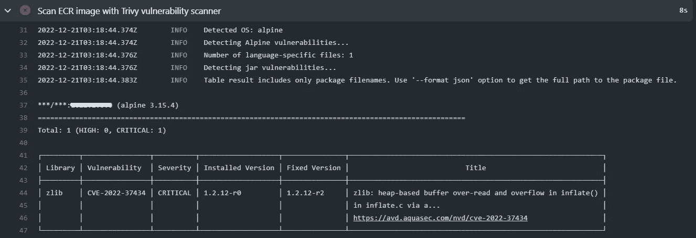
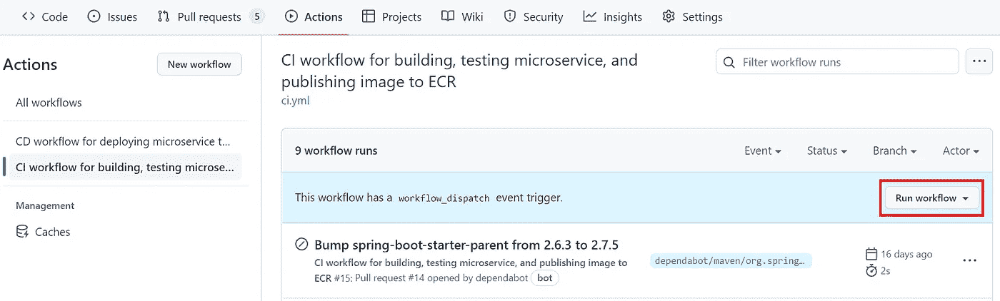
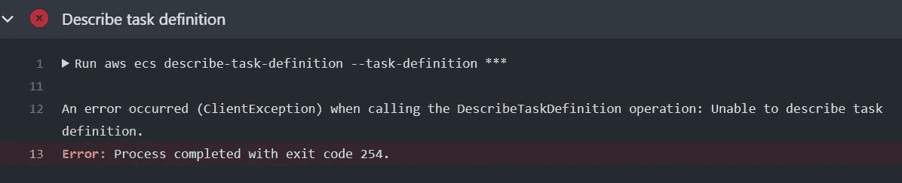
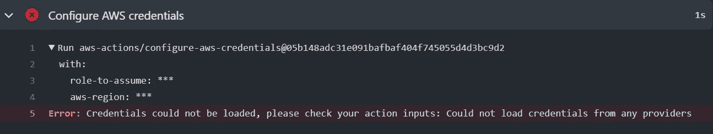
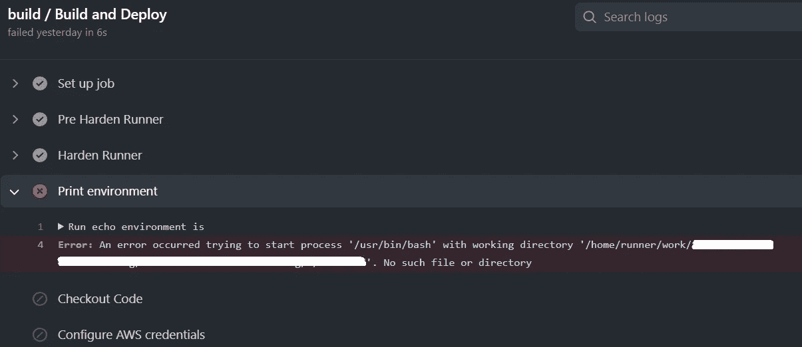
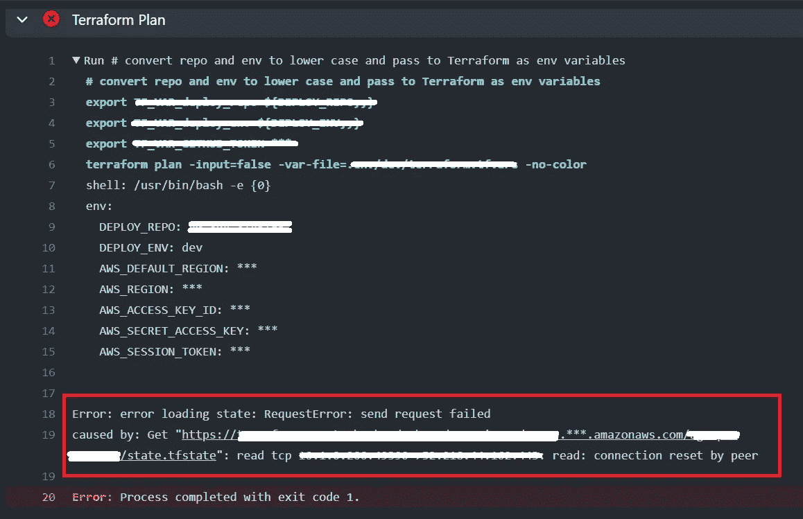
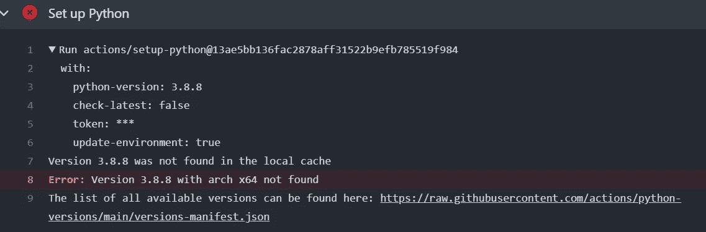
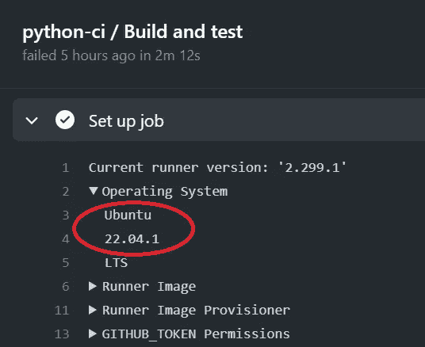

# GitHub 操作工作流程的故障排除提示

> 原文：<https://betterprogramming.pub/17-troubleshooting-tips-for-github-actions-workflows-43394e4f1a8a>

## GitHub Actions 工作流错误和解决方案的汇编，来自我自己的工作经验


作者照片

在使用 GitHub Actions 工作流将微服务构建和部署到 AWS 中时，我遇到了一些错误/异常，并深入寻找它们的解决方案。我列出了一系列这样的错误场景及其解决方案，希望对那些使用 GitHub Actions 的人有所帮助。

以下故障排除详情中引用的详细 CI/CD 工作流记录在我的故事“[深入了解 GitHub Actions 的可重用工作流](/how-to-use-github-actions-reusable-workflow-8604e8cbf258?sk=016e931ac8c4058eea74ce7838039bf6)”中。

# **错误#1: CI 工作流在“使用 Trivy 漏洞扫描器扫描 ECR 映像”步骤失败**

如果您使用 [Trivy](https://github.com/aquasecurity/trivy) 扫描您的 docker 映像，并且如果您的 CI 工作流在 ECR 映像扫描步骤失败，并出现以下错误(请参见下面的屏幕截图)，这是由 docker 基本映像中的漏洞问题引起的。在这种情况下，基本映像`amazoncorretto:17.0.2-alpine3.15`用于 Spring Boot 微服务(在撰写本文时，还没有发布带有修复的新映像)，您将需要提供解决方法来更新`Dockerfile`中基本映像中的包。

具体来说，就是在你的`Dockerfile`里的`FROM`线下面加线`RUN apk update && apk upgrade -U -a`。通过这一行修复，您配置项应该能够通过 ECR 映像扫描步骤。顺便说一下，我强烈推荐 Trivy 进行图像扫描，它不仅扫描你的应用程序的依赖项来检查漏洞，它还扫描你的基本图像。将 Trivy scan 添加到您的 CI 工作流中，如果您还没有这样做的话。



# **错误#2:** 发布工作流失败，出现“500 内部服务器错误”

在测试 maven 发布工作流程的过程中，我遇到了“500 内部服务器错误”,并指出 GitHub 包的行为不符合预期。我就此错误联系了 GitHub 技术支持，以下是他们的回应:

*这似乎是一个暂时性错误，可能发生在高负载期间*。他们推荐了以下解决方法，以允许在出现此类错误时重试。如果在 3 次重试后，您仍然遇到这个错误，那么清理发布过程的最好方法是手动将主程序的 pom 版本升级到下一个开发快照版本，并重新发布新版本。

```
env:
  MAVEN_OPTS: -Dhttp.keepAlive=false -Dmaven.wagon.http.pool=false -Dmaven.wagon.http.retryHandler.class=standard -Dmaven.wagon.http.retryHandler.count=3
```

# **错误#3:“无法从您的身份提供商处检索验证密钥，请参考 AssumeRoleWithWebIdentity 文档了解相关要求”**

如果在步骤“配置 AWS 凭据”中遇到上述错误，则表明 OIDC 配置错误。按照下面的四个步骤在 AWS 中正确配置 OIDC。

## **步骤 1:添加身份提供者(如果尚不存在)**

1.  打开 IAM 控制台。
2.  在导航窗格中，选择“身份提供者”，然后选择“添加提供者”。
3.  对于“配置提供商”，选择“OpenID 连接”。
4.  对于“提供商 URL ”,键入`[https://token.actions.githubusercontent.com](https://token.actions.githubusercontent.com.)`
5.  对于“观众”，键入`sts.amazonaws.com`，因为我们正在使用[官方动作](https://github.com/aws-actions/configure-aws-credentials)。
6.  选择“添加提供商”。

## **步骤 2:添加角色和信任策略**

根据新应用程序的需要添加新角色并分配策略。根据您计划部署的特定应用程序，此步骤中的策略可能会有所不同。如果有您想要使用的现有角色，请通过验证以下步骤确保其配置正确。

添加角色后，确保其信任策略定义如下，`Federated`行应该为我们刚刚在上面创建的身份提供者指定`ARN`(下面的示例片段仅供参考，请确保根据您在第 7 行的帐户更改身份提供者的`ARN`)。`aud`部分(第 12 行)应该总是有值`sts.amazonaws.com`，如上面的身份提供者部分所定义。

## **步骤 3:添加 ECR 访问的内联策略**

对于微服务来说，构建 docker 映像并将其推送到 ECR 是常见的步骤。我们用来登录 ECR 的 GitHub 操作`aws-actions/amazon-ecr-login@v1`需要 ECR 私有回购的 push/pull 权限。不幸的是，ECR 的内置策略不能用于从/向私有 repo 推送/提取图像，所以我必须为 ECR 访问创建一个内嵌策略。除了我们已经为该角色选择的现有策略之外，将此内联策略添加到我们的角色:

## **第四步:GitHub Actions 工作流配置**

创建一个新的 GitHub 环境秘密，密钥为`ROLE_TO_ASSUME`，值为该角色的`ARN`。

在定义作业之前，我们需要在 GitHub Actions 工作流中指定权限，特别需要在 caller 工作流中添加 `id-token: write`权限，它允许从 GitHub 的 OIDC 提供者请求 JWT。如果`id-token`的`permissions`设置被设置为`read`或`none`，我们将无法请求 OIDC JWT 令牌。

# **错误# 4:“NoCredentialProviders:链中没有有效的提供者”**

如果您在工作流执行中碰巧遇到这个错误，它通常表明 GitHub 操作无法找到定义的秘密。检查您是否在工作流程中指定了`environment`。如果您正在处理一个与 AWS 资源交互的全新工作流，请确保在工作流作业中定义的步骤上方添加这一行(见下文)。

```
environment: ${{ inputs.env || 'dev' }}
```

# **错误#5:即使工作流中有 workflow_dispatch 触发器，也缺少手动触发器**

如果您在工作流中定义了`workflow_dispatch`触发器，但是由于某种原因，您在存储库中的 Actions 选项卡下没有看到工作流的“Run workflow”按钮，请检查您所在的分支是否是存储库的默认分支。您可以将您的功能分支合并到您的默认分支中，修改触发器以指向您的功能分支，一旦代码被合并，您将看到最新的代码和工作流文件的更改被反映出来。您现在应该看到“操作”选项卡下的“运行工作流”按钮，请参见下面的屏幕截图。



# **错误#6: GitHub PR 页面显示“此分支已成功部署”,即使您运行 CI 工作流**

如果您的工作流中有 PR 触发器，当提出新的 PR 时，它会自动触发 CI 工作流。您的 AWS 环境中没有实际的部署。你想知道为什么在 GitHub 的 PR 页面上显示这一行“此分支已成功部署”(见下图截图)。我联系了 GitHub 技术支持，以下是他们的回复:

*“这是因为工作流有一个作业引用了* ***dev*** *环境。当您在工作流作业中引用一个环境时，GitHub 会隐式地创建一个到该环境的部署。本例中的部署是指 GitHub 中的* [*部署概念*](https://eur02.safelinks.protection.outlook.com/?url=https%3A%2F%2Fdocs.github.com%2Fen%2Frest%2Fdeployments%2Fdeployments&data=05%7C01%7C%7C8bdc91d2a5414b1aa2b108da6663bb3e%7C9c230f7cb8904c309f79d32c2ba39bd4%7C0%7C0%7C637934875790366862%7CUnknown%7CTWFpbGZsb3d8eyJWIjoiMC4wLjAwMDAiLCJQIjoiV2luMzIiLCJBTiI6Ik1haWwiLCJXVCI6Mn0%3D%7C3000%7C%7C%7C&sdata=%2FFpsTEr7UwjU%2BRcwO955ngcjr8Oi1d7hX6zfYxYL0aI%3D&reserved=0) *而非外部服务提供者。*

*目前，如果工作流中的作业引用环境，则无法从拉式请求时间线中更改或删除该消息，抱歉。*

我同意这条消息看起来确实令人困惑，我们也从其他用户那里收到了类似的反馈。我已将此票添加到讨论中。我不能给你一个时间表，当它将被修改，但这将记录在我们的 [*变更日志*](https://eur02.safelinks.protection.outlook.com/?url=https%3A%2F%2Fgithub.blog%2Fchangelog%2F&data=05%7C01%7C%7C8bdc91d2a5414b1aa2b108da6663bb3e%7C9c230f7cb8904c309f79d32c2ba39bd4%7C0%7C0%7C637934875790366862%7CUnknown%7CTWFpbGZsb3d8eyJWIjoiMC4wLjAwMDAiLCJQIjoiV2luMzIiLCJBTiI6Ik1haWwiLCJXVCI6Mn0%3D%7C3000%7C%7C%7C&sdata=CglPcn5Mkw%2BKqJZCwomyGBgEJrZN9MT5P%2BC0wLH5foo%3D&reserved=0) *。”*

在我们的示例 CI 工作流中，我们需要引用在`dev` GitHub 环境中定义的秘密来执行诸如配置 AWS 凭证和将图像推送到 ECR 之类的操作。CI 工作流引用了`dev`环境，这正是 GitHub 显示该消息的原因。我们这边什么也做不了。现在，只需注意这条消息，并等待 GitHub 提出适当的解决方案。


# **错误#7:“工作流不存在或在此标签中没有 workflow_dispatch 触发器”**

当您试图通过选择特定的标记来手动触发将已发布的标记部署到任何环境时，就会发生此错误。这个错误的原因是，自从 maven release 创建了您的标记之后，您的工作流文件一定发生了变化。当您在采用 GitHub 操作的开始阶段调整/细化您的工作流时，就会发生这种情况。因此，如果您的工作流自上一次 maven 发布以来发生了变化，最好的解决方法就是发布一个新版本并部署新标签。那有效！

# **错误#8:工作流程在“构建、标记和将图像推送到 AWS ECR”步骤失败**

如果您在 GitHub 操作日志中的“构建、标记和推送图像到 AWS ECR”步骤下看到一个错误，抱怨多次尝试推送图像到 ECR，最终返回退出代码 1。这很可能是因为您的应用程序没有在 ECR 注册表中配置 ECR 存储库，或者您的应用程序 IAM 角色没有在 ECR 存储库中配置适当的权限。仔细检查两个！

# **错误#9:“要求输入但未提供:AWS-区域”**

此错误发生在“配置 AWS 凭据”步骤中。即使你已经在 GitHub secrets 中正确添加了你的 IAM 角色和 AWS_REGION，你还是会遇到这个错误，为什么？几个原因:

1).确保在 GitHub 操作工作流程中正确设置了您的 OIDC 权限。在调用包含“配置 AWS 凭据”或任何其他 AWS 操作的可重用工作流之前，请确保检查您是否正确定义了以下权限。

```
permissions:
  id-token: write # need this for OIDC  
  contents: read
```

2).确保在操作环境变量之前定义了“配置 AWS 凭据”步骤。这似乎是 AWS 操作“配置 AWS 凭据”中的一个潜在错误，每当 github 环境变量被定义并传递到$GITHUB_ENV 中时，“配置 AWS 凭据”步骤就会以某种方式提取该环境变量并将其传递到其操作，而不是从 secrets 中获取 IAM 角色和 AWS 区域值。因此，建议始终将“配置 AWS 凭证”步骤放在处理`$GITHUB_ENV`的任何步骤之前。

# **错误#10:** 部署工件时“没有这样的文件或目录”

对于许多将映像部署到 ECS 的微服务，可重用的工作流已经确定了部署的细节，但是对于部署 docker 映像之外的工件的微服务，例如将 jar 文件部署到 Lambda 函数，当工件的路径没有正确定义时，可能会出现错误“没有这样的文件或目录”,特别是在 monorepo 场景中，或者在现有遗留存储库中的嵌套项目结构中。每当需要工件路径时，一定要指定工件的完整文件路径。

# **错误#11:发布工作流失败，工件已经存在错误**

快照版本可以发布多次，但发布版本只能发布一次。如果开发人员试图在版本已经发布之后发布相同的版本(唯一可能的原因是开发人员忘记将最新的代码从`release`分支合并到`release`之后的`main`中)，发布工作流将抛出工件“已经存在”的错误。避免这种错误的唯一方法是，一旦一个版本被成功发布到 GitHub 包，确保发布分支被合并回`main`，这将把`main`中的版本提升到下一个快照。

# 错误#12: **调用 DescribeTaskDefinition 操作时出错(ClientException):无法描述任务定义**

如果您的工作流程在`describe-task-definition`步骤失败，出现下面截图中的错误，您需要检查两件事:

1.  确保`ECS_TASK_DEFINITION`的秘密配置中没有打字错误。
2.  如果您在与 repo's secret 中定义的默认`AWS_REGION`位于不同区域的环境/帐户中运行此工作流，您需要在环境 secret 中定义`AWS_REGION`和`AWS_DEFAULT_REGION`，以在存储库或组织级别覆盖这些 secret 的值。



# 错误#13: **错误“无法加载凭证，请检查您的操作输入:无法从任何提供者加载凭证”**

如果您的工作流在`configure-aws-credentials`步骤失败，并出现上述错误，请参见下面的屏幕截图，根本原因是 OIDC 的权限问题。



您需要为 OIDC `id-token: write`添加权限。如果您的工作流正在调用可重用工作流，权限是在调用方工作流中设置的，而不是在可重用工作流中设置的，因此在调用可重用工作流之前，请确保调用方工作流已正确设置了以下权限(第 5–6 行),示例如下:

# 错误 14: " **npm ERR！代码 E400**

当您尝试将一个 npm 包发布到 GitHub 包时，如果您遇到此错误，详细信息如下:

`“253npm ERR! 400 Bad Request — PUT [https://npm.pkg.github.com/@<](https://npm.pkg.github.com/@arisglobal%2fagcp-ui)repo-name>— failed to stream package from json: unhandled input: Cannot publish over existing version”`

它表示您不能将相同版本的包发布到 GitHub 包，因为相同的版本已经存在。因此，请尝试升级版本并重试。

# 错误 15: **试图启动工作目录为**的进程“/usr/bin/bash”时出错

这个错误看起来很棘手，尤其是当所有工作目录和路径都为工作流正确定义时。修复其实非常简单。您需要始终将签出代码操作(`actions/checkout`)放在硬化运行程序步骤(`step-security/harden-runner`)之后。一旦顺序被切换，这个错误就消失了！



# 错误 16: **“对等方重置连接”**

如果您在`terraform plan`或`terraform apply`步骤期间遇到间歇性错误“**连接被对等方重置**”，请注意这是哈希公司`terraform-provider-aws`的已知问题，根本原因似乎是 AWS API 速率限制:[terra form 应用问题#23614 哈希公司/terra form-provider-AWS(github.com)](https://github.com/hashicorp/terraform-provider-aws/issues/23614)时，间歇性连接被对等方重置。

此处提交了在这种错误情况下重试的增强功能，[添加了当请求的连接被对等问题重置时的重试处理# 10715 hashi corp/terra form-provider-AWS(github.com)](https://github.com/hashicorp/terraform-provider-aws/issues/10715)。

在撰写本文时，该增强仍处于开放状态。我们希望 HashiCorp 团队能够尽快实现这一改进。同时，如果您在工作流程运行期间遇到这样的错误，请重试您的工作流程，错误通常会消失。



# 错误 17: **在设置步骤**中未找到版本###

这个错误是在我们的一个 Python 应用程序的“设置 Python”步骤中发现的。见下面截图。这看起来很奇怪，因为相同工作流的前几次运行在设置 Python 时都没有问题。这个问题的根本原因是 Ubuntu/Python 版本的兼容性。

如果你的 GitHub 托管的工作流运行器运行在`ubuntu-latest`版本上，这可能意味着不同的 Ubuntu 版本号，取决于最新的 Ubuntu 版本。例如，以下工作流的 Ubuntu 版本为 22.04，它没有为该操作提供 python 版本 3.8.8，如错误消息下方的屏幕截图中的链接所示，而工作流在 Ubuntu 版本 20.04 之前运行，该版本为该特定操作提供 python 版本 3.8.8。

版本不兼容的经典例子。修复方法是在工作流文件中将兼容的 Ubuntu 版本从`runs-on: ubuntu-latest`改为`runs-on: ubuntu-20.04`。升级 Python 版本的应用程序需要开发团队付出更多的努力和测试，这仍然是团队长期考虑的一个选项。最佳实践是在一段时间后重新访问这个版本清单链接，看看最新的 Ubuntu 版本是否支持您的特定 Python 版本，并相应地升级 Ubuntu 版本。或者更好的是，当资源和时间准备好时，升级你的应用程序的 Python 版本。



要了解您的工作流运行器运行在哪个版本的 Ubuntu 上，您可以在工作流运行结果页面中展开“设置作业”步骤，展开“操作系统”以捕获实际的 Ubuntu 版本。



我们探讨了我在使用 GitHub Actions 工作流程时遇到的一些错误。我希望这个列表有助于那些使用 GitHub Actions 工作流的人节省一些故障排除时间。

编码快乐！