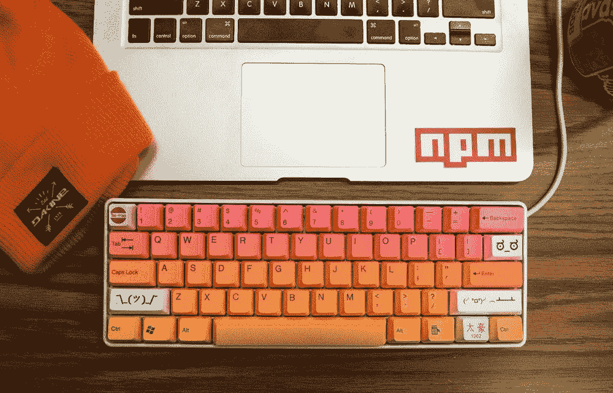
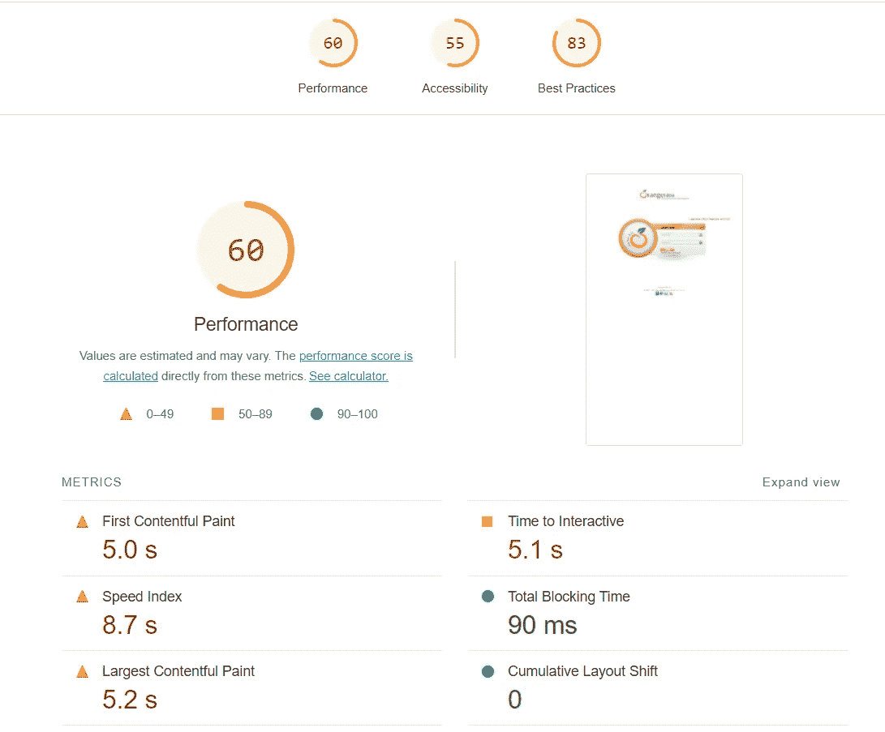
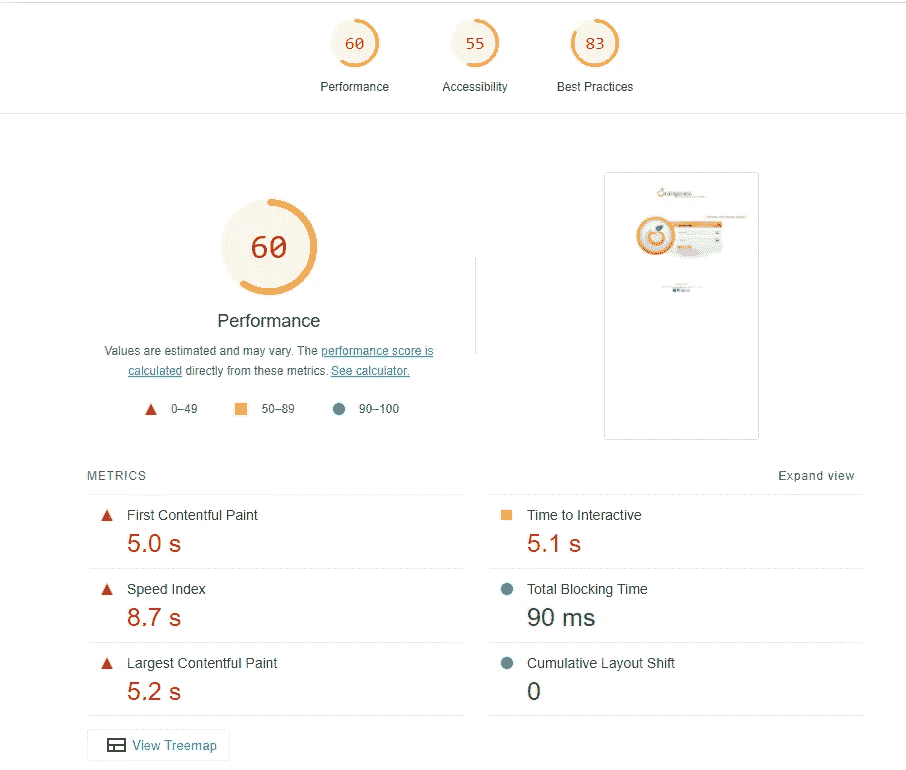
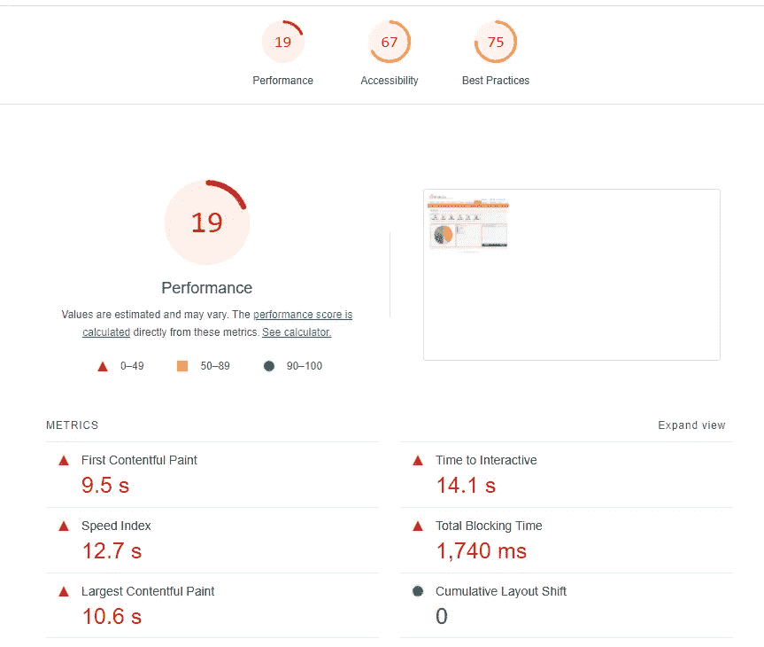

# 2 个了不起的工具来自动化客户端性能测试

> 原文：<https://betterprogramming.pub/2-awesome-tools-to-automate-client-side-performance-testing-a77756bba16f>

## 看《灯塔与剧作家》



保罗·埃施-洛朗在 [unsplash](https://unsplash.com/) 上拍摄的图片

随着应用程序变得越来越复杂，测试工作过度扩展，自动化我们的测试管道是至关重要的。

在本文中，我将演示如何使用两个令人惊叹的工具轻松快速地覆盖多个测试领域。

# 介绍谷歌的灯塔

谷歌的灯塔是一个开源的网站质量评估工具。
它基于谷歌的 [web-vitals](https://web.dev/vitals/) 指南，衡量 5 个质量因素:

## 1:性能

这个因素有三个方面:

*   [最大含量涂料(LCP)](https://web.dev/lcp/) :测量*负载*性能。为了提供良好的用户体验，LCP 应该在页面首次开始加载后的 2.5 秒内发生。
*   [第一输入延迟(FID)](https://web.dev/fid/) :测量*交互性*。为了提供良好的用户体验，页面的 FID 应该不超过 100 毫秒。
*   [累积布局偏移(CLS)](https://web.dev/cls/) :测量*视觉稳定性*。为了提供良好的用户体验，页面应该保持 0.1 的 CLS。或者更少。

## 2:可访问性

我已经在这里详细阐述了可访问性及其在当代软件开发中的重要性。
总的来说，lighthouse 根据其[网页可访问性指标](https://web.dev/lighthouse-accessibility/)努力提高网站的可访问性。

## 3:最佳实践

这将为 web 开发人员提供提高代码质量的机会。

## 4:搜索引擎优化

优化搜索引擎结果

## 5:渐进式网络应用程序(PWA)

让你的网站与现代技术保持同步。

这 5 个因素中的每一个都会产生一个从 0 到 100 的分数，结果是一个关于所发现的问题和解决问题的机会的详细报告。

您可以通过 4 种主要方式运行 Lighthouse:

1.  来自 chrome 开发工具
2.  在线的
3.  从 cli
4.  作为节点包

让我们关注节点包选项:)

首先，我们需要安装来自 NPM 的灯塔软件包

```
npm install lighthouse
```

在上面的脚本中，我们启动了一个 chrome 实例，并使用它在一个演示网站上执行 lighthouse。

我们只对性能、可访问性和最佳实践感兴趣。

现在我们可以运行脚本了:

```
node pure-lighthouse.js
```

最终结果是一个详细的 HTML 报告:



Lighthouse 提供了令人惊叹的细节报告，它真的可以帮助识别网页中的质量问题。

准备好脚本后，我们可以在自动化管道中执行它，并轻松地解决这些问题。

这种方法**，**的问题是我们只能测试应用程序的首页。

我们需要能够在页面之间导航，并在当前页面上运行灯塔。

# 介绍剧作家

剧作家是一个开源的 web 测试自动化框架。

它由微软开发，旨在使用 [Chrome 开发工具协议](https://chromedevtools.github.io/devtools-protocol/)，并在浏览器实例上执行操作，如导航、点击元素、文本插入、从下拉列表中选择选项等。

首先，让我们安装来自 npm 的剧作家:

```
npm install playwright
```

让我们来看一个基本的剧作家剧本:

在这个脚本中，我们创建了一个浏览器、一个上下文和一个页面，并将页面导航到我们的演示网站。

然后，我们可以插入我们的用户名和密码，点击登录按钮，等待直到欢迎元素可见。

让我们运行这个脚本:

```
node pure-playwright.js
```

在这个例子中，我们没有使用任何测试框架，我们希望这个例子框架是不可知的。

但是，您可以轻松地使用任何基于 JavaScript 的框架并获得报告。

# 介绍剧作家-灯塔

现在我们可以把所有的碎片拼起来。
我们将使用灯塔来启动质量评估，剧作家来浏览页面，而[剧作家-灯塔](https://www.npmjs.com/package/playwright-lighthouse)将充当将这两者结合在一起的粘合剂。

策略是通过 web 应用程序导航页面，然后将该页面的实例发送给 lighthouse auditor。

首先从 NPM 安装软件包:

```
npm install playwright-lighthouse
```

现在让我们编写测试脚本:

我们导航到仪表板，将页面实例传递给 lighthouse auditor，并将性能、可访问性和最佳实践的阈值分别定义为 90。

现在，让我们运行这个脚本:

```
node all-together.js
```

控制台输出是:

```
-------- playwright lighthouse audit reports --------c:\workspace-vscode\lighthouse-tutorial\node_modules\playwright-lighthouse\src\audit.js:79throw new Error(label);^Error: playwright lighthouse - Some thresholds are not matching the expectations.performance record is 71 and is under the 90 thresholdaccessibility record is 55.00000000000001 and is under the 90 thresholdbest-practices record is 83 and is under the 90 threshold
```

太棒了。我们没有通过测试，我们可以看到什么失败了！

现在让我们转到 HTML 报告，它将在`${current_dir}/lighthouse`下



# 哦不！

如您所见，lighthouse 是在登录页面上执行的，而不是在仪表板页面上。

这是因为当 lighthouse 启动时，它会打开一个新的浏览器实例，所有重要的身份验证细节、cookies 和存储都会丢失！
我们需要做的是创建一个持久的浏览器，在整个测试过程中保持存储，这可以很容易地实现，这要感谢剧作家的惊人的 API。

因此，让我们修改脚本:

因此，首先我们创建了一个临时目录，在其中保存所有相关的存储。然后，我们调用 playwrights[launchPersistentContext](https://playwright.dev/docs/api/class-browsertype#browser-type-launch-persistent-context)来创建一个持久的浏览器上下文，然后我们在上下文之外创建了一个页面实例。

其余的和我们之前一样，我们将持久页面传递给 lighthouse auditor 并调用质量评估过程。

让我们运行新脚本:

```
node all-together.js
```

控制台输出:

```
-------- playwright lighthouse audit reports --------c:\workspace-vscode\lighthouse-tutorial\node_modules\playwright-lighthouse\src\audit.js:79throw new Error(label);^Error: playwright lighthouse - Some thresholds are not matching the expectations.performance record is 19 and is under the 90 thresholdaccessibility record is 67 and is under the 90 thresholdbest-practices record is 75 and is under the 90 threshold
```

酷，现在让我们来看看 HTML 报告:



厉害！