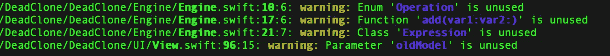
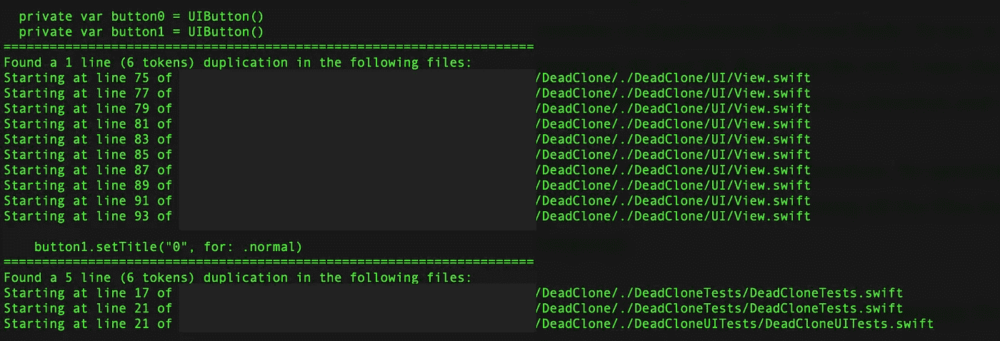

# 2 个 iOS 工具，用于检测死代码和克隆代码

> 原文：<https://betterprogramming.pub/2-ios-tools-to-detect-dead-and-cloned-code-a4401b33d7ec>

## 消除代码库中的代码味道


诺贝特·莱瓦西奇斯在 [Unsplash](https://unsplash.com?utm_source=medium&utm_medium=referral) 上拍摄的照片。

在发布一个项目后，我们想要添加新功能，A/B 测试一些其他功能，并删除不再有意义的旧功能。

所有这些干预都属于一个项目的[演进过程](https://en.wikipedia.org/wiki/Software_evolution#Types_of_software_maintenance)。它们属于*适应性维护*和*完美维护*类别。在其他一些情况下，我们需要干预来修复影响用户的 bug。这种干预属于*纠正性维护*范围。

所有这些变化有什么共同点？都是改变代码库的维护干预。他们可以引入新的代码片段，或者禁用我们不再需要的代码片段。

这些变化的一个潜在影响是引入了两种我们希望尽可能避免的[代码气味](https://en.wikipedia.org/wiki/Code_smell):

*   [死代码](https://en.wikipedia.org/wiki/Dead_code):无法在我们的代码库中执行的代码片段，因为它们不再可达。
*   [重复代码](https://en.wikipedia.org/wiki/Duplicate_code):多段(几乎)相同的代码在不同的文件或行中重复。它们通常是复制粘贴其他代码行的结果。

死代码的主要结果是一个被污染的代码库，我们不确定为什么会有特定的代码片段。我们可能想把代码放在那里，因为可能有东西在使用它。

重复代码的味道是一个更严重的问题。这使得代码难以维护。如果重复的代码有一个 bug，我们需要在所有使用它的地方修复它。这使得在代码库上工作成为一场噩梦。

今天，我想向您展示几个工具，我们可以用它们来半自动地检测和消除这些代码气味。

# 边缘


图片来自 [GitHub](https://github.com/peripheryapp/periphery) 。

外围设备是一个识别应用程序中未使用代码的工具。

它非常智能，不仅能够检测未使用的函数，还能够检测结构、枚举，甚至是函数签名中声明的、在函数体中没有使用的参数！

## 配置

我们可以利用`brew`在我们的机器上安装外围设备的二进制文件。运行以下命令:

```
brew tap peripheryapp/periphery
brew install periphery
```

第一个命令将`peripheryapp/periphery` tap 添加到我们已知的 tap 列表中。第二个命令实际上是安装外围设备。

安装完成后，我们需要对其进行配置。外围设备附带了一个交互式过程，允许您为项目创建适当的配置。我们可以简单地运行以下命令来初始化该过程:

```
periphery scan --verbose --setup
```

`--verbose`标志很重要，因为启用该标志后，外围设备将在交互配置之后、开始构建我们的项目之前打印一个`yaml`文件。一旦这些配置在控制台中打印出来，我们可以将它们复制并粘贴到一个`.periphery.yaml`配置文件中:

. periphery.yaml 文件的示例。如果您想手动填充它，请随意直接复制它，这样您就可以避免经历引导式设置！

`--setup`标志用于启动交互配置。如果我们需要多次运行外围设备并且我们已经有了`yaml`文件，我们可以省略`--setup`标志。

## 使用

在第一次配置运行之后，我们可以通过运行以下命令来使用该工具:

```
periphery scan
```

我准备了一个示例项目，在这个项目上我运行了 peripheral**来向您展示一个示例输出。我们可以在下图中观察到它:**

****

**外围样本输出**

**从工具的输出开始，我们可以探索我们的代码库，并验证已经发现的内容是否实际上没有被代码使用。大多数时候，工具是准确的。外围发现的死代码可以安全删除！**

**我们很少出现一些假阳性。这是由于一些协议扩展的默认实现，该工具很难检测到使用，或者一些内部函数和对象，我们需要提高可测试性。**

**总的来说，拥有这样一个工具对于减少代码大小和确保我们没有一些未使用的代码并且可能潜伏几个月或几年是非常重要的。我们不想在两个月后回到我们的代码库，问自己为什么这个函数没有被调用，对吗？**

# **复制粘贴检测器**

****

**照片来自 [PMD 的文件](https://pmd.github.io/latest/pmd_userdocs_cpd.html)。**

**[复制粘贴检测器](https://pmd.github.io/latest/pmd_userdocs_cpd.html) (CPD) 是一个可以用来检测我们代码库中复制代码的工具。它属于[编程错误检测器](https://en.wikipedia.org/wiki/PMD_(software)) (PMD)套件。**

## **装置**

**这个工具是用 Java 编写的。因此，安装时需要做一些额外的工作:**

1.  **下载并安装 [Java 8 for Mac](https://www.java.com/en/download/) 。**
2.  **从 [GitHub 发布页面](https://github.com/pmd/pmd/releases)下载该工具。**
3.  **解压存档文件。**
4.  **在终端中，运行`open /usr/local`。**
5.  **将解压后的档案文件中的`lib`文件夹复制到`/usr/local/`路径的`lib`文件夹中。**
6.  **将解压后的档案中的`bin`文件夹复制到`/usr/local/`路径的`bin`文件夹中。注意:您应该将`run.sh`文件的名称改为更有意义的名称。**

**完成这些步骤后，我们可以在终端的任何位置键入`run.sh`(或者您在步骤 6 中选择的名称)来执行我们的工具。**

## **使用**

**要使用该工具，我们需要导航至 Swift 项目的根文件夹。**

**然后，我们需要发出以下命令:**

```
run.sh cpd --minimum-tokens <N> --files . --language swift
```

**`--minimum-tokens`和`--files`参数是强制性的。前者要求我们指定一个数字。这是被视为重复代码的两个片段之间需要相等的令牌数。一个[标记](https://en.wikipedia.org/wiki/Lexical_analysis#Token)是一种编程语言的单一元素。下面一行:**

```
if list.isEmpty {
```

**由五个令牌组成:`if`、`list`、`.`、`isEmpty`和`{`。**

**与外围设备不同，这个工具需要一点调整，然后我们才能有效地使用它。我们需要回答这个问题:我们需要多少个重复的记号才能认为一个片段是重复的？**

**令牌数量越少，CPD 找到的重复数量就越多。一个好的权衡应该在 20 到 50 之间。这允许我们发现可以在函数中提取并重用的代码片段。**

**如果我们指定一个文件夹作为`--files`选项的参数，工具会递归运行。因此，通过指定`.`文件夹，它将在每个子文件夹中运行，分析所有包含指定语言代码的文件。**

**CLI 工具接受更多的[参数](https://pmd.github.io/latest/pmd_userdocs_cpd.html#cli-options-reference)，让我们定制它的行为。探索并使用它们，直到找到最佳配置。**

**我在测试项目中运行该工具，向您展示输出结果:**

****

**CPD 的示例输出，它能够找到我复制粘贴按钮声明和 setTitle 调用的位置。**

**一旦我们有了输出，我们就可以导航到适当的位置，并决定在适当的函数中重构代码以重用它。**

# **结论**

**在今天的文章中，我们探索了一些工具，它们可以从我们的代码库中删除一些死的和重复的代码。这些工具通过减少可能在我们的代码库中变得陈旧的代码片段，并通过提高我们的代码质量，帮助维护我们开发团队的健全。**

**幸运的是，我们不会每天都在代码库中引入死代码和重复代码。这些工具可以偶尔运行一次，可能每 3-6 个月运行一次。一个好的做法可能是计划家务冲刺。团队可以计划一些时间来重构代码，处理积压的一些任务，并运行这些工具来消除这些代码气味。**