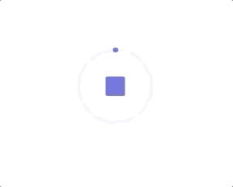
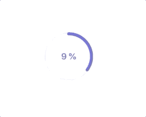

# SwiftUI 动画的两个必须知道的协议

> 原文：<https://betterprogramming.pub/2-must-know-protocols-for-swiftui-animation-cd50bf38895e>

## Animatable 和 AnimatableModifier 是创建 SwiftUI 动画的基本要素

照片由[周](https://unsplash.com/@phoebezzf?utm_source=medium&utm_medium=referral)在 [Unsplash](https://unsplash.com?utm_source=medium&utm_medium=referral)

使用 SwiftUI 时，以如丝般平滑的性能制作视图和过渡的动画非常重要。本文介绍了每个开发人员都必须知道的 SwiftUI 动画的两个协议。

# 1.动画协议

西蒙·伯杰在 [Unsplash](https://unsplash.com?utm_source=medium&utm_medium=referral) 上的照片

iOS 13+上有`Animatable`协议。它定义了可以制作动画的类型。协议包含的唯一值是`animatableData`，它是`VectorArithmetic`的关联类型。`VectorArithmetic`扩展了`AdditiveArithmetic`协议，增加了标量乘法和一种查询向量大小的方法。协议帮助我们制作路径动画和转换矩阵。

杨梦的动画协议要点

SwiftUI 遍历视图层次结构，找到采用`Animatable`协议的值，并通过使用特定项目的`animatableData`动画显示其变化。

下面我们用进度条圈动画为例多解释一下。

杨梦的进步圈动画

## `State`变量

通常，我们使用`@State`属性包装器来定义一些状态变量，然后将动画修改器附加到视图上。`progress`是进度百分比的状态变量。并且我们使用`Circle`的实例来绘制进度弧线。

杨梦的内容视图

## 动画和动画数据

为了理解`Animatable`的细节，让我们看一下下面的例子。

非动画 AnimatableCircle.swift 作者杨梦

杨梦的非动画圈

这里我们有一个采用`Shape`协议的`AnimatableCircle`。SwiftUI 中的所有形状都符合`Animatable`协议，但是在启动示例时没有动画。

SwiftUI 不能识别如何动画化这个圆，因为没有`AnimatableData`。

杨梦的动画圈

杨梦的动画圈

通过实现`animatableData`，我们更新了`progress`属性，并可以将它制作成动画。最重要的是，通过实现`Shape`协议，它给了我们更多的灵活性来制作更多可定制的动画。

# 2.AnimatableModifier 协议

照片由 [Fabian Mardi](https://unsplash.com/@fabianmardi?utm_source=medium&utm_medium=referral) 在 [Unsplash](https://unsplash.com?utm_source=medium&utm_medium=referral) 上拍摄

`AnimatableModifier`协议采用`Animatable`和`ViewModifier`协议。iOS 13+上有。正如你可能已经从协议的名字中注意到的，它可以动画化`Shape`的路径和`View`的内容！

杨梦的动画修改器协议要点

下面我们用带百分号标签的进度圈动画来解释一下。

进度圈与杨梦的百分比动画

杨梦的 percentageanimatablecircle . swift

让我们一个一个地检查代码:

## 动画圈

`AnimatableCircle`通过实现路径功能，采用`Shape`协议绘制圆弧。

我们没有让`AnimatableCircle`可动画化，也没有使用`animatableData`。

## 文本视图

我们在视图中添加了带有百分比的`Text`实例。它实现了`View`的主体，但也没有使用`@State`或`animatableData`。

值得注意的是，SwiftUI 在`Text`的末尾使用额外的`.id`来决定它是处理同一个视图还是一个新视图。通过使用一个惟一的 id，SwiftUI 将按照预期用指定的过渡重新绘制它。

## 动画修改器

`PercentageAnimatableCircle`采用`AnimatableModifier`。由于`AnimatableModifier`符合`Animatable`和`ViewModifier`，我们现在有两个地方可以做动画:`animatableData`和`body(content: Content)`。

`animatableData`更新进度百分比，`body`控制内容覆盖。

# 结论

照片由[亚伦·伯顿](https://unsplash.com/@aaronburden?utm_source=medium&utm_medium=referral)在 [Unsplash](https://unsplash.com?utm_source=medium&utm_medium=referral) 上拍摄

文章介绍了 SwiftUI 动画最重要的两个协议`Animatable`和`AnimatableModifier`。通过采用它们，我们可以实现许多令人兴奋的动画，并利用我们的应用程序的 UX。

# 资源

上述所有代码均可在[要点报告](https://gist.github.com/ericleiyang/50caec4afd8dbbb551a1e18a5786cbdc)中找到。