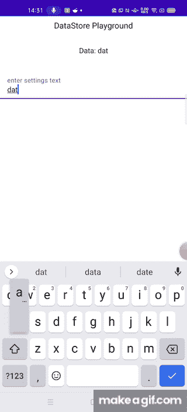
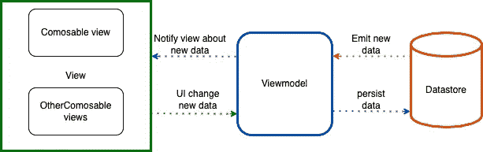

# 使用 Jetpack 合成和数据存储的双向流

> 原文：<https://betterprogramming.pub/2-way-flow-using-jetpack-compose-and-datastore-36305301347d>

## 如何在你的 Android 项目中使用 MVVM


图片由[智鹏雅](https://unsplash.com/@zhipeng_ya?utm_source=medium&utm_medium=referral)在 [Unsplash](https://unsplash.com?utm_source=medium&utm_medium=referral) 拍摄

我刚刚开始使用 Jetpack Compose APIs 和 datastore，我发现它使用起来非常方便。

让我们制作一个简单的演示应用程序，其中我们将有双向(2 路)数据流。

我们将使用 MVVM 作为我们这个小项目的架构，使用 Jetpack compose 库和 Datastore 库。协同程序在这里是自然的一部分。开始吧！

这是我们的演示应用程序的外观:



我们的主要架构是这样的:



我们看到我们的双向流是什么样子的。在左侧，我们有一个视图，在用户交互时数据被更改，然后`ViewModel`将更改的数据转发到数据存储，新数据被保存在那里。

一旦数据被持久化到`Datastore`中，它就发出一个新的数据流，这个数据流被转发回视图，UI 可以被更新。这是一个非常简单的解决方案，不需要用`ViewModels`订阅/观察/绑定视图的样板代码。

UI 机会随着流数据上的每次发射而被触发。这是由每一次用户界面的改变和随之而来的`Datastore`机会触发的。

```
//Composable UI element that handles onTextChangeAction
@Composable
fun DataStorePlaygroundActivityComponent(
  stringData: String,
  keyboardController: SoftwareKeyboardController?,
  onTextChangeAction: (dataString: String) -> Unit
) {
  val textAnswerState = remember **{** *mutableStateOf*("")
  **}** JetPackPlaygroundAppTheme **{** *Surface*(color = MaterialTheme.colors.background) **{** Column(Modifier.*fillMaxSize*()) **{** Title("DataStore Playground")
        Spacer(modifier = Modifier.*height*(16.*dp*))
        NormalText("Data: $stringData")
        Spacer(modifier = Modifier.*height*(32.*dp*))
        TextFieldSingleLine(
          textAnswerState,
          "enter settings text",
          keyboardController,
          onTextChangeAction
        )
      **}
    }
  }** }//Activity|Fragment view setting the composable
DataStorePlaygroundActivityComponent(
  stringData,
  LocalSoftwareKeyboardController.current
) **{** dataString **->** dataStoreViewModel?.saveDefaultText(dataString)
**}**//ViewModel interaction with the datastore.*viewModelScope*.*launch* **{** localDataStore.saveDefaultText(defaultText)
**}**
```

上面显示的代码展示了 UI 元素是如何放置的。我们定义了一个可组合元素`DataStorePlaygroundActivityComponent`,其中保存的文本显示在文本视图上，还有一个在用户交互完成时调用的动作(TextField 组件中文本的改变)。之后，`ViewModel`只是将新值转发给数据存储。

一旦新值保存在数据存储中，新值就会立即发出并传播到视图。以下是一些代码片段:

```
//Flow data from the datastore
override val customTextData: Flow<String>
  get() = App.applicationContext().*dataStore*.data
    .*map* **{** preferences **->** preferences[customTextKey] ?: CUSTOM_TEXT_SETTINGS_DEFAULT_VALUE
    **}****//**Listening the the flow within the ViewModelinit {
  *viewModelScope*.*launch* **{** localDataStore.customTextData.collect **{** data **->** mutableFlowData.value = LatestDataUiState.Success(data)
    **}
  }** }
//Data class for UI state
sealed class LatestDataUiState {
  data class Success(val tempString: String): LatestDataUiState()
  data class Error(val exception: Throwable): LatestDataUiState()
}//View logic
*lifecycleScope*.*launch* **{** repeatOnLifecycle(Lifecycle.State.*STARTED*) **{** dataStoreViewModel?.uiStateFlow?.collect **{** uiState **->** *// New value received*
      when (uiState) {
        is LatestDataUiState.Success -> showSuccessUI(uiState.tempString)
        is LatestDataUiState.Error -> showErrorUI(uiState.exception)
      }
    **}
  }
}**
```

上面截取的代码显示了视图如何与数据流连接，以及当接收到新的 UI 数据时，如何进行重组。

就是这样！与其他模式相比，代码确实很小。完整的代码可以在[这里](https://github.com/kliment-jonceski/JetPackPlaygroundApp)找到。

```
**Want to Connect?**If you are interested I’ve developed a simple puzzle app using Jetpack components. Check it out [here](https://play.google.com/store/apps/details?id=joncheski.kliment.com.brainteasers).
```