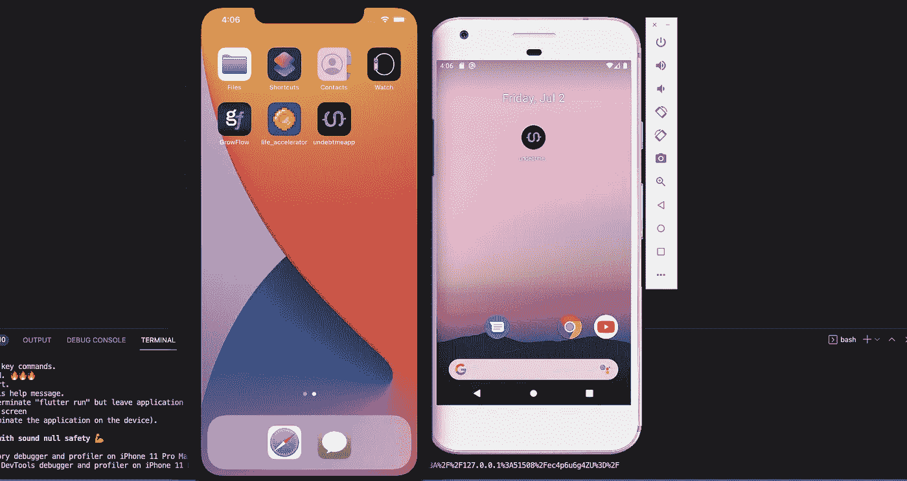
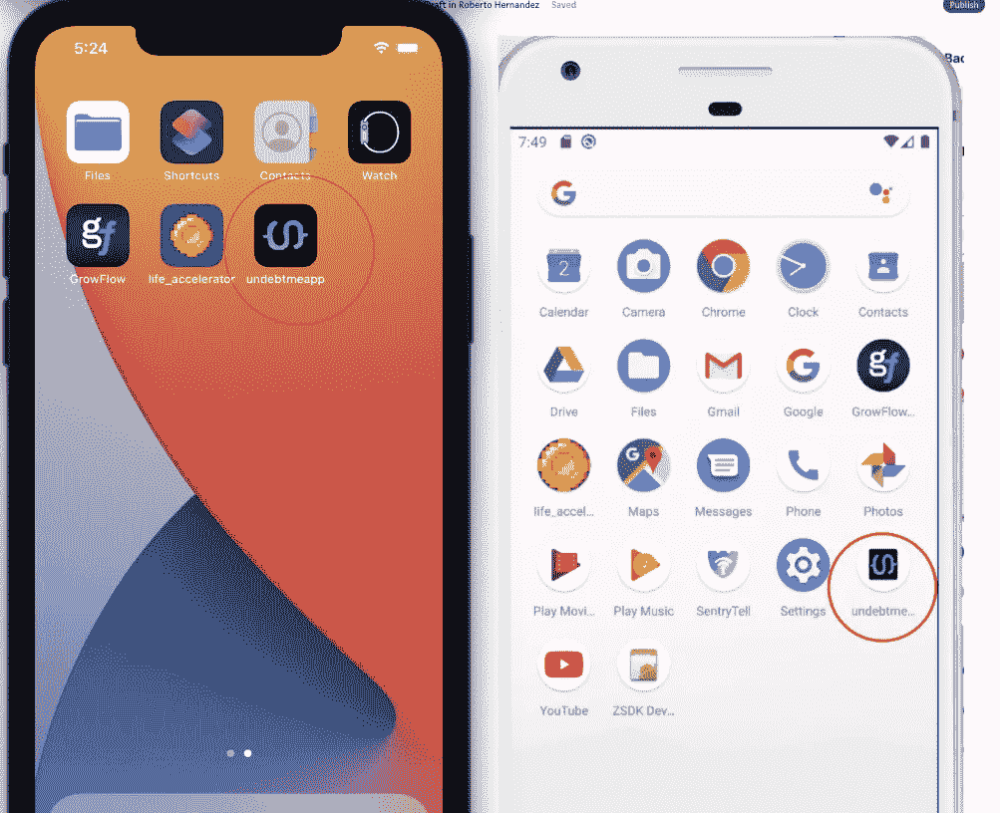
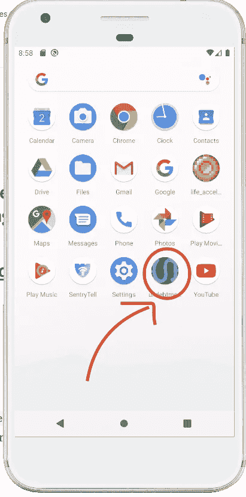
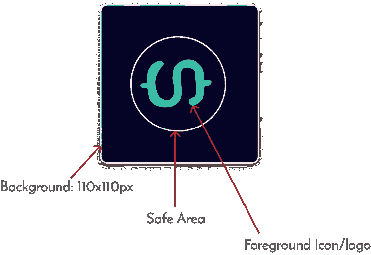
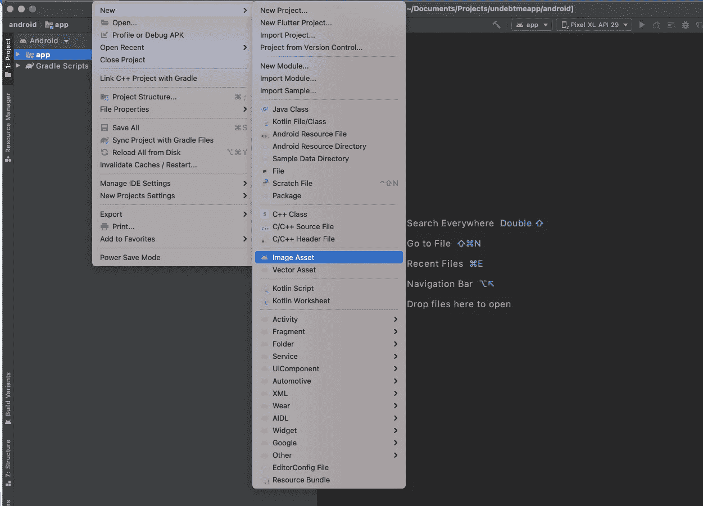
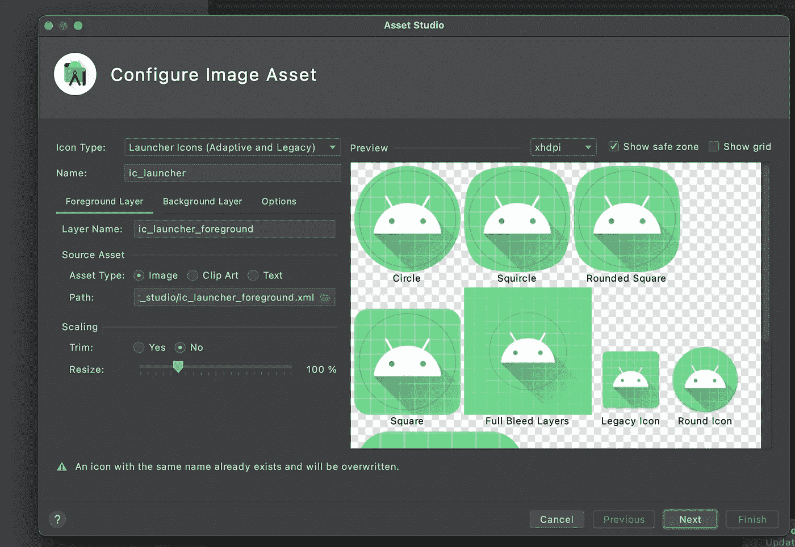
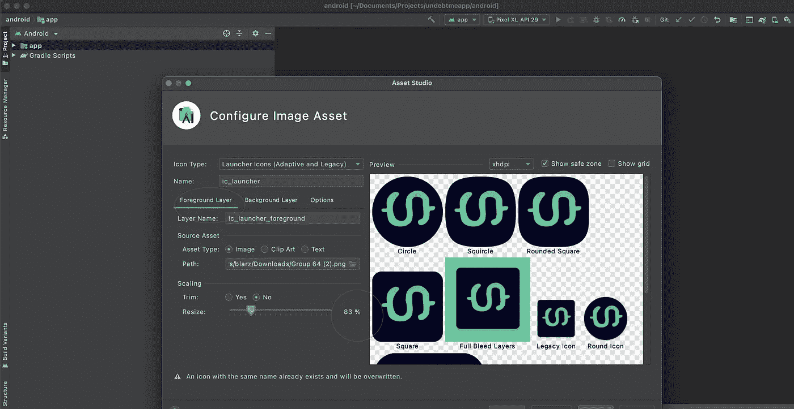

# 在 Flutter 中添加应用启动器图标的两种方法

> 原文：<https://betterprogramming.pub/2-ways-to-add-app-launcher-icons-in-flutter-e9fce30bc177>

## 以及如何解决您可能面临的常见问题



Undebtme 应用程序启动器图标。作者照片。

我最近在做一个 Flutter 项目，我需要添加一个应用程序启动器图标的简单任务。

当时，我刚刚开始使用 Flutter。因此，我开始寻找实现、实施和记录这项任务的最佳方式。

于是乎，我就创作了这篇文章。

今天，您将学习在 Flutter 中添加应用程序启动器图标的两种方法，以及如何解决在此过程中可能遇到的常见问题。

# 要求

*   软件包[flutter _ launcher _ icons 0 . 9 . 0](https://pub.dev/packages/flutter_launcher_icons)或更高版本
*   `android.png`


Undebtme 徽标/android.png

*   `ios.png`


Undebtme 徽标/ios.png

*   `background.png`(必须完全不透明，110x110px)。

# 1.使用 flutter_launcher_icons 包

向 iOS 和 Android 应用程序添加启动器图标的第一种方法是使用`flutter_laucher_icons`包。让我们按照下面两个简单的步骤来实现它。

## 设置初始配置文件

*   `dev_dependencies: flutter_launcher_icons: “0.9.0”`:这是你要安装的软件包版本。如果想安装最新的，可以这样做。

```
...
dev_dependencies:  
    flutter_launcher_icons: 
```

在上面的代码片段中，我们没有指定插件版本。它会得到最后一个。

*   `android: true and ios: true`:覆盖每个平台的默认现有颤振启动器图标。
*   `image_path_ios`:您希望在 iOS 上用作应用程序启动器图标的图标图像文件的位置。
*   `image_path_android`:你要在 iOS 上用作 app launcher 图标的图标图像文件的位置。

## 运行包并构建应用程序

```
flutter pub get
flutter pub run flutter_launcher_icons:main
flutter run
```

如果你遵循了这些步骤，你会在 iOS 和 Android 上看到这样的结果。在 iOS 上，图标看起来没问题。但在 Android 上，却没有。你注意到了吗？



iOS 和 Android 启动器图标

# Android 上的常见问题

让我们指出一些你在添加启动图标时可能会遇到的问题，更重要的是如何解决它们。

## 1.图标以填充居中


Android 居中启动器图标

*解决方案:使用具有以下* `*flutter_launcher_icons*` *插件属性的自适应图标设计。*

让我们修改`pubspec.yaml`文件并添加新的属性。现在我们将拥有:

pubspec.yaml

通过这样做，您将得到下面的输出。它看起来好多了，但仍然有一个问题—它被拉伸了。



拉伸图标

## 2.自适应图标正在拉伸

有一个很长的 [GitHub 线程](https://github.com/fluttercommunity/flutter_launcher_icons/issues/96)在那里他们谈论这一点。


拉伸启动器图标

*解决方案 1:创建一个符合以下规格的图像。这个 logo 只针对安卓。对于 iOS，我们需要另一个我们在本文开头提到的版本。*



自适应图标— Android

*解决方案 2:另一个解决方案是使用 Android Studio 相应地缩放图像。*

*   转到文件->新建->图像资产。



图像资产

你会看到这样的东西。Android Studio 将加载默认的自适应图标。



配置图像资产

现在，在`Source Asset`部分，搜索你的标识——你的位置。在我的例子中，它位于`download`文件夹中。

你只需要把自适应图标的大小调整到原来的 60-70%。通过这样做，您应该会看到类似这样的内容:



配置图像资源-自适应图标

如果您遵循这些解决方案，您将会得到如下的 iOS 和 Android 输出。现在 iOS 和 Android 都好看了。


最终取消应用程序启动器图标

# 2.手动(不推荐)

我过去常常跟踪这个。这是一个坏主意，因为由于匆忙和客户的期望，我在一个项目中错过了不止一个图标。我把事情搞砸了。

这不是添加启动器图标的推荐方式。这涉及到手工工作。这意味着您必须为每个平台的每个屏幕分辨率创建每个图标。

然后添加合适的名称并复制粘贴到正确的文件夹是一项令人生畏的任务。这是非常耗时和高风险的。

如果你愿意，你可以做，但是现在，这不值得。

# 最后的想法

给你的 Flutter 应用程序添加启动图标看起来似乎是一个简单的任务。的确如此。

然而，正如您在本文中已经意识到的，您可能会面临一些需要解决的问题。

建议使用`flutter_launcher_icons`包自动生成每个平台的图标。这也有助于你使用 Android 应用程序的自适应图标设计。

最后，由于我们列出的所有风险，不建议使用手动方法。这也是一项艰巨的任务。

我希望这篇文章是有帮助的。下一集再见。