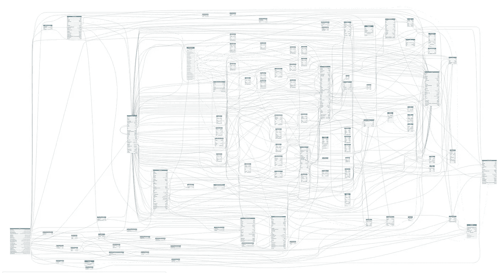
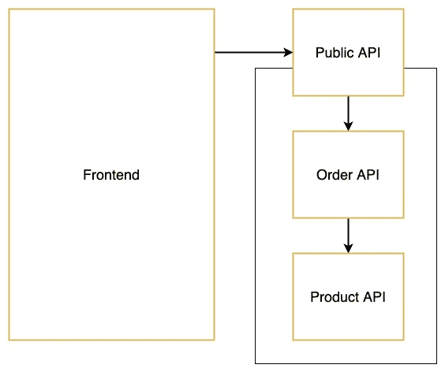
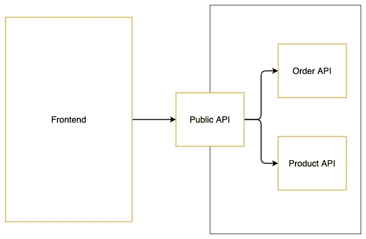
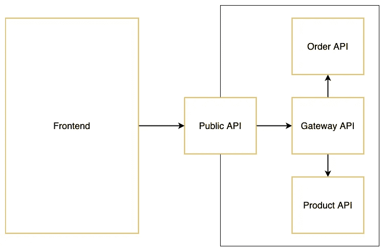

# 两年的 GraphQL 生产经验

> 原文：<https://betterprogramming.pub/2-years-of-graphql-in-production-a1a6dbaddbda>

## 你应该避免的常见陷阱



使用 GraphQL Voyager 生成的关系概述(作者提供照片)。

GraphQL 因为一些非常好的原因变得越来越流行。我们遇到的一些问题很有挑战性，但都是值得的。我将在本文中使用一个示例设置来演示我们遇到的问题以及如何解决这些问题。

让我们从头开始。我们为什么选择 GraphQL？

*   无需担心更新文档。所有的查询和突变都会被自动记录。
*   我们可以编写只返回请求数据的查询，而不是获取整个数据集。
*   我们前端的一个接入点。从 20 个不同的 API 获取所有需要的数据并不有趣。使用 GraphQL，我们可以选择将所有这些 API 缝合成一个。

# 缝

能够从一个端点获取所有数据听起来不错，但是拼接也会导致一些非常糟糕的问题。让我们看看下面的例子:



我们有一个与公共 API 通信的前端。公共 API 缝合订单 API，订单 API 缝合产品 API。公共 API 是唯一可以被前端访问的 API。这种连接看起来不是一个很大的问题，但是如果你有 20 个多层的 API，发布会变成一场噩梦。

为什么？因为当您更新产品 API 的模式时，您将需要重新启动订单 API 和公共 API(按照那个顺序)，因为模式需要重新加载。每次更新 GraphQL 模式时都必须重启十几个 API，这肯定不是一件有趣的事情。

我们可能遇到的另一个问题是当我们想要向上而不是向下查询时——从一个产品到它的父订单。这是行不通的，因为 Order API 只有在 Product API 运行时才会启动，因为它需要加载它的模式。

这意味着我们可以获取属于某个订单的产品:

```
order {
    identifier
    products {
        identifier
    }
}
```

但是我们无法获取属于某个产品的订单:

```
products {
    identifier
    order {
        identifier
    }
}
```

为了解决这些问题，我们可以重新安排我们缝合 API 的方式。通过让公共 API 负责加载所有模式，我们只需要在模式更新时重启一个 API。



因为公共 API 现在获取所有模式，我们可以添加一些代码，用`order`属性扩展产品模式。这将使通过产品查询获取订单成为可能。查看 Apollo [文档](https://www.apollographql.com/docs/apollo-server/federation/entities/#extending)了解更多关于扩展模式的信息。

现在，并不是所有的查询和变化都可以通过我们的公共 API 访问。例如，我们不想给我们的客户触发改变支付状态的突变的可能性。解决这个问题的一个方法是过滤掉某些查询和变异。我们可以循环模式中的所有查询和变化，并将它们与列表进行比较。如果查询在列表中，它们将是可见的。否则，它们将从模式中删除。另一种选择是添加一个中间件，检查当前用户是否有权触发某些查询和变异。

我们选择了这两个选项的组合。但是现在我们有了另一个问题。因为不是所有的变化都可以通过公共 API 访问，所以我们需要在更新支付状态时直接调用支付 API。这将适用于突变，但不适用于我们所有的查询，因为子对象和父对象只在公共 API 中缝合。为了解决这个问题，我们必须再次重新安排我们的设置。



我们将创建一个网关 API，并让它负责缝合所有的模式。公共 API 将缝合网关 API，并删除所有不应该通过前端访问的查询和变异。当我们需要在后端进行查询或变更时，我们现在可以使用网关 API，因为我们的后端服务位于同一个网络中。

# 分页查询

为某些查询实现[分页](https://graphql.org/learn/pagination/#pagination-and-edges)绝对是个好主意。我们选择了基于光标的方法，它运行得非常好。当我们想要获取产品时，我们现在可以使用以下查询:

```
products(first: 5, after: "cursor") {
    edges {
        node {
            identifier
        }
    }
}
```

但是，因为我们更改了模式，所以在获取订单及其产品时，我们现在有了一个分页结构:

```
order {
    products(first: 5, after: "cursor") {
        edges {
            node {
                identifier
            }
        }
    }
}
```

在这种情况下，我们不希望有一个分页的结构，因为对于一个特定的订单只有几个产品。为了解决这个问题，我们可以选择编写两个查询——一个带分页，一个不带分页。或者，当我们将产品组合成一个订单时，我们可以使用模式包装来剥离分页。包装模式是一个非常强大的选项，尤其是当您将所有远程模式整合到一个 API 中时。更多信息，请参见关于模式包装的[文档](https://www.graphql-tools.com/docs/schema-wrapping/)。

# 技巧

这些是我们遇到的最大的问题，但不是唯一的问题。这里有一些技巧可以帮助你构建一个可维护的 GraphQL API。

*   类型和枚举应该总是有一个唯一的名称。例如，如果你想给一个产品添加一个状态，把它命名为`ProductStatus`而不是`Status`，以避免类型冲突的问题。
*   向查询添加筛选器，而不是编写单独的查询。[这个 API](https://swapi.graph.cool/) 是如何实现过滤器的一个很好的例子(查看 docs 选项卡并搜索`assetFilter`)。
*   为您的查询和变异定义一个命名约定。这将更容易找到您正在寻找的查询或变异。
*   使用分页查询时，设置默认值和最大限制。当有人运行查询时，您不希望您的 API 崩溃。
*   您可以使用 [GraphQL Voyager](https://github.com/APIs-guru/graphql-voyager) 来生成您的模式的所有查询、变化和关系的概述。

# 资源

*   [用 Apollo 服务器拼接 GraphQL 模式](https://www.apollographql.com/docs/apollo-server/features/schema-stitching/#:~:text=Combining%20multiple%20GraphQL%20APIs%20into,we%20need%20in%20one%20request.)
*   [扩展 GraphQL 模式中的类型](https://www.apollographql.com/docs/apollo-server/federation/entities/#extending)
*   [GraphQL 基于光标的分页](https://graphql.org/learn/pagination/#pagination-and-edges)
*   [模式包装](https://www.graphql-tools.com/docs/schema-wrapping/)