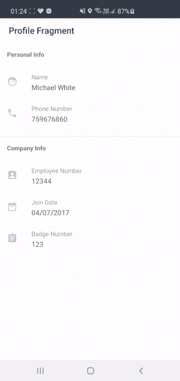
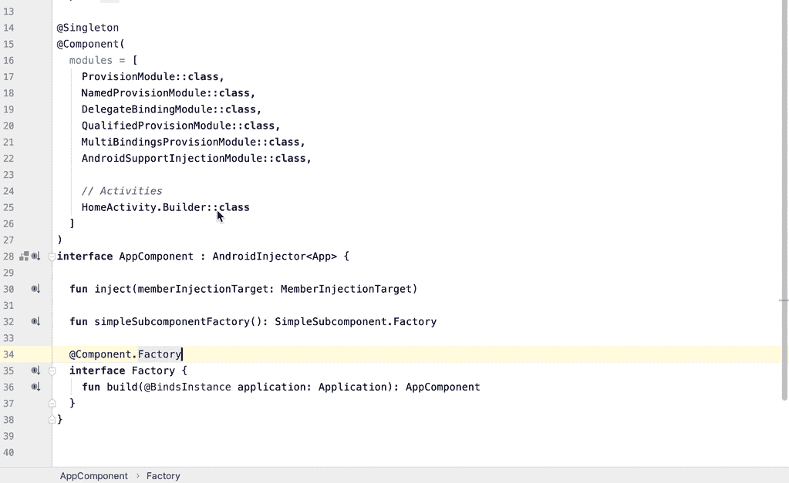
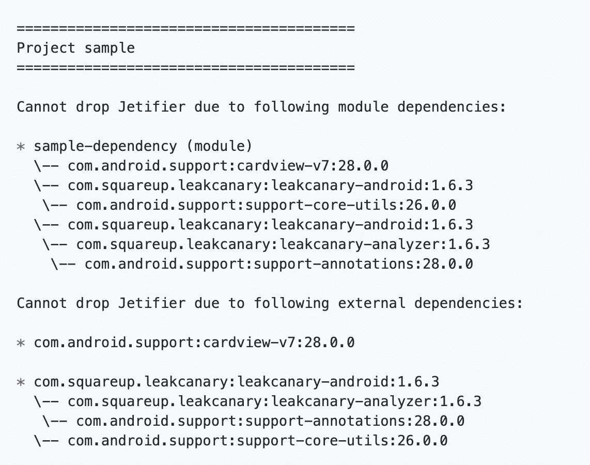
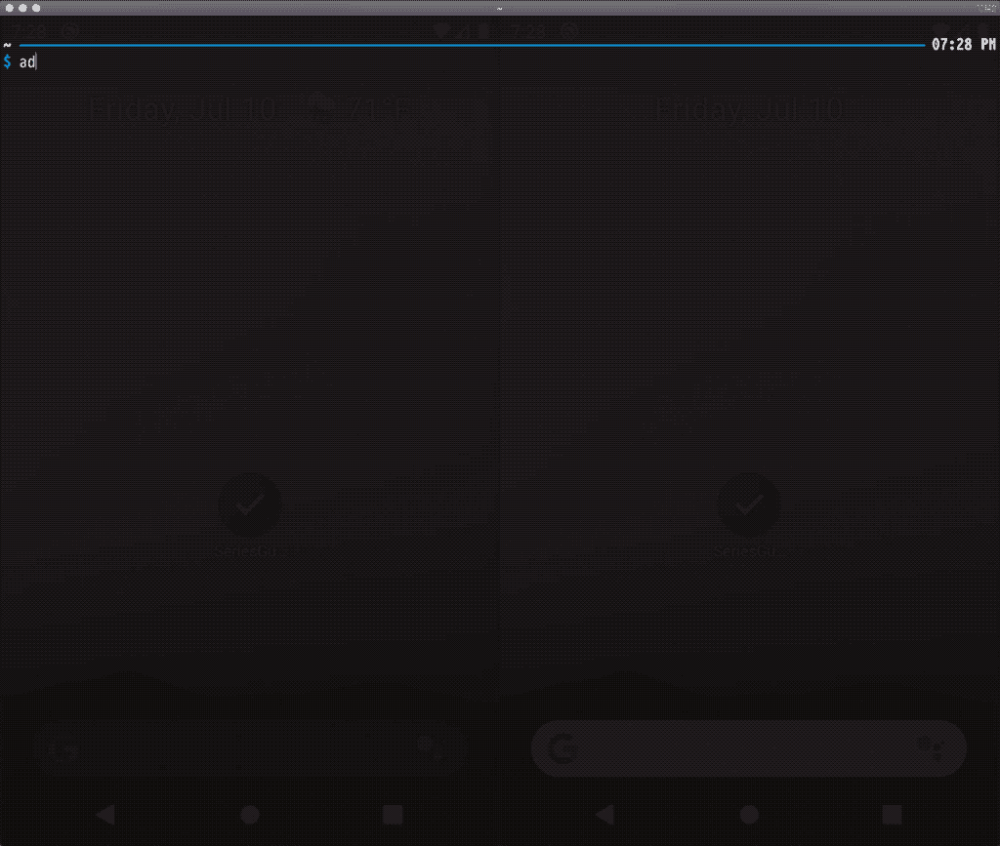
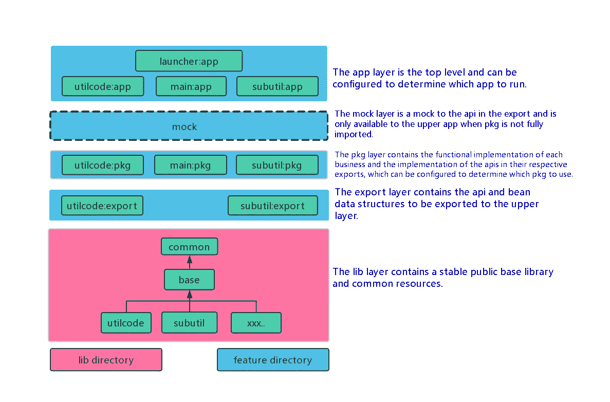
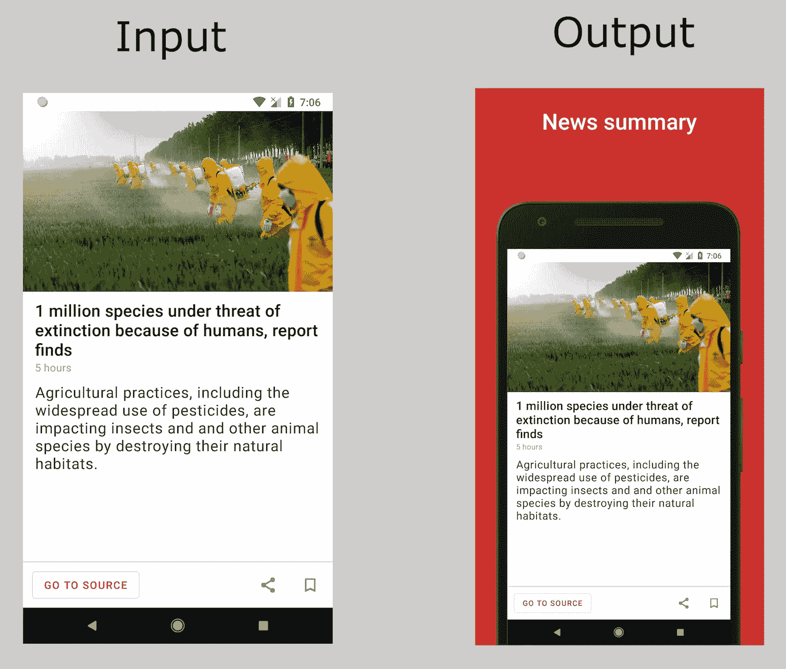
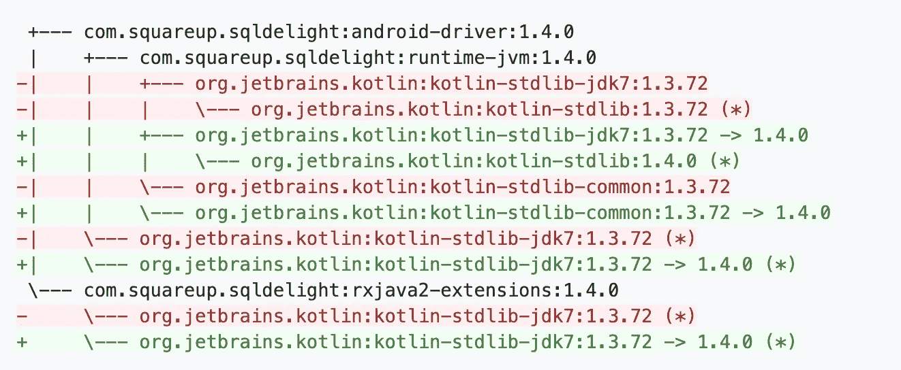
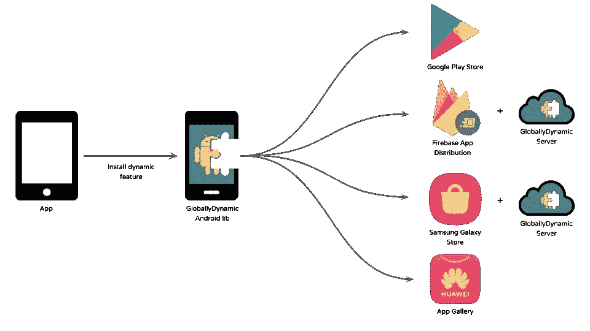
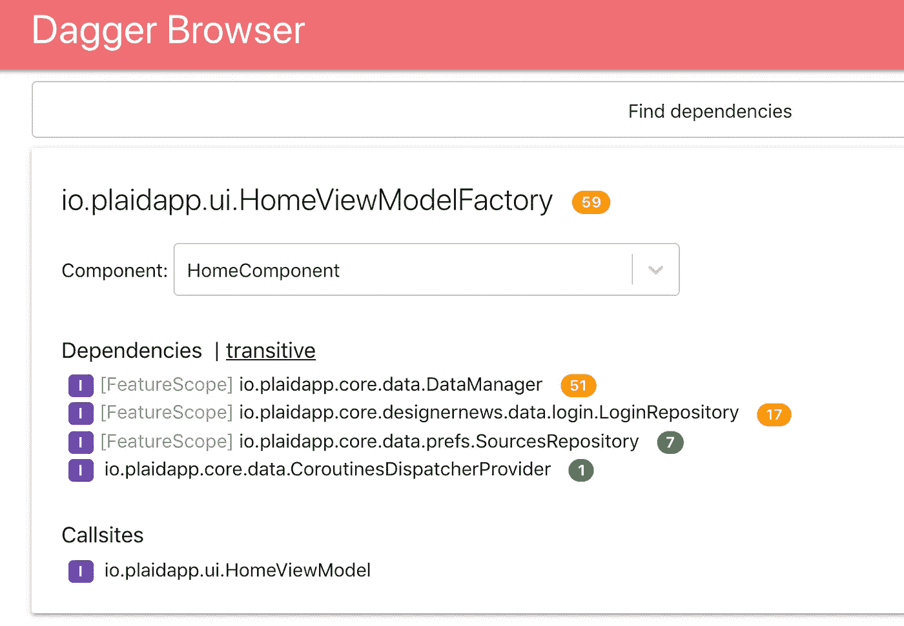

# 20 个你可能从未听说过的 Android 开发工具

> 原文：<https://betterprogramming.pub/20-android-dev-tools-youve-probably-never-heard-of-c6cc08b4e543>

## 一组有用但不常见的 Android 工具和库

由 [Pathum Danthanarayana](https://unsplash.com/@pathum_danthanarayana?utm_source=medium&utm_medium=referral) 在 [Unsplash](https://unsplash.com?utm_source=medium&utm_medium=referral) 拍摄的照片

在撰写关于[2019 年 30 个最佳 Android 库和项目](https://medium.com/better-programming/30-best-android-libraries-and-projects-of-2019-a1e35124f110)和[2020 年 25 个最佳 Android 库和项目—夏季版](https://medium.com/better-programming/25-best-android-libraries-projects-of-2020-summer-edition-dfb030a7fb0a)的文章期间，我发现了许多非常棒的工具和项目，它们可能会对您的 Android 应用开发有所帮助。它们位于无序列表的下方。享受吧。

# 1.AinD:Docker 中的 Android (Anbox)

AinD 通过在 Docker 中嵌套 [Anbox](https://anbox.io/) 容器在 Docker 中启动 Android 应用。

与基于 VM 的类似项目不同，AinD 可以在不支持嵌套虚拟化的情况下在 IaaS 实例上执行。Docker Hub: `[aind/aind](https://hub.docker.com/r/aind/aind)`

目的:

*   防盗(参见[常见问题解答](https://github.com/aind-containers/aind#faq)
*   iOS 和 Windows 平板电脑的 Android 兼容性(通过云)

 [## 集装箱/集装箱

### AinD 通过在 Docker 中嵌套 Anbox 容器，在 Docker 中推出 Android 应用。与基于虚拟机的类似项目不同，AinD…

github.com](https://github.com/aind-containers/aind) 

# 2.助推器

[Booster](https://github.com/didi/booster) 是一个非常有趣的工具。这是一个易于使用，重量轻，功能强大，可扩展的质量优化工具包，专为移动应用程序设计。首要目标是解决 app 复杂度增加的质量问题，比如性能、稳定性、包大小等。

Booster 提供了一系列模块，用于性能检测、多线程优化、资源索引内联、冗余资源减少、资源压缩、系统错误修复等。使用 Booster，一个应用的稳定性可以提高 15% ~ 25%，封装大小可以减少 1MB ~ 10MB。

这个优化器是在 Apache 2.0 许可下编写的，并且有非常好的文档。

 [## 滴滴/助推器

### Booster 是一个易于使用、轻量级、功能强大且可扩展的质量优化工具包，专为…

github.com](https://github.com/didi/booster) 

# 3.摇晃

[Shake](https://www.shakebugs.com/?utm_source=MichalBialas&utm_medium=sponsored&utm_campaign=blog_mention) 是检测 bug、探索用户重现 bug 的步骤、收集 bug 截图或视频的最佳工具之一。这将使你在测试程序或产品中的所有 bug 变得更容易。真的很值得去看看。

正如你在上面的 GIF 中看到的，你可以摇动设备，并得到一个模板提示来发送错误报告。用户可以标记错误，甚至模糊机密数据，描述问题，然后发给你。

安装非常简单，在好的[文档](https://www.shakebugs.com/docs/android/setup/)中有很好的描述。
还有一个[现场演示](https://demo.shakebugs.com/shyp-agency/LSG1QZUE/5)来检验这个工具是如何从内部工作的。

 [## 摇晃

### 编辑描述

www.shakebugs.com](https://www.shakebugs.com/?utm_source=MichalBialas&utm_medium=sponsored&utm_campaign=blog_mention) 

# 4.鞘

[鞘](https://github.com/arunkumar9t2/scabbard)是一个可视化和理解你的匕首 2 依赖图的工具。

鞘可视化入口点、依赖图、组件关系和作用域。您只需付出最少的努力就可以将它包含在您的项目中。它与 Gradle 以及 Android Studio 或 IntelliJ 很好地集成在一起(通过 gutter 图标直接从源代码轻松查看`@Component`或`@Subcomponent`图)。

[文档](https://arunkumar9t2.github.io/scabbard/)很棒，充满了例子和技巧。
一切都是在 Apache 2.0 许可下发布的。

 [## arunkumar 9t 2/鞘

### 一个可视化和理解 Dagger 2 依赖图的工具。更高级的例子。可视化入口点…

github.com](https://github.com/arunkumar9t2/scabbard) 

# 5.我能放下喷射器吗？

正如我们所知，有时从旧的支持库迁移到 AndroidX 并不是一件容易的事情，尤其是对于大型遗留项目。迁移的成功很大程度上依赖于 Jetifier 的使用(它将仍然依赖于旧工件的依赖项转换为对 AndroidX 类的操作)。但是，它也增加了构建时间。

> “由于越来越多的库被迁移到 AndroidX，在某个时候将不再需要启用这个工具。这个插件可以用来识别你正在使用的哪些库需要迁移到 AndroidX，或者如果已经有了新版本，需要进行升级。—我能放下 Jetifier 吗？

文档是不言自明的，该项目是在 Apache 2.0 许可下发布的。巨大推荐！

 [## plnice/我能滴喷射器

### 检查是否存在使用支持库而不是 AndroidX 工件的依赖关系。如果您迁移到…

github.com](https://github.com/plnice/can-i-drop-jetifier) 

# 6.亚行事件镜像

[ADB 事件镜像](https://github.com/JakeWharton/adb-event-mirror/)可让您将一台设备的触摸/按键/按钮事件实时镜像到一台或多台其他设备。

> “T 这个脚本并没有试图使分辨率、密度、方向或布局差异正常化。它最适用于使用完全相同的配置创建的模拟器。”—亚行事件镜像

这个工具允许你同时在不同类型的模拟器上测试你的应用。

 [## JakeWharton/ADB-事件-镜像

### 从一个设备使用 getevent 的输出，并将其作为单独的 sendevent 命令重定向到一个或多个设备…

github.com](https://github.com/JakeWharton/adb-event-mirror/) 

# 7.Android 模拟器容器脚本

[Android 模拟器容器脚本](https://github.com/google/android-emulator-container-scripts)是一组在容器中运行模拟器的最小脚本，用于各种系统，如 Docker，供外部使用。这些脚本与 Python 版本 2 和 3 都兼容。repo 非常流行，如果您想在远程机器上运行许多模拟器，它会很有帮助。

该项目是在 Apache 2.0 许可下发布的，并且有很好的文档记录。

 [## Google/Android-模拟器-容器-脚本

### 这是一组在容器中运行模拟器的最小脚本，用于各种系统，如 Docker、外部…

github.com](https://github.com/google/android-emulator-container-scripts) 

# 8.自动播放

[Autoplay](https://github.com/beworker/autoplay) 是一个 Gradle 插件，用于将 Android 工件发布到 Google Play。

你可以把它看作是 Gradle Play Publisher 或浪子的一个非常简单的替代品。您可以将应用发布为`apk`或应用捆绑包。

自动播放是:

*   针对 CI/CD 使用进行了优化
*   开发者友好
*   可靠且面向未来

这个项目有很好的文档，版本`1.3.0`，并且是在 Apache 2.0 许可下发布的。

 [## beworker/自动播放

### 用于将 Android 工件发布到 Google Play 的 Gradle 插件。自动播放针对 CI/CD 的使用进行了优化:它不…

github.com](https://github.com/beworker/autoplay) 

# 9.Gradle 静态分析插件

[Gradle 静态分析插件](https://github.com/novoda/gradle-static-analysis-plugin)是所有有意义的静态代码分析工具的一大替代工具，比如:

*   [检查样式](https://github.com/novoda/gradle-static-analysis-plugin/blob/master/docs/tools/checkstyle.md)
*   [PMD](https://github.com/novoda/gradle-static-analysis-plugin/blob/master/docs/tools/pmd.md)
*   [FindBugs](https://github.com/novoda/gradle-static-analysis-plugin/blob/master/docs/tools/findbugs.md) 【已弃用】【在 Gradle 6.0 中移除】
*   [斑点虫子](https://github.com/novoda/gradle-static-analysis-plugin/blob/master/docs/tools/spotbugs.md)
*   [检测](https://github.com/novoda/gradle-static-analysis-plugin/blob/master/docs/tools/detekt.md)
*   [安卓 Lint](https://github.com/novoda/gradle-static-analysis-plugin/blob/master/docs/tools/android_lint.md)
*   [KtLint](https://github.com/novoda/gradle-static-analysis-plugin/blob/master/docs/tools/ktlint.md)

不用自己设置，您有一个非常简单的方法可以毫不费力地将这些工具包含在您的代码库中。该插件是在 Apache 2.0 许可下发布的，有很好的文档，甚至有一个示例项目。

 [## novoda/grad le-静态分析-插件

### 一个 Gradle 插件，可以轻松地在不同的 Android、Java 或 Kotlin 上应用相同的静态分析工具设置…

github.com](https://github.com/novoda/gradle-static-analysis-plugin) 

# 10.AndroidUtilCode

AndroidUtilCode 是一个强大且易于使用的 Android 库。它封装了 Android 开发中常用的功能，有完整的演示和单元测试。通过使用其封装的 API，您可以大大提高开发效率。

该项目主要由两个模块组成，分别是 [utilcode](https://github.com/Blankj/AndroidUtilCode/blob/master/lib/utilcode/README-CN.md) (开发中常用)和 [subutil](https://github.com/Blankj/AndroidUtilCode/blob/master/lib/subutil/README-CN.md) (开发中很少使用但简化了主模块)。

代码在版本`1.29.0`中，在 Apache 2.0 许可下发布。

 [## Blankj/AndroidUtilCode

### AndroidUtilCode🔥是一个强大且易于使用的 Android 函数库。这个库封装了…

github.com](https://github.com/Blankj/AndroidUtilCode) 

# 11.Hijckr

> " Hijckr 干扰 Android 的布局膨胀，并将命名元素重定向到其他类。"

这是一个非常有趣的工具。例如，对于包含`TextView`的布局文件，Android 通常会加载`android.widget.TextView` *，*，但是我们可以劫持`xml`标签来加载`com.myapp.TextView`。

自述文件内容全面，允许我们快速开始使用该工具，它是 100%用 Java 编写的。

 [## JustinAngel/Hijckr

### Hijckr 干扰了 Android 的布局膨胀，并将命名元素重定向到其他类。例如对于布局…

github.com](https://github.com/JustinAngel/Hijckr) 

# 12.室友

[Roomigrant](https://github.com/MatrixDev/Roomigrant) 是一个助手库，使用编译时代码生成自动生成 Android 房间库迁移。它使用由房间库生成的方案文件，并根据它们之间的差异生成迁移。这意味着必须在`build.gradle`文件中启用房间模式生成，这在 README 中有很好的描述。

该项目是在 MIT 许可下发布的，版本为`0.1.7`。

 [## MatrixDev/Roomigrant

### Roomigrant 是一个助手库，使用编译时代码自动生成 Android 房间库迁移…

github.com](https://github.com/MatrixDev/Roomigrant) 

# 13.RoomExplorer

当我们将数据库迁移到 Room 时，我们可以在查看器中检查这个数据库。 [RoomExplorer](https://github.com/wajahatkarim3/RoomExplorer) 允许你以表格格式查看所有的表格数据，向表格中插入行，更新，删除行，放下和删除表格等。

该工具有很好的文档，并且是在 Apache 2.0 许可下发布的。

 [## wajahatkarim3/RoomExplorer

### 一个快速简单的数据库查看器和管理器库，用于您的房间数据库。“发行”标签中存在变更。查看…

github.com](https://github.com/wajahatkarim3/RoomExplorer) 

# 14.android-framer

android-framer 工具允许你给你的 Google Play 截图添加框架和标题。它的灵感来自于 fastlane frameit。

该工具是用 Python 和 [ImageMagick](https://imagemagick.org/) 构建的。您可以使用[脸书设计](https://facebook.design/devices)来配置框架(背景)。此外，您可以更改字体及其大小，调整框架大小等。

它是在 Apache 2.0 许可下发布的。

 [## faruktoptas/androidframer

### 为您的 Google Play 屏幕截图添加框架和标题。灵感来自 fast lane frame it pip 3 install androidframer = = 0.1…

github.com](https://github.com/faruktoptas/androidframer) 

# 15.相关性树差异

依赖树 Diff 是“一个智能的 Diff 工具，用于 Gradle 的`dependencies`任务的输出，它总是显示根依赖的路径。”

你可以用`brew`或者只使用`jar`文件来安装这个工具。

它是在 Apache 2.0 许可下发布的。

 [## JakeWharton/依赖关系树差异

### 一个智能比较工具，用于 Gradle 依赖项任务的输出，它总是显示到根的路径…

github.com](https://github.com/JakeWharton/dependency-tree-diff) 

# 16.格拉德医生

[Gradle Doctor](https://github.com/runningcode/gradle-doctor) 是一个 Gradle 构建扫描插件，包含可配置的构建速度问题警告，测量 Dagger 注释处理器花费的时间，确保`JAVA_HOME`已设置并与 IDE 的`JAVA_HOME`匹配，轻松禁用测试缓存，发现空`src`目录时构建失败(因为[空 src 目录](https://github.com/gradle/gradle/issues/2463)导致[缓存未命中](https://developers.soundcloud.com/blog/dagger-reflect))，等等。

这个工具有很棒的文档，并且是在 Apache 2.0 许可下发布的。

 [## 运行代码/梯度-医生

### 适合你身材的正确处方。有助于运行代码/梯度博士的发展，创造一个…

github.com](https://github.com/runningcode/gradle-doctor) 

# 17.全球动态

[globaly Dynamic](https://github.com/jeppeman/GloballyDynamic)是“一套工具，旨在使[动态交付](https://developer.android.com/guide/app-bundle/dynamic-delivery)普遍可用，无论底层应用商店/分发平台如何，同时还提供单一统一的 Android 客户端 API 和简化的开发人员体验。”

目前它支持:

*   谷歌 Play 商店([播放特写](https://developer.android.com/guide/app-bundle/dynamic-delivery))
*   华为应用图库([动态能力](https://developer.huawei.com/consumer/en/doc/development/AppGallery-connect-Guides/agc-featuredelivery-introduction))
*   大多数其他平台与[global dynamic 服务器](https://github.com/jeppeman/GloballyDynamic/blob/master/globallydynamic-server-lib)相结合(例如，亚马逊应用商店、三星 Galaxy 商店、Firebase 应用分发或在本地开发期间)

我推荐去 [README](https://github.com/jeppeman/GloballyDynamic) 了解这个工具背后的细节。

它是在 Apache 2.0 许可下发布的。

 [## 杰普曼/环球动力

### 一套工具，旨在使动态交付普遍可用，不管底层应用商店/…

github.com](https://github.com/jeppeman/GloballyDynamic) 

# 18.匕首浏览器

[Dagger Browser](https://github.com/Snapchat/dagger-browser) 是另一个工具(一个渐进式 web 应用程序),用于轻松导航项目的 Dagger graph。

> “图形数据由 Dagger [SPI](https://dagger.dev/spi.html) 插件填充，浏览器使用 [CRA (create-react-app)](https://github.com/facebook/create-react-app) 和 Typescript 构建。”—匕首浏览器

还有一个示例应用程序展示了这个工具是如何工作的。所有这些都是在 BSD-3 条款许可下发布的。

 [## snapchat/匕首浏览器

### Dagger Browser 是一个渐进的 web 应用程序，用于轻松导航项目的 Dagger 图。图形数据已填充…

github.com](https://github.com/Snapchat/dagger-browser) 

# 19.虫孔

[虫洞](https://github.com/JakeWharton/wormhole)是“一个穿越时间的字节码重写器，它将未来的 API 添加到`android.jar`中，这些 API 可以被 D8 和 R8 分解为所有的 API 级别。”

虫洞保证你可以向后兼容最新的 API。举个例子，

> “在 Android R 中有来自 Java 9 的新方法，比如`List.of`。多亏了 D8 和 R8，这些并不是 API 30 独有的，而是可以立即应用到 API 1。在 D8 和 R8 有一套针对在`android.jar`还没有*的原料药的脱糖方法。这个项目让他们可以立即使用，而不是等待。”*

 [## 杰克·哈顿/虫洞

### 一个穿越时间的字节码重写器，它将未来的 API 添加到 android.jar 中，可以被 D8 分解为所有的 API 级别…

github.com](https://github.com/JakeWharton/wormhole) 

# 20.MNML

MNML ，发音为“minimal”，是一个免费的简单的 Android 屏幕记录器。

显然，有许多应用程序和工具支持这一功能。目前，所有新设备都内置了屏幕录制功能，但如果你想了解如何实现这样一个应用程序，这个项目是一个很好的资源。

它是在 Apache 2.0 许可下发布的。

 [## afollestad/mnml

### 📹一个最小的，美丽的 Android 屏幕记录器。解散 GitHub 是超过 5000 万开发者的家园…

github.com](https://github.com/afollestad/mnml) 

# 结论

就是这样。我希望您喜欢这个列表，并且其中的一些工具对您有所启发。下次见！