# 20 个 Android Studio 快捷方式加速您的工作流程

> 原文：<https://betterprogramming.pub/20-android-studio-shortcuts-to-accelerate-your-workflow-4642cb335a96>

## 多光标、代码生成、高效搜索等等

[韦斯利·廷吉](https://unsplash.com/@wesleyphotography?utm_source=medium&utm_medium=referral)在 [Unsplash](https://unsplash.com?utm_source=medium&utm_medium=referral) 上拍摄的照片

作为 Android 开发人员，我们的很多时间都花在盯着 Gradle 构建上。虽然加快构建速度的最佳方法是投资一台强大的机器，但是您也可以通过有效地使用快捷方式来节省时间。

IDE 中有许多可用的快捷方式，我假设您知道最常用的基本快捷方式(特别是对于 macOS ),例如:

*   `Shift + Cmd + O`:转到一个文件
*   `Cmd + F9`:构建项目
*   `Cmd + E`:最近的文件
*   `Cmd + Space`:基本代码完成
*   `Cmd + Option + L`:重新格式化选中的代码
*   `Option + F6`:查找用法
*   `Shift + F6`:重构/重命名
*   `Cmd + Alt + /`:注释取消对代码块的注释

在接下来的几节中，我们将介绍一些您可能不知道的基本 Android studio 快捷方式。

使用鼠标或触控板经常会中断工作流程，影响工作效率。让我们开始培养一个好习惯——更多地使用键盘。

我希望这些建议能加快你的工作流程。

# 转到下一个或以前编辑的代码

我们很容易忘记代码库中最后编辑的变更。通过使用 Cmd +方括号`[]`，您可以轻松地将光标切换到代码中最后一个和下一个编辑位置。

## 快捷键:C `md + [`和 C `md + ]`

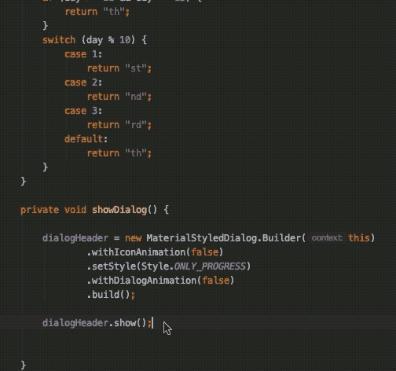

`Command + Shift + Backspace`允许您浏览代码库中的光标历史。

# 显示函数参数列表

当调用一个函数时，尤其是有多个参数的函数，知道可用的参数列表、它们的顺序和类型是很方便的。了解这一点有助于最小化传递错误参数的机会。

下面的快捷方式突出显示了函数的签名，当前参数以粗体显示。

## 快捷键:C `md + P`

或者，在 Windows 中，(Ctrl + P):

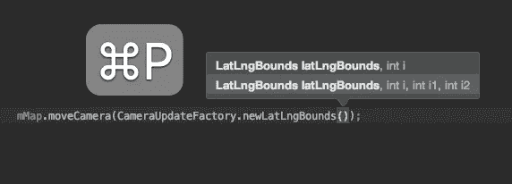

# 选择当前代码块

要选择当前代码块的开始或结束，我们可以简单地使用下面的快捷键。

## 快捷键:Option+Command+Shift + {或+ }

有时，寻找括号对变得很棘手——例如，在嵌套的代码块中。为了找出正确的打开或关闭对，不需要花太多时间盯着突出显示的括号，我们只需做一个`Option + Command + ] or + [`。

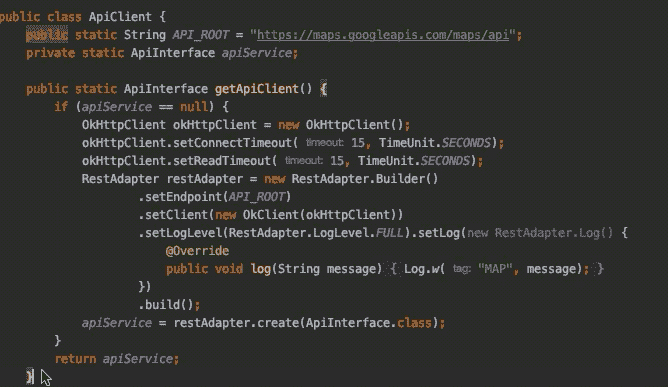

# 展开或折叠所有方法

android 应用的代码库经常穿插回调 hells 和匿名类(`OnClickListeners`等)。浏览这样的代码库可能会令人沮丧。幸运的是，Android studio 有几个扩展和折叠所有方法的快捷方式。

## 所有方法展开/折叠:Cmd + Shift + +/-

对于 Windows 用户:`CTRL + SHFT And +/-`。

此外，还有一个快捷方式可以选择性地折叠/展开当前块:`Command + +/-`。

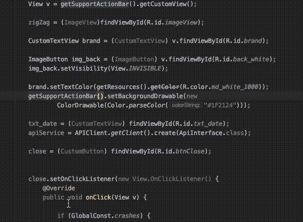

# 快速替换方法名

我们经常遇到这样的情况，有几个函数具有相同的参数和相似的名称。我们想做的是改变方法名。通常，我们会将光标放在函数名的中间，并寻找替代名。找到一个名称后，IDE 会添加新名称，但不会删除以前的名称。这很烦人，因为你必须手动删除以前的名字。

然而，有一种不太为人所知的快捷方式可以快速替换名称。不要按“Enter”来自动填充新名称，而是按“Tab”。

## 快捷方式:使用“Tab”而不是“return”来替换名称

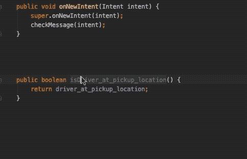

# 高效搜索您的代码库

在您的代码库中有许多搜索类、函数和接口的选项。

*   `Cmd + F`搜索当前文件。
*   `Shift + Cmd + F`让您在路径中搜索。
*   `Cmd + Option + O`允许您通过符号名称直接搜索。

最好的是`Shift + Shift` 快捷命令，可以让你在代码库中的任何地方进行搜索。此外，为了快速搜索代码库中的文件，特别是当有大量具有相同前缀的文件时，您可以简单地键入类名单词的第一个字母。例如，为了查找名为`ActivityTaxReceipt2`的文件，您可以快速键入`ATR2`。

## 查找操作

搜索查找器还可以让您快速查找操作，即您可能偶尔会用到，但一时想不起快捷方式的操作。它使用强大的模糊搜索来检索基于您在自然语言中输入的快捷方式。

## 快捷方式:`Cmd + Shift + A`

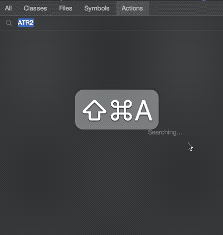

使用选项卡在操作之间切换，并搜索所有代码库。

# 代码生成

Kotlin 中的数据类减少了许多样板代码，但是输入其他类的所有`toString`、`Parcelable`实现和 getter-setter 方法仍然会耗费大量时间。幸运的是，我们可以利用以下代码生成快捷方式:

*   `Cmd + N`列出了所有可用的选项，例如编辑器窗格中可用的覆盖方法和实现接口。
*   `Command+O`显示您可以覆盖的方法列表。

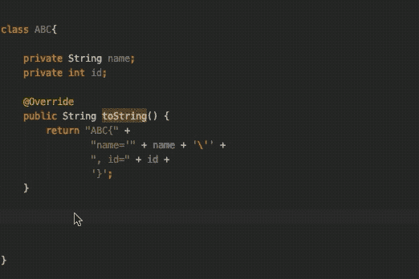

## 附上声明

要快速将一串语句包围在`if-else`、`try-catch`或循环等中，请使用以下快捷键:

Mac: `Cmd + Option + T`
Windows: `Ctrl + Alt + T`

## 实时模板:`Cmd + J`

尽管我们尽了最大努力，我们还是花了很多时间编写冗余代码。例如，定义迭代循环、祝酒词、初始化视图(`findViewById`)和打印日志语句。

幸运的是，Android studio 提供了许多内置的代码片段，可以使用`Cmd + J`快捷键完成代码。一旦选中，您只需通过 tab 键来指定所需的参数。

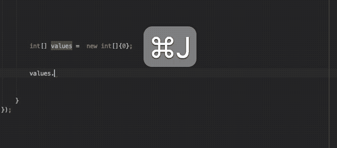

您可以查看实时模板的完整列表，甚至可以从首选项>编辑器>实时模板中创建一个自定义模板。

# Goto 声明

当你刚接触一个代码库时，快速导航到一个变量、方法或类的声明可能是你在阅读代码时最常做的事情。

做一个`Cmd + Click`快速带我们去申报。键盘快捷键提供了更多的灵活性。

`Cmd + B`显示从当前代码调用类、变量或方法的所有位置的层级列表。要仅查找类的构造函数调用，请调用构造函数的上述快捷方式，如下所示:

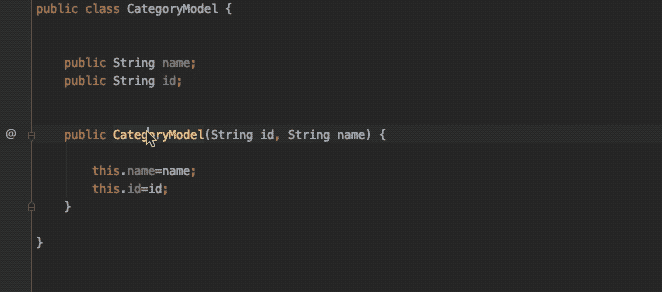

还有另一种返回类实现列表的变体:`Option + Command + B`。

# 修复错误和优化导入

让我们从最常见的用例开始。当光标位于错误行上时，我们通常会将鼠标悬停在上面，以显示红色下划线代码的详细描述。IDE 不仅在显示弹出框时有滞后，而且还会减慢我们的工作流程。Android Studio 提供了以下快捷方式。

## 将鼠标悬停在带下划线的错误上:`Cmd + F1`

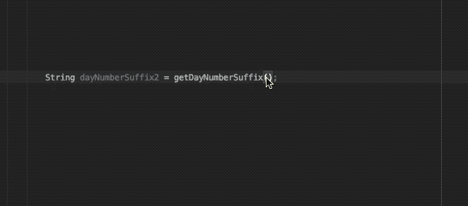

## 转到下一个突出显示的错误

一个不太为人所知的 Android Studio 快捷方式会将您带到 IDE 在当前打开的文件中突出显示的下一个错误(如果没有错误，则会显示警告)。只需按下`F2`。

## 自动修复错误

通过在错误上使用快捷键`Option + Enter`, Android studio 会使用推荐的错误自动修复错误(如果有的话)。

## 优化导入

要删除未使用的导入并按组对报表进行排序，使用以下快捷方式:`Ctrl + Option + O`

注意:Android Studio 在自动导入包时做得不是很好——尤其是那些不明确的包。因此，我们可以通过以下方式从首选项>编辑器>自动导入中显式修复该问题:

*   将“粘贴时插入导入”下拉列表值更改为“全部”
*   启用**动态添加明确的导入选项。**

# **剪贴板历史**

**Android Studio 的另一个鲜为人知的功能是非常需要的剪贴板历史。IDE 会存储您最近复制的内容列表。然后，您可以选择同时粘贴其中一个或多个。**

## **快捷方式:`Cmd + Shift + V`**

**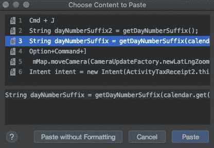**

# **修改方法**

**Android Studio 提供了快捷方式，可以让你修改函数的签名，并将代码块提取到一个新方法中。**

## **更改方法签名**

**MAC:`Cmd + f6`Windows:`Control + f6`**

**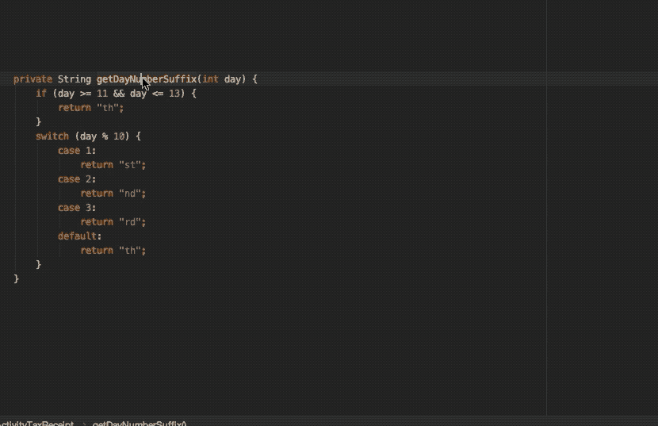**

## **提取方法**

**Mac: `Cmd + Option + M`
Windows: `Ctrl + Alt + M`**

**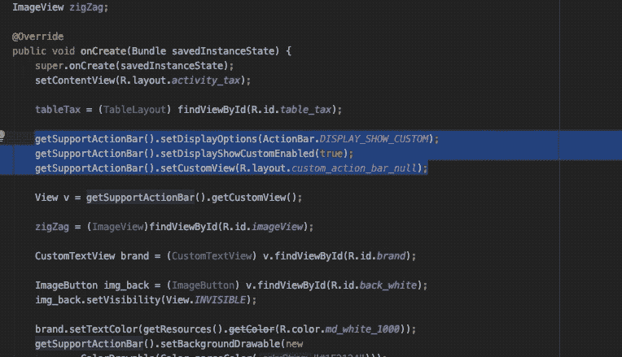**

# **多光标**

**到目前为止，多光标是重构代码的最强大的特性。它让您可以同时选择和编辑多行，当您需要在大量行中添加或删除前缀时，它是您的救星。在我们看它的键盘快捷键之前，让我们来看一下你可以用鼠标点击做什么。**

**通过简单地按住`Alt`按钮并进行选择，您可以将多个光标放置在不同的行上，如下所示:**

****

**这很好，但鼠标触控板的精度并不是每个人都喜欢的。我当然更喜欢使用等效的键盘快捷键。**

## **选择多个事件**

**如果要选择当前选择的下一个匹配部分，请使用以下命令:**

*   **Mac: `Ctrl + G`**
*   **视窗:`Alt + J`**

**要选择所有匹配的事件，请使用以下快捷键:**

*   **Mac: `Ctrl+Cmd+G`**
*   **视窗:`Shift + Ctrl + Alt + J`**

**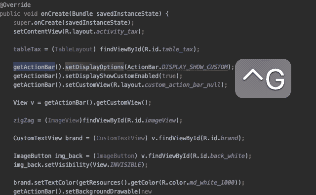**

# **结论**

**Android Studio 有大量的内置快捷方式。例如，`Control+Shift+Space`给出了一个更智能的按类型过滤的代码完成列表。**

**你可以在这里查看 Mac、Windows 和 Linux 环境下等同的 Android Studio 快捷方式的完整列表。**

**这一次到此为止。我希望你喜欢它！**