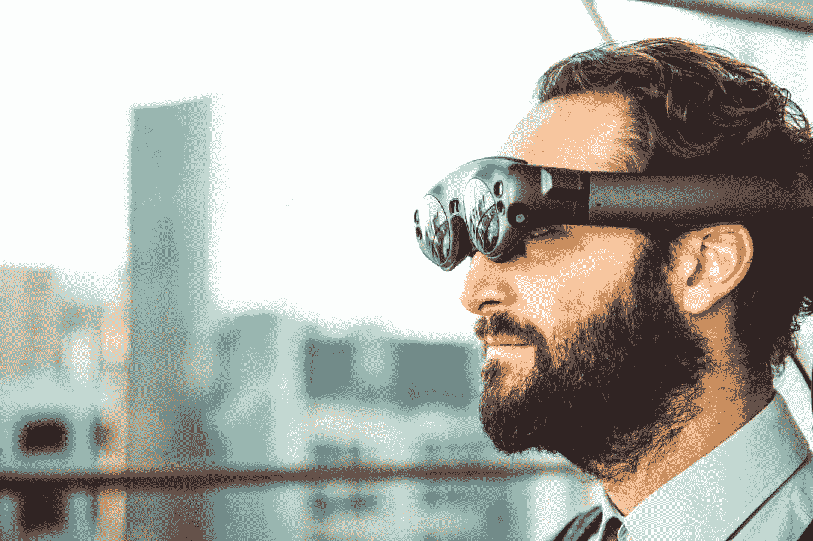
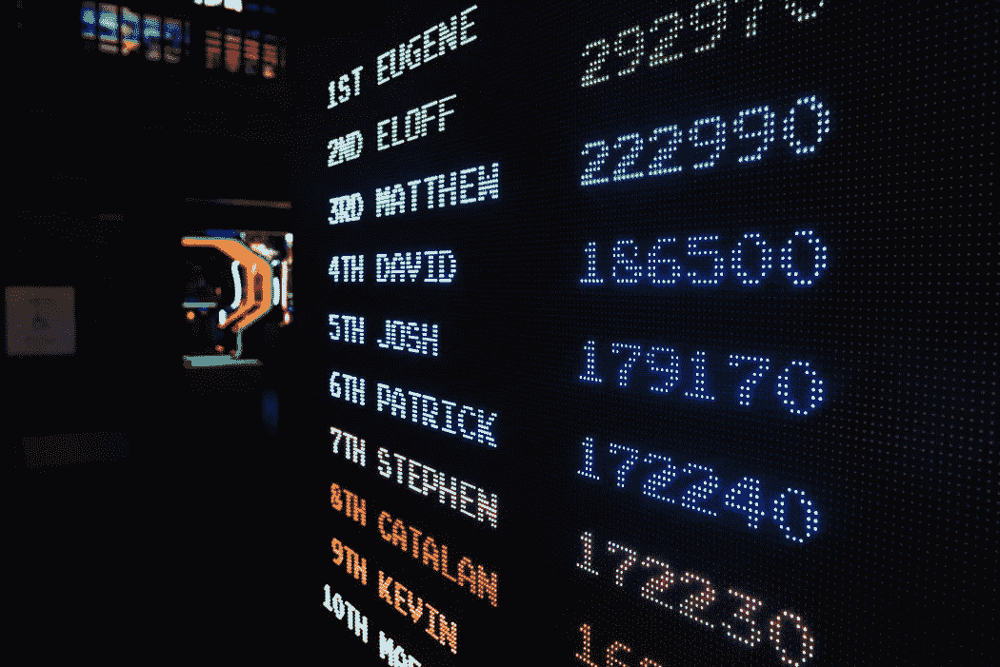
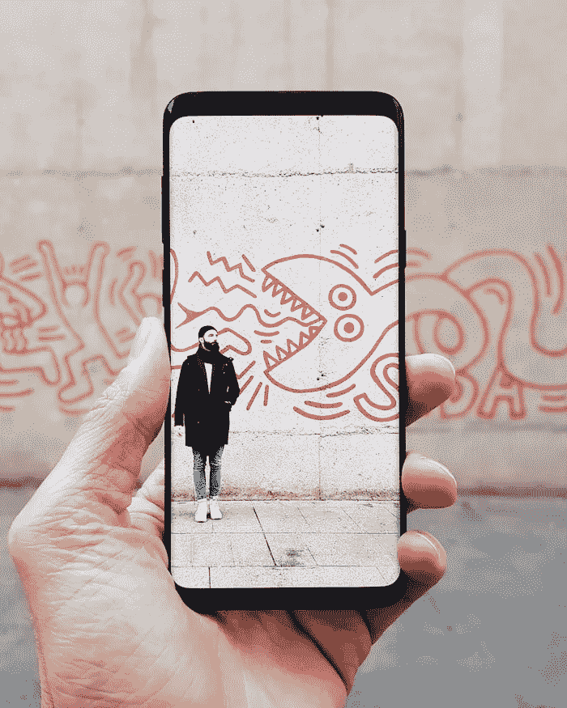
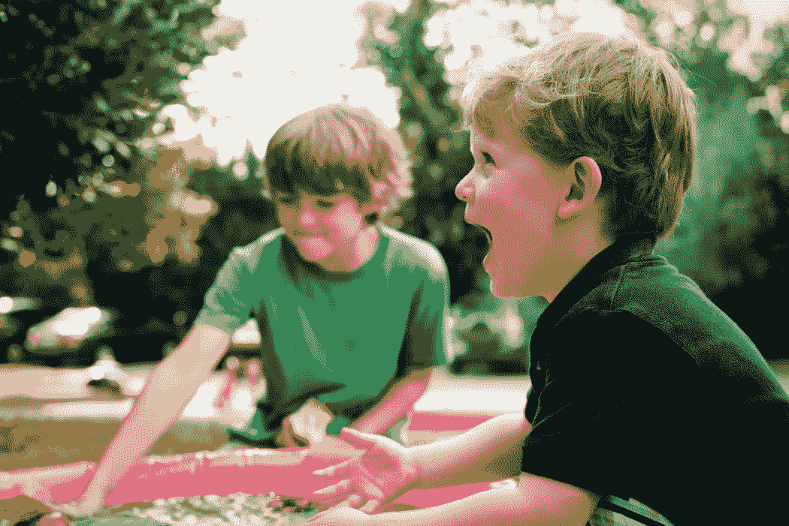
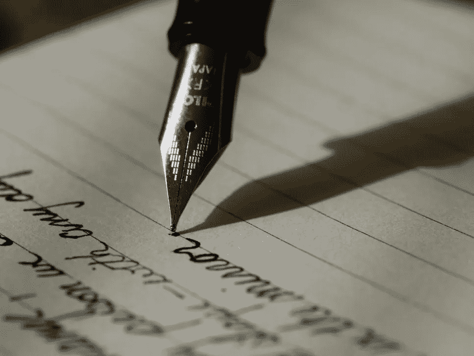
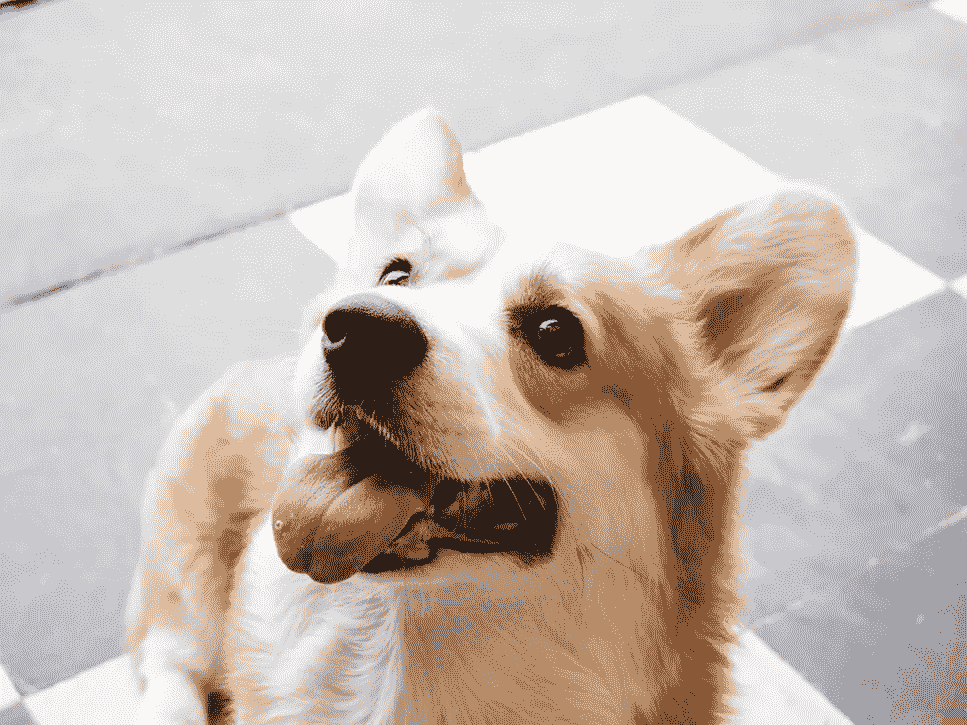
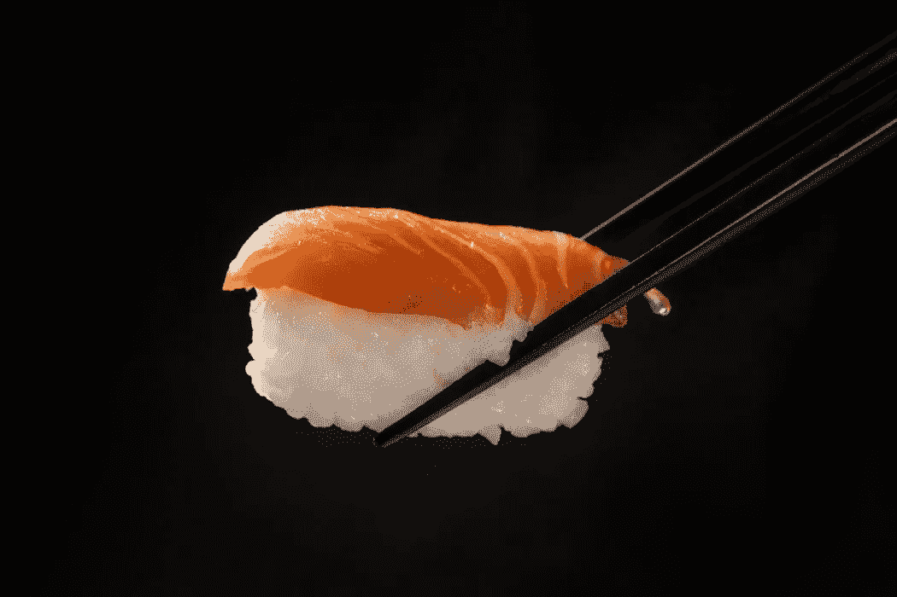
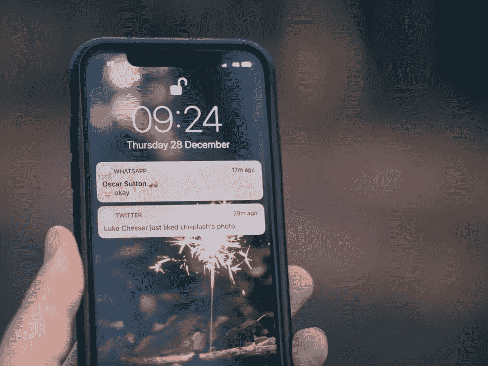

# 20 个增强和混合现实用例

> 原文：<https://betterprogramming.pub/20-augmented-and-mixed-reality-app-ideas-and-inspiration-4806c3976ae3>

## 为你的下一个副业增加趣味

在 [Unsplash](https://unsplash.com/s/photos/augmented-reality?utm_source=unsplash&utm_medium=referral&utm_content=creditCopyText) 上我的名字是 Yanick

查看【superworldapp.com】超级世界[想象一下戴着一副新买的时髦智能眼镜到处走。当你靠近冰箱时，一个类似记事本的小虚拟显示器会在它旁边出现。在记事本上，你或你的另一半已经列出了一些你需要从杂货店购买的物品。你检查了你的冰箱，并添加了另一个项目。该列表会通过云自动同步到您的智能眼镜和智能手机上。当你离开冰箱时，便条消失了，带来另一种令人满意的效果，也许还伴随着一小段声音。你正要离开公寓，门边又弹出一张纸条，提醒你去倒垃圾。](https://medium.com/u/d62c6cb320d5#1 便笺条</h1>

<p id=) [Unsplash](https://unsplash.com/s/photos/projector?utm_source=unsplash&utm_medium=referral&utm_content=creditCopyText) 上 [NeONBRAND](https://unsplash.com/@neonbrand?utm_source=unsplash&utm_medium=referral&utm_content=creditCopyText) 拍摄的照片

# #2 演示

PowerPoint、谷歌幻灯片和类似的程序仍然是向一群人演示的事实标准。这个陈旧的领域正在寻求更好的解决方案——AR/MR 可能就是那个解决方案。向观众展示文本、图像、视频、图表和其他媒体的可能性只受你想象力的限制。如今，3D 数据可视化通常很难创建和使用，但 AR/MR 可能是它们更广泛采用的一个途径。

## 特征

*   准备包含文本、图片、视频等的幻灯片。
*   保存和加载演示文稿。
*   主持其他设备可以连接的演示会话。
*   在集中位置或每个演示者设备的唯一位置显示幻灯片。
*   实时处理 2D、3D 和其他数据。
*   定制幻灯片(文本、背景、数据可视化、过渡、效果等。)
*   在大空间中创建自定义虚拟演示空间。
*   通过演示者和观众控制，使演示具有互动性和个性化。

由[元素 5 数码](https://unsplash.com/@element5digital?utm_source=unsplash&utm_medium=referral&utm_content=creditCopyText)在 [Unsplash](https://unsplash.com/s/photos/score?utm_source=unsplash&utm_medium=referral&utm_content=creditCopyText) 上拍摄

# #3 将一切游戏化

健身、与朋友一起看电影、上下班通勤、遛狗、做饭或做家务——AR/MR 为我们提供了工具，让我们可以做几乎所有更有吸引力的事情。

你的下一个副业项目可能是一个智能眼镜应用程序，它可以跟踪重要的统计数据(可能通过连接到智能手表)，并根据用户在锻炼过程中消耗的卡路里奖励用户积分。这些积分可以在相关商店转换成折扣，或者只是为了与他人竞争而收集。或者，它可以跟踪用户拥抱他们所爱的人的频率，给他们一个分数来衡量他们在一段时间内的情感外向程度。许多游戏化应用已经存在，但智能眼镜将允许这些应用被重新发明，并无缝集成到正在游戏化的活动中。

## 特征

*   通过现有的和新的游戏化技术让用户参与日常活动。
*   与其他用户共享进度。
*   竞争(如排行榜)和合作功能，使日常活动更具社会参与性。
*   可视化时间进程。
*   为用户提供和可视化的建议和提示，以提高游戏化活动的效率或熟练程度。
*   通过与(零售)公司的联合项目奖励用户。

马丁·威登卡在 [Unsplash](https://unsplash.com/s/photos/augmented?utm_source=unsplash&utm_medium=referral&utm_content=creditCopyText) 上的照片

# #4 书籍插图

对于这项技术来说，这是一个显而易见的选择，并且接近现有增强现实应用程序中已经完成的工作。当阅读一本书时——无论是儿童读物、奇幻小说、传记还是教科书——读者的智能眼镜可以产生互动的插图或内容模型。这可以通过两种方式实现，通过二维码或类似的视觉提示，或者通过阅读文本——在这种情况下，书甚至不需要修改。

## 特征

*   显示图像、动画、视频或交互式 3D 模型。
*   播放带有特定术语定义或关于人物、时代、活动等附加背景信息的音频剪辑。
*   识别视觉提示，例如 QR 码，或者使用光学字符识别和自然语言理解来确定播放什么可视化。
*   与可视化的交互。

照片由[艾米莉亚娜霍尔](https://unsplash.com/@emilianatmbg?utm_source=unsplash&utm_medium=referral&utm_content=creditCopyText)在 [Unsplash](https://unsplash.com/s/photos/calendar?utm_source=unsplash&utm_medium=referral&utm_content=creditCopyText) 拍摄

# #5 日历

不用每年都买新日历该有多好？当然，智能手机已经为我们做到了。然而，手机屏幕也许并不像日历放在你生活空间的一面墙上那样自然。AR/MR 应用应该能够轻松地与现有的日历应用集成，使它们能够以更传统的方式使用。

## 特点:

*   与现有日历应用程序集成。
*   将日历挂在墙上。
*   保存和加载日历位置。
*   跨设备同步日历位置。

照片由 [Aron 视觉效果](https://unsplash.com/@aronvisuals?utm_source=unsplash&utm_medium=referral&utm_content=creditCopyText)在 [Unsplash](https://unsplash.com/s/photos/timer?utm_source=unsplash&utm_medium=referral&utm_content=creditCopyText) 上拍摄

# #6 计时器和倒计时

另一个想法已经存在，但可以通过现实世界的位置环境来增强。与其在一个集中的地方(比如你的手机)与几个秒表交互，不如将它们放在不同的地方(比如炉子、微波炉和冰箱)附近，这样会更有帮助。

## 特征

*   在特定位置放置一个或多个定时器。
*   通过文本或图像添加额外的上下文。
*   保存和加载定时器和倒计时。
*   跨设备同步计时器和倒计时。

帕特里克·grądys 在 [Unsplash](https://unsplash.com/s/photos/control-panel?utm_source=unsplash&utm_medium=referral&utm_content=creditCopyText) 上拍摄的照片

# #7 智能家居控制面板

对于更倾向于视觉的智能家庭用户来说，与脱离实体的语音助手交谈可能不是控制他们各种设备的最方便的方式。进入*混合现实控制面板！*

除了与现有的智能家居系统集成之外，要实现这一点所需要的就是在一些直观的 3D 用户界面中包装可交互的选项。

## 特征

*   通过混合现实界面与智能家居系统交互

照片由 [Skyla Design](https://unsplash.com/@skyladesign?utm_source=unsplash&utm_medium=referral&utm_content=creditCopyText) 在 [Unsplash](https://unsplash.com/s/photos/frame?utm_source=unsplash&utm_medium=referral&utm_content=creditCopyText) 上拍摄

# #8 相框

另一个不太牵强的想法是用虚拟相框取代数码相框。不同的实现可以通过视觉提示将它们放置在任何地方或预定的位置。一个稍有不同的应用程序可能会查看物理图像，并在其上添加动画或叠加其他图像。

## 特点:

*   保存和加载图像位置。
*   将图像叠加到视觉线索上。
*   将效果应用于虚拟图像。
*   将效果应用于物理图像。

阿什顿·宾汉姆在 [Unsplash](https://unsplash.com/s/photos/kids?utm_source=unsplash&utm_medium=referral&utm_content=creditCopyText) 上拍摄的照片

# #9 后院守护者

你有孩子或宠物吗？如果是这样，你可能对这种情况比较熟悉。再次想象你在你的厨房或客厅里。当孩子们和/或宠物在后院玩耍时，你正忙着准备晚餐或看电视。你发现自己一直在检查他们。如果有人受伤了，或者更糟的是，有人想抓住他们，而他们正在你的围栏附近。不管怎样，你现在真正需要的是一副 X 射线护目镜，让你能看穿那些讨厌的墙。输入智能眼镜。通过连接到你的孩子或宠物身上的外部摄像头或跟踪设备，这可以实现(无论是后院还是室内)。你可以进一步加强这一点，绘制出你的生活空间并指定安全区域，这样如果有人离开该区域，就会发出警报。

## 特点:

*   连接到摄像头或跟踪设备。
*   将摄像机输出叠加到具有正确转换视角的墙壁上，以将用户的真实世界 3D 视图与感兴趣的区域相匹配。
*   突出显示穿墙跟踪装置。
*   指定、保存和加载安全区域。
*   如果设备离开安全区域，向用户发出警报。

[Alex](https://unsplash.com/@worthyofelegance?utm_source=unsplash&utm_medium=referral&utm_content=creditCopyText) 在 [Unsplash](https://unsplash.com/s/photos/tooth-brush?utm_source=unsplash&utm_medium=referral&utm_content=creditCopyText) 上的照片

# #10 刷牙训练器

大多数人不喜欢去看牙医。尽管如此，许多人没有正确刷牙。有些可能刷的时间不长，或者不够用力，而另一些可能比清洁造成的伤害更大。增强现实可以用来创建刷牙训练器——用户在刷牙时照镜子，应用程序分析刷牙过程。分析将如何工作，我不确定——也许在人工智能和牙科专家的帮助下。

## 特征

*   在镜子前录制智能眼镜的视频流。
*   分析刷牙技巧、持续时间和力度的视频记录。
*   建议使用者如何改善刷牙。
*   奖励用户的改进(有人说游戏化了吗？)或通过与牙医的联合项目。

照片由[米米·蒂安](https://unsplash.com/@mimithian?utm_source=unsplash&utm_medium=referral&utm_content=creditCopyText)在 [Unsplash](https://unsplash.com/s/photos/talking?utm_source=unsplash&utm_medium=referral&utm_content=creditCopyText) 上拍摄

# #11 言语培训师

同样，但可能稍微简单一点的是一个配套应用程序，它可以帮助用户改善他们的讲话，分析语法，不必要的填充词的使用，甚至可能是口才。我们应该注意，记录你每句话的应用程序会有隐私问题。

## 特点:

*   记录用户的声音。
*   分析用户的语音。
*   建议用户如何改善他们的语音。
*   奖励用户的改进(有人说游戏化了吗？)

戴夫·阿达姆松在 [Unsplash](https://unsplash.com/s/photos/football?utm_source=unsplash&utm_medium=referral&utm_content=creditCopyText) 上拍摄的照片

# #12 梦幻体育

这项技术非常适合所有的体育项目，但是梦幻足球和它的同类，特别是，可能会从这项技术中大大受益。不仅个性化的联赛、比赛和球员统计数据可以实时覆盖到实际覆盖范围上，用户还可以直接与信息和其他用户进行交互。

## 特征

*   用幻想相关信息增强体育报道。
*   操纵幻想相关的数据。
*   与其他用户互动。

照片由[丹金](https://unsplash.com/@danielcgold?utm_source=unsplash&utm_medium=referral&utm_content=creditCopyText)在 [Unsplash](https://unsplash.com/s/photos/restaurant?utm_source=unsplash&utm_medium=referral&utm_content=creditCopyText) 上拍摄

# #13 在餐馆吃饭

这是 AR/MR 技术的另一个相当自然的契合点。顾客在看菜单时，可以看到各种食物选择的高质量 3D 模型。模型还可以是可交互的(即移动、旋转或调整模型大小)。最重要的是，可以根据要求提供一顿饭及其配料的营养统计或成本明细。

## 特征

*   可视化菜单项。
*   与菜单项可视化交互。
*   显示膳食的营养统计数据。
*   显示一顿饭原料的成本明细。

照片由 [Louis Hansel @shotsoflouis](https://unsplash.com/@louishansel?utm_source=unsplash&utm_medium=referral&utm_content=creditCopyText) 在 [Unsplash](https://unsplash.com/s/photos/restaurant?utm_source=unsplash&utm_medium=referral&utm_content=creditCopyText) 上拍摄

# #14 在餐馆工作

另一方面，餐馆服务员的生活也可以变得更轻松。做服务员的挑战之一是记录顾客等了多长时间——等着被招呼、拿到菜单、点饮料和食物，以及买单。另一个挑战是接受客人的订单(特别是，如果他们有具体的要求)并回答关于菜单的问题(例如，每天的特色菜是什么)。这两个问题都可以用上面探讨的方法轻松解决:定时器和便签。只需在每张有客人的桌子上放置一个计时器和便条。每当服务员与一桌的客人交谈时，或者当特定事件发生时(订单已被接受，食物已被提供)，计时器可能会重置，而 notes 可以跟踪一桌的订单、饮食限制或账单的累计总额。

## 特征

*   在桌子上方放置计时器。
*   基于不同的条件(接近、与游客交谈、预定义事件发生)重置计时器。
*   在表格上创建和编辑不同类型的注释(订单、饮食限制、账单累计)。

mauro paillex 在 [Unsplash](https://unsplash.com/s/photos/skiing?utm_source=unsplash&utm_medium=referral&utm_content=creditCopyText) 上拍摄的照片

# #15 增强视力

智能眼镜以掠食者的方式增强视力。想象一下在下雨、下雪或有雾的天气里走路、开车，或者滑雪或滑板滑雪。给定一个具有红外或其他类型视觉的高级相机和相当强大的处理器(空间计算往往很昂贵)的设备，人们可以设想一个以对人类视力更友好的方式突出地形的应用程序(例如，通过在识别的表面上放置数字网格——一些现有的应用程序已经可以做到这一点)。

## 特征

*   使用附加传感器识别低能见度条件下的表面。
*   突出已识别的表面。
*   绘制和显示向前或朝向目的地的导航路径，以最大限度地减少障碍或不平坦的地形。

照片由[亚伦·伯顿](https://unsplash.com/@aaronburden?utm_source=unsplash&utm_medium=referral&utm_content=creditCopyText)在 [Unsplash](https://unsplash.com/s/photos/writing?utm_source=unsplash&utm_medium=referral&utm_content=creditCopyText) 上拍摄

# #16 自动更正手写

你多久手写一次东西？在这些文章中，正确的语法有多重要？写作中的个人风格在某些情况下意义重大，比如给朋友或家人写信。

但是在这个电子邮件和短信的世界里，手写往往不太自然，所以我们会犯拼写错误，或者我们的手眼协调能力不如从前。

无论哪种方式，一副可靠的智能眼镜都可以通过扫描你的书写并指出错误来减轻这种痛苦。这种应用程序甚至可以为用户打算写的内容提供建议，就像现有的自动更正解决方案一样。

## 特征

*   实时扫描和理解手写文本。
*   发现错误并提供纠正。

弗洛伦西亚·波特在 [Unsplash](https://unsplash.com/s/photos/corgi?utm_source=unsplash&utm_medium=referral&utm_content=creditCopyText) 上拍摄的照片

# #17 解读宠物情绪

如果你和我一样，你知道想知道宠物在想什么或它们的感受是什么感觉。我更喜欢狗，通常能轻松读懂我们的狗伙伴。另一方面，猫通常躲避我。

可以利用 AR/MR 来了解动物在任何给定时间的感受，也许可以建议与它们互动的方式(例如，类似于*“这只狗在逗你，考虑参加追逐游戏”*或*“这只猫很害怕，最好让它们待着”*)。

## 特征

*   分析宠物的视频流寻找行为线索。
*   暗示合适的反应。

由 [Kelvin Zyteng](https://unsplash.com/@zyteng1997?utm_source=unsplash&utm_medium=referral&utm_content=creditCopyText) 在 [Unsplash](https://unsplash.com/s/photos/sushi?utm_source=unsplash&utm_medium=referral&utm_content=creditCopyText) 上拍摄的照片

# #18 怀孕安全

那些已经怀孕或正在怀孕的人会知道检查准妈妈可以安全食用哪些食物的不便。这是一个持续的争论，可能会通过增强现实应用程序得到缓解。这可以通过拍摄和分析孕妇将要吃的东西来实现。自然，这样的结果应该被仔细检查，因为不是一顿饭的所有成分在任何给定的时间都是可见的。但这个应用程序可能是一个伟大的第一步，让期待父母更容易知道什么是安全的，什么是不安全的。

## 特征

*   分析食物的图像或视频流。
*   显示孕妇是否可以安全食用该食品的结果。

照片由 [Aaron Burden](https://unsplash.com/@aaronburden?utm_source=unsplash&utm_medium=referral&utm_content=creditCopyText) 在 [Unsplash](https://unsplash.com/s/photos/reading?utm_source=unsplash&utm_medium=referral&utm_content=creditCopyText)

# #19 学习阅读

沿着与书中插图类似的路线，AR/MR 可以与自然语言理解相结合来帮助人们学习如何阅读。智能眼镜可以扫描正在阅读的页面，听读者试图大声朗读文本，分析并检查发音和间隙等，当读者似乎卡住时提供帮助。

## 特点:

*   扫描和理解书籍页面上的文本。
*   倾听并理解读者。
*   分析音频的发音错误和阅读速度/流程。
*   当读者陷入困境时提供建议。
*   突出显示出错的部分或特定单词，并提示读者重读它们。
*   奖励表现良好的读者，并鼓励他们保持决心(有人说游戏化吗？)

照片由[杰米街](https://unsplash.com/@jamie452?utm_source=unsplash&utm_medium=referral&utm_content=creditCopyText)上的 [Unsplash](https://unsplash.com/s/photos/notification?utm_source=unsplash&utm_medium=referral&utm_content=creditCopyText)

# #20 个通知

每个人都熟悉通知。收到新的电子邮件、短信或附近解锁的 WiFi 热点，通知一定会让你知道。

手机有几种方式提醒用户新的通知:通过振动(触觉提示)、声音(音频提示)和某种显示的信息(视觉提示)。虽然我们都习惯并关注它们，但通知和它们的线索可能会在 AR/MR 中发生革命性的变化。也许一个动画邮递员不知从哪里冒出来，通过虚拟邮件向你发送新的通知。或者，每个通知可以由出现在背景中的拍摄开始以及一些相关的(或定制的)声音效果来标记。

## 特征

*   以众所周知的方式实现通知。
*   增强传统的通知系统。
*   从头开始创新通知。