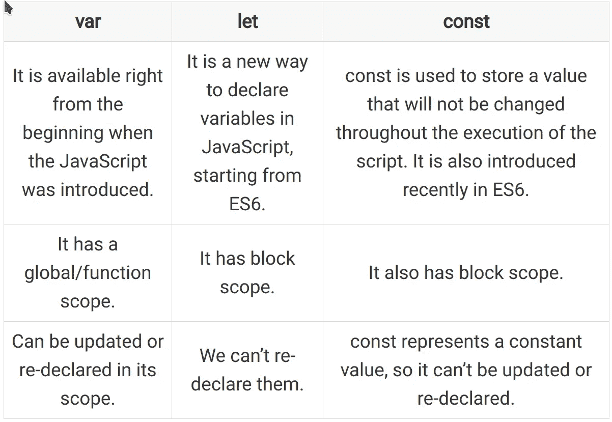
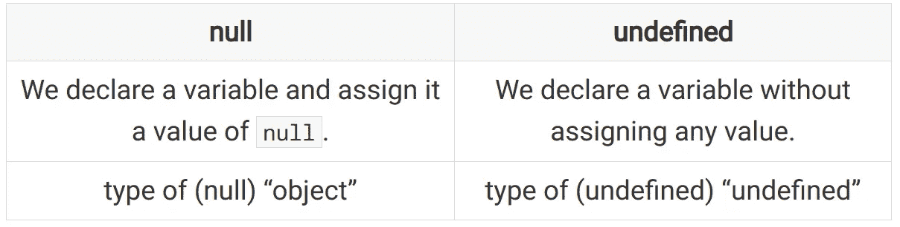

# 20 个常见的 JavaScript 面试问题

> 原文：<https://betterprogramming.pub/20-common-javascript-interview-questions-66e9e376f766>

## 熟悉一下，这样他们就不会在面试时让你措手不及


克里斯蒂娜@ wocintechchat.com 在 [Unsplash](https://unsplash.com?utm_source=medium&utm_medium=referral) 上的照片

面试是招聘过程中很重要的一部分。它提供了关于技能和知识的见解，以及个人承担挑战性任务的能力。对于雇主来说，这也是筛选出不适合某个职位的候选人的最可靠的方法之一。

作为一名 JavaScript 开发人员，你必须在参加考试或面试之前做好准备。这会增加你被知名公司雇佣的机会。

现在，你可能想知道从哪里开始准备，或者他们会在面试中问什么问题。为了帮助你，我整理了一份 JavaScript 面试常见问题的列表。每个问题都有一个简短的答案，您可以在下面查看。

最后，你会更有信心回答面试官的任何问题。事不宜迟，我们开始吧。

# 1.JavaScript 是什么？

JavaScript 是 Netscape 在 1995 年创建的一种脚本语言。它最初用于流行的网络浏览器 Netscape Navigator。但是现在我们可以将它用于客户端和服务器端的应用程序开发。

好吧，我想没有人会问这个，但是我们不要忘记 JavaScript 是从哪里来的。

# 2.列出 JavaScript 的一些优点

*   JavaScript 可以在网络浏览器中离线工作。
*   它支持多种编程范例。例如，我们可以利用面向对象、函数式和命令式编程概念。
*   它拥有最大的开源库和框架集合。
*   JavaScript 能够创建在线/离线游戏、桌面软件、网站和移动应用程序。
*   不需要学习单独的编程语言来创建一个网站的前端和后端。所有主流的 web 浏览器都支持 JavaScript，它可以在使用 Node.js 的服务器上运行。
*   它是一种解释型语言，这意味着我们不必在使用之前构建或编译它的代码。JavaScript 指令直接执行。

# 3.我们应该使用内部的还是外部的 JavaScript？

当我们只需要在单个网页上使用它时，内部 JavaScript 更合适。然而，对于有多个网页的网站，总是倾向于使用外部 JavaScript 文件。

# 4.为什么像 Autoptimize 这样的 WordPress 插件会在一个文件中聚合 JavaScript 代码？

JavaScript 源代码在单个文件中的聚合减少了生成网页时向服务器发出的请求数量。反过来，它使一个网站加载速度更快。

例如，假设我们在一个网页上包含了十个 JavaScript 文件。当我们打开这个网页时，我们的网络浏览器向服务器发送十个 HTTP 请求来检索这些文件。另一方面，如果我们将所有这些文件的代码聚合成一个，那么我们只需要向服务器发出一个请求。

# 5.什么是 JavaScript 提升？

提升是 JavaScript 中的一个概念，它允许我们甚至在声明变量和函数之前就使用它们。

基本上，当我们执行一段 JavaScript 代码时，首先它会自动从代码中提取所有变量和函数声明，并将它们移动到作用域的顶部。之后，它开始执行代码。

提升的主要好处是我们的代码能够正确工作，不会显示任何错误，比如“未定义的变量”或“未定义的函数”

# 6.预测以下代码的输出

## 密码

```
username = "Juan Cruz Martinez";
var username; // variable declaration
var username; // redeclared the variable
console.log(username);
```

## 输出

```
Juan Cruz Martinez
```

## 说明

*   首先，第 2 行和第 3 行的变量声明将被认为是一个语句。
*   现在，将应用提升的概念，这意味着 JavaScript 将变量声明移动到顶部。之后，代码将被执行。
*   此外，请记住，即使我们重新声明变量，存储在变量中的值也不会丢失。

# 7.什么是 JavaScript 严格模式？

如果我们犯了一个小错误，JavaScript 的默认行为是非常宽容的。这意味着它不会显示任何错误消息。但是有时候在开发中，为了调试代码，我们需要看到各种错误和警告。

下面是 JavaScript 中*严格模式*的使用。基本上，它是一个受限制的变体，JavaScript 显示所有的错误和警告，即使它们是无声的。

我们可以通过在脚本开头使用`"use strict";`指令来启用严格模式。

# 8.苗条身材的替代品有哪些？

[Svelte](https://svelte.dev/) 是 JavaScript 编程语言的前端开发框架。一些受欢迎的替代方案包括:

*   反应
*   vue . j
*   有角的

# 9.什么是自调用函数？

自调用函数与普通函数略有不同，因为它们是在声明的地方立即执行的。

通常，我们首先声明一个函数，然后调用它。但是 JavaScript 会在运行时自动执行自调用函数的代码。

需要注意的一点是，这些函数没有任何名称。反过来，我们也无法回忆起这些类型的函数。它们也被称为*匿名函数*。

这里有一个自调用函数的例子。

```
(function (){
	var a = 12;
	var b = 3;
	console.log(a * b);
}());
```

# 10.var，let，const 有什么区别？



# 11.==和===有什么区别？

这两者都在 JavaScript 中用于比较两个值。


# 12.null 和未定义的关键字有什么区别吗？

这两个关键字都表示一个空值。但是 null 和 undefined 之间有两个基本区别。



# 13.区分函数声明和函数表达式

基本上，*函数声明*只不过是使用关键字`function`、唯一名称、参数和函数体定义函数的正常过程，而当我们将函数声明赋给变量时，它就变成了*函数表达式*。

有趣的是，函数表达式没有被提升。这意味着，如果您试图在定义之前调用它们，它们将显示一个错误。

## 函数声明

```
function full_name(first_name, last_name)
{
	return first_name + " " + last_name;
}
```

## 函数表达式

```
var addition = function add(value_1, value_2)
{
	return value_1 + value_2;
}
```

# 14.什么是终结？

JavaScript 中的一个*闭包*是另一个函数内部的一个函数。内部函数可以访问自己的变量，外部函数中定义的变量以及全局变量。

## 关闭示例

# 15.预测这两个函数的输出。它们是否会返回相同的输出？

## 函数 user1()的输出

`{name: "Juan"}`

## 函数 user2()的输出

```
undefined
```

# 16.南是什么？

在 JavaScript 中，NaN 代表的不是一个数字。这是一个特殊的值，当我们无法执行操作时就会出现。

例如，如果我们试图用一个数字(例如，“Hello World”/5)来划分一个字符串，会怎么样呢？

# 17.解释 for-in 循环

`for-in`循环是专门设计来逐步遍历对象的所有属性的。它在每次迭代中从对象中选择一个属性，并对其执行所需的操作。

我们试着借助一个例子来理解一下。

## 输出

```
name -> Juan
country -> Germany
website -> livecodestream.dev
```

# 18.什么是事件冒泡和捕获？

在 JavaScript DOM 中，HTML 元素嵌套在一起形成一个层次结构。

现在，如果父元素和子元素都注册了特定事件的句柄，那么事件传播的顺序是什么？

有两种方法可以确定，分别是*事件冒泡*和*捕获*。

在事件冒泡中，子元素将首先捕获事件，然后将其传播到父元素。在事件捕获中，父元素将首先捕获事件，然后将其传播给子元素。

# 19.JavaScript 和 ECMA 脚本有什么区别？

JavaScript 是一种脚本语言，而 [ECMA 脚本](https://www.ecma-international.org/ecma-262/)是一个指南和规则的集合，用于跨不同的网络浏览器标准化 JavaScript。

# 20.如何使用 JavaScript 创建 Cookie？

在 JavaScript 中，可以使用`document.cookie`对象创建 cookie。只需给它分配一个字符串值，这个字符串值就是一系列用分号分隔的键值对。

## JavaScript 创建 cookie 示例

```
document.cookie = "username=Juan; expires=Wed, 03 Oct 2030 12:00:00 UTC; path=/";
```

# 结论

雇主通常会问一些刁钻的问题来迷惑应聘者。如果你没有做好充分的准备，那么很有可能你最终会失去机会。

今天我试着回答一些常见的 JavaScript 面试问题。你甚至可以在去面试前用这篇文章作为参考。

感谢阅读！