# 20 个鼓舞人心的前端挑战您可以从今天开始编码

> 原文：<https://betterprogramming.pub/20-inspirational-front-end-challenges-you-can-start-coding-today-1a7ebd5c5798>

## 挑战自我，让你的前端技能更上一层楼

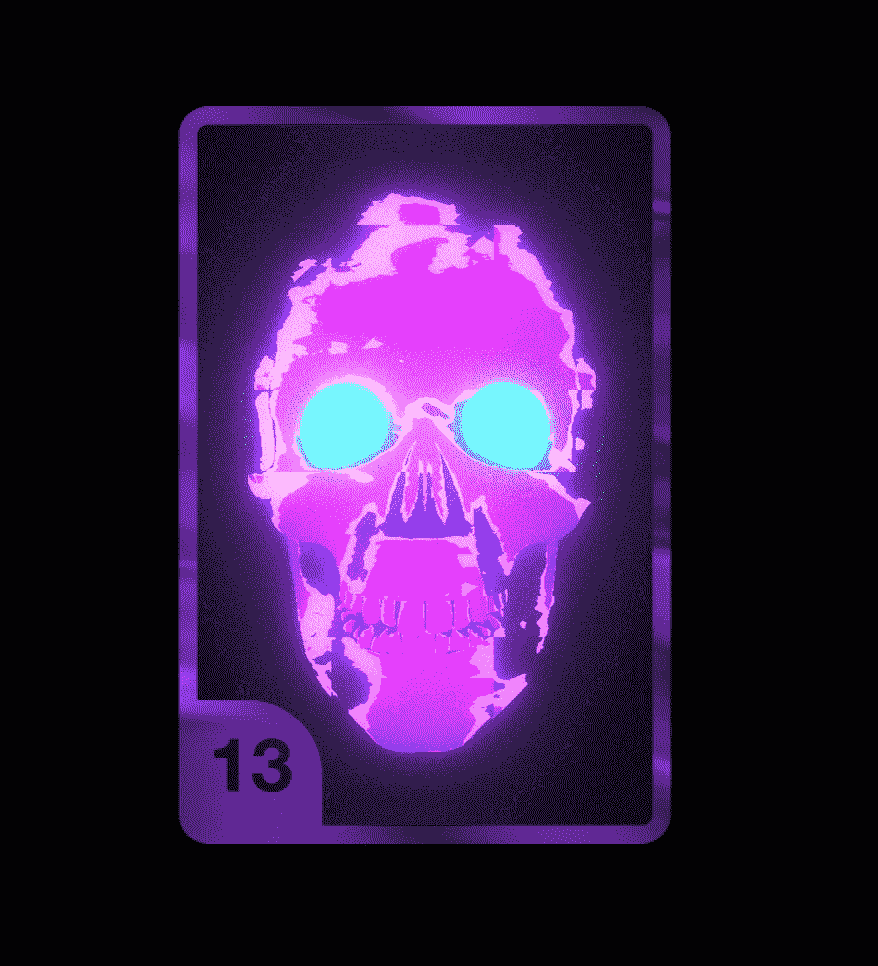

[幽灵卡](https://codepen.io/pizza3/full/pobevYW)—[尤甘](https://codepen.io/pizza3)

作为一个开发者，项目越多，经验越多，你就变得越优秀。编码是一块肌肉，像其他肌肉一样，需要不断的锻炼。

为什么不花几个晚上做一个兼职项目，并付出额外的努力来变得格外擅长编码呢？

事不宜迟，这里列出了提高前端开发技能的编码思路。用这篇文章作为你下一个项目的灵感来源。

**这是你今天可以开始编码的挑战的完整列表。**

# **1。幽灵卡(专家)**

幽灵卡的概念是一个燃烧的骷髅，用 CSS 和 JavaScript 制作动画。

每个前端开发人员都需要了解如何创建流畅的动画和过渡的基础知识。

这是你的机会，通过重现这个可怕的燃烧头骨来提升你的游戏。

[幽灵卡](https://codepen.io/pizza3/full/pobevYW) —由 [Yugam](https://codepen.io/pizza3)

## 下面是你通过建立幽灵卡将学到的东西

*   掌握 CSS——了解转场、关键帧和动画都是重新创建动画所必需的
*   熟练理解动画的 3D 建模和 3D 物理——你需要后者来理解如何为火焰创建感觉直观的平滑过渡。

# 2.求职平台界面(中级)

求职平台 UI 是一个现代化的，外观干净的求职平台。

该平台包含了每个雇主期望从一个体面的前端开发人员那里得到的大部分功能。

[求职平台 UI](https://codepen.io/TurkAysenur/full/jOqdNbm) —作者 [Aysenur Turk](https://codepen.io/TurkAysenur)

## 下面是你通过构建求职平台 UI 将学到的东西

*   HTML —您将掌握如何使用布局的理解。
*   CSS——这个平台需要一些关于如何设计按钮、卡片等样式的知识。
*   JavaScript——在搜索工作时有过滤器。您需要弄清楚如何用 JavaScript 来做到这一点。

# **3。CSSometric 变形动画(专家)**

CSSometric 动画可以作为一个简洁的进度加载指示器。

比如——用户在上传图片？在图像上传到服务器时显示动画。

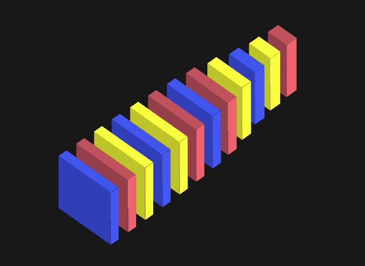

—[瑞安·穆里根](https://codepen.io/hexagoncircle)

## 以下是您将通过构建 CSSometric 变形动画学到的内容

*   掌握 CSS——了解转场、关键帧和动画都是重新创建动画所必需的
*   熟练理解动画的 3D 建模和 3D 物理

# **4。万圣节风格的动画(中级)**

万圣节动画是一个以万圣节为主题的圆圈，有一个旋转的动画。

圆圈会根据黑色在圆圈上出现的位置而变化。

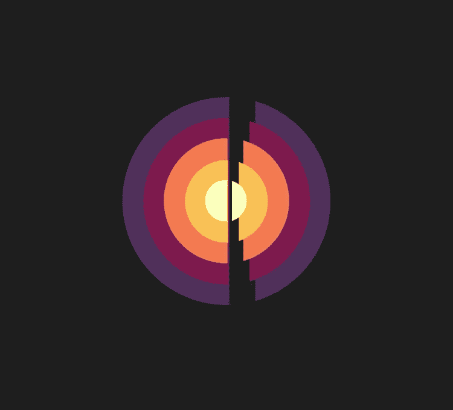

[万圣节](https://codepen.io/thebabydino/pen/mdERmQB)——作者[安娜·都铎](https://codepen.io/thebabydino)

## 下面是你将通过构建万圣节动画学到的东西

*   对带有关键帧、过渡和计时的 CSS 动画有很好的理解
*   对 HTML 的基本理解——你需要用 HTML 在画布上画圆。请记住，您可以使用 JavaScript 在画布上画圆。

可以[看安娜·都铎的这个动画的分步教程](https://www.youtube.com/watch?reload=9&v=oXP4qjvme3o&feature=youtu.be)。

# 5.10162020 动画(专家)

10162020 动画有彩色的鹅卵石连着从天上掉下来的绳子。

[10162020](https://codepen.io/toshiya-marukubo/pen/wvWGGbK) —作者[丸久保俊哉](https://codepen.io/toshiya-marukubo)

## 通过构建 10162020 动画，您将学到以下内容

*   掌握 CSS——了解转场、关键帧和动画都是重新创建 10162020 动画所必需的
*   熟练理解动画的 3D 建模和 3D 物理

# 6.**仅 CSS 交互式 3D 骰子**(中级)

以下挑战要求你掷骰子。但不是任何普通的骰子——这个骰子需要能够根据控件旋转角度。

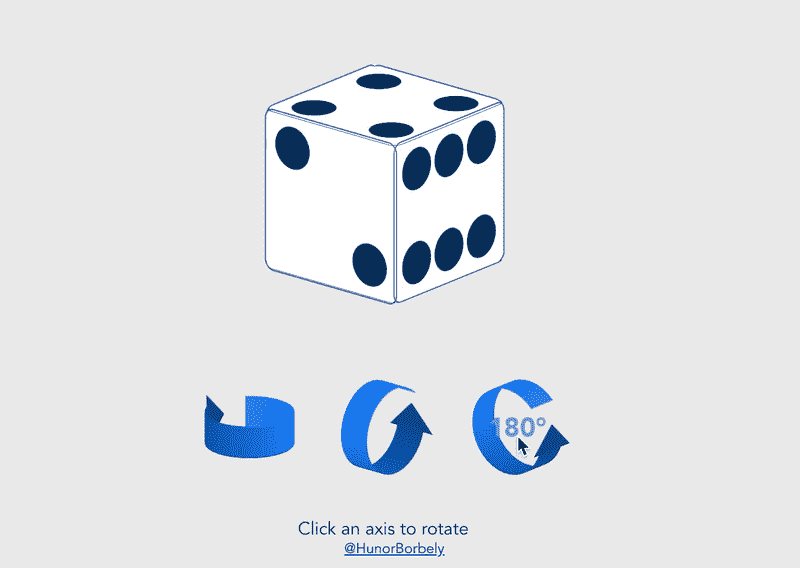

[纯 CSS 交互式 3D 骰子](https://codepen.io/HunorMarton/pen/mdERrLy)”——作者[胡诺尔·马顿·博贝利](https://codepen.io/HunorMarton)

## 这是你通过构建仅 CSS 交互式 3D 骰子将学到的东西

*   对 CSS 的 3D 效果有基本的了解。您需要根据用户输入旋转骰子。
*   对 JavaScript 事件的基本理解——当用户点击控件时，您必须根据输入旋转骰子。

# 7.喵喵键盘(用声音试试)

喵喵键盘是一种基于网络的钢琴，演奏起来像任何普通的钢琴，但是——你猜对了！声音被猫的喵喵叫声取代。

这是一个有趣的项目——你自己试试吧！

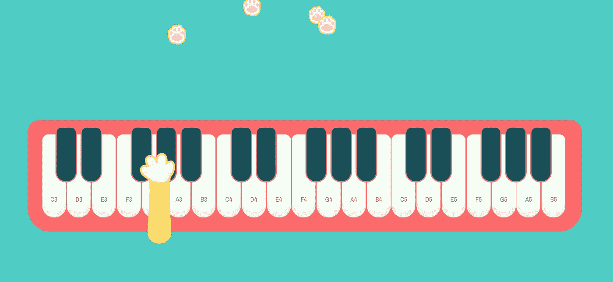

[喵喵键盘](https://codepen.io/laurenvast/pen/jOrWXej)——作者[劳伦·王](https://codepen.io/laurenvast)

## 这是你通过构建喵喵键盘将学到的东西

*   对 [Tone.js](https://tonejs.github.io/) 的基本理解——喵喵喵键盘大量使用音库来操纵声音。

> " Tone.js 是一个网络音频框架，用于在浏览器中创建交互式音乐."— [官方 Tone.js 网站](https://tonejs.github.io/)。

*   对 CSS 和 HTML 的基本理解，用于重新创建键盘及其包含的动画

# 8. **Lo-Fi 顺风 CSS 用户头像堆栈(初学者)**

这产生了使用[顺风](https://tailwindcss.com/)构建的整洁的头像堆栈。这些常见的头像堆栈可以在互联网的许多小巷中找到。我相信你以前已经在某个地方见过它们了——为什么不创造自己的呢？

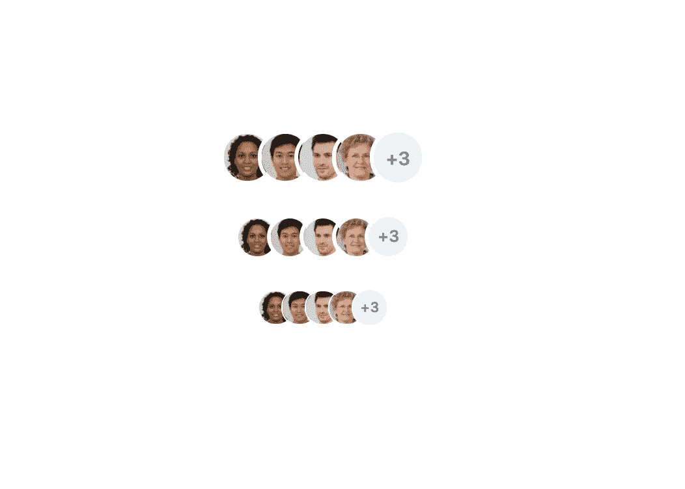

[低保真顺风 CSS 用户头像堆栈](https://codepen.io/robstinson/pen/NWrrgej)—[Rob](https://codepen.io/robstinson/pen/NWrrgej)

## 下面是你通过构建低保真顺风 CSS 用户头像堆栈将学到的东西

*   对 HTML 和 CSS 有基本的了解
*   基本了解如何使用[顺风库](https://tailwindcss.com/)

> “Tailwind CSS 是一个高度可定制的低级 CSS 框架，它为您提供了构建定制设计所需的所有构件，而没有您必须努力克服的任何恼人的固执己见的风格。”— [官方顺风网站](https://tailwindcss.com/)。

# 9.**新形态加载动画(中级)**

新形态的加载动画看起来整洁而催眠。它可以作为进度指示器用于各种加载页面。

注意:您还可以更改加载动画的颜色，使其具有多种颜色。

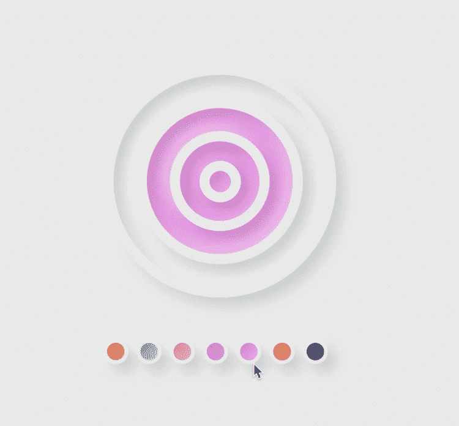

[新形态加载动画](https://codepen.io/ruphaa/pen/QWENjRr)—[鲁法·甘内什](https://codepen.io/ruphaa)

## 这是你将通过构建神经形态加载动画学到的东西

*   理解 CSS 动画的基础，使用 CSS 关键帧，过渡等。
*   改变动画颜色的 JavaScript 基础。

# 10.无限铅笔旋转(初学者)

一支无限旋转的铅笔。铅笔不是图像，但它是用 CSS“手工雕刻”的。这使得它更具挑战性和趣味性。

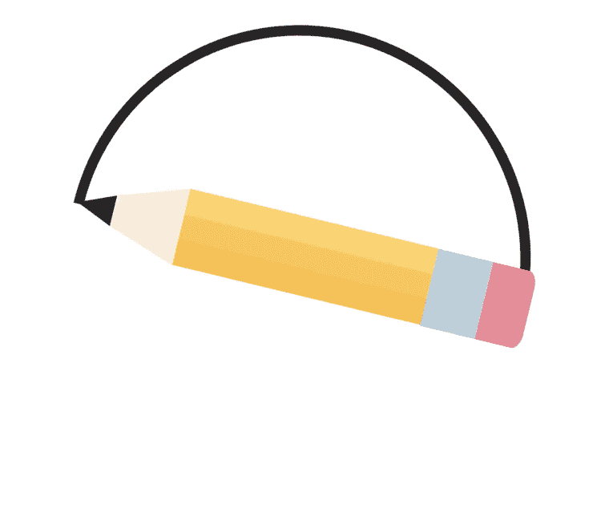

[无限铅笔旋转](https://codepen.io/ruphaa/pen/yQBEBY)—[鲁法·加内什](https://codepen.io/ruphaa)

## 下面是你将通过构建无限铅笔旋转学到的东西

*   理解 CSS 动画和使用 CSS 关键帧，过渡等的基础知识。
*   如何使用 HTML 和 CSS 创建铅笔

# 11.迷你 Insta-好友列表布局(初学者)

迷你 Insta-Friends 列表布局概念的灵感主要来自最初的 Instagram stories 功能。

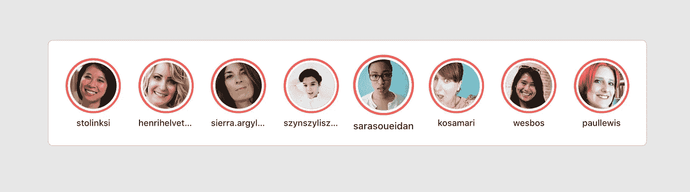

[迷你 Insta-Friends 滚动列表布局](https://codepen.io/argyleink/pen/bGegorL)—[亚当·阿盖尔](https://codepen.io/argyleink)

## 通过构建迷你 Insta 好友列表布局，您将了解到以下内容

*   如何使用 HTML 创建一个流畅的布局
*   CSS 和布局样式的基础知识

# 12.链接悬停动画(初学者)

每当您将鼠标悬停在链接上时，链接悬停动画都会产生一个外观整洁的悬停动画。动画会在链接周围画一个圆。

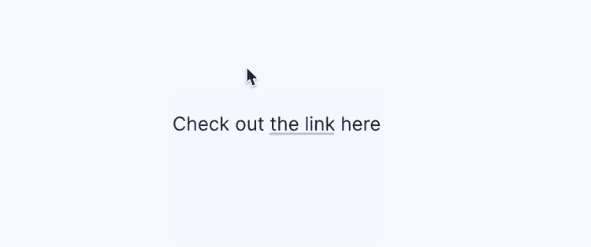

[链接悬停动画](https://codepen.io/aaroniker)——作者[亚伦·伊克尔](https://codepen.io/aaroniker)

## 下面是您将通过构建链接悬停动画学到的内容

*   使用 HTML 和 CSS 的基础知识
*   了解 CSS 的悬停动画

# 13.**带缩放视图的快速详情(初学者)**

带有缩放视图的快速详细信息是类似商店的产品概述。在网上购物时，你通常会看到类似的布局。

[带缩放视图的快速细节](https://codepen.io/JorgeAguilar/pen/VwjeJYO) —作者 [Jorge Aguilar](https://codepen.io/JorgeAguilar)

## 通过使用缩放视图构建快速详细信息，您将学到以下内容

*   使用 HTML 和 CSS 的基础。
*   理解 CSS 的悬停动画。在这种情况下，您将根据光标所在的位置显示和隐藏元素。

# 14.纯 CSS 的幽灵(初学者)

呀！一个鬼！

鬼魂不是一个图像。只是用 CSS“手绘”的。挑战你的 CSS 技能，尝试只用 CSS 编写一个幽灵。

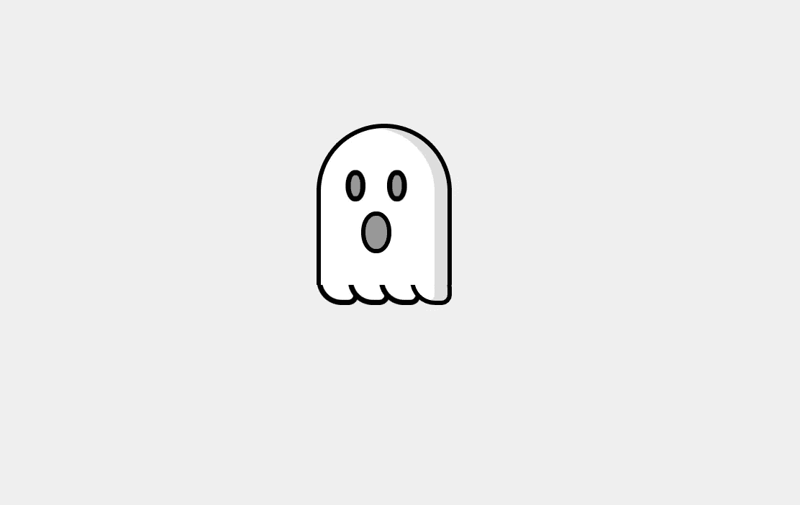

[幽灵👻](https://codepen.io/havardob/pen/BazRQyj) —作者[哈瓦德·布林朱尔森](https://codepen.io/havardob)

## 下面是您将通过构建仅支持 CSS 的 Ghost 学到的东西

*   对 CSS 和 HTML 有扎实的理解

# 15.热狗按钮(初学者)

这个热狗外观的按钮非常适合食品配送或食品订购应用程序。为什么不创造一些用户会记得的东西呢？

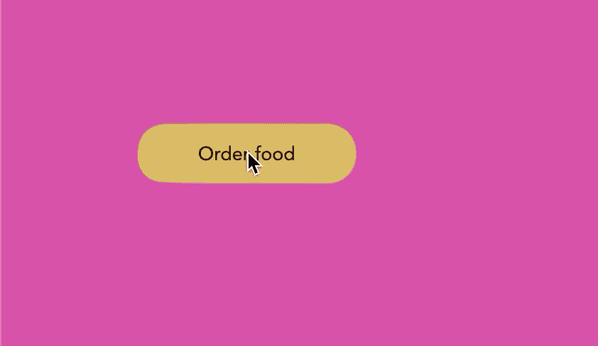

[热狗按钮](https://codepen.io/sdras/pen/qBbyZPE)—[莎拉·德拉斯纳](https://codepen.io/sdras)

## 下面是您将通过构建热狗按钮学到的内容

*   对 CSS 和 HTML 有扎实的理解。
*   对如何使用 CSS 动画有扎实的理解。

# 16.仅 CSS 开发人员 Avocado(中级)

谁不爱吃牛油果？它们对你有好处，是很棒的早餐。

仔细看看——关于这个挑战有许多细节。注意鳄梨周围温和的梯度和粗糙的边缘。

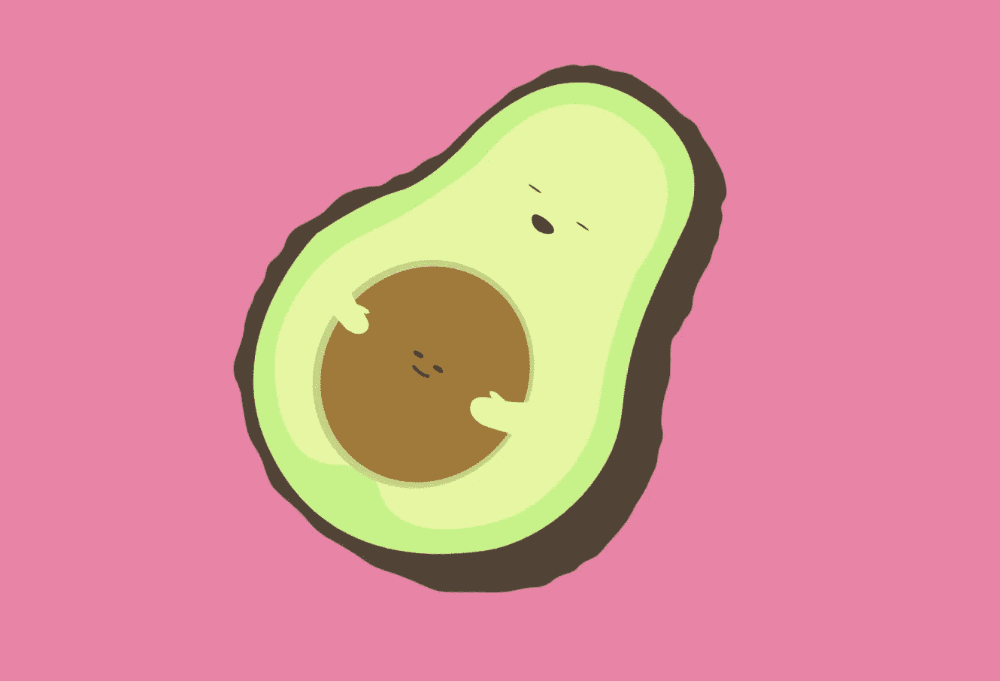

[开发者鳄梨](https://codepen.io/sdras/pen/yRVYGo)——作者[莎拉·德拉斯纳](https://codepen.io/sdras)

## 下面是您将通过构建仅支持 CSS 的开发人员 Avocado 学到的东西

*   掌握 CSS 以及如何绘制复杂的对象。
*   对非凡的细节有敏锐的洞察力。

# 17.灰色突发抽象动画(专家)

灰色爆发动画是明亮背景上基于黑暗主题的光爆发。

注意:动画中有多种色调和不同的协调。

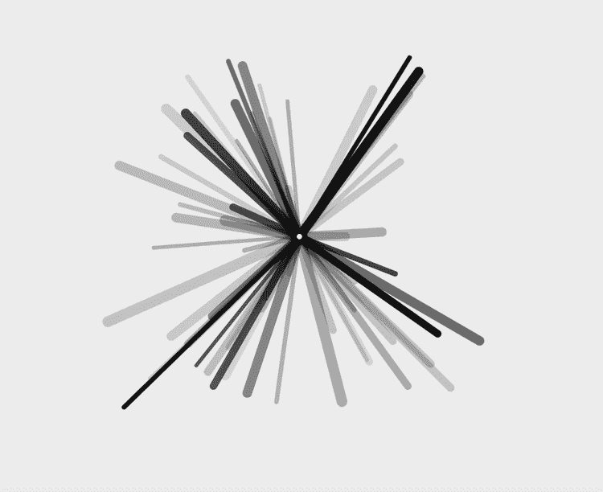

[灰色爆发](https://codepen.io/chriscoyier/pen/OJXNeyP) —作者[克里斯·科伊尔](https://codepen.io/chriscoyier)

## 以下是您将通过构建灰色爆发抽象动画学到的内容

*   掌握 CSS 动画，结合 JavaScript
*   使用可缩放矢量图形(也称为 SVG)的深入知识

# 18.仅城市 CSS 插图(中间)

城市背景插图是一座现代城市。这不是一个图像，而是使用 CSS 和 JavaScript 绘制的。

注意背景中的所有小细节。那些都是用 CSS 和 JavaScript 绘制的。

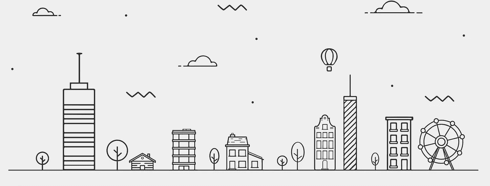

[城市插图](https://codepen.io/lisilinhart/pen/MoqMQq) —作者[李思](https://codepen.io/lisilinhart)

## 以下是您将通过构建仅使用 CSS 的城市插图学到的内容

*   深入了解 CSS 以及如何编写复杂的
*   对 JavaScript 有扎实的理解，并将其与 CSS 和 HTML 相结合

# 19.带语音识别的 SVG 动画(专家)

用你的声音或鼠标切换动画。动画与语音识别一起工作。通过允许使用麦克风，您可以根据输入更改动画。

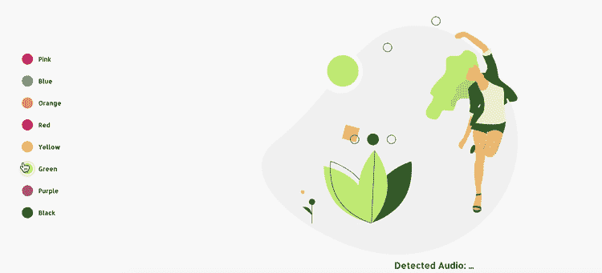

[带语音识别的 SVG 动画](https://codepen.io/lisilinhart/pen/NVKOPo) —作者[李思](https://codepen.io/lisilinhart)

## 下面是通过构建带有语音识别的 SVG 动画您将学到的东西

*   实验性(截至 2020 年末)语音识别 API 的使用

> [Web 语音 API](https://developer.mozilla.org/en-US/docs/Web/API/Web_Speech_API) 的`SpeechRecognition`接口是识别服务的控制器接口；它还处理从识别服务发送的`[SpeechRecognitionEvent](https://developer.mozilla.org/en-US/docs/Web/API/SpeechRecognitionEvent)`。— [Mozilla 文档](https://developer.mozilla.org/en-US/docs/Web/API/SpeechRecognition)。

*   对 SVGS、CSS 和 HTML 有深入的了解

# 20.平滑明暗主题切换(初学者)

我们都知道并喜欢这个特性。如今，每个应用程序都允许我们在一个黑暗或明亮的主题之间切换。为什么不学习它是如何工作的？

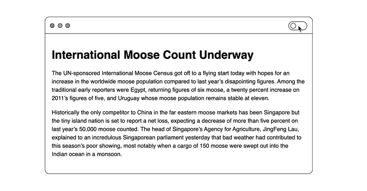

[拨动](https://codepen.io/dope/pen/LYZRvNv) —由[托座](https://codepen.io/dope)

## 下面是你将通过构建平滑的明暗主题切换学到的东西

*   对 CSS 变量的基本理解
*   如何使用 JavaScript 和事件

# 结论

你坚持到了最后！感谢阅读。我希望你能受到鼓舞。编码快乐！

**附言:寻找更多的编码思路？永远不要耗尽编码的想法，永远不要。** [**在这里获取权限来一堆前端挑战被我。**](https://gumroad.com/l/IuqKc)

了解我最新内容的最好方式是通过我的[时事通讯](https://wholesomedev.substack.com/welcome)。成为第一个得到通知的人。

[https://wholesomedev.substack.com/welcome](https://wholesomedev.substack.com/welcome)