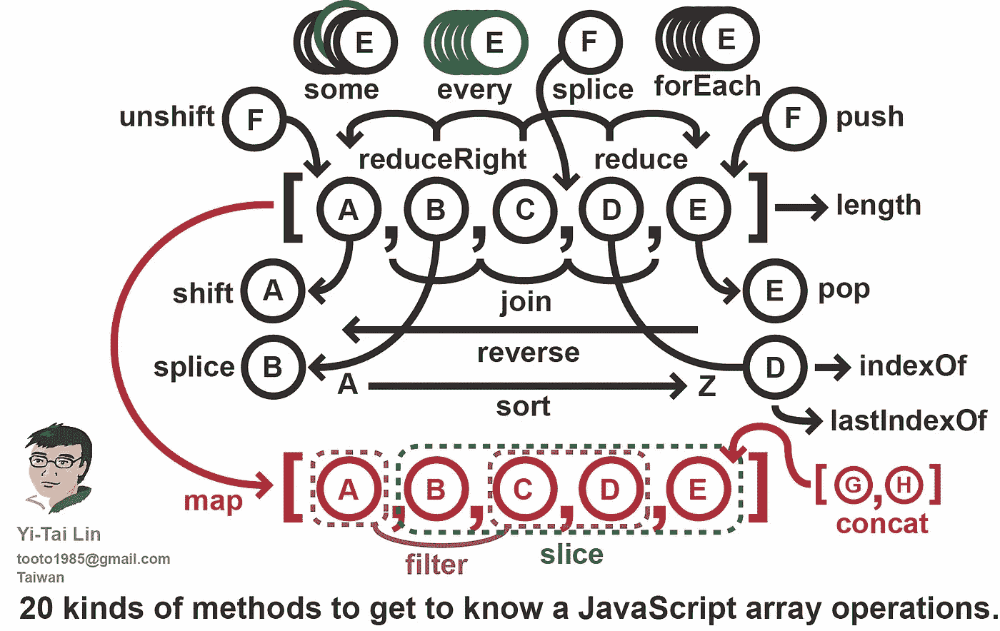

# 了解 JavaScript 数组操作的 20 种方法

> 原文：<https://betterprogramming.pub/20-methods-to-get-to-know-javascript-array-operations-6935e757729b>

## 了解 JavaScript 中许多可用于数组的方法



图像布衣-泰林

让我们创建一个数组。

```
var foods =  ["🍎", "🍊", "🍗", "🍕", "🥩"];
```

# 1.长度

返回数组中元素的个数。

```
**foods.length;** // 5
```

提示:我们可以改变`length`属性来删除元素。

```
foods.length = 0;foods; // []
```

# 2.推

将元素添加到数组的末尾。

```
var foods =  ["🍎", "🍊", "🍗", "🍕", "🥩"];**foods.push('🍇');**foods; // **["🍎", "🍊", "🍗", "🍕", "🥩", "🍇"]**
```

提示:使用带有扩展操作符(`…`)的 push 作为`concat`方法的替代方法。

```
var numbers = [1,2,3,4,5];var num2 = [6,7,8,9,10];**numbers.push(...num2);**
```

# 3.松开打字机或键盘的字型变换键

将元素添加到数组的开头。

```
var foods =  ["🍎", "🍊", "🍗", "🍕", "🥩"];**foods.unshift('🍇');**foods; // **["🍇", "🍎", "🍊", "🍗", "🍕", "🥩"]**
```

提示:使用 unshift 和 spread 操作符(`…`)在开头连接元素。

```
var numbers = [1,2,3,4,5];var num2 = [6,7,8,9,10];**numbers.unshift(...num2);**
```

# 4.流行音乐

移除数组的最后一个元素。

```
var foods =  ["🍎", "🍊", "🍗", "🍕", "🥩"];**foods.pop()**;  // "🥩"foods; // **["🍎", "🍊", "🍗", "🍕"]**
```

提示:我们可以在堆栈实现中使用`pop`方法。

[](https://medium.com/better-programming/implementing-a-stack-in-javascript-73d1aa0483c1) [## 用 JavaScript 实现堆栈

### 它们就像有更多结构和规则的数组

medium.com](https://medium.com/better-programming/implementing-a-stack-in-javascript-73d1aa0483c1) 

# 5.变化

移除数组的第一个元素。

```
var foods =  ["🍎", "🍊", "🍗", "🍕", "🥩"];**foods.shift()**;  // "🍎"foods; // **["🍊", "🍗", "🍕", "🥩"]**
```

提示:我们可以在`Queue`实现的出列操作中使用`shift`方法。

[](https://medium.com/better-programming/implementing-a-queue-in-javascript-59b332c7ff0d) [## 用 JavaScript 实现队列

### 看看队列数据结构

medium.com](https://medium.com/better-programming/implementing-a-queue-in-javascript-59b332c7ff0d) 

# 6.加入

将数组的元素连接到字符串。

```
var foods =  ["🍎", "🍊", "🍗", "🍕", "🥩"];var joinedFood = **foods.join()**; // "🍎,🍊,🍗,🍕,🥩";var joinedFood1 = **foods.join('--')**; // "🍎--🍊--🍗--🍕--🥩"
```

提示:用作字符串连接的替代方法。

```
var arr = ['J','a','v', 'a'];var str = '';**// without join**for(let i = 0, len = arr.length; i < len ; i++) { str += arr[i];
}**// with join**str = **arr.join(''); // Java**
```

# 7.串联

用参数连接一个数组。

```
var array = [1,2,3,4,5];var newArray =  array.concat(1,2,3, [12,12,34], undefined, null);newArray; // **[1, 2, 3, 4, 5, 1, 2, 3, 12, 12, 34, undefined, null]**
```

# 8.反面的

反转数组的元素。

```
var foods =  ["🍎", "🍊", "🍗", "🍕", "🥩"];foods.reverse();foods; // **["🥩", "🍕", "🍗", "🍊", "🍎"]**
```

提示:反串。

```
var str = "Anitha";**var strArray = [...str].reverse().join('');**
```

# 9.索引 Of

数组中给定元素的第一个索引，如果不存在，则返回-1。

```
var foods = ["🍎", "🍊", "🍗", "🍕", "🥩", "🍎"];**foods.indexOf('🍎');** // 0**foods.indexOf('🍔');** // -1
```

# 10.lastIndexOf

数组中给定元素的第一个*最后一个索引*，如果不存在，则返回`-1`。

```
**var foods = ["🍎", "🍊", "🍗", "🍕", "🥩", "🍎"];****foods.lastIndexOf('🍎'); // 5****foods.lastIndexOf('🍔'); // -1**
```

# 11.一些

检查是否有任何元素从回调函数返回 true。

```
var num = [1,2,3,4,10, 12];num.some(n => n > 10); // truenum.some(n => n > 100); // false
```

# 12.每个

检查回调函数中的所有元素是否都返回 true。

```
var num = [1,2,3,4,10, 12];num.every(n => n > 10); // falsenum.every(n => n > 0); // true
```

# 13.分类

对数组的元素进行排序。默认情况下，它根据字符代码进行排序。我们也可以传递我们的排序函数。

```
var arr = ['b', 'c', 'd', 'e'];arr.sort(); // ["b", "c", "d", "e"]// custom sortvar arr = [1,2,3,4,5, 11 ];arr.sort( (a, b) => a-b ); // **[1, 2, 3, 4, 5, 11]**
```

使用`sort`方法时要小心，因为它基于字符代码进行排序，其中`“11" < “2”`。

```
var arr = [1,2,3,4,5, 11 ];arr.sort();  **[1, 11, 2, 3, 4, 5]**
```

在此了解为什么上面的代码返回错误的排序顺序:

[](https://medium.com/better-programming/understanding-the-sort-method-of-arrays-a9f2d5f83230) [## 了解数组的排序方法

### 如何使用 JavaScript 的排序

medium.com](https://medium.com/better-programming/understanding-the-sort-method-of-arrays-a9f2d5f83230) 

提示:用排序混洗一个数组。

```
var arr = [1,2,4,1,2,3];**arr.sort( () =>** **Math.random() - 0.5****);**
```

# 14.过滤器

`filter()`方法创建一个新的数组，其元素从回调函数返回 true。

```
var foods =  ["🍎", "🍊", "🍗", "🍕", "🥩"];var vegFoods = foods.filter( **(food) => isVeg(food)** );**vegFoods; ["🍎", "🍊", "🍕"];**
```

# 15.减少

`reduce()`方法对数组的每个元素执行一个 reducer 函数(您提供的),产生一个输出值。

例子一:

```
var arr = [1,2,3,4,5];var result = 0;**function add(res, currentNum) {
   return res + currentNum;
}****arr.reduce(add, result);**
```

例子二:

```
var apples = ["🍎", "🍎"];var juice = 🧃 ;  // think as empty can function makeJuice(juice, fruit) { **let fruitMix = grind(fruit);** **return fruitMix + juice;**}apples.reduce( **makeJuice** , juice);
```

# 16.ReduceRight

类似于 reduce，但是元素是从右向左传递给回调函数的。

```
var array = [1,2,3,4,5];function sum(result, num) {
 **console.log(num);**
   return result + num;
}var result = 0;**array.reduce(sum, result);**// go from left to right i.e., 1,2,3,4,5**array.reduceRight(sum, result);**// go from right to left i.r., 5,4,3,2,1
```

# 17.地图

从回调函数返回的值创建一个新数组，对数组的每个元素执行该函数。

```
var numbers = [1,2,3,4,5];function double(num) {
   return num * num;
}var doubledNumbers = numbers.map(double) 
```

# 18.接合

`splice()`方法将从特定索引中移除 *n* 个元素，并插入这些元素。

```
var array = [1,2,4,5];array.splice(2, 0, 3); //insert 3 at index 2array;  // **[1,2,3,4,5]**array.splice(2, 1, 30);//remove 1 item from index 2 and insert 30array; // **[1, 2, 30, 4, 5]**
```

提示:使用此方法在特定索引处插入元素。

```
function insertElementAtIndex(array, index, elem) {
   array.splice(index, 0, elem);
}
```

# 19.薄片

`slice()`方法返回数组一部分的浅表副本。

```
var array = [1,2,3,4,5];array.slice(1); // [2, 3, 4, 5] --> slice starts from index 1 to endarray.slice(1,3); // [2,3]--> slice from index 1 to (3-1)
```

提示:获取数组的最后一个元素:

```
// get last n elementsarray.slice(-n);n = 1array.slice(-1); 5if n = 3array.slice(-3); //  [3, 4, 5];
```

# 20.为每一个

对每个数组元素执行一次回调函数。在`forEach`、`map`功能中不能使用`break`和`continue`。

```
var numbers = [1,2,3,4,5]numbers.forEach((e) => {
  console.log(e)
});
```