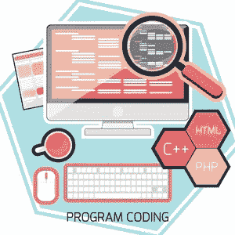
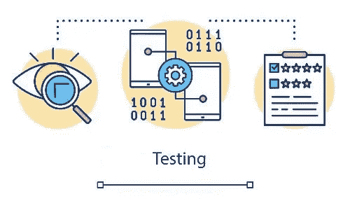
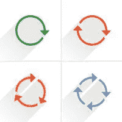
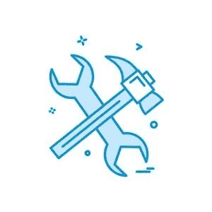

# 立即成为更好的程序员的 20 个技巧

> 原文：<https://betterprogramming.pub/20-tips-for-becoming-a-better-programmer-immediately-d0767a1efd0c>

## 结合想法，不要宗教化，告诉，不要问，等等


## **目录:**

1.  [三思而后行](https://medium.com/p/d0767a1efd0c/edit#637a)
2.  [了解每个项目背后的业务](#fa0d)
3.  找到具有不同编码风格的人，并与他们讨论
4.  [不要信教](#5e61)
5.  [定期学习和阅读](#2d90)
6.  [深入挖掘更多知识](#83e5)
7.  [参与论坛，授课，分享知识](#c3f6)
8.  [当你学到新东西的时候，愿意重写你自己的代码](#dc44)
9.  [结合思路](#c1b0)
10.  [写好名字，做好评论](#63f5)
11.  学习更多的语言
12.  [测试](#6781)
13.  [设计模式](#08b2)
14.  [关注点分离](#fe7b)
15.  [在描述你的代码时，尽量少用“和”](#23ab)
16.  [不要重复自己](#b350)
17.  [告诉，不要问](#0c94)
18.  [开启—关闭原理(OCP)](#5e2e)
19.  [短功能](#c84a)
20.  [框架](#46f1)

作为一名开发人员是一个梦幻般的职业，充满了巨大的挑战和难题，让我们夜不能寐。由于对任何技能水平的开发人员的需求都很大，而且往往太忙，他们往往没有足够的时间停下来思考自己的工作。

技术正以令人难以置信的速度发展，我们必须跟上。但是，很多开发者不愿意。他们几年前就学到了一些东西，并且他们继续遵循同样的坏习惯直到今天。嗯，如果一个程序员一遍又一遍地重复同一个旧的(通常是不正确的)概念，即使十年的经验也不能帮助他们成为一个更好的程序员。另一方面，学习可以让你在任何语言编程方面的知识和技能突飞猛进。

***建立在知识上的经验增加得更快也更有价值*** *。*

我想和你分享 20 个技巧，它们将会立即提升你的编码技能。如果你是初学者，挑选几个，并进一步研究特定的主题。这将是你职业生涯中最好的投资之一。没有经验的知识不是很有用——没有知识的经验很容易造成混乱。

# **1。编码前先思考**

写代码不应该占用你 100%的开发时间。50–60%就足够了。我见过许多程序员写得比他们思考的速度还快。人类不太适合多任务处理。一步一步来，三思而后行。


## **提示**

*   把一张纸放在你的键盘旁边。画图表、概念、图像、表格。任何一种愚蠢的想象都可能有所帮助。如果你面前有一个画板，那就更好了。
*   先思考，然后把你的想法写在纸上。在你知道你想要实现什么之后写代码要有效得多。
*   从马上开始写代码看起来像是超级有效的开发，但事实并非如此。那只是一种错觉。实际上，您可能会发现自己在代码中来来回回，上上下下，不断地修改前面的代码行。
*   **各个击破**。每个问题一开始看起来都很复杂。不要惊慌。考虑把你的代码分成更小的部分。有几种可能的方法可以做到这一点。
*   在你写代码之前，考虑一下测试。对测试人员或产品所有者如何知道任务已经完成有一个清晰的想法是很有帮助的。太模糊的目标是可怕的，最终导致开发时间长得多。这个问题的代价可能会很高！

# **2。了解每个项目背后的业务**


这可能看起来不像编程，但相信我，商业是必不可少的。它支付你的薪水。以某种疯狂的方式为自己编码可能很有趣。然而，我们都需要谋生。因此，我们的代码必须遵循一些业务目标。

许多人，包括经理和营销人员，都取笑程序员，认为他们是生活在自己的 1 和 0 的世界里的怪人和极客。尽管深入代码行完全没问题，但偶尔抬起头看看你在做什么以及为什么做也是非常有用的。

总有一个客户有他们的需求、预算、商业理念和期望。如果一个程序员了解全局，他或她可能对解决客户以前可能没有想到的未来问题有用。

# **3。找到编码风格完全不同的人，并与他们讨论**

当人们做一件事时，不管在我们看来有多傻，他们总是有理由的。诚然，原因可能首先是有缺陷的，但你应该期望其他人已经把思想投入到他们所做的事情中。他们很可能知道一些你不知道的事情，并且可以从中学习。

一些开发人员更喜欢面向对象的编程，另一些则为函数式风格而战，或者两者兼而有之。每个小组都能够列举出他们的风格的许多好处，并能为他们为什么决定使用这种风格辩护。OOP 有许多我非常喜欢的伟大概念。然而，函数式编程是建立在使 OOP 架构更加健壮和易读的原则之上的。避免改变状态的概念使得方法和类的行为更加可预测，也使得单元测试更加容易和可靠。

能够倾听他人并捍卫自己的观点是非常有价值的技能。不要小看他们！

# **4。不要宗教化**

太多时候，我们可以看到科技文章称赞一种特定的技术，并声称其他技术是可怕的。没完没了——关系数据库对 noSQL，OOP 对函数式编程，Laravel 对 Symfony 对 Nette，VueJs 对 React 对 Angular，Nginx 对 Apache，等等等等。

我不觉得这些小战争特别有用。他们除了迷惑新开发人员之外什么也没做。搜索客观信息和有效的比较可能是一项非常困难的任务，尤其是因为不是每个工具在相同的情况下都有用。技术决策应该始终强调业务目标。

不管我们使用和喜欢什么技术，让我们对新思想保持开放的态度。

# **5。定期学习和阅读**

技术是现代世界最具活力的领域。我们作为开发者，至少在某种程度上需要跟上时代。我们的知识每天都在变老，我们需要学习新的东西。当涉及到新硬件、服务器技术、云、编程语言或框架、测试工具等时，我们至少应该对技术世界的发展方向有一个大致的了解。

如今学习新东西非常容易。你可以在 YouTube 上找到大量免费资料。与你所获得的价值相比，付费频道，如 lynda.com、udemy.com 或 laracast.com(针对 Lavarel 框架)的花费少得惊人。十到十五美元的课程需要几十个小时的学习材料，这简直令人吃惊。如果你需要学习新的东西，你没有理由不去做。你需要的任何东西都可以在网上找到。让自己陷入“不知道”的状态，可能很有挑战性。我们在一个领域越有经验，我们就越不想向另一个方向发展。然而，这是个人成长和自我发展的重要组成部分。

Medium.com 也是一个巨大的信息来源。每周至少花一到两个小时阅读。把你的阅读分成两部分——你已经知道并想了解更多的东西和你不熟悉但想了解的东西。另外，你可能会发现在科技世界之外的领域积累知识很有趣。我个人喜欢物理，天文，经济学。

# **6。深入挖掘更多知识**

伟大的开发人员在底层技术的知识上也有别于一般的开发人员。当然，用 React 或 VueJs 编码不需要了解 IP 地址、路由或 DNS 系统。但是我们知道的越多，我们能够解决的难题就越多。

我个人喜欢学习新东西。我想尽可能深入地了解技术。你不一定要像我一样，但是对底层技术有些了解总是一个优势。伟大的开发者不会再造轮子。在野外使用开源资产。在过去的 10 年里，开源材料激增。

这里有一些提示，你可能会发现对推进你的职业生涯既有趣又有用。此外，你将提高解决更复杂问题的能力。

*   彻底了解计算机。看看小型处理器以及它们是如何处理数据的。汇编程序是什么样子，C 或 C++命令如何编译成汇编程序。有许多很好的资源解释了计算机的核心水平。你会在这里找到一个这样的 YouTube 频道。
*   如果你是一名 web 开发人员，你肯定应该了解数据是如何存储的，以及它是如何在全球范围内传输的。物理层、数据层、网络层等。这被称为 **OSI 模型**，来源: [1](https://www.webopedia.com/quick_ref/OSI_Layers.asp) 或 [2](https://medium.com/learn-with-the-lean-programmer/osi-model-layers-explained-ee1d43058c1f) 。
*   Web 开发人员应该熟悉客户机-服务器架构。Apache、Nginx、IIS、Postfix、Node、Composer 这些名字听起来应该很熟悉。
*   如今，云是一件大事。Azure 和 AWS 是极其复杂的工具。我不认为你必须是这些云技术的专家，但至少看看他们能做什么。作为一名 web 开发人员，你肯定会与负责托管的团队交流。能够相互理解并意识到可能出现的问题总是有益的。
*   即使你不是一个 Linux 迷，像我一样，至少学习一些基本的命令。Linux 广泛用于 web 服务器，你很可能无法避免它。命令行对每个人来说看起来都不友好，但一些基本知识是必要的。当你习惯了，就会觉得更自然，你的有效性就上去了。

# **7。参加论坛、授课、分享知识**

当你的经验和知识达到一个更高的层次时，分享一部分也许是好的。我们利用许多免费资源来发展我们的知识，这些资源是由那些愿意分享他们的经验并在他们的工艺上花费大量时间的人提供的。回馈社区应该是开发者工作描述的一部分。

在 stackoverflow.com，你可以帮助人们解决他们的问题。每个开发者大概都在用这个门户提供的积累的知识，所以时不时的伸出援手是很棒的。

教学不仅为加深我们的知识创造了机会，也为更好地表达知识创造了机会。能够描述我们想要什么，并解释解决方案，对于团队领导和与客户沟通至关重要。实践是关键。写文章(例如在媒体上)或拍摄简短的教育视频是分享知识和共同学习的好方法。

# **8。当你学到新东西的时候，愿意重写你的代码**


大多数开发人员有一份全职工作，他们自己也有一些较小的项目，通常是开源的。除非绝对必要，否则客户通常不愿意为更大的重构买单。然而，从事你自己的小项目对你的个人技能建设非常有益。一段时间后，我们大多数人都会发现我们之前写的代码可以做得多好。这是一个重新开始并做得更好的好机会。

就我个人而言，我已经从零开始重写了我的一个项目三次。我到了不能再接受原来风格的地步。我不认为这是浪费时间，因为它帮助我迅速获得了额外的经验。时间本身没有帮助。10 年来反复做同样的事情，几乎不比一年来广泛的学习和实践要好。我认识一些已经从事这行十多年的开发人员，但是他们甚至不能使用`include` 命令来分离他们的代码。他们所有的经历对他们一点帮助都没有。

技能发展可能是什么样的:

*   研究、学习最佳实践、审查他人的代码
*   尽你所能做好你的项目
*   让别人检查你的工作并提供反馈
*   以更好的方式重构你的代码，或者如果需要的话从头开始
*   让另一个人再次检查您的代码。收集反馈并学习新的东西
*   选择你自己的风格，同时尽可能多地使用最佳实践

每当你在代码中发现[代码带有](https://medium.com/swlh/what-are-code-smells-in-php-oop-approach-for-cleaner-code-c9729232dc5f)的味道时，想想代码和整体编程风格。可能是时候改进现有的代码了。

# **9。结合思路**

许多程序员倾向于选择一种编写代码的方式(OOP、函数式编程、过程式编程)，他们希望坚持自己的风格，不管情况如何。他们甚至可能不喜欢某些方法和风格，而根本不理解它们。在特定的场景中，所有的编程风格都是有用的。

另一个例子是在关系数据库中使用 jsons。MySQL 8 对 jsons 有很好的支持，没有理由让你的数据库 100%是关系型的。它可以产生非常困难的表格结构。我个人喜欢混合数据库的概念。

你可能会发现关于单一应用是否比微服务更好的讨论层出不穷。和往常一样，这个世界并不是非黑即白的，典型的答案是“*看情况*”。没有理由避免混合模式。我们又回到了第 4 节:不要太虔诚。

# **10。写好名字，做好评论**

命名和缓存失效被幽默地认为是编程中最困难的部分。有一个很好的理由——命名决定了可读和不可读代码的区别。

当我在大学学习时，我们使用 Matlab 作为主要的编程工具。Matlab 的一个强大特性是可以编写越来越密集的代码。当我们开始学习 Matlab 时，我们有一个编程任务，我们大多数人都以标准的过程化方式处理它。然后，第二个任务是:“*用一行*写你的代码”。这通常可以在 Matlab 中轻松完成。然而，阅读它可能是一个真正的地狱般的经历。避免过于密集的代码，除非出于性能原因绝对必要，例如。通常，程序员为了可读性会牺牲一点性能。记住，两个月后你可能也很难阅读你自己的代码。不要破坏你未来的工作！


为方法起一个好名字对于阅读任何代码都是必不可少的。我甚至向我们的客户展示这一点，并演示我们如何创建代码以及为什么它很重要。如果你这样做了，项目价格就不那么重要了，因为它的价值已经体现出来了。

使用专有名称与代码分离密切相关。记住，循环、嵌套条件和正则表达式很难读懂。将代码块封装到函数或类中。这将使代码对我们的队友更加友好。

比较这两个例子(PHP 代码):

```
if(!preg_match("^[_a-z0–9-]+(\.[_a-z0–9-]+)*@[a-z0–9-]+(\.[a-z0–9-]+)*(\.[a-z]{2,3})$^", $email)) {
   … handling wrong email
}
```

或者:

```
if(!$this->isEmailValid($email)) {
   … handling wrong email
}private function isEmailValid(string $email) 
{
     return preg_match("^[_a-z0–9-]+(\.[_a-z0–9-]+)*@[a-z0–9-]+(\.
            [a-z0–9-]+)*(\.[a-z]{2,3})$^", $email);
}
```

关于类/方法/变量命名的一些提示:

*   如果可能的话，避免使用“管理”或者“经理”这样的字眼。为什么？因为几乎所有东西都可以成为经理——它会很快被过度使用。
*   一致地使用动词和名词的顺序。比如`emailValidation` 或者`validateEmail` 都可以。选择一种风格并坚持下去。
*   如果可能，指出该方法返回的内容。我喜欢对布尔返回类型使用“is”。比如我觉得`isEmailValid` 比`emailValidation`更好的名字。你马上就会知道名字开头的“*是*”意思是*真* / *假*返回类型。同样，*有*或*包含*可以表示一个布尔返回类型。
*   如果可能的话，不要重复自己。一个例子是使用类。考虑一个`$user`类。没有单词“ *user* ”的方法名也可以。很明显，方法是关于用户的。`$user->getFullName()` 或`$user->getAddress()`比`$user->getUserFullName()`或
    `$user->getUserAddress()`好。
*   如果没有强有力的理由不这样做，遵循普遍接受的惯例。例如，在 PHP 中，变量名采用`camelCase` 样式。SQL 列名写在`snake_case`中。类和对象使用`PascalCase`。
*   在一些语言中，例如 JavaScript，可以像使用任何其他字母一样，将*$*-符号用作常规字符。在 PHP 中，*$*-符号是一个特殊字符，但在 JS 中不是。因此，您可以自由地将变量命名为`var user`或`var $user`。但是，*$*-符号可以分隔特殊变量。当你加入一个新的 JS 项目时，询问软件架构师如何使用它。例如，在 VueJs 中，以 *$* 开头的变量表示 Vue 本身提供的特殊对象。比如`this.$route`或者`this.$store`。同样，无论你用什么符号，都要保持一致。
*   与上一点类似，有时 _ 用于私有变量，尤其是在 JavaScript 中。有些开发者喜欢它，有些讨厌它。你知道这是怎么回事。保持一致就好。

# **11。学习更多的语言**



如果你是一名职业程序员，一定要学习更多的语言。至少一些更广泛的经验是有用的。例如，Matlab/R 编程方法与 C 完全不同。C++的面向对象方法不同于 C 或 Basic。使用 C#为 Windows 编程需要一种不同于用 C 创建控制台程序的方法。然后，有几个新的方法，如 Go、Rust 或 Swift。

不同的语言以不同的方式解决同样的问题。学习它们会大大提高你解决问题的能力。

# **12。测试**



测试是任何一种代码编写的基本部分。有一整套围绕测试构建的方法，称为测试驱动开发(简称 TDD)。使用这种方法，首先为新对象编写测试，然后用业务逻辑填充类。这有几个优点:

*   先做测试。因此，在实现任何业务逻辑之前，您需要考虑输入和输出。
*   一旦你准备好测试，安全地更新你的应用程序是非常容易的。
*   应用程序越大，测试就越重要——很难在一个大的应用程序中找到所有可能的错误。

TDD 可能看起来工作量很大，因此，只有一小部分程序员真正使用它。我个人不知道有人使用这种技术。然而，这里有几个有用的原则可以帮助每一个程序员。

测试中的一个重要作用是能够重构和验证一切仍然按预期工作。过多的单元测试很难达到这种状态，因此，应该探索单元测试和组件测试的结合。在组件测试中，N 个单元一起说话。最重要的是，客户欣赏 e2e(端到端)测试，确保客户的体验在新版本发布后保持不变。对于一个 web 应用程序，有几个流行的工具，如 Cypress、TestCafe 或 Selenium，( [Selenium vs. Cypress](https://www.perfecto.io/blog/cypress-vs-selenium-whats-right-cross-browser-testing-solution-you) )。

以一种易于测试的方式编写应用程序及其组成部分——手动或自动。如果测试很困难，那通常意味着代码结构太复杂，可能需要进一步思考。

# **13。设计模式**

设计模式( [1](https://sourcemaking.com/design_patterns) )是解决经常出现的特定问题的通用代码结构。没必要强迫自己全部使用。然而，了解它们的构造是非常重要的。

在我看来，有几个设计模式是每个程序员都应该知道的:

*   观察者
*   工厂
*   建设者
*   一个
*   装饰者

这些模式将帮助您解耦代码，并以经过充分测试的方式解决典型问题。此外，您的代码将变得更容易阅读，因为命名将暗示类和方法做什么。

另一个非常重要的知识是了解反模式。反模式是导致问题的概念，但在许多软件中非常典型。一些例子包括:

*   上帝反对
*   重新发明轮子
*   瑞士军刀
*   意大利面条代码
*   熔岩流

# **14。**分离顾虑


最强大的编程原则之一是关注点分离(SoC)。规则很简单:每个类或函数应该完成一个简单的任务。有很多不同方法的类很难维护和扩展。这就是香蕉/大猩猩笑话的来源:“你想要一只香蕉，但你得到的是一只大猩猩拿着香蕉和整个丛林”。不要让你的类和方法增长太多。下一条规则将帮助你保持正轨。

如果一个类或一个函数做了太多的事情，就很难阅读和理解。此外，组合多个特性使得代码重用更加困难。

分离的一个很好的例子是 HTML 的开发。HTML 刚开始的时候，还没有 CSS。如果需要特定的字体，有一个标签:

```
<font color="red" face="Verdana, Geneva, sans-serif" size="+1">My text in red and Verdana font</font>
```

网站结构、内容和风格紧密结合在一起。CSS 允许分离样式和网页结构。突然之间，不用接触 HTML 代码本身就可以更新样式了。

# **15。**在描述部分代码时，尽量少用“和”

当解释你的函数或类是做什么的时候，如果你没有太多次使用“和”，请仔细听。如果你这样做了，那就是你的函数或者类应该被分割成多个实体的标志。单一责任原则是你真正的朋友。

非最佳类的一个例子:传送用户数据，验证输入数据，并将数据保存到 DB。

# 16 岁。不要重复自己



不重复自己(干)！这是一个极其重要的规则，每个人都应该记住。任何时候你使用复制和粘贴，只要停止这样做，并重新思考你在做什么。真的需要复制部分代码吗？不能改成代码复用吗？

这听起来可能很明显，但是如果我们，作为程序员，忘记了思考，我们只是不停地写新的代码行，遵循这个规则可能会很棘手。我看到一个代码，30 个 HTML 页面中的每一个都有自己的标题。头文件的编号`include`。如果客户决定改变一个图标，程序员需要更新 30 个页面。一场真正的噩梦。

# 17。告诉，不要问

“*告诉，不要问*”原则描述了写作功能的一个重要概念。核心思想是，我们应该告诉一个类如何处理它的数据。数据业务逻辑应该在类的内部，而不是外部。不正确的方法应该是请求数据，更新数据，然后将其设置回类。

## 例子

违反*告诉、不问*原则:

```
class User {
    public $firstName;
    public $lastName;
    public $fullName;
    public $myValue = 0;
}$user = new User();
$user->fullName = $user->firstName . '' . $user->lastName;
$user->myValue = $user->myValue++;
```

更好的代码:

```
class User {
    public $firstName;
    public $lastName;
    private $myValue = 0; public function getFullName() {
       return $this->firstName . ‘ ‘ . $this->lastName;
    } public function incrementMyValue() {
        $this->$myValue ++;
    }
}$user = new User();
$fullName = $user->getFullName();
```

# 18。开启-关闭原则(OCP)

编程应该遵循最佳实践和某些规则，比如 SOLID，它可以改进代码，使其更易于维护、阅读和重用。然而，在某些时候，每个程序员都必须决定在好代码和过度优化的代码之间划一条线。如果你将任何规则发挥到极致，结果都不会是最优的。这就是编程的魅力——永远不会只有一个正确的答案。开闭原则是那些总是要求在编程速度、代码长度、类数量、可读性、可重用性等之间进行折衷的原则之一。在我看来，这是在实际编码中实际应用的最棘手的规则之一。让我们用例子来解释一下。


开闭原则意味着你的代码对于扩展是开放的，对于修改是封闭的。简单来说，就是为了扩展它，你不应该更新现有的代码。这条规则对于有自己生产周期的图书馆来说尤其重要。如果你是一个库开发者，你不希望每次需要扩展时都更新/测试/发布你的代码。

如何识别代码中可能违反了 OCP？一个典型的情况是使用多个相同类型的项目，例如不同的文件类型。对于每种文件类型(jpg、png、doc、pdf 等),您可能需要一个处理程序和一个模型。).一个简单的解决方案可能包括一个 if/elseif 块或一个长开关，如下所示:

```
public function getHandler(string $fileType){
    switch ($fileType) { case “jpg” : 
             return new JpgHandler();
             break; case “doc” : 
             return new DocHandler();
             break; case “pdf” :
             return new PdfHandler();
             break;
    }
}
```

这是一个典型的违反 OCP 的例子，因为每次需要添加新的文件类型时，都需要更新这个开关。该代码不会因修改而关闭。这种用*开关*的琐碎解决方案将会带来问题。

我喜欢使用的一个解决方案是实现寄存器。任何时候你需要一个新的处理器，你只需要注册它。在 Laravel 中，这可以在`AppServiceProvider`中完成，它处理容器中的绑定。

## **例子**

```
class FilesRegistry
{
    private $handlers = []; public function addFileHandler(Handler $handler){
        $this->handlers[$handler->getExtension()] = $handler;
    } public function getHandler(string $extension) {
        return $this->handlers[$extension];
    }
}
```

在`AppServiceProvider` (或者依赖注入容器的其他注册方法)中我们有:

```
$filesRegistry = new FilesRegistry();$jpgHandler = new JpgHandler();
$filesRegistry->addFileHandler($jpgHandler);$docHandler = new DocHandler();
$filesRegistry->addFileHandler($docHandler);
```

现在，我们把所有的处理程序都放在一个地方，所有的东西都在容器(或者我们代码的其他顶层位置)上定义。如果我们需要添加一个新的处理程序，我们只需将它添加到服务提供者并注册它。然后，需要获取处理程序的代码将询问寄存器，假设它有一个。如果没有，例如，可以有一个通用的文件处理程序，或者它抛出一个异常。

# **19。**短功能

编写简短、命名良好的函数是每个代码可读性良好的关键。这个经验法则非常简单——如果功能代码比你的屏幕高度长，那么它可能太长了。较短的函数可以更好地命名，使代码更容易理解。最重要的是，它们更容易测试。

长函数应该总是像代码气味一样亮起红灯。它们通常包含太多嵌套的*if*/*else*/*for*/*while*块，极难阅读。请记住，其他人会阅读您的代码。即使是你，在两到三个月之后，也会很难弄清楚你那些疯狂的函数是做什么的，以及你为什么要以如此混乱的方式实现它们。

缩短函数有几种方法。这里有几个例子:

*   如果 / *否则*减少*的使用*

```
if($var === 1) {
    return true;
}
else {
    return false;
}
```

替换为:

```
return $var === 1;
```

*   `foreach`通常可以有效地用数组函数代替:

```
$result = 0;
foreach($numbers as $number) { /* $number is a class */
    $result += number.value;
}
```

替换为:

```
$result = array_reduce($numbers, “sumNumberValues”);
```

其中`sumNumberValues` 分别定义为:

```
sumNumberValues ($total, $number){
    return total + $number->value;
}
```

# **二十。**框架



如今，大多数流行的编程语言都有多种可用的框架。框架不仅仅是一组函数/类/工具，还是一种编写代码的方法。这有助于您保持编码风格的一致性。最重要的是，每个网站必须处理的所有典型任务都已经解决并经过了良好的测试。—例如，路由、数据验证、数据库通信、收集和阵列操作等。不要试图重新发明轮子！

# 讨论

你有什么成为更好的程序员的小技巧？请在评论中分享！

