# 20 VS 代码快捷键，加快编码速度

> 原文：<https://betterprogramming.pub/20-vs-code-shortcuts-for-fast-coding-cheatsheet-10b0e72fd5d>

## 小抄

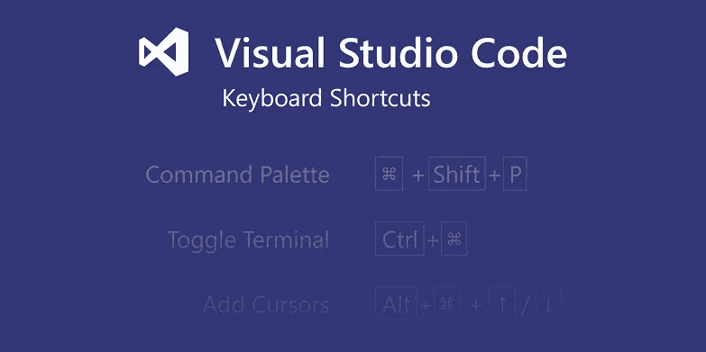

VS 代码快捷键

本文希望能帮助使用 VS 代码的人更快地编码。

不是每个人都有时间仔细阅读每一个技巧和诀窍来找到帮助他们更快编码的技巧和诀窍——这些技巧和诀窍实在太多了。

所以我会列出我最喜欢的快捷方式，让我成为一个快速编码者。

我们开始吧。

# 接合线

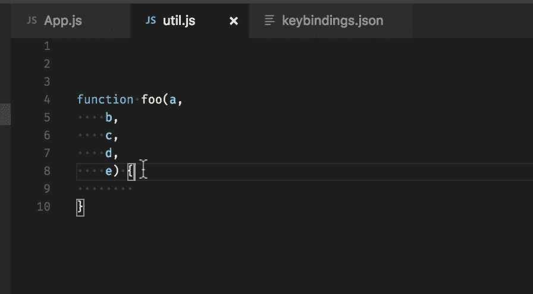

接合线

*   在 Mac 上:Ctrl+J
*   在 Ubuntu 上，Windows **:** 从`File` > `Preferences` > `Keyboard shortcuts`打开键盘快捷键，将`editor.action.joinLines`绑定到自己选择的快捷键。

# 代码格式

此快捷方式有助于缩进编辑器设置中已经设置好的代码。

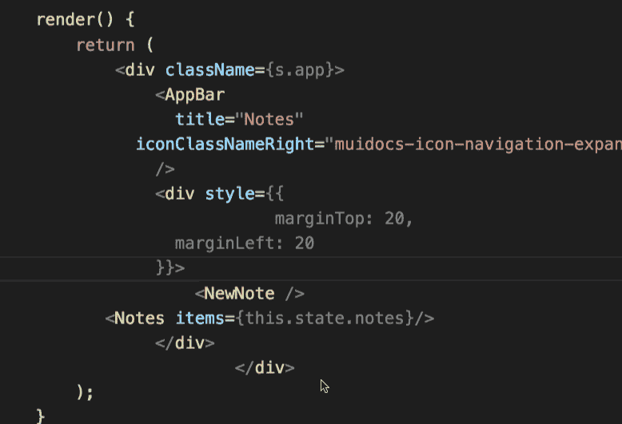

代码格式

提示:在结尾或开头用这个。当我处理完文件中的代码时，我更喜欢使用它。

*   在 Windows 上:Shift + Alt + F
*   在 Mac 上:Shift + Option + F
*   在 Ubuntu 上:Ctrl + Shift + I

# 修剪尾随空白

这个命令有助于去掉开头和结尾的多余空格，并且可以避免任何类型的严格换行。

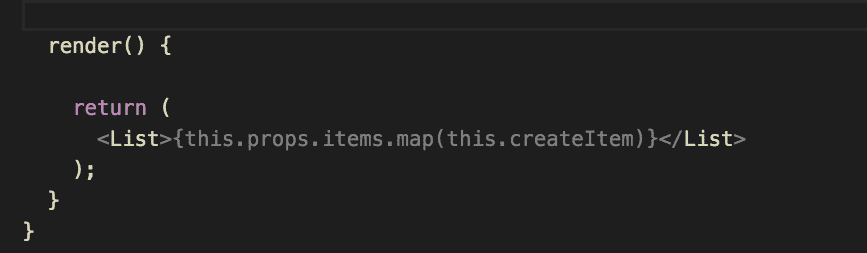

修剪空白

**提示:**一旦你完成了文件中的代码，就在最后使用它。

或者，您可以从设置本身启用空白修剪:

1.  打开 VS 用户设置(首选项>设置>用户设置选项卡)。
2.  点击窗口右上角的`{}`图标。这将打开一个文档。
3.  如果用户设置文档中没有新的`"files.trimTrailingWhitespace": true`设置，请添加到用户设置文档中。这是因为您不是直接编辑默认设置，而是添加到默认设置中。
4.  保存用户设置文件。

我们还添加了一个新命令来手动触发它(来自命令面板的`Trim Trailing Whitespace`)。

或者，如果您使用新版本，然后按照设置 1，并看到下图。

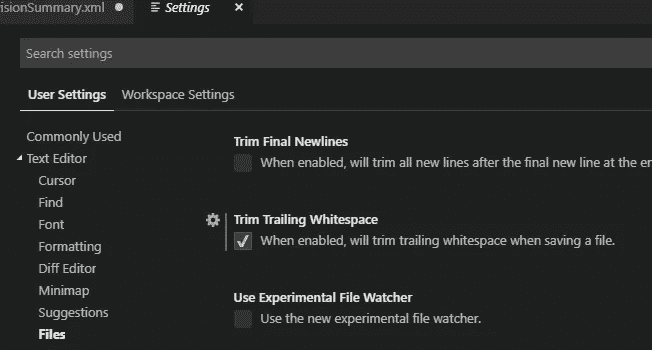

# 代码折叠

有时，如果文件很大，而您只想对代码有一个整体的了解，那么就需要代码折叠。

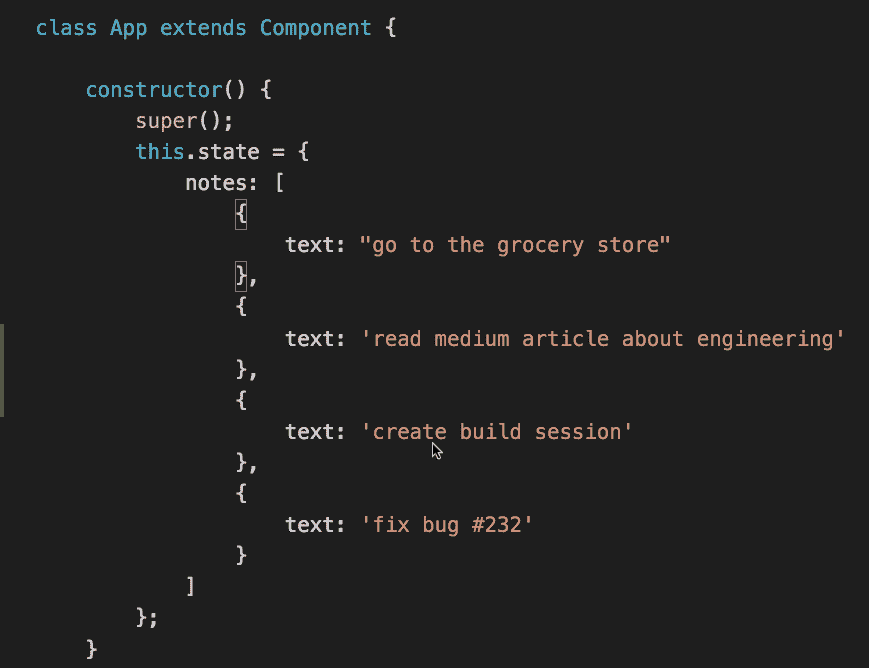

代码折叠

1.  要在光标处折叠最里面的未折叠区域:

*   在 Windows /Ubuntu 上:Ctrl + Shift + [
*   在 Mac 上:Command+ Option + [

2.展开在光标处展开折叠区域:

*   在 Windows /Ubuntu 上:Ctrl + Shift + ]
*   在 Mac 上:Command+ Option + ]

# 向上/向下复制行

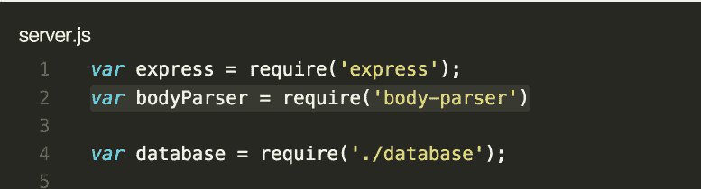

向上/向下复制行

*   在 Windows 上:Shift + Alt +向上/向下
*   在 Mac 上:Shift + Option +向上/向下
*   在 Ubuntu 上:Ctrl + Shift + Alt +向上/向下

此外，您可以通过选择:文件>首选项>键盘快捷键并根据您的选择编辑绑定来查看相关的键绑定。

# 拆分编辑器

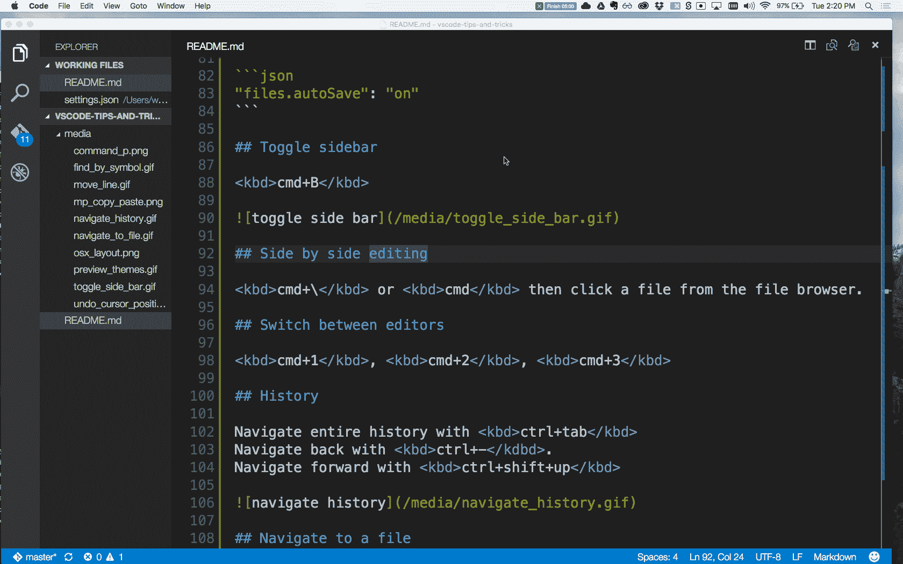

*   在 Windows 上:Shift + Alt + \或 2，3，4
*   在 Mac 上:Command + \或 2，3，4
*   在 Ubuntu 上:Shift + Alt + \或 2，3，4

要拆分编辑器，可以使用`split editor`命令。拆分编辑器原来的键盘快捷键是`123`。这在并排编辑的情况下很有用。

此外，您可以通过选择“文件”>“首选项”>“键盘快捷键”,并根据您的选择编辑绑定，来查看相关的键绑定。

# 网格编辑器布局

默认情况下，编辑器群组排列在垂直栏中(例如，当您拆分编辑器以从侧面打开它时)。您可以轻松地以您喜欢的任何布局(垂直和水平)排列编辑器群组:

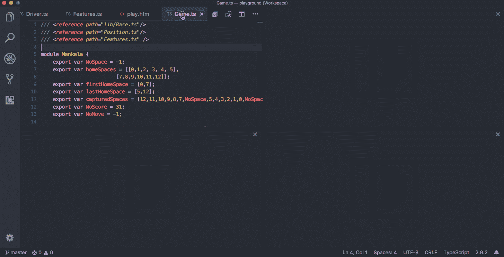

为了支持灵活的布局，您可以创建空的编辑器组。默认情况下，关闭编辑器群组的最后一个编辑器也会关闭群组本身，但是您可以使用新设置`workbench.editor.closeEmptyGroups: false`来更改此行为。

在“新视图”>“编辑器布局”菜单中有一组预定义的编辑器布局:

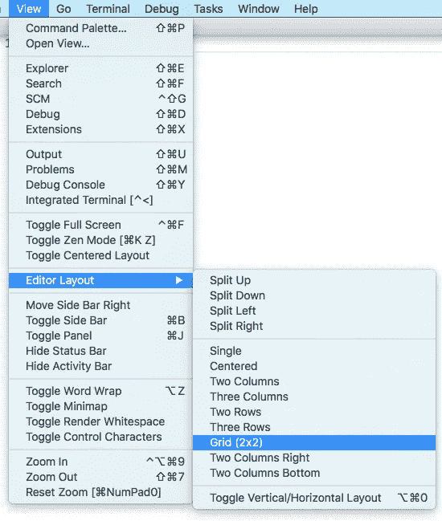

# 选择单词

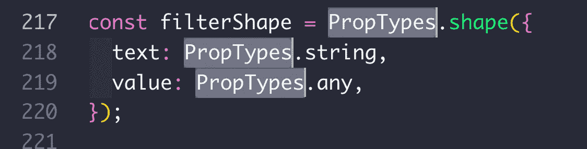

选择单词

*   在 Windows 上:Ctrl+ d
*   在 Mac 上:Command + d
*   在 Ubuntu 上:Ctrl+ d

如果您多次按下 command + d，您会将同一关键词的另一个实例添加到您的选择中。

# 打开和关闭边栏

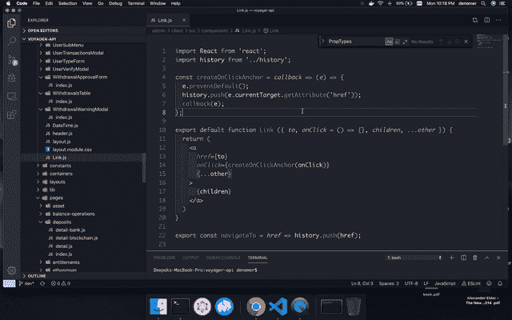

侧边栏的打开和关闭

*   在 Windows 上:Ctrl+ b
*   在 Mac 上:Command + b
*   在 Ubuntu 上:Ctrl+ b

有时当文件很长或者拆分编辑器关闭时，侧边栏会很有帮助。

# 导航到特定行

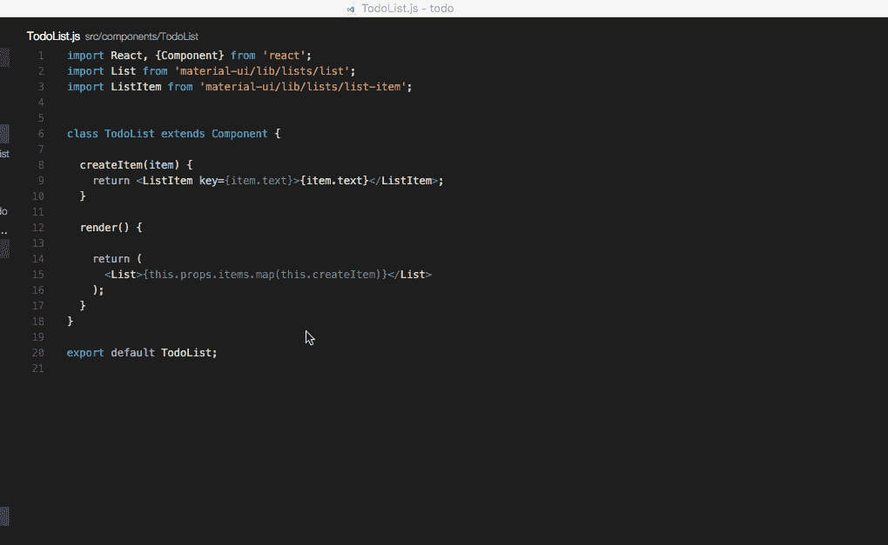

导航到特定行

**注意:**要转到文件中的某一行，可以使用 ctrl + g，然后键入行号。或者，您也可以先用 command + p 打开“转到文件”菜单。然后输入`:`。然后键入您的行号。

*   在 Windows 上:Ctrl + g
*   在 Mac 上:Ctrl + g 或 Ctrl + p
*   在 Ubuntu 上:Ctrl + g

# 转到文件中的符号

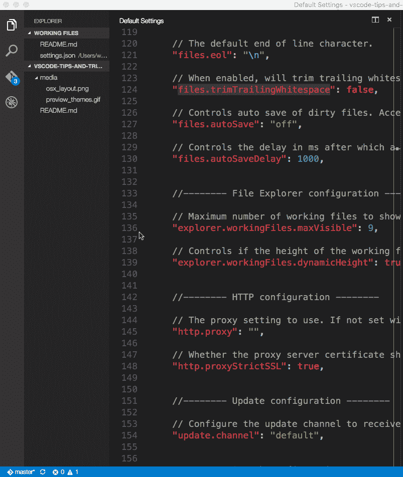

*   在 Windows 上:Ctrl + Shift + o
*   在 Mac 上:Command + Shift+ o
*   在 Ubuntu 上:Ctrl + Shift + o

您可以通过添加冒号`@:`按种类对符号进行分组。

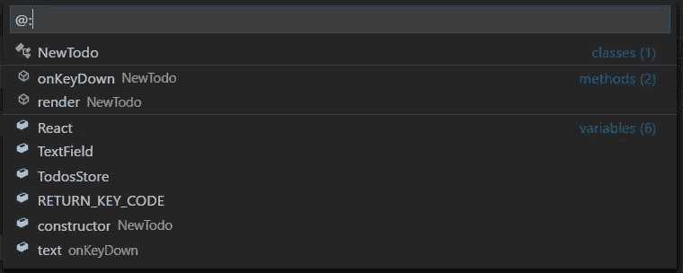

将符号分组

# 转到工作空间中的符号

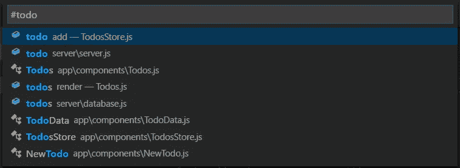

转到工作空间中的符号

*   在 Windows 上:Ctrl + t
*   在 Mac 上:Command + t
*   在 Ubuntu 上:Ctrl + t

# 删除上一个单词

*   在 Windows 上:Ctrl + backspace
*   在 Mac 上:Command + delete
*   在 Ubuntu 上:Ctrl +退格

这在你打错字的时候非常有用，你讨厌按住退格键来找到你想要删除的部分。

# 用词选择

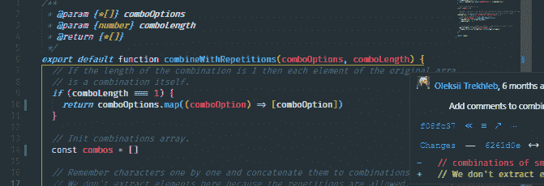

*   在 Windows 上:Ctrl + Shift +右箭头键/左箭头键
*   在 Mac 上:Command + Shift +右箭头键/左箭头键
*   在 Ubuntu 上:Ctrl + Shift +右箭头键/左箭头键

这对于更快地选择单词并根据需要进行编辑非常有用。

# 双线电路

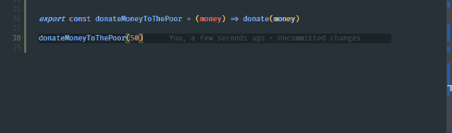

*   在 Windows 上:Ctrl + Shift + d
*   在 Mac 上:Command + Shift +d
*   在 Ubuntu 上:Ctrl + Shift + d

一个非常强大和众所周知的功能是复制行的能力。

# 删除一行

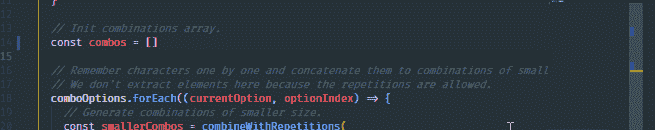

*   在 Windows 上:Ctrl + x
*   在 Mac 上:Command + x
*   在 Ubuntu 上:Ctrl + x

# 在上方/下方添加光标

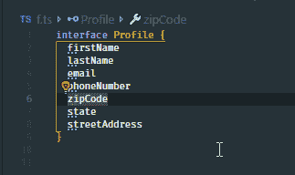

*   在 Windows 上:Ctrl + Alt +向上键/向下键
*   在 Mac 上:Command + Alt +向上键/向下键
*   在 Ubuntu 上:Ctrl + Alt +向上键/向下键

复制游标可以说是 VS 代码中最节省时间的一个特性。这在像 TypeScript 这样的情况下变得非常有用

# 重命名符号

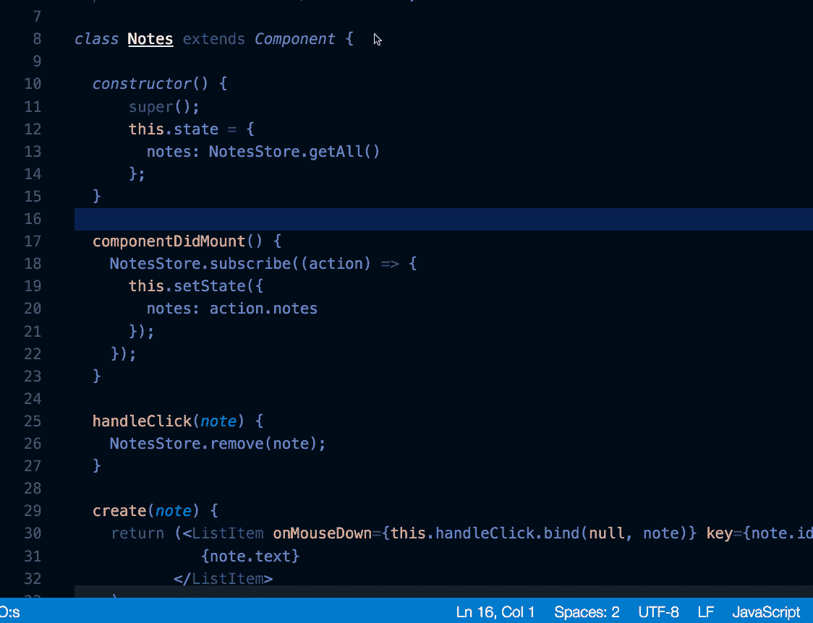

*   在 Windows 上:F2
*   在 Mac 上:F2
*   在 Ubuntu 上:F2

选择一个符号，然后键入 F2。或者，您可以使用上下文菜单。

# 列(框)选择

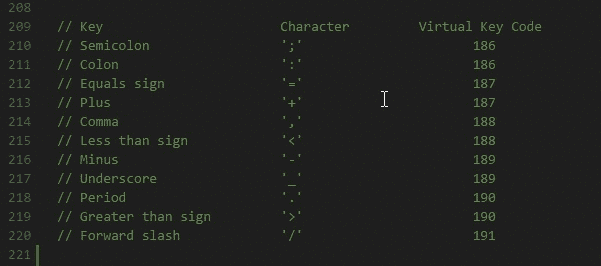

*   在 Windows 上:Shift + Alt
*   在 Mac 上:Shift + Option
*   在 Ubuntu 上:Shift + Alt

拖动鼠标时，可以使用上述命令选择文本块。每个选定行的末尾将添加一个单独的光标。

# 命令选项板

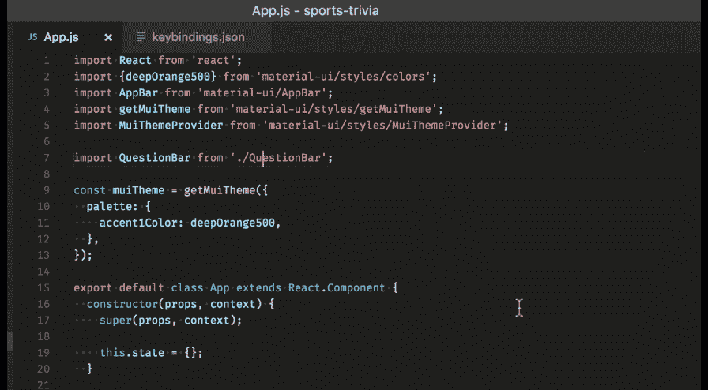

命令选项板

*   在 Windows 上:Ctrl + p
*   在 Mac 上:Command + p
*   在 Ubuntu 上:Ctrl + p

根据您当前的上下文访问所有可用的命令。

一些最常用的是:

## 1.打开一个文件

要转到一个文件，您可以使用上面的命令，然后键入您要查找的文件的名称。这应该有助于您快速找到文件。

## 2.请参见键盘参考命令

所有命令都在命令调板中，并带有相关的键绑定(如果存在)。如果您忘记了键盘快捷键，可以使用命令调板来帮助您。

# 结论

因为有很多快捷方式可以满足你的需要，所以我在不同的操作系统中添加了所有 VS 代码快捷方式的 pdf 链接。

**Linux:**https://code . visual studio . com/shortcut s/keyboard-shortcut s-Linux . pdf

**窗口:**[https://code . visual studio . com/shortcut s/keyboard-shortcut s-windows . pdf](https://code.visualstudio.com/shortcuts/keyboard-shortcuts-windows.pdf)

**MAC OS:**[https://code . visual studio . com/shortcut s/keyboard-shortcut s-MAC OS . pdf](https://code.visualstudio.com/shortcuts/keyboard-shortcuts-macos.pdf)