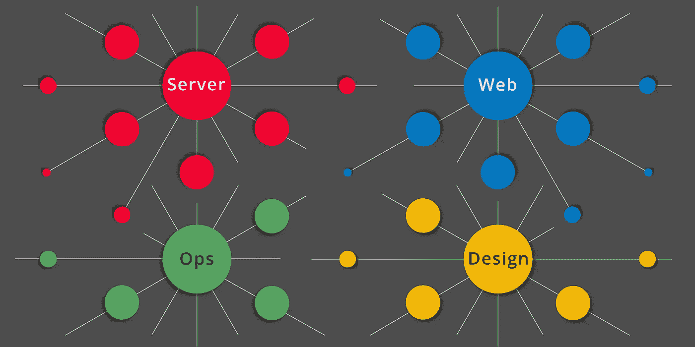
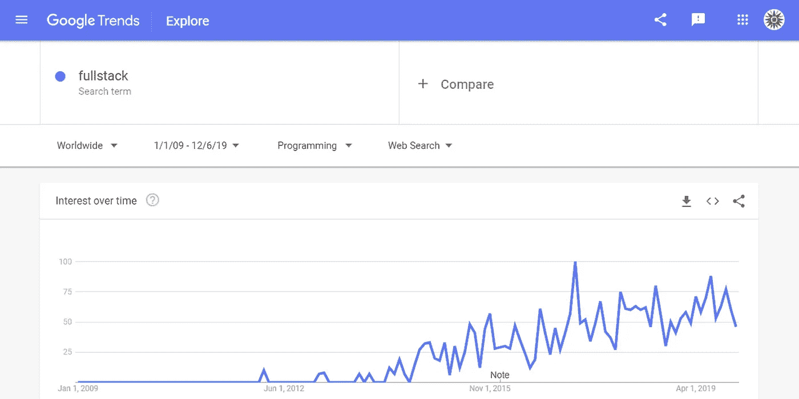

# 全栈宣告死亡

> 原文：<https://betterprogramming.pub/2020-001-full-stack-pronounced-dead-355d7f78e733>

## 欢迎 2020 堆栈



作者决定是时候更新他的职位发布和招聘实践，以反映新的现实:“全栈”不再帮助他将工作要求与申请人的技能相匹配。

# 全栈的起源

在新千年的黎明，网络工具已经到达了这样一个点，即建立一个网站所需的一切都可以从开源软件中组装起来。大致遵循 OSI 网络模型，我们开始将组件的各个部分称为*层*，将集合称为*栈*。

`LAMP`栈是其中的第一层，有四层:`L`用于 *Linux* 操作系统，`A`用于 *Apache* HTTP 服务器，`M`用于 *MySQL* 数据库服务器，`P`用于 *PHP* 脚本语言。随着时间的推移，随着许多栈变体的出现，层的概念得到了很好的证明:`WAMP, MAMP, XAMPP, LEMP, LEPP, MEAN, JAMStack,`等等。

有了这些，软件开发复兴的钥匙可以免费获得，为任何对创建网站感兴趣的人提供了一个低门槛。所需要的只是毅力和学习新工具、语言和协议的愿望。不需要微软或甲骨文或 IBM 或其他商业供应商。这是一个公平的领域，吸引了许多玩家，导致了上世纪 90 年代末的投机性网络时代。

很快，浏览器中 AJAX 的引入`(XMLHttpRequest)`启用了一种新的网站类型，引领了 Web 2.0 时代和 Web 应用。但是开发这些新应用程序所涉及的工作量意味着单独的开发人员很难满足业务期限的要求。

结果是专业化。前端开发人员处理 HTML、CSS 和 JavaScript。后端开发人员处理主机操作系统、HTTP 服务器和数据库。精通这两种语言的开发者被称为*全栈*开发者。

# 全栈时代

专业化是一件好事。直到它不是。一方面，这意味着团队可以并行工作以缩短开发周期。另一方面，这意味着我们必须额外努力沟通初始需求和变更单规范，否则我们将冒着失去并行工作成果的风险。

因此，拥有一个全栈开发团队，没有可区分的前端/后端组，似乎是一个好主意。

最重要的好处是团队中的每一个开发人员都非常清楚每一个小小的改变会带来的后果。他们每个人都可以正确地评估影响和风险，让管理层清楚地了解成本和延迟。此外，当员工离职时，可以毫不延迟地安排替补人员，并且可以高效地进行入职培训。

但是随着基础技术的进步，这个美好的画面变得不那么令人信服了。堆栈不再局限于最初的四层操作系统、HTTP 服务器、数据库和脚本语言。

*   当我们需要扩展我们简陋的应用程序来处理越来越多的并发用户时，复杂性就增加了。所以我们增加了负载平衡器。
*   我们需要更快地配置新服务器，降低灾难性故障的风险。所以我们转向了云计算。
*   我们开始制作东西来接触全球观众。因此，我们开始将我们的部署复制到区域数据中心。
*   我们发现模式繁重的数据库和复杂的连接并不总是最好的。所以我们开始使用键值存储。
*   我们需要更好的质量控制。所以我们雇佣了专门的测试工程师来构建回归套件。
*   我们想让浏览器控制渲染和合成。所以我们从服务器端脚本切换到 REST APIs。
*   我们了解到良好的代码管理对团队的有效性至关重要。所以我们使用 Github 创建了工作流，并且从未回头。

随着我们能力的增长，我们开始更仔细地倾听我们的用户:

*   我们的用户希望应用程序有更少的提交表单，更流畅，更一致，更易用。所以我们雇佣了具有艺术技巧和人体工程学敏感度的用户界面专家。
*   我们的用户要求更少的障碍来完成他们的工作。所以我们雇佣了用户体验专家来研究我们的缺点，并设计更好的交互方式。
*   我们的用户发现了手机的便利，并纠缠着我们，直到我们给他们我们的大 SaaS 应用程序的移动版本。

在整个过程中，基本面一直在向前发展:

*   HTML5 已经成熟，包含了语义网、可访问性、服务工作者和组件。
*   CSS 的发展超越了选择器和层叠，包含了过渡、变量、新的布局模型和分页媒体。
*   随着模块化、面向对象的类、异步函数以及在任何地方执行的能力——在浏览器的 DOM 中、在服务器上和在桌面上——所有这些都使用相同的脚本语言，JavaScript 得到了迅猛发展。
*   HTTP advanced 具有更好的缓存、安全策略、持久会话、多路复用流、报头压缩和优先级。

全栈时代与其说是消亡，不如说是泛滥成灾。堆栈的层次越来越多，以至于没有人能成为所有方面的专家。职责的多样化和专业化是自然的结果。

作为文艺复兴时期的人，全栈工程师的荣耀已经成为传奇。在这个新时代，没有人能指望做所有的事情。

# 2020 堆栈

这给我们留下了未解决的问题。拥有跨越多个层面的知识和技能的有才华的个人还有用武之地吗？我们如何适应全栈开发人员传统上带给项目的各种经验？管理层如何满足所有这些需求？招聘人员应该如何筛选准新员工？求职者应该如何申报他们的技能？

是时候重新思考术语*全栈*了。

我说这话时有些矛盾，因为我帮助推广了这个概念。full-stack.com[网站](https://full-stack.com?utm_term=FullStackPronouncedDead)是我对 2009 年艺术状态的看法。但可悲的是，在 2019 年，它是一个适合计算机历史博物馆的遗物。



谷歌趋势 2009–2019 术语*全栈*

奇怪的是，人们似乎对“全栈”这个术语越来越感兴趣。2009 年至 2019 年期间的谷歌趋势快照显示，过去五年中，谷歌趋势大幅上升。并且每年都达到新的高度。

但是，如果所有这些查询都在寻找下一个东西，它就在这里。当然，我们必须给它一个名字，这样我们才能适当地讨论它。

我就叫它 **2020 栈**。新一代的新名字。

以下是我对此的看法:

首先，让我们表彰那些在不同领域拥有深厚技能的个人。他们是我们不落入专业化陷阱的最大希望。我们想要避开那些建立帝国的倾向，那些使用秘密咒语的大师，以及那些随着专业化而蔓延的信息孤岛。

其次，让我们认真对待这样一个事实:职业发展意味着人们来来去去。组织必须将此视为其日常运营的一部分。高级职员离开时，业务不能中断。“没有人是不可或缺的。”

第三，领域术语削弱了专家之间的交流。当专家使用特定领域的术语、首字母缩略词和惯用表达时，他们将自己和队友置于危险之中。“他说/她说。”跨域受精对于保持沟通渠道的畅通至关重要。

以下是 2020 年新堆栈专家的一些特征:

因为没有一个人可以处理所有的事情，所以 2020 堆栈必须由一个团队来完成。不是一群个人，而是一个真正的团队。这意味着，当一个人落后时，另一个人会赶上来。当一个人拥有高超的技能时，就会有一种机制来指导其他人。当团队的知识基础出现缺口时，他们会寻找并雇佣一个比他们都聪明的团队成员。

每个 2020 战队队员都必须是跨领域专家。任何只具备一两层技能的人都不是真正的 2020 团队成员——这些类型的人*可能渴望*成为未来的 2020 团队成员，也可能不会。但是，除非他们对堆栈的多个层面有深入的了解，否则他们只是 2020 年的候选人。

2020 团队成员带给项目的技能组合没有严格的分类。与我们迄今为止采用的前端/后端类别不同，2020 年的划分是多方面的。一个 2020 团队可能有一名成员拥有包括 NoSQL、云配置和持续集成在内的技能。与此同时，另一个 2020 团队可能有一个类似的团队成员，他们的技能包括 SQL 数据库、Node.js 服务器、容器和编排。简单地称他们为 2020 年的后端团队成员，这给了他们太少的信任。

最后，至关重要的一点是:交流应该是带着共同的目的进行的，那就是为手头的问题做出最好的决定。这意味着技能重叠的同事应该以开放的心态交流。不仅仅是*向*同事通报新的进展，同事们应该*讨论*的事情。这让每个人都变得更聪明，并防止专业化卷土重来。共生生长。

# 你好，“2020 栈！”

因此，让我们试一试，看看我们如何利用这一点来更好地将工作要求与申请人的技能相匹配。以下是项目经理可能发布的内容，希望找到适合他们公司文化的内容:

```
Rock City Brewing is seeking a “2020 stack” team player with a strong background in testing, documentation, and code management. Applicants should also have cross domain skills in at least two of the following areas: cloud configuration, containers, orchestration, CI/CD, and server-side scripting.

Shape our future by helping us choose the best tools for the job. At RCB, career advancement is part of your job. Share your knowledge with the rest of the RCB 2020 stack each week at Tech Tuesday.
```

同一发布的招聘人员可以选择一组更具体的关键词来寻找候选人:

```
Our client is looking for a “2020 stack” team player to help with regression testing, API documentation, Github workflow management, and DevOps.

If you have any combination of these, we want to hear from you.
```

以下是申请人可以在他们的 LinkedIn 个人资料上填写的内容(使用新旧术语，因为他很务实):

```
Antoní is a “2020 stack” team player with significant experience in classic back end technologies and newer 2020 DevOps layers, including Gitlab, Kubernetes and Digital Ocean.Antoní is a passionate advocate of open source and DRY, and believes the key to successful reuse is in great documentation.
```

在其中的每一个中，我们都看到了代码管理领域和 DevOps 领域之间的角色的明确桥梁。在每一个例子中，对“2020 堆栈”的认可都暗示了一个比老的*敏捷团队成员*更复杂的角色。

# 层，层，层

那么，分割这个新空间最明智的方式是什么呢？像前端和后端这样的术语能给我们所需要的特异性吗？术语*服务器*和 *web、*坐在*设计*和*运营*旁边如何？当然，这些类别已经足够宽泛了。对吗？

但是等等，我们不能忽视测试人员，因为我们知道如果没有他们的技术，我们的产品将不如我们的竞争对手。如果没有市场营销，我们甚至不会有顾客。

所有这些以及更多的情况都是有道理的。我已经分享了[我的完美 2020 堆栈](https://medium.com/better-programming/2020-002-my-perfect-2020-stack-43be78df37dd)。但是你如何分割你的层没有它如何堆积重要。新的 2020 堆栈完全是关于跨域通信的。我认为这是新的文艺复兴。