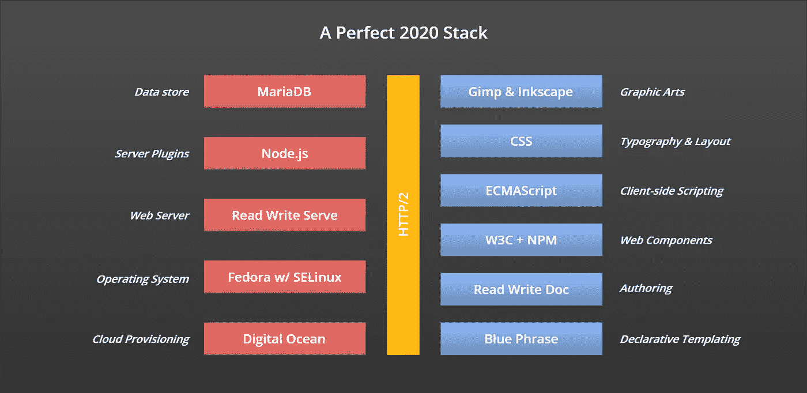

# 我的完美 2020 堆栈:面向新一代的新堆栈

> 原文：<https://betterprogramming.pub/2020-002-my-perfect-2020-stack-43be78df37dd>

## *从“全栈”到“2020 栈”的旅程有一些令人惊讶的赢家和输家*



还记得 web 堆栈简单的时候吗？什么时候这些层可以缩成一个四个字母的缩写词，像 LAMP 或 LEMP 或 LEPP？当你需要的只是廉价的商品硬件、一些开源软件和毅力的时候？

我第一个成功的网站 vintage 1999 是由少数几层构建的:HTML4、CSS2、JavaScript3 和 Apache 1.1，都运行在 Linux 2.0 内核上。它有 38，000 页，20 年后[它仍在把它们推出](https://crescentbloom.com/?utm_term=MyPerfect2020Stack)。

但从那以后我们都变了。哦，我们的筹码增加了多少！

# 我的完美 2020 堆栈

这是新的十年，新的一代。因此，是时候采用新的堆栈了，即 2020 堆栈。 *****

2020 年的堆栈是什么样的？嗯，这很大程度上取决于你想做什么。选择正确的层在很大程度上取决于您需要多大的可伸缩性。

我最喜欢的是小网站。适合虚拟服务器的那些。不需要负载平衡器或有状态数据存储的应用程序。已经被 WordPress 占领了很长时间的 CMS 利基市场。但不是玛丽·近藤的极简服务器。相反，它可以处理持续的流量，而不需要高峰时段的自动供应。

我的甜蜜点现在有十二层。从下到上，我有:

在基地，Digital Ocean 是一家迎合“自己动手”人群的云提供商。我过去一直运行自己的服务器，直到成本高得令人望而却步。机架空间租赁、专用 IP 地址和带宽每月加起来总共为 100 美元.但是真正的杀手是电费。一个 5 美元的数字海洋水滴比我发给我的电力供应商的 1.25 美元/天要便宜得多。将这些数字相乘，我最终每年节省了数百美元。

接下来是带有 SELinux 的 Fedora Linux 发行版。安全性是我们所有人都非常关心的问题。SELinux 是运行在内核中的广泛的安全网。搭配好的`iptables`防火墙配置，再没有比这更安全的感觉了。如果你怀疑这种需要，考虑一下这个:在你最喜欢的云提供商上安装一个新的服务器，看看它会多快被坏人攻击。我见过新服务器在不到 10 分钟的时间内遭受 SSH 暴力登录尝试！

接下来，我的 web 服务器是读写服务器，TLS 证书来自 LetsEncrypt。我曾经是 Apache 的明星，只需几分钟就能配置和启动新网站。但是因为我已经从 PHP 迁移到了 JavaScript，所以我没有其他选择了。在我尝试模仿 Apache 以前给我的所有功能之前，Express 看起来是一个简单的东西:内容协商、条件缓存、压缩、SEO 重写、CORS 和内容安全策略。我已经切换到读写服务，它在默认情况下处理所有这些。

服务器上的应用程序逻辑由 Node.js 处理。NPM 的生态系统似乎有一个包来处理一切，所以组装我需要的东西并将其插入读写服务器是一项简单的任务。发送邮件、与支付网关接口、访问数据库以及我编写的所有其他服务器端 API 都不需要费力。

我的数据库服务器是 MariaDB，开源社区采用的 MySQL 的更名分支。当我需要存储非结构化的 JSON 时，我依赖 PostgreSQL，因为我可以直接在特定的 JSON 属性上执行查询——这有点像 MongoDB，但熟悉 SQL 语法。

对于跨线通信，我依赖 HTTP/2 的持久会话和多路复用流。对古老的 HTTP/1.1 协议的这两项改进改变了我组装文档的方式。首先，行首阻塞的问题消失了，所以不需要图像精灵，即使我有几十个小图像。其次，没有必要将我的 JavaScript 和 CSS 文件优化成包。一旦浏览器和服务器之间建立了连接，所有这些小文件就可以不间断地在网络上传输。

对于 HTML 模板，我使用 Blue Phrase，它是 HTML 的完全无损表达，带有简写符号。对我来说，无与伦比的开始和结束标签以及不可读的标签汤的日子已经结束了。我倾向于在每个模板中只使用几个变量(标题，描述，关键字，搜索引擎优化，飞溅，日期等)。)并将它们以声明性的语言风格分散到模板中。

当我写新的网页时，我专注于我想表达的东西，而不是装饰。为此，我使用 Read Write Doc，它有一种不受干扰的写作体验。即使我的最终目标是在一个媒体出版物上发表博文，我也会使用它(它有一个无与伦比的在线所见即所得编辑器)。作为一名经验丰富的代码编辑人员，我更喜欢使用一页等宽的字符，用手敲击键盘，而不是鼠标。无论如何，每当我想看到我的 CSS 作品时，我可以用一个简单的按键在预览和编辑模式之间切换。

对于 web 组件，我使用了 W3C 标准:影子 DOM、定制元素、HTML<template></template>

客户端脚本都是模块化的面向对象的 ECMAScript。我只在最新的浏览器版本中使用最新的语言特性。也就是说，我只会在[caniuse.com](https://caniuse.com)对每个主要浏览器的最新版本全线绿灯的时候使用它。我远离聚脂填料。

CSS 是关于排版和布局的，而排版是从正确选择字体开始的。我更喜欢可读性。现在，我也把我使用的所有字体文件放在自己的服务器上，这样我就不会被第三方的带宽限制所阻碍。比如类似这样的:`<link href='/fonts/source-serif-pro-400-latin.woff2' rel=preload as=font crossorigin />`。这样做的额外好处是，不用担心 FOUT——“无样式文本的闪现”。

最后，对于图形艺术，我发现自己转向 GIMP 看光栅 png，转向 InkScape 看矢量 SVG。

# 失败者

一些旧的最爱和短暂的爱情不再是我的一部分:

*   **Photoshop & Illustrator。两个非常好的应用程序满足了我多年的图形艺术需求。我依依不舍地向这些人道别。他们的免费和开源替代品现在满足了我的所有需求。**
*   jQuery。自从跨浏览器兼容性战争结束后，我就不需要这个了。唯一真正的杀手级特性是它的选择器语法，它非常有用，以至于早在 2009 年就作为`querySelector`被添加到 DOM 中。
*   **AJAX。Web 2.0 的前身现在是那个时代的遗迹，T2 被现代的、更简单的技术取代，XML 被 JSON 取代。**
*   **萨斯/SCSS。我承认编写没有变量的 CSS 是没有效率的，所以 SASS 有了一个好的开始。模块也是一项重要的工作。但是最终，它需要太多的脑力才能有效地在 JavaScript 中使用。从那时起，CSS 已经走过了漫长的道路，像这样的代码争论者和破坏者正在被淘汰。**
*   **贝姆命名。**CSS 类名的*块元素修饰符*方法确实解决了全局名称空间问题，但是代价是过于冗长。我在语义元素上切换到了父/子选择器，避开了标识符和类名，采用了一种更简单的方法，比如:

```
header > ul > li {
   ...
}
nav > ul > li {
   ...
}
footer > ul > li {
   ...
}
```

*   格鲁吉亚&凡尔纳。这两个在我的字库中占据了多年的榜首。我可以相信它们是可用的、可读的。但是一旦有了规则，铸造厂开始分发开源字体，我就开始寻找其他地方。
*   Babel，Grunt，Gulp，Browserify，WebPack。前四个并不奇怪。但是说 WebPack 已经没有用了，这有点令人惊讶。这是背景故事。

1.  在具有持久会话和多路复用流的 HTTP/2 之前，我们依赖这些工具来捆绑我们的资源。但是在 HTTP/2 的新世界中，捆绑没有给我们带来任何东西。
2.  随着 ECMAScript 2015 的推出，新的语言特性一落地，我们就争相使用，但有一个问题。如果不将代码传输回 ECMAScript 5，我们就无法在野外部署代码。我们依赖 Babel 作为我们构建过程中的标准步骤。今天，我需要的所有新语言特性到处都有，所以巴别塔是不必要的。
3.  在动态导入在浏览器中可用之前，我们需要将文件转换回 CommonJS 格式。现在大多数主流浏览器都支持`<script type='module'>`(Edge 76+即将推出)，所以我们终于可以和 ECMAScript 模块打招呼了，和所有其他的说再见了。

*   **JSX。我不明白为什么有人认为这是件好事。“但你会习惯的”从来都不是一个令人信服的论点。**
*   **功能编程。我将我的函数式编程限制在一行程序中，就像`numbers.sort((a, b) => a - b);`对于其他所有事情，我使用面向对象编程。**

# 获胜者

对我来说，真正的明星层是:

*   **JavaScript 模块。**服务器端 Node.js 中的模块被证明是赢家。我很高兴终于可以在客户端使用它们了。
*   **面向对象的 JavaScript。**这可以总结为五条黄金法则:1)用命名类替换匿名对象，2)声明*并初始化*构造函数中的所有属性，3)立即密封所有对象，4)用不变签名定义方法，5)将`this`绑定到每个回调。
*   **蓝色短语。用于模板、创作和声明性编程。我依靠它来生成好看且写起来愉快的 HTML。**

这是新的一代，过去几十年的四层堆栈现在是十二层堆栈。冒着听起来老生常谈的风险，我将首先陈述一个显而易见的事实:你的筹码可能会有所不同。我很好奇其他人会提出什么样的*完美的 2020 堆栈*。

**“这是一个新的十年。”当然，如果你是一个纯粹主义者，并且你认为新的十年要到 2021 年 1 月 1 日才开始，你可以保存这篇文章，明年再看。但是你会错过一年的快乐时光。*