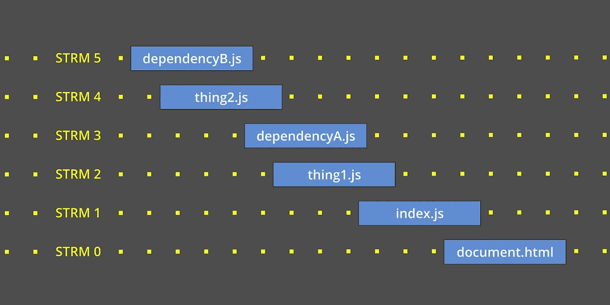

# 有了 ES 模块和 HTTP/2，您可能不再需要 Webpack

> 原文：<https://betterprogramming.pub/2020-004-the-rollout-of-modules-is-complete-d25f04870284>

## 是时候全面拥抱进口/出口了

复用流上的 JavaScript 模块

*随着 JavaScript 模块在各种主流浏览器中得到全面支持，精明的开发人员现在可以在没有 Webpack 的情况下交付生产就绪的应用。*

前端 Web 开发人员正处于将其应用程序投入生产的新方式的风口浪尖。由于浏览器最终支持使用符合 ECMA-262 标准的模块的`import`和`export`，对传输器和打包器的需求正在消失。

到目前为止，微软 Edge 是最后一个例外，它阻碍了我们在野外部署 ES 模块。今天，随着基于 Chromium 的 Edge 76 的发布，每个主流浏览器都支持新的模块标准。这对我们如何构建和部署代码有着巨大的影响。

为了理解我的观点，请允许我分享一些背景故事。

走到今天这一步是一条漫长的道路，经历了性能分析器、任务运行器、传输器、打包器和 HTTP 协议的重大变革。

# 雅虎！时代

2005 年，雅虎发表了一篇文章，后来成为某种前端圣经。回顾今天的星群，雅虎看起来像是一个昏暗的尘埃。但是在《时代》杂志的“有史以来最有影响力的 15 个网站”排名中，雅虎。排名第七。

引起所有骚动的文章标题是“加速你的网站的最佳实践”最重要的是它的黄金法则*减少 HTTP 请求*。对于如何实现这一点，它给出了明确的建议:将所有的脚本合并到一个文件中。

在那个时候，组合你的脚本是一个容易遵循的戒律。我们写的大部分都是操纵用户界面的简单事件监听器。更复杂的网站可能偶尔会编写一个函数，触发一个`XMLHttpRequest`来检索数据。

无论哪种方式，不管我们在这个时代写了什么，都是放在全球范围内的。因此，当我们的网站发展到具有更强的交互性时，全球范围的使用变得越来越成问题。如何命名一个迭代一系列事物的函数，如何将这个名字与其他相似的名字分开？像`iterateThing1()`和`iterateThing2()`这样的名字应该不是闻所未闻。

在这个时代，我有一个客户，他的全部 20，000 行代码都在一个文件中。团队中的每个开发人员都在同时工作！有些东西必须放弃。

# AMD 和 CommonJS 时代

作为程序员，我们在这里没有遇到任何新的东西。定义本地名称空间是每一种主流编程语言都必须解决的一个共同需求。在几乎所有情况下，文件级的模块化代码都是解决方案。不幸的是，对于当时的 JavaScript 开发人员来说，这种语言还没有成熟到允许这样做。

取而代之的是应用级的解决方案，以异步模块定义(AMD)规范及其`RequireJS` 实现的形式出现。使用这种解决方案，文件中的所有内容都被包装在自己的上下文中，将其函数和变量与外部隔离，有效地防止了名称冲突。每个文件本身就是一个单元。为了使用这个单元，开发者可以通过用一个`define()`函数包装目标来选择对外界可见的内容。和任何其他想要访问它的单元，将使用一个`require()`函数来完成。

当这发生在前端时，Node.js 正忙于处理后端的相同问题。他们的解决方案是 CommonJS 模块系统。在该系统中，开发人员将通过声明一个`module.exports` 语句来选择对外界可见的内容。任何其他想要获得这些出口的单位都需要一份`require`声明。

同一问题的两种不同解决方案。

快进到 2015 年，ECMAScript 的 TC39 委员会加入了这场争论，并正式宣布了直接解决模块化代码需求的新语言特性。他们宣布，模块将通过两个新的关键字获得一流的语言支持:`import`和`export`。这就结束了争论。

但是宣布和实施是两回事。直到 2017 年末，第一个实现才在 Chrome 浏览器中实现。还需要两年半的时间`import/export`才能被所有主流浏览器完全支持。

AMD、CommonJS 和 ES 模块的完整故事无需在此赘述。但是`import/export`的长期推出所带来的后果对我的故事很重要。结果是，希望获得模块化代码好处的开发人员不得不做出选择:要么使用旧的模块语法编写，要么使用新的语法编写，然后*将其转换回旧的语法以便部署。*

对于我的项目，我选择用新的语法来写。为了将代码部署到产品中，我使用了一个专门构建的 CLI 工具，我称之为 [eximjs](https://hub.readwritetools.com/tasks/eximjs.blue) ，它将`import`和`export`语句转换为 CommonJS 语句。当我编写这个工具时，我认为它的寿命很短。我没想到我会用它五年！

# 邦德勒时代

看到他们的未来，许多项目选择通过使用 transpilers 来超越不可避免的事情。巴贝尔成为这一领域无可争议的冠军。它完美地解决了模块语法问题，同时还为 TC39 宣布的其他新特性提供了 polyfills 和 shims。

为了实现这一点，前端开发人员开始远离伴随他们成长的简单的*脚本*工作流，并开始转向*构建过程*。这推动了对任务运行者的需求:可以作为一系列步骤运行的工具。最初，Grunt 和 Gulp 满足了这个需求。我们使用它们来建立构建过程，每当源代码文件发生变化时，就对其进行编译、链接、测试和缩减。

模块化架构成为现实，开发人员全力以赴。名称空间问题已经解决。

是 DevOps 的人首先注意到这种新方法产生了自己的一系列问题。或者说，它重新浮现了雅虎多年前小心翼翼发现的老问题。大量的小文件意味着大量的 HTTP 请求，这意味着更长的加载时间。但是我们不会因此而停止设计模块化架构。我们需要一种不同的方法。

新方法以捆扎机的形式出现。我们一直使用的任务运行器被新的工具所取代，这些工具解析我们的 JavaScript 并确定它的依赖关系。这些依赖模块被连接成一个包，并在一个 HTTP 请求中发送出去。DevOps 很开心。

每个人都重组了他们的构建过程，放弃了任务运行器，用 Browserify 或 Webpack 这样的捆绑器取而代之。不久之后，竞争以 package 和 Rollup 的形式出现，前者减轻了 Webpack 所需的大部分配置开销，后者专注于同构 JavaScript 和捆绑 ES 模块的愿望。

随着时间的推移，许多有趣的问题已经被 bundlers 解决了。例如，*树摇动*和*分块*是对构建过程的主要改进。另一方面，在浏览器中，*代码分割*和*延迟加载*对到达目标的包进行了重大优化。今天，bundler toolscape 仍然存在，并且与包大小和缓存相关的性能改进正在进行中。

但是这一切都有问题。原来的问题是 HTTP 的线头阻塞问题，被雅虎这么小心翼翼的叫出来。随着我们的应用程序变得越来越复杂，它变成了名称空间问题。然后，当我们等待 TC39 精确地指定新的模块加载器应该如何工作时，它变成了语言缺陷问题。在此期间，它变成了 bundler 性能问题，因为我们试图平衡所有竞争需求，以实现更快的传输、按需加载和缓存。

# 2020 年时代

但是让我们休息一下，在整个 Web 堆栈的更广泛的背景下重新检查这些问题。特别是，让我们在 HTTP 的上下文中来看它们。

甚至在模块戏剧展开的同时，我们最初的性能问题的解决方案以 HTTP/2 的形式出现了。我们都非常熟悉的经典 Web 协议的这一更新提供了对我的故事非常重要的两个主要改进:持久连接和多路复用流。

它是这样工作的。使用 HTTP/2，对 HTML 文档的请求会打开浏览器和服务器之间的连接，该连接会一直保持打开，直到所有需要的东西都到达。此外，当浏览器发现它需要什么(图像、字体、脚本、样式)时，它会请求它们，而不会暂停或等待响应完全完成。这是可行的，因为新协议有多路复用流，所以所有这些请求可以同时进行。简而言之，线头阻塞问题变得没有实际意义。

现在请允许我简短地离题。一听说 HTTP/2，我就自然而然地寻找支持新协议的 web 服务器以及我正在编写的 Node.js 库。我对当时看到的一切都不满意。这成为我创建[读写服务](https://hub.readwritetools.com/enterprise/rwserve.blue?utm_term=TheRolloutOfModulesIsComplete) HTTP/2 服务器的催化剂。今天，我在每个新项目中都使用这个服务器，我可以证明新协议的优势。持久连接和多路复用流如宣传的那样交付。

这个新协议与我的信条直接相关，即捆扎机将很快成为过去的遗迹。因为 HTTP/2 如此完美地容纳了许多文件，所以应用程序不需要单独处理优化的任何部分。

HTTP/2 和本地 es 模块提供的优势是多方面的:

*   当使用 JavaScript `import`和`export` 语言语句时，Transpilation 不再是必要的。
*   调试不再需要源代码映射，因为源代码不会被 transpiler 破坏。
*   不需要复杂的试探法来猜测最佳的块边界，因为块不是一个东西。
*   分割包不需要管理代码，因为模块是作为离散的命名文件到达的。
*   不需要延迟加载优化器，因为浏览器只在需要时才请求脚本和资源。
*   不需要摇动树，因为浏览器只请求它发现的依赖项。
*   浏览器、服务器和内容交付网络的缓存都可以充分利用 HTTP 的`cache-control`、`if-none-match`和`etag`头，节省网络带宽，提高吞吐量。
*   DevOps 人员可以使用每种 mime 类型的最佳方法来微调文件压缩。

与带有 bundlers 的 HTTP/1.1 相比，带有本机 ES 模块的 HTTP/2 显然是赢家。简而言之，源代码文件可以直接投入生产，而不需要我们为自己创造的所有代码。

长期以来，我们一直将 JavaScript 视为编译语言，以至于我们忘记了它实际上是一种解释语言。是的，我们可能仍然想使用棉绒和缩绒机，以保持整洁，但所有其他轧棉机只是适得其反。

简而言之，如果你对你的团队选择构建工具有任何影响，现在是重新思考你为什么需要 Webpack 的好时机。

保持简单是更聪明的成功之道。