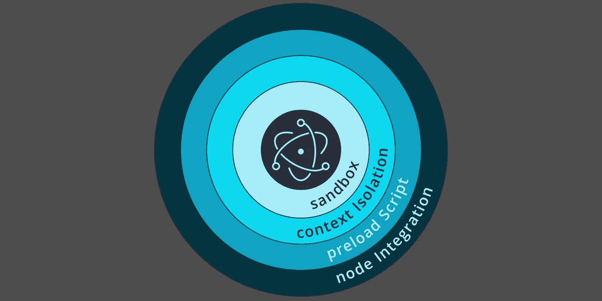

# 电子应用使用起来越来越安全

> 原文：<https://betterprogramming.pub/2020-005-electron-apps-are-getting-faster-and-safer-3c045c39f61f>

## *电子企业蓄势待发*

[电子报](https://www.electronjs.org/)桌面应用程序是使用数百万软件开发人员所熟悉的技术创建的。这使得进入门槛很低，也是它的吸引力所在。

开始很容易。任何熟悉 Node.js 的人都可以自举一个 *Hello World！*简单易用的桌面应用。

当然还有另一个大的好处:相同的代码库可以同时用于 Windows、Mac 和 Linux。所有这些加起来就是一个令人信服的案例，需要更仔细地研究。

但是创建一个真正的电子应用程序并不适合胆小的人。改造那个最初的 *Hello World！快速安全地做某事需要努力。值得庆幸的是，安全性是 2020 年电子行业的大新闻。*

# 2019 年-转折的一年

过去一年发生了几件大事，使项目出现了拐点。去年的旅程经过了以下几个重要里程碑:

*   随着 4.0 版本开始迎接新的一年，5.0 版本将于 4 月发布，6.0 版本将于 7 月发布，7.0 版本将于 10 月发布。
*   今年 3 月，Electron 采用了一种治理结构，正式制定了道路规则，并帮助更容易地取得进展。
*   11 月，Charles Kerr 和他的团队公布了一个全新的[构建过程](https://github.com/electron/build-tools)，这大大缩短了当其依赖关系(Node.js、 [V8](https://v8.dev/) 和 [Chromium](https://www.npmjs.com/package/chromium) )发生变化时重建 Electron 所需的时间。
*   12 月，Electron 作为一个孵化项目被加入到 OpenJS Foundation 中，向整个 JavaScript 社区表明这个项目将会继续存在。

人们开始觉得，2014 年的欢乐之旅已经变成了一段更有节奏的漫长旅程。

# 安全改进

有些人知道，最近发布的勇敢浏览器开始作为一个实验性的电子项目。

在认真尝试之后，勇敢的团队最终意识到，再多的锁定代码也无法让他们安全地访问可能包含恶意代码的任意 URL。

对于 electronic 社区的其他人来说，教训很明显:使用 electronic 的嵌入式 Chromium 浏览器窗口只显示本地托管的页面。

对于那些无法抵制访问远程 URL 诱惑的开发人员，建议有点复杂:确保网页有 HTTP [内容安全策略](https://rwserve.readwritetools.com/content-security-policy.blue?utm_term=NewsFrom2020CovalenceConf)，限制通过不安全的渠道获取 JavaScript。

内容安全策略并不是每个开发人员技能的一部分，所以任何想要正确做到这一点的人都需要提前学习。

最可怕的是，Electron 的嵌入式 Node.js 库允许开发者完全访问桌面的文件系统和网络堆栈。这就是电子桌面应用程序与简单的浏览器应用程序的区别。

因此，为了降低恶意代码横行的风险，开发人员可以为任何不需要 Node.js 的浏览器窗口启用`sandbox`选项。沙盒在主机操作系统级别上工作。这是锁定的大锤方法。

需要 Node.js 并决定关闭`sandbox`选项的开发人员仍然可以通过正确设置`nodeIntegration`选项来谨慎行事。

*   当创建一个浏览器窗口来访问只使用本地托管资源(脚本、样式表、图像或字体)的本地托管文档时，可以安全地将`nodeIntegration`设置为`true`，允许 Node.js 库调用。
*   另一方面，当创建可能访问任意远程 URL 的浏览器窗口时，`nodeIntegration`必须始终设置为`false`，阻塞 Node.js 库调用。

当在关闭`nodeIntegration`的浏览器窗口中仍然需要对 Node.js 的选择访问时，开发人员可以使用`preload script`。使用这种类型的架构，在创建浏览器窗口之前会执行一个单独的 JavaScript 模块。

该模块可以在浏览器窗口的整个生命周期内访问 Node.js，并可以充当自定义的代理 API。只要代理只传递简单的值，而不是 Node.js 对象，`preload script`就可以代表浏览器窗口安全地获取和设置文件系统和操作系统的值。

为了在访问远程内容时更加安全，可以将`contextIsolation` 选项设置为`true`。该选项将强制为每个浏览器窗口创建一个单独的 JavaScript 世界。

上下文隔离可以防止坏人在不受信任的浏览器窗口中摆弄 JavaScript 的原型链，以便在同级浏览器窗口中偷偷获取对受信任代码的控制。

刚刚开始使用 Electron 的开发人员可能没有充分认识到这些选项的重要性，并且可能在匆忙获得工作原型时不经意地做出了糟糕的选择。

为了帮助解决这个问题，Doyensec 的 Luca Carettoni 创造了一个开源工具，它有一个充满双关语的名字——“T5”电负性。可以把它想象成一个安全审计工具。它通过扫描项目的 HTML DOM 和 JavaScript AST 来寻找潜在的漏洞。

# 反对“远程”的奇怪提议

electronic 是一个开源项目，与许多类似的项目不同，它没有大的企业赞助。工作是由分散在全球各地的开发人员执行的，他们从事的项目有着非常不同的目标。因此，贡献者关注不同的需求也就不足为奇了。

谢天谢地，其中一个需求是更好的性能。为此，在最近的 2020 年共价会议上，宣布在电子版本 9.0 中将弃用常用的`remote`模块，并在版本 10.0 中完全删除。

这是一个惊喜。不知何故，我没有看到杰里米·阿普索普以前发表的文章[电子公司的“远程”模块被认为是有害的](https://medium.com/@nornagon/electrons-remote-module-considered-harmful-70d69500f31)。

为了理解这一点的含义，新来者需要理解电子应用具有分裂的个性。

一边是应用程序的主进程，它负责启动一切。另一边是应用程序的*呈现器*进程。两者使用进程间通信(IPC)进行通信。

掌握电子发展的关键是懂得如何利用`ipcMain`和`ipcRenderer`来协调一切。这就是远程模块派上用场的地方。它使得从渲染器进程到主进程的 IPC 调用变得超级简单，允许普通人完成更多工作。

在我参与的所有电子应用程序中，`remote.getGlobal()`被战略性地有效使用。每次都像预期的那样起作用。

诽谤`remote`背后的原因，以及我自己的反驳观点是:

*   *论据:*每次 IPC 调用需要 0.1ms。*对位:*这是花生。在一眨眼的时间里(以每屏幕刷新 16 毫秒的帧速率)，可以进行 160 次 IPC 调用。
*   *论据:*使用不当会导致竞态条件。 *Counterpoint:* 在执行之前设置回调监听器消除了这类问题。
*   *论点:*远程对象被代理，失去了它们的原型链。 *Counterpoint:* 适当的反序列化和向正确对象类型的转换允许结果被使用而不会出现意外。
*   *论点:*这是一个等待发生的安全漏洞。这不是一个密切相关的论点。来自主进程的 PNG 图像可能已经部署了它们的恶意负载，而不管任何 IPC 调用。

我个人认为这是对性能的过分追求，我希望不要执行弃用`remote`模块的计划。尽管如此，我还是很欣赏对细节的关注。很高兴知道电子性能调整已经达到 0.1 毫秒被视为重要的水平。

# 为企业做好准备

在今年的会议上，我注意到一个趋势，那就是在企业桌面应用程序中使用电子，尤其是那些针对 Windows 用户的应用程序。

在围绕电子公司跨平台能力的所有喧嚣中，人们忽略了一点，那就是*你不必把三者都作为目标。*

我在会议上与许多人交谈过，他们明确地限制他们的开发工作来为 Windows 用户进行优化。ChartIQ 的 Terry Thorsen 很好地展示了这个案例。

C++程序员越来越稀缺，这已经不是秘密了。JavaScript 优先开发者的崛起同样显而易见。因此，毫不奇怪，电子公司准备给微软一个机会。

寻找具有华丽风格的新面孔的老 MFC 应用程序是用电子重写的特别好的候选者。我打赌 C#和 Visual Basic 也会受到冲击。

但是要真正实现这一点，电子社区需要开始直接向企业用户征求反馈，并把他们的需求放在路线图上。

# 2020 年的路线图

我还没有看到 2020 年及以后的路线图，但如果保持去年的发布节奏，我们可以期待在未来 12 个月内看到 8、9、10 和 11 版本。

我的个人愿望清单包括:

*   对进程间通信(IPC)更好的应用层支持。由于我们不能使用事件或回调来跨越主/呈现器的界限，每个电子应用程序的很大一部分都在处理传递数据的脚手架。目前每个人都有自己的卷。
*   更好地支持应用程序级变量。因为渲染器需要获取和设置应用程序状态，所以拥有一些主进程和独立渲染器都可以访问的专用状态对象是有意义的。目前这都是用`remote.getGlobal()`完成的。它很简单，但能完成工作，但我会投票给更复杂的东西。
*   摇树。电子应用程序充斥着永远不会被调用的代码。最终的`asar`构建过程中一个受欢迎的附加步骤是分析哪些文件可以丢弃。我意识到这可能是一个耗时的过程，但就我而言，我会毫无怨言地使用它。
*   电子线头工具。随着项目的发展，会发现更好的做事方法，旧的方法会被淘汰。拥有一个工具来扫描我们的应用程序，并使用这些新功能提出改进方法，将使每个人的应用程序更快、更安全。