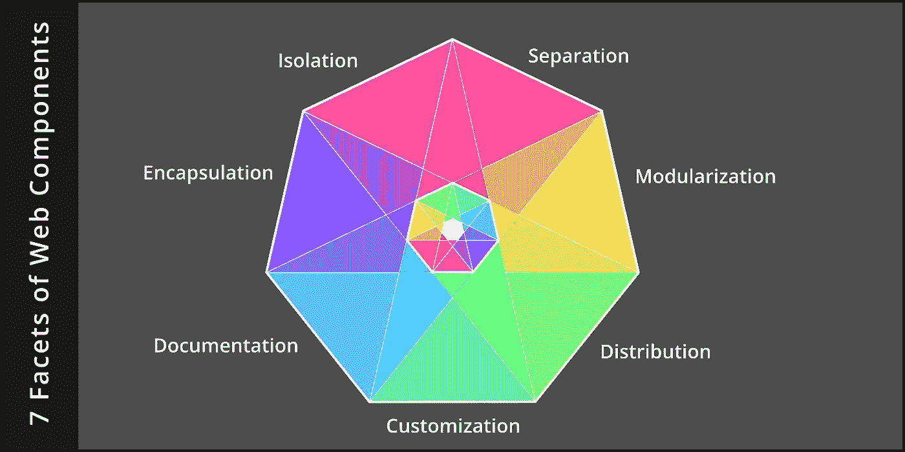

# Web 组件的 7 个方面

> 原文：<https://betterprogramming.pub/2020-007-the-facets-of-w3c-web-components-e76798ab7b29>

## 封装、隔离、分离、模块化、分发、定制和记录



Web 组件为开发人员带来了好处，它提供了一种设计应用程序各个部分的方法，而不会产生冲突。

对于组件，首先要理解的是，它们不是主要的设计问题。也就是说，它们不是用户问题的技术解决方案。

所以，首先考虑 UI/UX 是一种干扰。相反，它们是软件开发人员关心的问题，为软件开发人员面临的问题提供解决方案。

设计良好的组件有七个不同的方面，它们独立于任何框架(React、Vue、Angular ),并严格遵守 W3C web 标准:

1.  *封装*定制的 HTML 元素，这样它们就可以作为一个单元来对待。
2.  *隔离* CSS 规则，防止特异性泄露。
3.  将模板、修饰和控制的工作分成 web 的三种核心语言。
4.  *模块化*组件以提供内部范围。
5.  *分发*成品，以便与他人分享。
6.  *定制*发布的产品在不同设置下工作。
7.  *记录*所有部件是如何组合在一起的。

# 1.包装

web 组件最容易理解的概念之一是，文档的各个部分是从整体中分离出来的，并被视为一个单元。这是使用*定制元素*完成的，这是一种 [W3C](https://www.w3.org/) 技术。

自定义元素的规范描述了它的生命周期，从浏览器将它添加到文档中开始，到它被删除为止。浏览器发送给自定义元素的生命周期事件可以被截获，并用于构造、反应和破坏。

这提供的范围意味着开发人员可以清理他们的文档级`onLoad`和`onUnload`回调。

此外，对定制元素属性的更改可以以类似的方式做出反应。这允许本地化所有事件侦听器，将它们与组件的其余代码放在一起。

定义定制元素是一个简单的单行程序:

```
customElements.define('my-component', MyComponent);
```

这里，第一个参数是定制元素名称，第二个参数是定义组件行为的 JavaScript 类。

有了这条语句，自定义元素名称现在与 HTML 的预定义标记处于同等地位，可以像任何其他元素一样使用。

```
<body>
    <h1>Hello World!</h1>
    <my-component></my-component>
</body>
```

新组件的内部工作封装在这个标签中。

# 2.隔离

几年来，我忽略了组件革命，没有充分理解 W3C 发布的影子 DOM(T21)规范。也许是这个不熟悉的名字，带有“曾经被移除”的含义。

我现在认识到它是一种作用域技术，并充分肯定它为我最棘手的问题之一:CSS 特异性规则提供了解决方案。

过去，我曾感叹过这样一个事实:再聪明的命名也不能帮助我写出正确定位元素的 CSS。我在 [*为什么 CSS 最难的部分是特异性*](https://medium.com/swlh/tws-017-why-the-hardest-part-of-css-is-specificity-75cf8bb1c44c) 中详细探讨了这个问题。

当时，似乎我声明的每个新 CSS 规则都会对完全不相关的元素产生一些意想不到的副作用。

即使我完全掌握了特异性的概念，我仍然发现很难找到没有副作用的解决方案。对我来说，设计牢不可破的 CSS 解决方案的能力还没有实现。

这就是暗影 DOM 适合它的地方。它在作用于`document`的元素和自定义元素中定义的元素之间提供了防火墙。好处是既安全又简单。

例如，如果我在组件中声明了超链接显示的特殊规则，这些规则不会泄露并覆盖组件外的超链接。

样式规则可以直接在*元素类型*上声明，简单如下:

干净的代码。我不再需要使用类名或标识符来定位组件中的元素。

# 3.分离

Web 组件使用三种不同的语言:HTML 用于模板化元素，CSS 用于修饰元素，JavaScript 用于控制与用户的交互。

大多数开发人员都知道从*关注点分离*中获得的好处，所以没有必要在这里重复。奇怪的是，近年来，这一设计原则被公然忽视了。

但是当坚持使用时，一个简单的模式出现了，使这三种语言和谐相处。

*   结构化标记被写成 HTML `template`，并保存到一个`.html`文件中。
*   装饰是使用 CSS 规则声明的，CSS 规则保存在一个单独的`.css`文件中。
*   控制用户交互的脚本是用 JavaScript 编写的，保存在自己的`.js`文件中。

在这个模式中，组件的初始化放在`.js`文件中，当定制元素被添加到 DOM 中时，由浏览器调用。

然后，JavaScript 代码使用 HTTP 动态获取 HTML 模板和 CSS 规则，将它们添加到一个影子根:

瞧啊。这三种语言是和谐的，关注点的分离保持不变。

# 4.模块化

定义本地名称空间是每一种主流编程语言都必须解决的一个共同需求。

JavaScript 通过`import/export`语句来实现这一点。这种语言特征消除了全球环境污染。好处是函数名可以短而甜。没有更多的`initABC`和`initXYZ`时，平原老`init`就行了。

注意，我在这里特别谈论的是 ES 模块，而不是老派的`require`语句。如果使用得当，组件的动态部分可以按需出现，只在需要时加载。

要在 HTML 文档中使用它，请遵循这个新模式，确保指定了`type='module'`属性:

```
<head>
    <script src='/my-component.js' type='module'></script>
</head>
```

当这样做时，组件的每一部分都会自动获得 HTTP 提供的缓存和压缩好处。这与捆扎机提供的一体化合并形成了对比。

关于这方面的更多信息，我在 [*中探索了在 ES 模块的新世界中对捆绑机的需求日益减少的情况。模块的展示已经完成*](https://medium.com/better-programming/2020-004-the-rollout-of-modules-is-complete-d25f04870284) 。

# 5.分配

当组件完成时，可以在 npm 上发布，供网站应用程序使用。Npm 是一个公共包管理器，最初是为 Node.js 库设计的，但它也适用于 web 组件。

一个简单的`package.json`文件足以描述组件:

为了安装组件，使用`npm init`命令在网站的根目录下创建一个单独的`package.json`文件。

命令`npm install my-component`用于下载组件并将其放在网站的`node_modules`目录中。为了简洁起见，省略了设置 npm、发布软件包和安装软件包的完整机制。

好处是:组件创建者容易发布，更广泛地分发到 JavaScript 社区，以及组件消费者的语义版本化。

# 6.用户化

大多数组件将提供满足原始创建者需求的默认样式。这很少是组件消费者想要的。

组件开发人员可以通过预测哪些 CSS 声明可能会引起反对并更改声明以从 CSS 变量中提取值来适应这些消费者。

最常见的定制类型与配色方案、组件定位和组件大小有关。明智地使用一般命名的变量效果最好。

记住，因为 shadow DOM 隔离了元素，所以不需要创建像`--my-component-width`这样的前缀名称。像`--width`这样简单的名字就可以了。

变量名应该用默认值声明，在组件的 CSS 文件中，在`:host`选择器中，然后使用`var()`语法应用到组件，如下所示:

这样做时，使用者只需在应用程序的 CSS 中定位自定义元素名称并定义新的变量值，就可以覆盖这些默认值:

消费者受益于不必仅仅为了风格上的改变而放弃回购。

# 7.证明文件

必须向消费者提供足够的说明、示例和参考资料，以便按预期使用组件。发布的`readme` 文件应该有这些部分:

*   *动机。*组件解决什么问题的陈述。
*   *特色。*组件如何解决该问题的描述。
*   *安装。*获取组件的链接，以及放置组件的位置。
*   *配置。*描述如何使用向消费者公开的每个属性。
*   *举例。*`Hello World`演示如何让组件在 HTML 页面上工作。
*   *定制。*可以被覆盖的所有 CSS 变量的列表。
*   *事件。*组件发出或消耗的事件列表及其在生命周期中的位置。

这个列表中的前两项是描述性的:它们是卖点。接下来的三个是自然教程:一步一步的傻瓜指南。

最后两个是参考资料，因此用户不必阅读代码就能知道发生了什么。

为了简洁起见，上面的代码示例一定是不完整的。对于感兴趣的读者，您可以在这些开源的符合 W3C 的 web 组件中看到所有七个方面的作用。

当开发除了最简单的 *Hello World 之外的任何软件时！*对于应用程序，开发者必须想办法防止无关的代码干扰手头的任务。

这已经成为我们为自己创造的许多基本编码策略的催化剂，即:函数、对象、模块、局部变量和其他类似的作用域模式。

Web 组件正好适合这个领域。