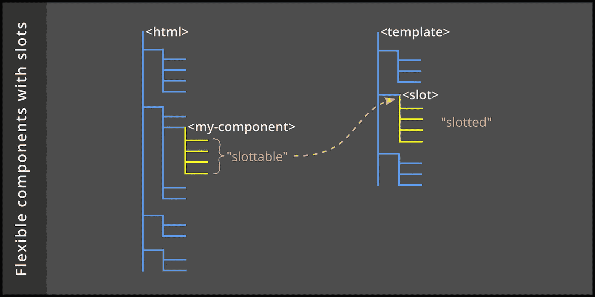

# 通过插槽增加 Web 组件的灵活性

> 原文：<https://betterprogramming.pub/2020-008-add-flexibility-to-web-components-with-slots-c07ce2620952>

## 将重点从组件开发者转移到组件消费者



HTML `<slot>`标签通过允许任何人向标准 web 组件添加新内容，将重点从组件开发者转移到组件消费者。

# 自定义元素和模板

定制元素是一种基于标准的技术，允许软件开发者扩展 HTML 的基本标签集。它与其他基于标准的技术一起用于创建一个独立于任何专有框架的 *web 组件*，比如 React、Vue 或 Angular。

这里的一切都是面向未来的，由万维网联盟(W3C)设计和批准的。

首先，考虑一个具有如下结构的文档:

```
<body>
    <h1>Hello World!</h1>
    <my-component></my-component>
</body>
```

为了使其合法化，开发人员必须通知浏览器新的标签名称，并告诉它 JavaScript 类将定义它的行为。这是通过这样一个声明完成的:

```
<script>    
    window.customElements.define('my-component', MyComponent);
</script>
```

新的`my-component`标签成为组件开发人员指定的元素层次结构的简写。最初，`document` DOM 无法访问这个层次结构——它被包装在一个 HTML `<template>`中并被搁置一旁，直到浏览器需要它。

出于讨论的目的，我将声明一个可用于 web 组件的模板，它模拟一个带有标题、内部内容和页脚的对话框。

```
<template>
    <caption>Getting Started</caption>
    <section>
        <h2>Welcome</h2>
        <p>Press OK when you're ready to begin.</p>
        <button>OK</button>
    </section>
    <footer>Glad you're here!</footer>
</template>
```

# 该槽元件

让我们不要纠缠于`MyComponent` JavaScript 类做什么或者 web 组件生命周期如何工作的细节。我们将把那个讨论留给别处的。

相反，让我们专注于我们已经创建的模板，改变它使标题和文本通用。目标是让*消费者*，即*使用*组件的应用程序开发者，决定在那里放什么。这就是`<slot>`标签发挥作用的地方。这是同一个模板，但是有一个槽，可以接受来自消费者的元素:

```
<template>
    <caption>Getting Started</caption>
    <section>
        <slot></slot>
        <button>OK</button>
    </section>
    <footer>Glad you're here!</footer>
</template>
```

# 可开槽和开槽的

为了使用这个新组件，使用者在开始和结束自定义元素标记名之间添加元素，如下所示:

```
<body>
    <h1>Hello World!</h1>
    <my-component>
        <h2>Goodbye</h2>
        <p>Your submission has been accepted.</p>
    </my-component>
</body>
```

本例中消费者指定的`h2`和`p`元素称为*可开槽元素*。

当浏览器呈现文档时，*将模板和可开槽的元素组成*一个内部层次结构，如下所示:

```
<body>
    <h1>Hello World!</h1>
    <my-component>
        <caption>Getting Started</caption>
        <section>
            <h2>Goodbye</h2>
            <p>Your submission has been accepted.</p>
            <button>OK</button>
        </section>
        <footer>Glad you're here!</footer>
    </my-component>
</body>
```

在组合层次结构中，从消费者处获得的标题和段落被称为*槽元素*。

# 命名插槽

正如我们所看到的，组件现在是欢迎和告别的大杂烩。为了澄清这一点，我们希望允许消费者指定标题和页脚。这就是*命名槽*发挥作用的地方。组件开发人员应该将模板改为有三个插槽，每个插槽都有一个唯一的`name`属性(`title`、`inner`和`message`)。

```
<template>
    <slot name='title'></slot>
    <section>
        <slot name='inner'></slot>
        <button>OK</button>
    </section>
    <slot name='message'></slot>
</template>
```

下面是消费者应该如何用命名槽标记文档，以便正确使用这三个槽:

```
<body>
    <h1>Goodbye World!</h1>
    <my-component>
        <caption slot='title'>Finishing Up</caption>
        <h2 slot='inner'>Goodbye</h2>
        <p slot='inner'>Your submission has been accepted.</p>
        <footer slot='message'>Thanks for supporting us!</footer>
    </my-component>
</body>
```

浏览器将文档层次结构组成为:

```
<body>
    <h1>Goodbye World!</h1>
    <my-component>
        <caption>Finishing Up</caption>
        <section>
            <h2>Goodbye</h2>
            <p>Your submission has been accepted.</p>
            <button>OK</button>
        </section>
        <footer>Thanks for supporting us!</footer>
    </my-component>
</body>
```

# 默认插槽值

组件开发人员可以为三个插槽中的每一个提供默认值，这样消费者就不会被迫提供它们。

当文档被合成时，这些缺省值将被覆盖——但是只有当消费者提供了具有匹配名称的可开槽元素时。这是默认的版本:

```
<template>
    <slot name='title'>
        <caption>Getting Started</caption>
    </slot>
    <section>
        <slot name='inner'>
            <h2>Welcome</h2>
            <p>Press OK when you're ready to begin.</p>
        </slot>
        <button>OK</button>
    </section>
    <slot name='message'>
        <footer>Glad you're here!</footer>
    </slot>
</template>
```

如果消费者提供了前面显示的“Goodbye”文档标记，那么组合的层次结构将与我们已经看到的完全一样。但是如果消费者省略了指定的槽，那么组合的层次结构将与我们开始时的“Hello”文档一样。

我们刚刚使我们的 web 组件变得更加灵活！