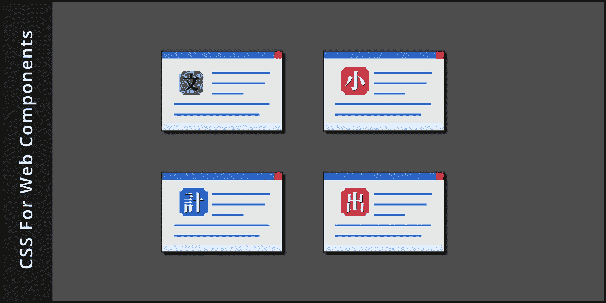

# 仅用于组件的特殊 CSS

> 原文：<https://betterprogramming.pub/2020-010-special-css-just-for-components-d5fc36c83744>

## 如何创建标准、健壮的组件



从历史上看，HTML 组件的设计很脆弱，灵活性很小。不应该是这样的。现在有一种标准的方式让消费者能够定制组件。

# 为 Web 组件输入 CSS

web 组件的两个方面似乎是相互对立的:隔离和定制。开发者如何保持内部 CSS 规则与外界隔离？消费者如何设计组件来实现他们想要的品牌？

这种冲突可以通过针对 web 组件设计的特殊 CSS 特性来解决。

首先，让我们定义隔离和定制的目标。

*隔离*是组件的影子 DOM 创建的防火墙。在隔离的情况下，应用于网站的 CSS 规则只影响从文档的根到自定义元素的元素，而不会进一步影响。另一方面，在组件中声明的 CSS 规则只影响从它的分离阴影根开始的元素。

这是好事。它允许组件开发者和组件消费者独立地声明规则，而不用担心他们的决定会被意外地覆盖。

*定制*另一方面，是消费者定制组件外观的能力。消费者可以使用 CSS 修饰设计良好的组件，而无需分叉代码。

CSS 工作组几年来一直在试验解决这一明显冲突的方法。他们采用的解决方案现在可以在浏览器中使用。

以下是目前可以使用的产品:

*   CSS 自定义属性，用于将值传递给组件
*   `:host`选择器，用于自引用组件定位
*   `:host()`伪类选择器，用于选择组件的实例
*   `::slotted()`伪元素选择器，用于定位用户插入组件的元素

这里的一切都是基于标准的，由万维网联盟(W3C)采用，并且独立于任何专有框架，如 React、Vue 或 Angular。它经得起未来的考验。

# CSS 自定义属性

CSS 自定义属性被用来解决许多不同的问题。它们已经存在了一段时间，大多数 CSS 作者都很熟悉。

回顾一下，自定义属性通常在文档的根级别声明，并在选择器中使用，如下例所示:

```
:root {
    --color: #DDD;
    --background: #333;
}
p {
    color: var(--color);
    background-color: var(--background);
}
```

这里使用的`:root`伪类选择器可能有些人不熟悉。它与`html`选择器同义，但具有更高的特异性。哪一个都可以。

自定义属性不必在根处声明。它们也可以在元素上声明。例如，我们可以通过这样做来本地化名为`rwt-shadowbox`的自定义元素中使用的变量的范围:

```
rwt-shadowbox {
    --color: #DDD;
    --background: #333;
    --alt-color: #EEE;
    --alt-background: #222;
}
```

# 组件内部的自定义属性

现在让我们离开文档的 CSS，看看组件的内部 CSS。

每当需要向外界公开一个特性时，可以将组件的内部样式表设计成使用定制的属性名。这些名称既可以在文档的样式表中声明(如前所示)，也可以在组件本身内部声明。

因此，组件的内部样式表可能被设计成使用这些名称，就像这样:

```
header {
    color: var(--color);
    background: var(--background);
}
footer {
    color: var(--alt-color);
    background: var(--alt-background);
}
```

与固定值(如`#DDD`和`#333`)不同，像这样的自定义属性穿透了影子 DOM 防火墙。这是组件创建者让消费者控制其样式的主要方式。

如果您没有从本文中学到任何东西，请记住:CSS 自定义属性——由用户在文档的样式表中定义——穿透了影子 DOM 防火墙。

自定义属性本身是一个好的开始，但是我们可以用`:host`选择器使我们的组件更加灵活。

# :主机选择器

好的组件设计会将关于尺寸、位置和装饰的最终决定留给消费者。正如刚才演示的那样，这可以通过使用变量来实现。然而，组件不应该强迫消费者提供这些。组件创建者应该始终提供合理的默认值。

为此，通过在一个`:host`选择器中声明默认变量值，在组件内部指定它们。这个特殊的选择器相当于影子 DOM 的文档 DOM 的`:root`选择器。

再次考虑名为`rwt-shadowbox`的示例组件。这是一个考虑到定制而设计的对话框。创建者有目的地使用组件大小和位置的变量，以使消费者在使用时具有灵活性。

为了实现这一点，创建者在组件的`:host`选择器中声明变量，并在`#shadowbox`选择器中使用它们，如下所示:

```
:host {
    --width: 70vw;
    --height: 50vh;
    --bottom: 1rem;
    --left: 1rem;
}
#shadowbox {
    width: var(--width);
    height: var(--height);
    bottom: var(--bottom);
    left: var(--left);
}
```

如果创建者没有为`:host`中的变量声明默认值，消费者将被迫为四个变量中的每一个提供值。

CSS `var()`语法也为这些情况提供了后备值，作为一种安全网。后备值被指定为`var()`的第二个参数，如下所示:

```
#shadowbox {
    width: var(--width, 70vw);
    height: var(--height, 50vh);
    bottom: var(--bottom, 1rem);
    left: var(--left, 1rem);
}
```

# 选择组件实例

有时，一种成分被有意设计成具有多种风味。例如，一个组件可能同时具有一组暗模式和一组亮模式的颜色默认值。在这种情况下，创建者可能希望通过让用户指定一个类名而不是一系列颜色变量来简化用户的工作。

创建者可以用`:host()`伪类选择器来做这件事。这可能是这样的:

```
:host(.darkmode) {
    --color: #DDD;
    --background: #333;
}
:host(.brightmode) {
    --color: #222;
    --background: #EEE;
}
```

选择使用黑暗模式主题的使用者会将组件放入文档中，如下所示:

```
<body>
    <h1>Dark mode</h1>
    <rwt-shadowbox class='darkmode'></rwt-shadowbox>
</body>
```

当一个文档中有多个组件实例时，这种技术也可以用来定位组件的特定实例。也许，对于成员有一个对话框，对于非成员有一个稍微不同的变体。用于定位标识为`non-member`的消费者实例的组件的 CSS 将是:

```
:host(#non-member) {
    --color: #DDD;
    --background: #333;
}
```

以非成员角色使用组件的使用者会将文档指定为:

```
<body>
    <h1>Non member</h1>
    <rwt-shadowbox id='non-member'></rwt-shadowbox>
</body>
```

# 选择开槽元素

有时组件被有目的地设计成允许消费者插入元素。我在这里详细讨论了这个[。](https://medium.com/better-programming/2020-008-add-flexibility-to-web-components-with-slots-c07ce2620952)

考虑消费者对三个开槽元件的这种使用:

```
<body>
    <rwt-shadowbox>
        <h1 slot='inner' id='caption'>Slotted Header</h2>
        <p slot='inner' class='first-para'>First paragraph...</p>
        <p slot='inner'>Next paragraph...</p>
    </rwt-shadowbox>
</body>
```

可以使用`::slotted()`伪元素定位开槽元素。它有一个参数，是一个选择器，比如标记名、标识符或类名。

该示例中组件的内部样式可能如下所示:

```
::slotted(#caption) {
    font-size: 2rem;
}
::slotted(p) {
    text-indent: 0;
}
::slotted(.first-para) {
    text-indent: 1rem;
}
```

这里，组件创建者以三种方式使用了`::slotted()`伪元素:用标识符定位标题，用`<p>`标记定位所有段落，用类名定位第一个段落。

# 摘要

所有这些都很难理解，所以我开源了几个定制组件，您可以在这里更详细地研究这个主题。

总之，组件创建者有四种技术可以为消费者提供他们渴望的灵活性:

*   使用 CSS 自定义属性向使用者公开各个设置
*   使用组件内部的`:host`选择器，就像在文档中使用`:root`选择器一样
*   使用`:host()`伪类选择器让消费者能够定位内部组件类
*   使用`::slotted()`伪元素选择器对消费者插入的任意元素进行样式化

通过适当的预先考虑，组件设计可以享受隔离的安全好处，同时提供定制的灵活性好处，使事情不那么脆弱，更有用。