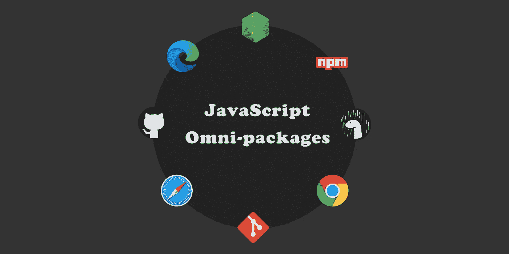

# JavaScript 全包

> 原文：<https://betterprogramming.pub/2020-021-javascript-omni-packages-bae42d446d6c>

## 如何打包 JavaScript 库以实现从遗留模块到标准模块的平稳过渡



图片来源:作者

JavaScript 已经为包装革命做好了准备。现在，所有主流浏览器和服务器端 Node.js 软件都支持新的 ESNext 模块。这是好消息。

但是 CommonJS 模块的遗产将伴随我们很长一段时间。每个想要利用标准`import/export`语法的新 JavaScript 项目都需要考虑新的模块加载器是否能满足它们所有的依赖关系。与此同时，每个包开发者都需要考虑他们是要支持遗留消费者(CommonJS)还是基于标准的消费者(ESNext)或者两者都支持。

这不是一个小问题，而且不会很快消失。Python 开发人员经历了类似的转变，历时 12 年才完成。Python3 于 2008 年发布，但不兼容的 Python2 系统直到 2020 年 4 月才最终冻结。

最好的策略是设计和发布全包，允许开发者和消费者逐渐从旧的过渡到新的。让我们看看如何做到这一点。

# 模块化装载基础

大多数 JavaScript 开发人员已经掌握了导入/导出的语法，所以我们不需要再重复一遍。但是并不是每个人对 JavaScript 如何查找和加载模块都有相同的熟悉程度。所以让我们从建立一些共同点开始。

装载机的工作主要有四个方面:

1.  确定模块依赖关系
2.  确定在哪里可以找到模块
3.  维护已下载模块的列表
4.  捕捉循环依赖关系

这些都不是微不足道的任务，谢天谢地，我们都可以依靠已经为我们完成的工作。

在 ESNext 中，模块加载器是语言规范本身的一部分，所以为了使用`import/export`语法，不需要额外的解析和执行。

对于 CommonJS，模块加载器只是 JavaScript 的另一部分。因此，为了在代码中的任何地方使用`require/exports`语法，我们的脚本必须首先指示 JavaScript 解释器解析并加载处理该语法的函数。在前端，这是构建工具和捆绑器的工作，如 [Browserify](http://browserify.org/) 、 [Rollup](https://rollupjs.org/guide/en/) 和 [webpack](https://webpack.js.org/) 。在后端，这由 Node.js 系统无缝处理，我们不需要做任何额外的工作。

在实践中，通常使用较新的 ESNext 语法来定位较旧的 CommonJS 加载器。为了实现这一点，我们使用了一个类似 [Babel](https://babeljs.io/) 的编译器，它将`import`语句重写为`require`语句，将`export`语句重写为`module.exports`语句。

CommonJS 加载器同时执行它们的工作。这意味着在开始执行时，一切都被解析并准备好立即使用。另一方面，新的 ESNext 加载器异步地按需执行工作。这意味着只有在需要的时候，模块才会通过网络传输。当使用适当的 HTTP 缓存时，这种优化会得到进一步增强。

# 四种执行途径

我们的代码可以遵循四条路径:两条用于前端和后端，两条用于 ESNext 和 CommonJS。

## 1.使用 CommonJS 的前端

为此，我们使用捆绑器将模块加载器和我们自己的代码打包成一个文件。此外，如果我们已经使用新的语法编写了代码，我们需要指示我们的 bundler 也调用 transpiler。为了在浏览器中使用它，我们在 HTML 中添加了一个`<script>`标签，如下所示:

```
<script src=index.js type=text/javascript **nomodule**></script>
```

对于加载了`nomodule`属性的浏览器脚本，代码应该用`require`语句编写。如果我们用`import`语句编写它们，它们在被发送到浏览器之前必须由构建器或捆绑器进行编译。

## 2.使用 ESNext 的前端

为此，我们简单地标识我们的源代码文件并添加一个带有`type=module`的`<script>`标签。

```
<script src=index.js **type=module**></script>
```

用`type=module`加载的浏览器脚本可以安全地依赖 JavaScript 的原生加载器，并且毫不费力地使用标准的`import`语句。这是我们都应该为之奋斗的目标。

## 3.使用 CommonJS 的后端

为此，我们创建一个具有值为`"commonjs"`的`"type"`属性的`package.json`文件，Node.js 将为所有`require`语句使用其内置的 CommonJS 加载器。

```
// package.json
{
  "type": "commonjs"
}
```

Node.js 定位并读取最近的`package.json`文件，以便发现如何加载子模块。虽然我们通常认为`package.json`是一个指定发布规则的文件，但现在它作为`"type": "commonjs"`或`"type": "module"`的运行时说明符发挥了双重作用。

## 4.使用 ESNext 的后端

为此，我们创建一个具有值为`"module"`的`"type"`属性的`package.json`文件，Node.js 将依赖 JavaScript 的本地加载器来处理所有的`import`语句。

```
// package.json
{
  "type": "module"
}
```

对于任何尝试使用 Deno 的人来说，这是一个好消息:他们可以免费使用 Deno，因为 Deno 原生支持 es next——不需要任何特殊的`package.json`文件。

那些一直关注这个主题的人会记得早期的讨论，其中介绍了对 CommonJS 文件使用文件扩展名`.cjs`和对 ESNext 文件使用文件扩展名`.mjs`的想法。这只是 Node.js 曾经支持过的，从未被浏览器厂商正式采用过。今天的最佳实践是坚持使用`.js`扩展。如果我们想创造一个只有一个真实来源的全方位包，这是很重要的。

# 全方位包装

让我们为全包定义我们的目标。它们应满足以下要求:

*   包应该可以在所有四个可执行路径中使用。
*   应该有一组文件作为“事实的来源”
*   程序包文件应该用未混淆的、完全注释的源代码进行调试和测试。
*   软件包文件应该由用户使用最少的代码来分发和安装。
*   包应该在一个公共名称下发布和版本化。

我们可以通过一个类似于经典的"`src`、`dbg`、`dist`"模式的修改过的组织树来完成这些目标，许多项目已经在使用这种模式。但是 omni-package 布局中没有三个顶级目录，而是有四个:`esmodule`、`esm`、`commonjs`和`cjs`。每个文件都有一套完整的原始文件，使用相同的子目录布局和相同的文件名。

`esmodule`目录是真实的原始来源。开发人员只能在这个树中进行更改。使用任一 ESNext 执行路径调试和测试包的工作都是直接使用该树中的文件完成的。它保存在回购中，但通常不会分发给包装消费者。

`esm`目录是`esmodule`的缩小版。它随软件包一起分发，可以在浏览器中使用，HTML 语句如下:

```
<script src=/node_modules/my-package/**esm**/index.js **type=module**></script>
```

或者可以在 Node.js 项目中使用如下的导入语句:

```
import MyPackage from 'my-package/**esm**/index.js'
```

`commonjs`目录是`esmodule`的通天塔编译版本。使用任何一个 CommonJS 执行路径调试和测试包的工作都是使用这个树中的 transpiled 文件来完成的。它通常不会分发给包装消费者。

`cjs`目录是`commonjs`的缩小版。它随软件包一起分发，可以在浏览器中使用，HTML 语句如下:

```
<script src=/node_modules/my-package/**cjs**/index.js **nomodule**></script>
```

或者可以在 Node.js 项目中使用如下的导入语句:

```
import MyPackage from 'my-package/**cjs**/index.js'
```

提醒一下，为了让 Node.js 正确地从`esm`和`cjs`加载文件，如上所述，这两个顶级目录必须有一个带有`"type": "module"`或`"type": "commonjs"`的`package.json`文件。(在前端，浏览器会完全忽略这些`package.json`文件。)

# 出版和发行

出于发布和分发的目的，四个顶级目录被放在一个外部项目目录中，连同通常的许可证和自述文件，加上一个项目级的`package.json`文件，如下所示(没有`"type"`属性):

Omni-packages 是 JavaScript 过渡期的最佳方式。它们允许包开发者和包消费者以他们自己的速度从遗留模块迁移到新的 ECMAScript 标准模块，而没有混乱的“停止世界”中断。