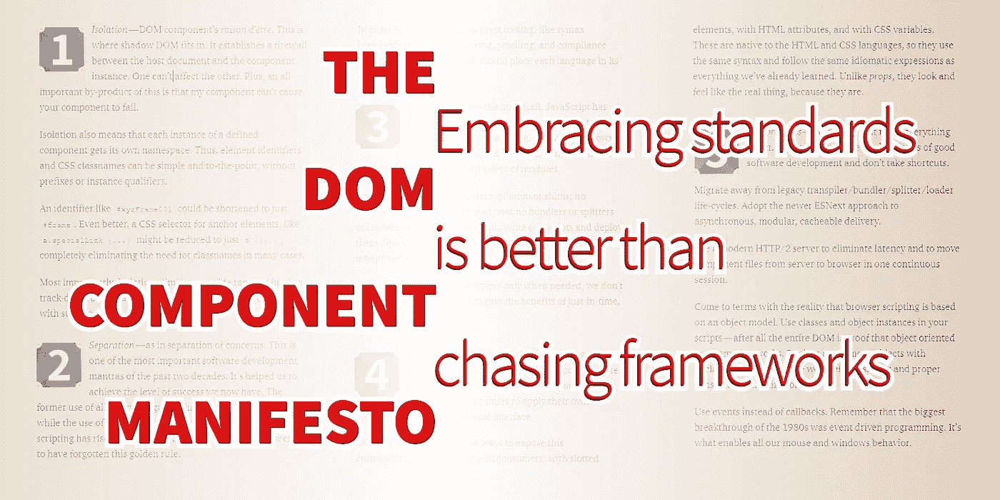

# 我的 DOM 组件宣言

> 原文：<https://betterprogramming.pub/2020-028-the-dom-component-manifesto-5627cb033c93>

## 拥抱标准比追逐框架更好

作者照片。

似乎每次开发人员发现一个好的编码模式，他们都想把它变成一个框架。对他们有好处。他们发现了一些有用的东西，并希望与他人分享。但是*我已经*找到了对我有用的东西，而且*你也可能*找到了。所以我们不需要他们的框架，因为它解决了他们的问题，而不是我们的问题。

相反，我们需要的仅仅是一个产生好结果的一致的方法。

因此，为了保持一致性，我选择为我构建的所有 DOM 组件遵循一个标准模式，以获得那些好的结果。虽然将这种模式转变成一个框架很有诱惑力，但我有意抵制了这种冲动。那被证明是一个好决定。

是的，每个 DOM 组件都有相同的初始化模式，对基于事件的通信的相同依赖，以及许多相同的函数名。但这是模式的终点，也是组件的独特之处的起点。开发人员不应该与一个框架作战，编写代码的唯一目的是绕过一些未解释的限制，而是应该被给予以任何有意义的方式适应我的模式——或者你的模式——的自由。

所以对我来说，框架过时了，模式流行了。但是是哪种模式呢？

答案就在我们身边。简单来说，就是拥抱已经开发出来并免费提供给我们的语言、协议和开放标准，它们就像闪闪发光的宝藏一样摆在我们面前。

我对 DOM 组件的理念是接受由万维网联盟(W3C)、Ecma 国际和互联网工程任务组(IETF)开发的标准。这些审议机构如此努力地为我们提供了一种方法来标记、设计、编写和交付一套不同硬件设备上的优秀网络体验。

这个由五部分组成的理念包括隔离、分离、模块化、配置和最佳实践。

# *1。隔离*

DOM 组件的*存在理由*。这就是暗影 DOM 的用武之地。它在宿主文档和组件实例之间建立了防火墙。一个不能影响另一个。另外，一个非常重要的推论是，我的组件不会导致你的组件失败。

隔离还意味着已定义组件的每个实例都有自己的名称空间。因此，元素标识符和 CSS 类名可以简单明了，没有前缀或实例限定符。

像`#xyzFrame001`这样的标识符可以缩短为`#frame`。更好的是，锚元素的 CSS 选择器，比如`a.specialLink {...}`，可以减少到只有`a {...}`，在很多情况下完全不需要类名。

最重要的是，隔离消除了大量难以追踪的错误，混杂 CSS 似乎很容易传播这些错误。

# *2。分离*

如关注点分离。这是过去二十年中最重要的软件开发咒语之一。它帮助我们取得了现在的成功。这些年来，一体化语言的使用已经减少，而用于标记、样式和脚本的独立语言的使用已经增加。可悲的是，一些全新的框架似乎忘记了这条黄金法则。

为了从优秀的工具中获益，比如语法突出显示、林挺、检查、剖析和符合性检查，我们编写的代码应该将每种语言放在自己的文件中。

这种方法隐藏的好处是缓存。HTML 模板被加载一次并被浏览器缓存，CSS 声明被加载一次并被浏览器缓存，JavaScript 模块被加载一次并被浏览器缓存——所有这些都是自动的，不需要我们做任何努力。

# *3。模块化*

圣杯。JavaScript 终于发展起来了，它给了我们一个将变量排除在全局范围之外的好方法。现在每个主流浏览器都支持 ESNext 模块，所以现在是时候拥抱模块的简单性和安全性了。

值得注意的是，这意味着没有运输或垫片，没有货单或包装开销，也没有捆扎机或分离器或装载机。这意味着我们可以简单地编写脚本并将它们直接部署到服务器上。我们可以重新发现*解释* JavaScript 的乐趣。

因为浏览器只在需要的时候加载脚本，我们不需要做任何特殊的事情来获得即时、按需加载的好处。

# *4。定制*

替代设置中的用法。组件应该被设计成适应明显不同的值。组件应该允许消费者将他们自己的装饰性品牌应用到他们的视觉界面上。

DOM 标准为我们提供了三种向组件消费者公开这种定制的方式:使用开槽元素、HTML 属性和 CSS 变量。这些是 HTML 和 CSS 语言所固有的，所以它们使用相同的语法，遵循与我们已经学过的一样的惯用表达。不像*道具*，它们看起来和感觉上都像真的一样，因为它们就是真的。

# 5.最佳实践

让一切变得更美好的指南和护栏。请记住，我们的集体成功是艰苦战斗的结果。最佳实践是所有帮助我们赢得这些战斗的策略和安全规则的精华。以下是适用于 DOM 组件的内容:

*   使用现代的 HTTP/2 服务器来消除延迟，并在一个连续的会话中将组件文件从服务器移动到浏览器。
*   从传统的传输器/捆束器/分离器/加载器生命周期中迁移出来。采用更新的 ESNext 方法进行异步、模块化、可缓存的交付。
*   接受浏览器脚本基于对象模型的现实。在脚本中使用类和对象实例。毕竟，整个 DOM 证明了面向对象编程是可行的。
*   停止追逐`undefined`错误。用已声明的类替换匿名对象，这些类具有明确定义的形状和正确的构造函数初始化。
*   使用事件而不是回调。记住，20 世纪 80 年代最大的突破是事件驱动编程。它支持我们所有的鼠标和窗口行为。它是原始的非阻塞编码模式。

# 结论

这个宣言的催化剂是这些[开源 DOM 组件](https://domcomponents.com/components.blue)。要更深入地探究其背后的哲学，请参见[Web 组件的 7 个方面](https://medium.com/better-programming/2020-007-the-facets-of-w3c-web-components-e76798ab7b29)。

这是我的宣言。五个清晰的想法解决了我所有的 DOM 组件问题。没有半年一次的大修来升级到最新的突破性变化框架。不再追逐闪亮的新事物。全部基于标准。一切面向未来。