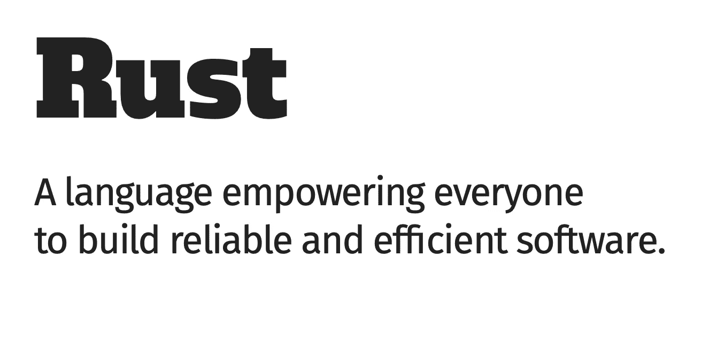
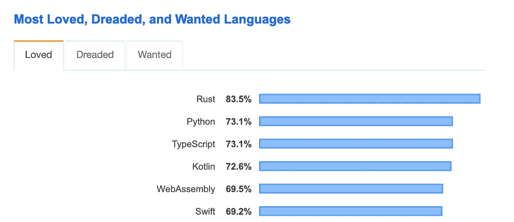
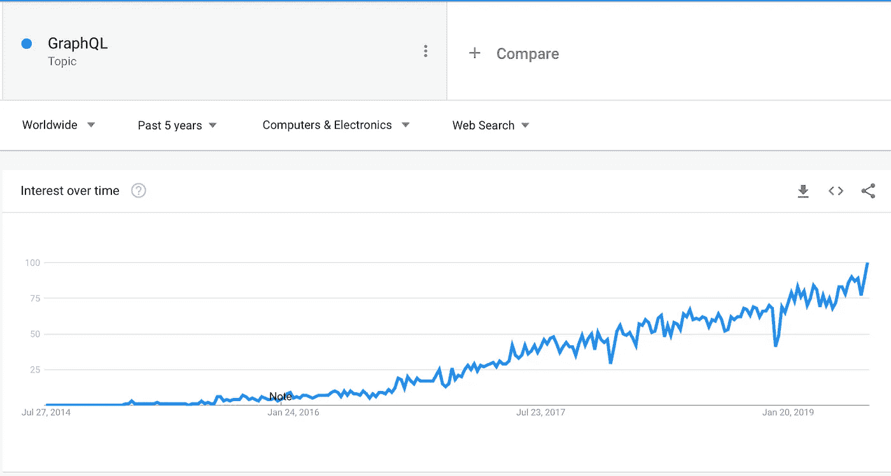
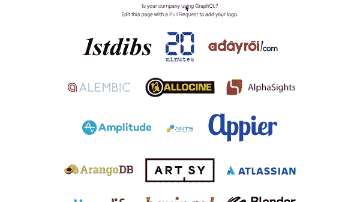
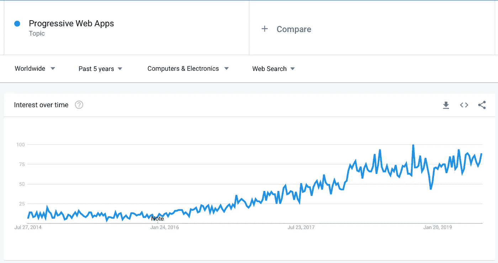
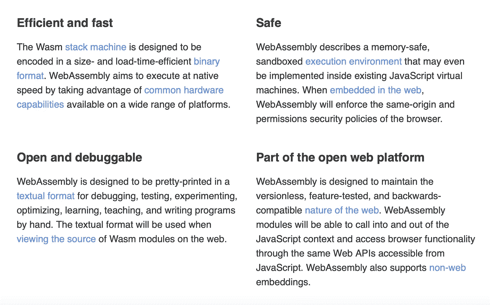
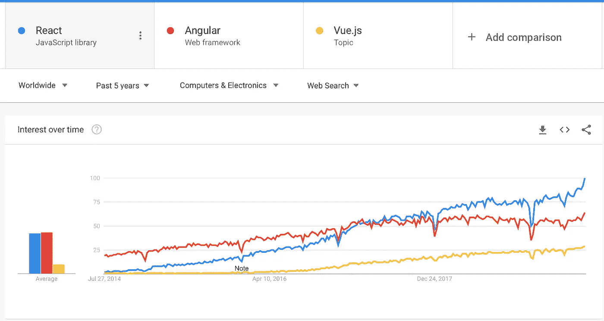
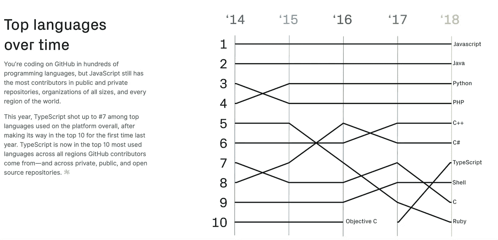
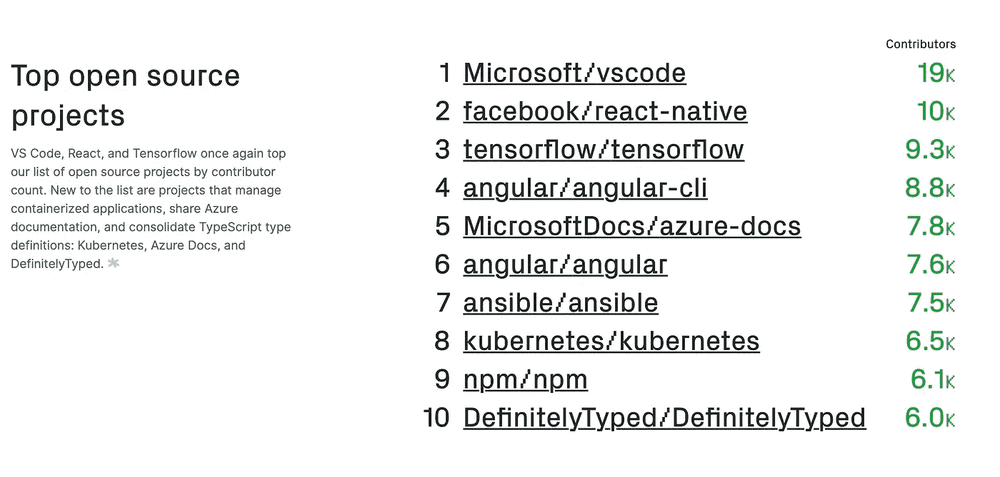

# 2020 年及以后的规划趋势预测

> 原文：<https://betterprogramming.pub/2020-programming-trend-predictions-a5d6b70bec26>

## 预测 2020 年将出现哪些编程技术

萨法尔·萨法罗夫在 [Unsplash](https://unsplash.com/@codestorm) 上拍摄的照片

2020 年就要到了，虽然听起来很疯狂。2020 年听起来像是来自科幻小说，然而我们就在这里——即将敲响它的大门。

如果你对编程世界的未来感到好奇，那么你来对地方了。我可能完全错了——不要引用我的话——但以下是我认为会发生的事情。我不能预测未来，但我可以做出有根据的猜测。

[成为媒介会员直接支持我的工作](https://trevorlasn.medium.com/membership)。提前感谢！

> "预测未来的最好方法是创造未来."
> 
> ― **亚伯拉罕·林肯**

# Rust 会成为主流

锈-[https://www.rust-lang.org/](https://www.rust-lang.org/)

[**Rust**](https://en.wikipedia.org/wiki/Rust_(programming_language)) 是一种专注于安全——尤其是安全并发——的多范例系统编程语言。Rust 在语法上类似于 C++，但它旨在提供更好的内存安全性，同时保持高性能。

来源:[吃剩的沙拉](http://leftoversalad.com/c/015_programmingpeople/)

我们已经看到 Rust 编程语言四年来的强劲增长。相信 2020 年是 Rust 正式成为主流的一年。什么是主流有待自我解释，但我相信学校将开始在课程中引入 Rust。这将产生新一波的铁锈工程师。

来自 [2019 StackOverflow 调查](https://insights.stackoverflow.com/survey/2019#most-loved-dreaded-and-wanted)最受喜爱的编程语言。

Rust 已经证明了自己是一门伟大的语言，拥有一个充满活力和活跃的社区。随着脸书在铁锈上建造天秤座——这是有史以来最大的工程——我们将会看到铁锈是如何被去除的。

如果你想学习一门新的语言，我强烈建议你学习 Rust。如果你好奇想了解更多， [*我就从这本书*](https://www.amazon.com/Rust-Programming-Language-Covers-2018-ebook/dp/B07SRQ97RD/ref=as_li_ss_tl?_encoding=UTF8&qid=&sr=&linkCode=ll1&tag=thegeniusde07-20&linkId=ba7efc64f6dfd4d77cf6162ca6dfbe51&language=en_US) 开始学铁锈。**去锈吧！**

# GraphQL 的采用将继续增长

[GraphQL 谷歌趋势](https://trends.google.com/trends/explore?cat=5&date=today%205-y&q=%2Fg%2F11cn3w0w9t)

随着我们的应用程序变得越来越复杂，我们的数据消费需求也在增长。我是 GraphQL 的忠实粉丝，也用过很多次。我认为与传统的 REST API 相比，这是一个更好的获取数据的解决方案。

典型的 REST APIs 需要从多个 URL 加载，而 GraphQL APIs 可以在一个请求中获得应用程序需要的所有数据。

各种规模的团队在许多不同的环境和语言中使用 GraphQL 来支持移动应用程序、网站和 API。

[谁在使用 GraphQL](https://graphql.org/users/)

如果你对学习 GraphQL 感兴趣，[看看我写的这个教程](https://medium.com/better-programming/how-to-setup-a-powerful-api-with-graphql-koa-and-mongodb-339cfae832a1)。

# 进步的网络应用是一股不可忽视的力量

渐进式 web 应用程序(PWA)是一种新的构建应用程序的方法，它结合了 Web 的最佳功能和移动应用程序的最高质量。

照片由 [Rami Al-zayat](https://unsplash.com/@rami_alzayat?utm_source=medium&utm_medium=referral) 在 [Unsplash](https://unsplash.com?utm_source=medium&utm_medium=referral) 上拍摄

野生环境中的 web 开发人员比特定于本地平台的开发人员要多得多。一旦大公司意识到他们可以重新利用他们的 web 开发人员来开发渐进式 web 应用程序，我怀疑我们将会看到一个巨大的 PWAs 浪潮。

不过，大公司需要一段时间来适应，这对技术来说很正常。渐进部分通常会倾向于前端开发，因为它主要是关于与 Web Workers API *(本地浏览器 API)* 的交互。

网络应用不会消失。越来越多的人开始意识到，编写一个单一的交叉兼容的 PWA 可以减少工作量，节省更多的时间。

[PWA 谷歌趋势](https://trends.google.com/trends/explore?cat=5&date=today%205-y&q=%2Fg%2F11bzxympx6)

今天是开始学习更多关于 PWAs 的完美一天， [**从这里开始。**](https://medium.com/better-programming/everything-you-need-to-know-about-pwas-8e41a7e745aa)

# 网络大会将看到更多的光

[网页组装](https://webassembly.org)

WebAssembly(缩写为 *Wasm* )是一种基于堆栈的虚拟机的二进制指令格式。Wasm 被设计为高级语言(如 C、C++和 Rust)编译的可移植目标。Wasm 还支持客户端和服务器应用程序在 web 上的部署。PWAs 也可以使用 wasm。

换句话说，Web 组装是 JavaScript 技术和更高级技术之间的桥梁。考虑在 React 应用程序中使用 Rust 图像处理库。Web assembly 允许您这样做。

性能是关键，随着数据量的增长，保持良好的性能将更加困难。这时，来自 C++或 Rust 的低级库开始发挥作用。我们会看到更大的公司采用 Web 组装，并从那里滚雪球。

# React 将继续占据统治地位

[前端 JavaScript 前端库](https://trends.google.com/trends/explore?cat=5&date=today%205-y&q=%2Fm%2F012l1vxv,%2Fg%2F11c6w0ddw9,%2Fg%2F11c0vmgx5d)

React 是目前最流行的前端开发 JavaScript 库，这也是有原因的。构建 React 应用程序既有趣又简单。就构建应用程序的经验而言，React 团队和社区已经做了出色的工作。

反应—[https://reactjs.org](https://reactjs.org)

我曾与 Vue、Angular 和 React 一起工作，我认为它们都是很好的框架。记住，图书馆的目标是把事情做好，所以不要太关注味道，多关注把事情做好。争论什么样的框架是“最好的”是完全没有意义的选择一个框架，将你所有的精力投入到构建东西上。

如果你有灵感，从这个列表中挑选一些，今天就开始建造吧！

# 总是赌 JavaScript

我们可以很有信心地说，2010 年是 JavaScript 的十年。我们已经看到了 JavaScript 的大幅增长，而且似乎没有放缓的趋势。

继续押注凯尔·辛普森的 JavaScript

JavaScript 开发人员一直被称为“非真正的开发人员”，这让他们备受指责。JavaScript 是任何大型科技公司的核心，比如网飞、脸书、谷歌等等。因此，JavaScript 作为一种语言和其他任何编程语言一样合法。以身为 JavaScript 开发人员为荣。毕竟，一些最酷、最创新的东西是由 JavaScript 社区开发的。

几乎所有的网站都在某种程度上利用 JavaScript。有多少网站？几百万！

 [## 即将推出的新 JavaScript 特性— 2019 年、2020 年及以后

### 对 JavaScript 语言未来的一瞥

medium.com](https://medium.com/@indreklasn/new-upcoming-javascript-features-2019-2020-and-beyond-5c426f31ec97) 

对于 JavaScript 开发人员来说，这是前所未有的好时机。工资在上涨，社区一如既往地充满活力，就业市场巨大。如果你对学习 JavaScript 很好奇，那么“ [*你不知道的 JS*](https://amzn.to/2YzFmcq) ”系列丛书是一本很棒的读物。

[随着时间的推移热门语言](https://octoverse.github.com/projects)

我之前写过关于[是什么让 JavaScript 流行起来的话题](https://medium.com/better-programming/what-makes-javascript-javascript-b9ab51ad983a)——你可能也应该读一下。

[顶级开源项目](https://octoverse.github.com/projects)

**让我们知道哪些项目或语言值得更多的爱和关注！**

了解我最新内容的最好方式是通过我的[时事通讯](https://wholesomedev.substack.com/welcome)。成为第一个得到通知的人。

我的[简讯](https://wholesomedev.substack.com/welcome)。成为第一个得到通知的人。