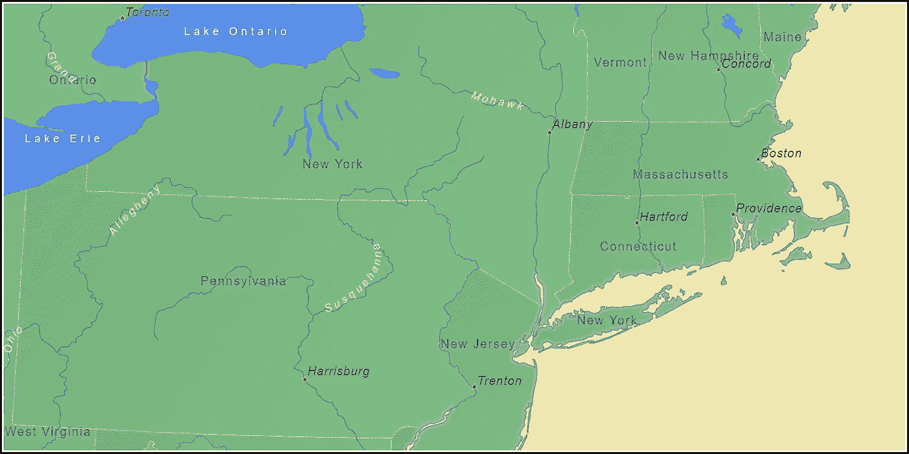

# 一个穷人的网络工作者

> 原文：<https://betterprogramming.pub/2022-052-a-poor-mans-web-worker-279d17a13018>

## 一项实验技术如何拯救世界



这是探索网络工作者替代品的催化剂。在这个例子中，新罕布什尔州的康科德需要更好的碰撞检测和标签放置的自动调整。来源: [https://full.earth](https://full.earth/?utm_term=poor-mans-web-worker) 。

一段时间以来，我一直在使用 JavaScript 和 HTML canvas 开发一个基于浏览器的地球地图系统。这项工作的主要挑战之一是在将 3D 纬度/经度投影到 2D 画布上时保持用户界面的响应。地图上每个要素的每个点都必须使用三角法进行转换:

```
x = R cosΦ sin(λ - λ₀)
y = R (cosΦ₀ sinΦ - sinΦ₀ cosΦ cos(λ - λ₀))
```

为了理解这个问题的规模，一个典型的地图可能包含几十个图层，每个图层包含数百个要素，每个要素包含数千个点。

每当用户平移或缩放时，所有这些点都必须通过该投影公式运行。此外，因为用户可以自由地重新定位观察点，所以不能使用有意义的缓存方案。

我一直认为，总有一天将数学转移到一个单独的线程是必要的，所以我一直关注着网络工作者的前景。

最近，我一直在实现一个碰撞检测系统来识别和纠正重叠的地图标签。这样做所需的计算远远超出了用户的接受范围。这是该项目的转折点——是时候认真考虑实现一个 web worker 了。

可悲的是，这一努力的结果令人失望。

网络工作者的机制非常简单。任何在线教程都足以让我们开始。回顾一下，web worker 的承诺是浏览器的主线程可以自由地响应鼠标和键盘事件，而 web worker 线程可以完全专注于计算。

不幸的是，这种工作方式有一个很大的缺点:必须使用`postMessage`函数来来回回地传递输入和输出。教程中演示的玩具例子经常把它当作简单的实现细节，而实际上它变成了一个主要的瓶颈。

在[用 Web Workers](https://engineering.salesforce.com/optimizing-performance-with-web-workers-612b48621d8d/) 优化性能中，陈熠记录了这个问题，指出“4000 个对象的序列化/反序列化需要大约 20 ~ 30 毫秒，抵消了将大约 100 毫秒的过程移植到 Workers 的好处。”

James Milner 在[检查 Web Worker 性能](https://www.jameslmilner.com/post/web-worker-performance/)中对此进行了更详细的研究，他总结道“Web Worker 的真正成本来自于将数据从主线程传输到 Web Worker 以及将数据返回到主线程。”

在我的例子中，在主线程和 web worker 之间传输 100K 对`{Φ, λ}`和`{x, y}`是一个站不住脚的设计。

解决这个问题的方法是使用可转移数组。这些是由主线程填充数字的大型缓冲区，由工作线程处理，然后由调用者返回并展开。

这种方法的一个扩展是 [OffscreenCanvas](https://developer.mozilla.org/en-US/docs/Web/API/OffscreenCanvas) 函数，它已经被承诺了很长时间。Chrome 和 Opera 在 2018 年提供了这方面的实现，但 Firefox 和 Safari 仍然不支持它([can use](https://caniuse.com/offscreencanvas))。

在研究该做什么的时候，我偶然发现了另一项实验性技术，我称之为穷人的网络工作者，但更恰当的称呼是`requestIdleCallback`。Safari 已经正式将其纳入考虑范围，而其他所有浏览器都已经提供了实现。与此同时，62 线 [polyfill](https://github.com/behnammodi/polyfill/blob/master/window.polyfill.js) 可以暂时满足我们的需求。

`requestIdleCallback`的概念很简单。浏览器知道它的队列何时为空，以及离下一个“事件循环”开始还有多长时间我们可以要求浏览器在发生这种情况时通知我们。浏览器通过我们在请求中注册的回调函数来实现这一点。它还告诉我们有多少空闲时间可供我们使用。

使用`requestIdleCallback`时，我们的责任是在处理数据的同时关注时钟，当时钟用完时，将控制权交还给浏览器。如果我们在完成之前放弃了，我们需要获取足够的状态信息，从我们停止的地方继续我们的工作，并要求浏览器在另一段时间可用时通知我们。

这是我用过的脚手架，可以适用于类似的问题:

这是穷人的网络工作者:

为了以 60 赫兹的刷新率实现清晰的屏幕渲染和鼠标的平滑移动，浏览器需要每隔 16.67 毫秒处理一次新业务(1000 毫秒/60 = 16.67 毫秒)。在它处理完未决的 DOM 事件和内存管理开销之后，剩余的时间将被计算到注册的`requestIdleCallback`中。

用 1 毫秒―15 毫秒范围内的时间片可以取得真正进展的想法一点也不明显。然而在实践中，这种做法取得了令人满意的效果。

最后一点。细心的读者会注意到对`requestIdleCallback`的调用嵌入在`computeLayout`回调函数本身中。这看起来像一个递归调用，事实上，当用 Chrome 的 inspector 调试代码时，你会注意到堆栈似乎随着每个新请求而增长。

不要被误导——这不是真正的递归。就像它的表亲`requestAnimationFrame`，浏览器正在做一些幕后的蠢事。(顺便说一下，关于堆栈溢出问题的答案本身就在[堆栈溢出](https://stackoverflow.com/questions/29181253/is-requestanimationframe-implementations-recursive)上！)

# TL；速度三角形定位法(dead reckoning)

*   网络工作者被大肆宣传为银弹，但往往达不到他们的承诺。
*   使用`postMessage`在主线程和工作线程之间穿梭数据是一个主要的瓶颈。
*   `requestIdleCallback`功能可以成功地作为网络工作者的替代。