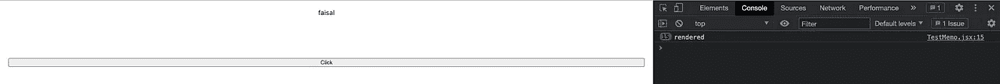

# 清洁 React 项目的 21 个最佳实践

> 原文：<https://betterprogramming.pub/21-best-practices-for-a-clean-react-project-df788a682fb>

## 提高代码质量的实用建议


Diana Polekhina 在 [Unsplash](https://unsplash.com?utm_source=medium&utm_medium=referral) 上拍摄的照片。

React 对事物应该如何构建没有太大的偏见。这就是为什么我们有责任保持项目的整洁和可维护性。

今天，我们将讨论一些改善 React 应用程序健康状况的最佳实践。这些规则被广泛接受。因此，拥有这方面的知识是必要的。

一切都会用代码显示，所以系好安全带！

# 1.使用 JSX 速记法

尝试使用 JSX 简写来传递布尔变量。假设您想要控制一个`Navbar`组件的标题可见性。

## 严重的

## 好的

# 2.使用三元运算符

假设您想要基于角色显示用户的详细信息。

## 严重的

## 好的

# 3.利用对象文字

对象文字有助于提高代码的可读性。假设您想要根据角色显示三种类型的用户。不能用三元，因为选项数超过两个。

## 严重的

## 好的

现在看起来好多了。

# 4.使用片段

总是使用`Fragment`而不是`Div`。它保持了代码的整洁，并且对性能也有好处，因为在虚拟 DOM 中少创建了一个节点。

## 严重的

## 好的

# 5.不要在 Render 中定义函数

不要在 render 中定义函数。尽量保持渲染中的逻辑最小化。

## 严重的

## 好的

# 6.使用备忘录

`React.PureComponent`和`Memo`可以显著提高应用程序的性能。它们帮助我们避免不必要的渲染。

## 严重的

虽然子组件应该只渲染一次，因为 count 的值与`ChildComponent`无关。但是，它会在你每次点击按钮时渲染。



## 好的

让我们将`ChildrenComponent`编辑成这样:

现在，无论你点击按钮多少次，它只会在必要的时候呈现。

# 7.将 CSS 放到 JavaScript 中

编写 React 应用程序时避免使用原始 JavaScript，因为组织 CSS 远比组织 JS 困难。

## 严重的

## 好的

# 8.使用对象析构

利用对象析构来获得优势。假设您需要显示一个用户的详细信息。

## 严重的

## 好的

# 9.字符串道具不需要花括号

将字符串属性传递给子组件时。

## 严重的

## 好的

# 10.从 JSX 删除 JS 代码

如果任何 JS 代码不能满足渲染或 UI 功能的任何目的，请将其移出 JSX。

## 严重的

## 好的

# 11.使用模板文字

使用模板文本构建大型字符串。避免使用字符串连接。很好，很干净。

## 严重的

## **好的**

# 12.按顺序导入

总是试着按照一定的顺序导入东西。它提高了代码的可读性。

## 严重的

## 好的

经验法则是保持导入顺序如下:

*   内置的
*   外部的
*   内部的

所以上面的例子变成了:

# 13.使用隐式返回

使用 JavaScript 特性隐式`return`来编写漂亮的代码。假设你的函数做了一个简单的计算并返回结果。

## 严重的

## 好的

# 14.组件命名

始终对组件使用 PascalCase，对实例使用 camelCase。

## 严重的

## 好的

# 15.保留属性命名

不要使用 DOM 组件属性名在组件之间传递属性，因为其他人可能不需要这些名称。

## 严重的

## 好的

# 16.引用

对 JSX 属性使用双引号，对所有其他的 JS 使用单引号。

## 严重的

## 好的

# 17.专有命名

如果 prop 值是 React 组件，则始终使用 camelCase 作为 prop 名称或 PascalCase。

## 严重的

## 好的

# 18.括号中的 JSX

如果您的组件跨越多行，请始终用括号将它括起来。

## 严重的

## 好的

# 19.自动结束标签

如果你的组件没有任何子组件，那么使用自结束标签。它提高了可读性。

## 严重的

## 好的

# 20.方法名中的下划线

不要在任何内部 React 方法中使用下划线。

## 严重的

## 好的

# 21.备用道具

总是在你的``标签中包含一个 alt 道具。不要在你的 alt 属性中使用`picture`或`image`，因为屏幕阅读器已经将`img`元素声明为图像。没必要包括这个。

## 严重的

## 好的

# 结论

给你。如果你能走到这一步，恭喜你！我希望你能从这篇文章中学到一些东西。

我希望你有美好的一天！:D

**有话要说？**

```
**Get in touch with me via** [**LinkedIn**](https://www.linkedin.com/in/56faisal/) **or my** [**Personal Website**](https://www.mohammadfaisal.dev/)**.**
```

[](https://javascript.plainenglish.io/45-npm-packages-to-solve-16-react-problems-a9ab18946224) [## 45 个 NPM 软件包解决 16 个 React 问题

### 关于如何选择完美的 npm 包的深入指导

javascript.plainenglish.io](https://javascript.plainenglish.io/45-npm-packages-to-solve-16-react-problems-a9ab18946224) [](/top-7-libraries-for-blazingly-fast-reactjs-applications-c0069e87c8b7) [## 快速反应应用的 7 大库

### 摇滚明星开发人员的必备工具

better 编程. pub](/top-7-libraries-for-blazingly-fast-reactjs-applications-c0069e87c8b7) [](/22-best-practices-to-take-your-api-design-skills-to-the-next-level-65569b200b9) [## 22 个最佳实践，让您的 API 设计技能更上一层楼

### 设计 REST APIs 的实用建议

better 编程. pub](/22-best-practices-to-take-your-api-design-skills-to-the-next-level-65569b200b9) [](https://javascript.plainenglish.io/20-essential-parts-of-any-large-scale-react-app-ee4bd35436a0) [## 任何大型 React 应用程序的 20 个基本部分

### 如果您正在编写企业级代码，您需要了解这一点

javascript.plainenglish.io](https://javascript.plainenglish.io/20-essential-parts-of-any-large-scale-react-app-ee4bd35436a0) 

# 资源

*   Airbnb 指南:[https://github.com/airbnb/javascript/tree/master/react](https://github.com/airbnb/javascript/tree/master/react)