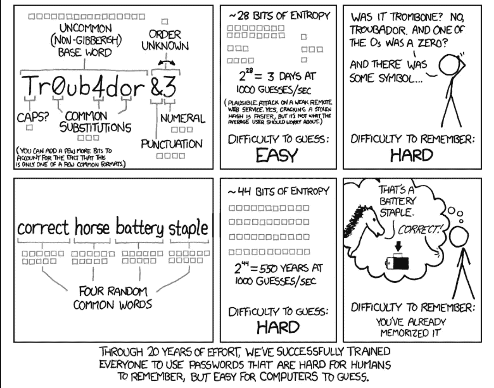
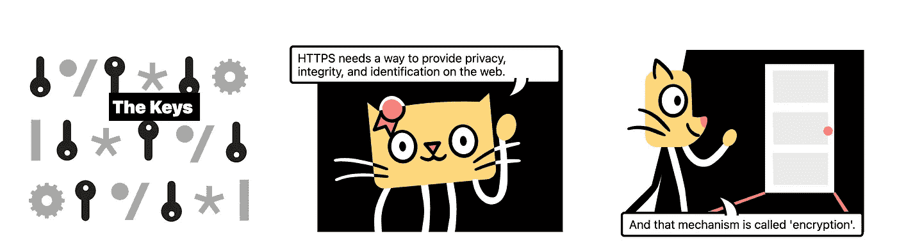
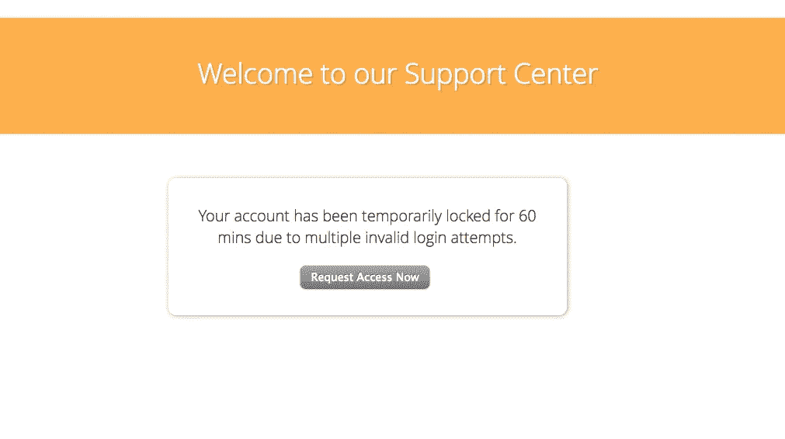
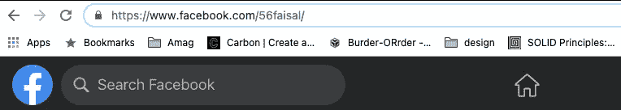
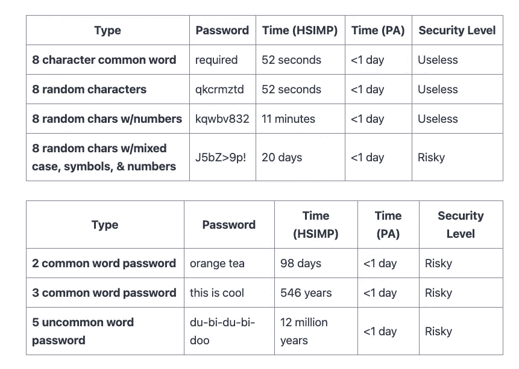

# 在 Web 应用程序中处理密码的 21 个最佳实践

> 原文：<https://betterprogramming.pub/21-best-practices-for-handling-passwords-in-web-applications-7b2d7a66378f>

## 构建安全的应用程序


米哈伊尔·尼洛夫摄于[佩克斯](https://www.pexels.com/photo/fashion-man-person-sunglasses-7534785/?utm_content=attributionCopyText&utm_medium=referral&utm_source=pexels)

哪个更聪明？撬锁还是偷钥匙？

你当然可以造一把坚固的锁，但是如果你不能保护钥匙，那就没用了！

**密码就像你系统的钥匙。**所以，如果你是一个真诚的网站开发者，你有责任保证它的实力！

今天，我们将讨论一些关于密码的最佳实践。许多例子正在出现。所以**扣好！**

# 1.喜欢长密码而不是难密码

鼓励用户选择更长的密码，而不是让它更难记。

> 简单+长>困难+短

这是因为大多数黑客攻击都不是由试图猜测你密码的人完成的——它通常是由运行循环的机器完成的。

而一台机器不在乎难度。所以请选择更长的密码！



图片来源:[https://xkcd.com/936/](https://xkcd.com/936/)

**资源:**[https://xkcd.com/936/](https://xkcd.com/936/)

# 2.不要通过电子邮件发送简单的密码

不幸的是，这是开发人员中非常常见的错误。以纯文本形式发送**密码**比你想象的更常见。

> 近 40%的人每周至少忘记一次密码。

因此，他们所做的就是重置他们的密码，并在他们的电子邮件中获得一个简单的密码。

任何电子邮件都会通过各种服务器。如果其中一个受到威胁，那么你就有麻烦了！所以千万不要这样！

## 替代品:

*   正文消息
*   一次性密码
*   加密电子邮件服务
*   密码管理器

**资源:** [为什么通过电子邮件发送密码不好](https://blog.sanebox.com/2017/08/23/sending-passwords-via-email-why-its-a-bad-idea-and-what-to-do-instead/)

# 3.将 HTTPS 用于身份验证相关页面

这是显而易见的。尽早安装有效的 SSL 证书！如果您有任何限制，那么至少对授权页面这样做。

这不仅对安全性很重要。这对于在你的用户中建立信任也很重要，并且有助于搜索引擎优化



图片来源:[https://howhttps.works/the-keys/](https://howhttps.works/the-keys/)

HTTPS 通过加密提供隐私保护。详细讨论超出了本文的范围，但是如果你感兴趣的话，下面是一个有趣的资源。

**资源:**[https://howhttps.works/](https://howhttps.works/)

# 4.防止字典密码

字典密码是最常用密码的列表。密码破解者发现密码更容易破解。他们通常先浏览这些。

[这里的](https://raw.githubusercontent.com/danielmiessler/SecLists/master/Passwords/Common-Credentials/10-million-password-list-top-1000000.txt)列出了 100000 个最常见的密码文件——以此作为参考，并检查。

**资源:** [千万字典密码列表](https://raw.githubusercontent.com/danielmiessler/SecLists/master/Passwords/Common-Credentials/10-million-password-list-top-1000000.txt)

# 5.防止连续密码

人们用作密码的一些常见序列很容易预测。

## 不好的例子

```
qwertyuiop -> top row of keyboard
asdfghjkl -> middle row of keyboard
zxcvbnm -> bottom row of keyboard
123456 -> numeric digits in sequence
```

这些对用户的手指来说更容易，但对安全性不好。防止用户给这些。

# 6.防止重复密码

此外，重复的密码在用户中非常常见。它们通常容易记忆，因此也容易猜测。

## 坏榜样

```
aaaaa1111 
bbbbb22222
```

在前端检测这些并阻止人们使用它们。

# 7.不要在数据库中存储普通密码

这意味着任何有权访问该数据库的人都可以轻易地破坏所有用户帐户。

> 切勿将密码直接存储在数据库中

实现某种加密。又不难，何乐而不为呢？

# 8.使用哈希函数而不是加密函数

说到加密…不要使用类似`SHA1`、`SHA2`、`MD5`等加密功能。这些都是通用哈希函数，旨在处理大型数据集。

> 这意味着它们在确保数据完整性方面非常出色，但在存储密码方面完全是垃圾——不要使用它们！

总是使用`[bcrypt](https://www.npmjs.com/package/bcrypt)` **。有了`bcrypt`，你可以决定哈希函数有多贵。下面是一段代码来展示它有多简单！**

因为密码不是一个大数据集，所以它们非常适合这个用例。

资源:[https://codahale.com/how-to-safely-store-a-password/](https://codahale.com/how-to-safely-store-a-password/)

# 9.惩罚你的用户

引入针对不成功登录尝试的惩罚系统。如果有人 10/15 次后还不能登录，惩罚他们一个小时左右。类似这样的。



这可以让你免受暴力攻击。

# 10.考虑实施第二个用户名

在大多数网站上(比如脸书),如果你去看用户的简介，你可以很容易地从网址上知道用户的`userName`。它可以使破解更容易。



我的概要

如果你真的关心安全性，你应该考虑为你的用户实现第二个`**userName**`。每一个都有不同的用途。

## 已知用户名

*   辨认一个人
*   要搜索个人资料
*   在线身份

## 未知用户名

*   这将仅用于身份验证。
*   只有用户会知道。

# 11.合适的 UI 设计。

虽然可以在后端检查强密码，但是您应该考虑实现某种前端验证。

禁用**提交**按钮，直到输入有效密码。下面是一个检查密码强度的示例。

**资源:** [带 javascript 的密码强度检查器](https://www.section.io/engineering-education/password-strength-checker-javascript/)

# 12.引入延迟

每次登录失败后，强制延迟五秒钟——您的用户不会感觉到，但攻击者会感到痛苦。

如果攻击者试图猜测用户的密码，他们会失败很多次。这将使攻击更加困难，因此不太可能在合理的时间范围内成功。

资源:[这是一条信息线索](https://security.stackexchange.com/questions/94432/should-i-implement-incorrect-password-delay-in-a-website-or-a-webservice)

# 13.不鼓励替代

有人认为用`C0mpl3x`代替`Complex`作为密码更安全。但是你猜怎么着？其他人也知道这个！

[https://media.giphy.com/media/d3mlE7uhX8KFgEmY/giphy.gif](https://media.giphy.com/media/d3mlE7uhX8KFgEmY/giphy.gif)

所以，不要鼓励你的用户使用这种类型的密码——黑客会替换掉这些替代品，所以他们只是让密码变得复杂，没有任何功能。

# 14.双因素认证

这与密码没有直接关系，但与安全性有关。考虑为您的 web 应用程序实现双因素身份验证。

# 15.密码更好

有两种人:相信复杂单词的人更好，相信长密码的人更好。

根据联邦调查局的说法，较长的密码更适合作为密码，因为它们更难破解。

下面是一个对比:



**资源:**[https://www . zdnet . com/article/FBI-recommendes-pass phrases-over-password-complexity/](https://www.zdnet.com/article/fbi-recommends-passphrases-over-password-complexity/)

# 16.层叠

添加多层安全性—不要只依赖前端验证或后端验证。尝试采用多个安全级别，以便有多个故障点。

你永远不知道什么会出错！

# 17.在几次不正确的尝试后锁定帐户

这是一个相当明显的问题。跟踪用户是否试图登录一个帐户，并反复给出错误的输入。

封锁或锁定这些帐户，并运行额外的验证。不过这应该取决于您的用例。

# 18.让你的挑战性问题不可预测

如果帐户被锁定，一些系统会通过使用质询问题来添加第二层。

> 保持那些问题不可预测！

“你妈妈叫什么名字？”不是一个很好的问题——这可以在用户的社交媒体页面上找到！

## 好问题的品质

*   很容易记住，即使是多年以后。
*   包含成千上万个可能的答案，所以不容易猜到。
*   这不是社交媒体上常见的话题。
*   有一个永远不变的答案(你最喜欢的颜色或梦想中的汽车可能会随着时间的推移而改变)。

**举例:**谁是你童年的英雄？

**资源:** [好的挑战问题](https://www.journalofaccountancy.com/issues/2018/mar/password-recovery-questions.html)

# 19.避免密码轮换

这是一个有争议的问题。有人说，你应该强迫你的用户在 90 天后更换他们的密码，这是破解密码所需要的时间。

> 但是随着更强大的机器的出现，这就不是真的了。

这在用户中培养了不良习惯。他们通常希望避免频繁更改密码的复杂性，因此在任何地方都使用相同的密码！

# 20.鼓励在密码中使用空格

密码中的空格是个好东西。不幸的是，许多用户没有利用这一点。

鼓励他们使用空格—它会自动创建更安全、更易记的密码！

# 21.经验法则

如果你已经走到这一步，感到厌倦，不想记住所有这些要点，让我为你简化一下。只要记住一件事！

> 尺寸很重要

鼓励长密码，你应该没问题。嗯，大部分时间！

如果你能走到这一步，恭喜你！这些指导方针可能并不适合所有的用例，但是我希望你已经学到了一些东西！

祝你有美好的一天，我的朋友！

**有话要说？**

**通过** [**LinkedIn**](https://www.linkedin.com/in/56faisal/) **或我的** [**个人网站**](https://www.mohammadfaisal.dev/) **与我取得联系。**

[](https://javascript.plainenglish.io/story-of-a-failed-react-project-f32177479bdf) [## React 项目失败的故事

### 这给我们的创业带来了灾难。

javascript.plainenglish.io](https://javascript.plainenglish.io/story-of-a-failed-react-project-f32177479bdf) [](/21-best-practices-for-a-clean-react-project-df788a682fb) [## 清洁 React 项目的 21 个最佳实践

### 提高代码质量的实用建议

better 编程. pub](/21-best-practices-for-a-clean-react-project-df788a682fb)