# 从 Chrome 地址栏可以做的 21 件有用的事情

> 原文：<https://betterprogramming.pub/21-useful-things-you-could-do-from-chrome-address-bar-fb1ba18c29cf>

## 隐藏的秘密内部命令


谷歌 Chrome 中的莫迪游戏截图

网络浏览器带有许多内置命令，可以用来做不同的事情。

在这篇文章中，我整理了一些我觉得有趣的 Chrome 命令，它们也能帮你节省时间。

## 1.恐龙游戏

如果在地址栏输入“chrome://dino/”，就可以玩霸王龙恐龙游戏了。T-Rex 游戏是 Chrome 离线模式下隐藏游戏的翻版。尽情享受吧！

```
chrome://dino/
```

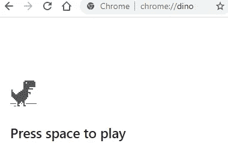

Chrome 中的 Dino 游戏截图。

## 2.重新开始

如果您想快速重启浏览器并在重启后保持打开的标签不变，此命令非常方便。

```
chrome://restart
```

## 3.放弃

使用此命令，您可以关闭浏览器，但要小心，因为它不会记住您打开的标签。

```
chrome://quit
```

## 4.实验特性

该命令显示浏览器的实验功能。

```
chrome://flags/
```

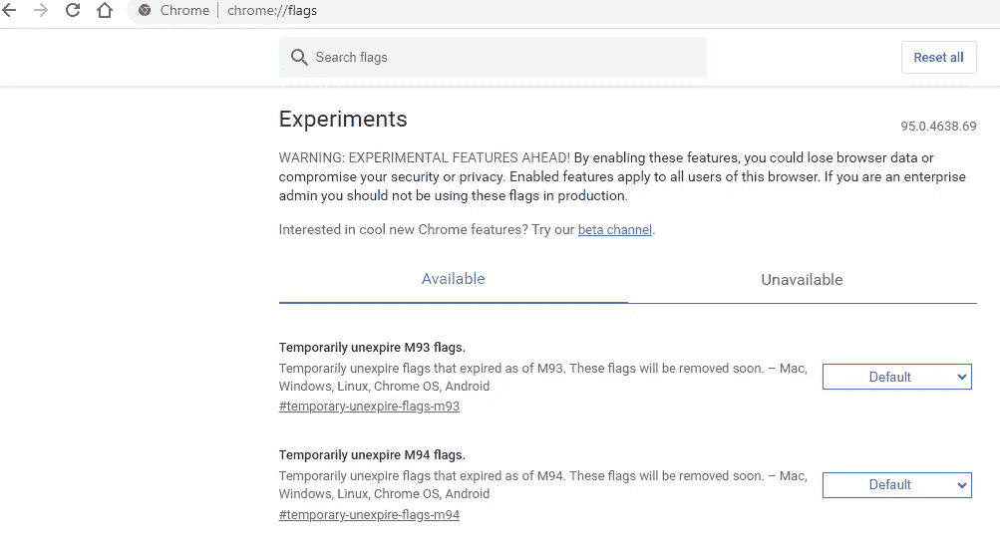

Chrome 的实验选项卡截图。

## 5.设备日志

这个命令显示最近的 Chrome 日志。

```
chrome://device-log
```

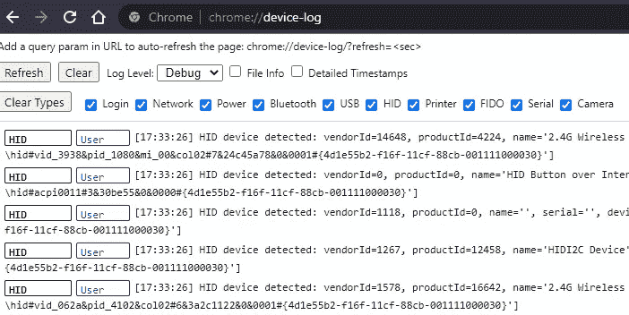

Chrome 的日志截图。

## 6.猛撞

该命令显示最近报告的崩溃。

```
chrome://crashes
```

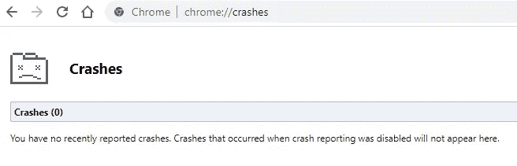

Chrome 的崩溃截图。

## 7.应用程序的

使用此命令，您可以列出浏览器中安装的应用程序。

```
chrome://apps/
```

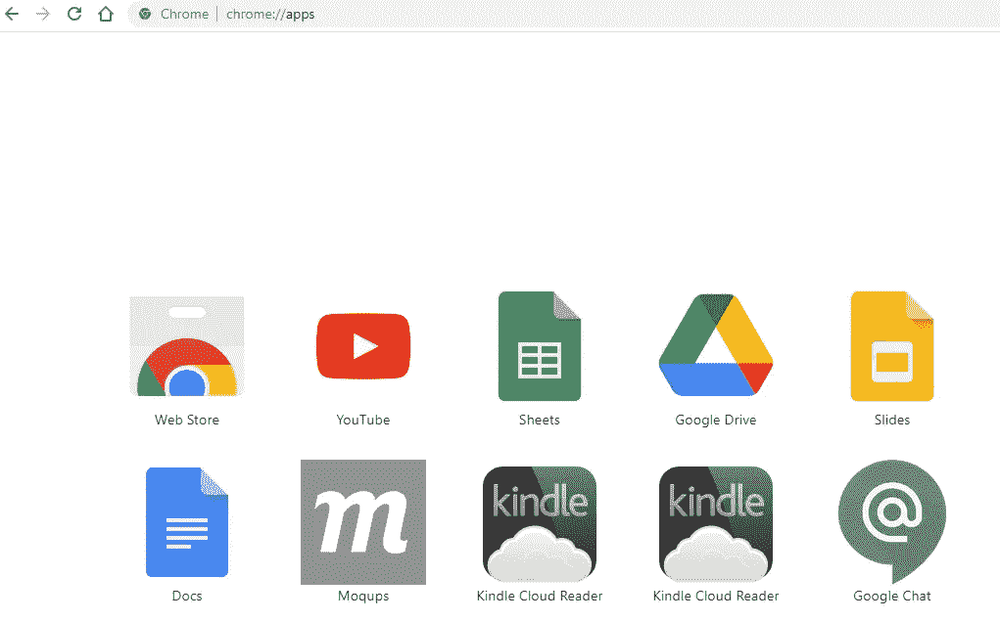

Chrome 已安装应用的截图。

## 8.书签

此命令显示您的书签页面。

```
chrome://bookmarks
```

## 9.自动填充内部

此命令返回一个列表，其中包含一段时间以来捕获的所有自动填充字段记录。

如果您希望重置所有已保存的表单域，使它们不会自动填充，这将非常有用。例如，用户名。

```
chrome://autofill-internals
```

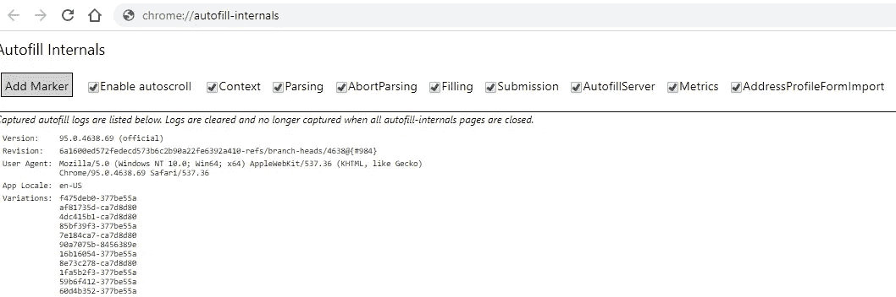

Chrome 的自动填充内部截图。

## 10.打开一个新标签

使用此命令，您可以打开一个新选项卡。

```
chrome://newtab
```

## 11.显示导航历史记录

如果您在地址栏中键入以下命令并导航到它，将会打开 web 浏览器的地址历史记录。

```
chrome://history
```

## 12.设置

使用这个命令，Chrome 的配置窗口将在当前标签中打开。

```
chrome://settings/
```

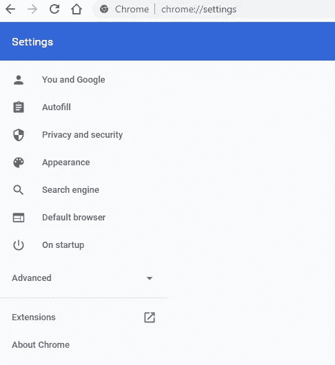

Chrome 的设置截图。

## 13.打印选项

您可以使用此命令显示打印预览页面。

```
chrome://print
```

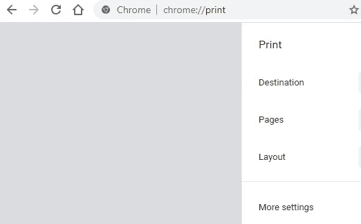

Chrome 的打印选项截图

## 14.系统

通过这个命令，你可以看到 Chrome 的系统诊断数据。比如 Chrome 的版本或者安装的扩展。

```
chrome://system/
```

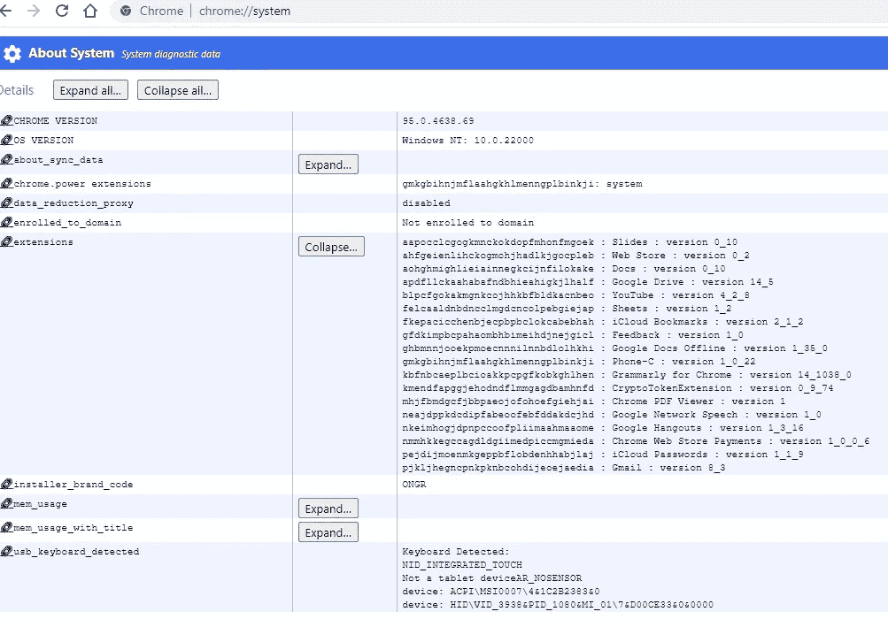

Chrome 的系统诊断数据截图。

## 15.用户操作

使用这个命令，您可以实时详细地监控用户操作。对调试有用。

```
chrome://user-actions/
```

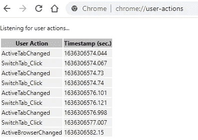

## 16.GPU 状态

通过这个命令，你可以看到你的 Chrome 的硬件加速功能。

```
chrome://gpu/
```

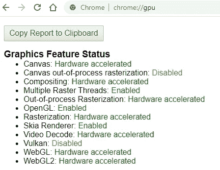

当前 Chrome 的 GPU 状态截图。

现在，您可以键入 chrome://flags/命令来启用或禁用前面的一些功能。

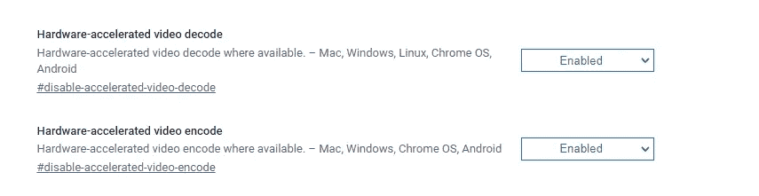

Chrome 的 GPU 选项截图。

## 17.描摹

这个命令显示了 Chrome 跟踪选项。您可以使用此功能来记录有关浏览器的重要数据。在跟踪性能问题时，例如一个进程正在等待另一个进程或其他相关的 GPU 问题时，它会很有帮助。

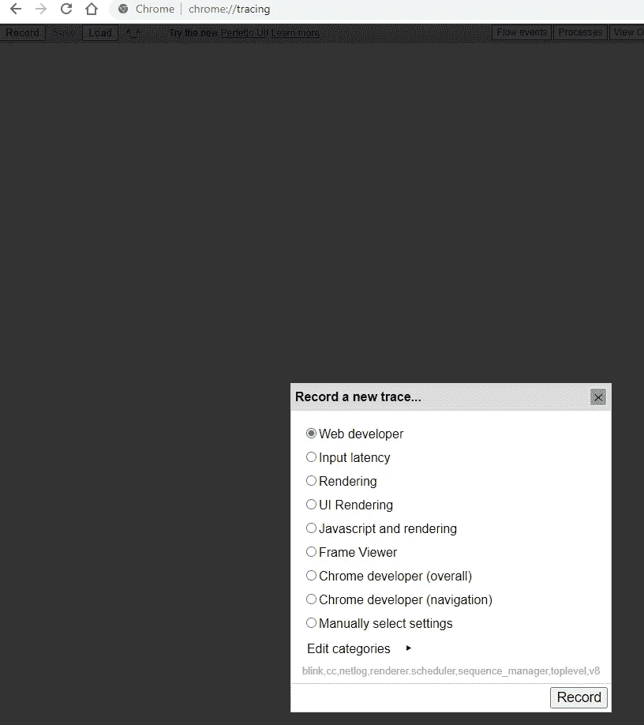

Chrome 的追踪选项截图。

## 18.下载内部资料

这个命令会打开内部下载管理页面，并显示所有 Chrome 下载的列表。

```
chrome://download-internals/
```

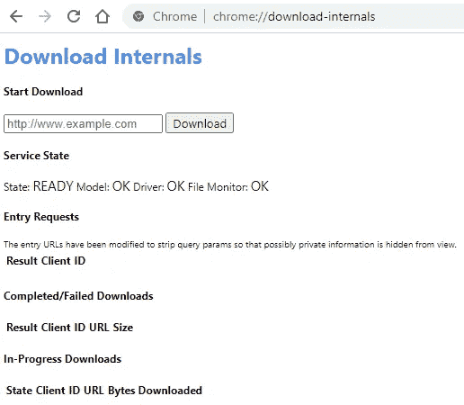

Chrome 的下载内部截图。

## 19.搜索引擎

使用此命令，您可以列出和修改浏览器的搜索引擎配置。

```
chrome://settings/searchEngines
```

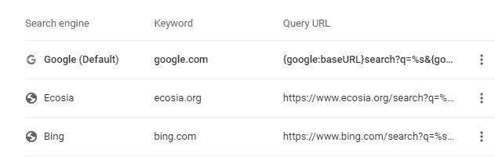

Chrome 的搜索引擎截图。

## 20.易接近

你可以使用这个命令在 Chrome 中打开一个带有可访问性内部表示的标签。你可以看到和修改 Chrome 的各种辅助模式。您还可以查看特定页面的可访问性树。

```
chrome://accessibility
```

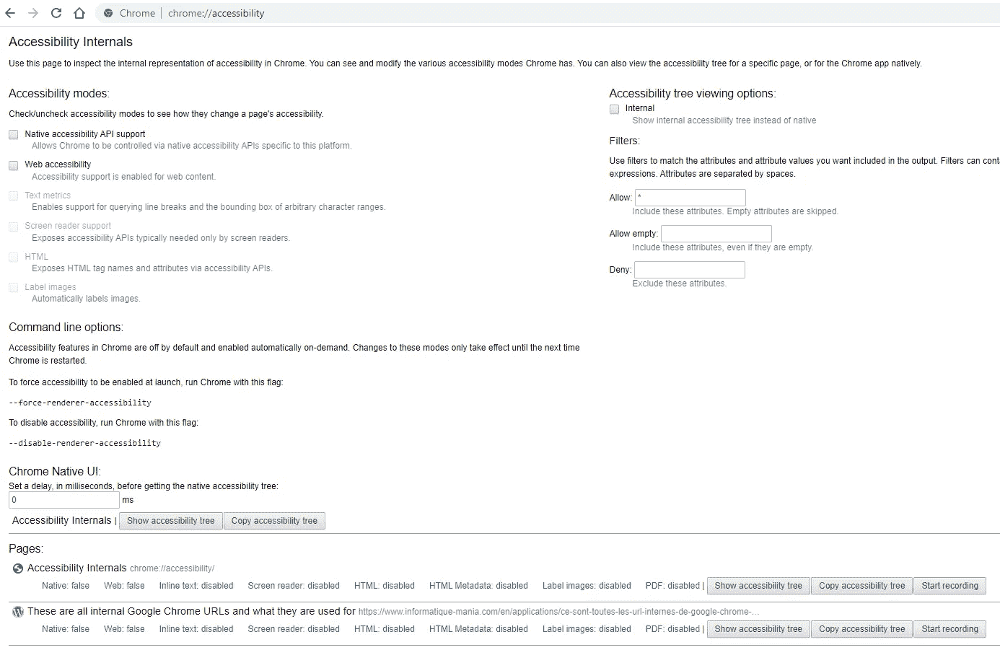

Chrome 的辅助功能选项截图。

## 21.信用

这个命令会打开一个标签，上面列出了 Chrome 正在使用的功能和组件。

```
chrome://credits/
```

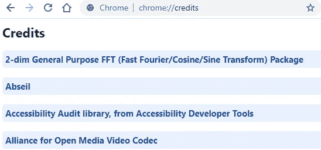

Chrome 的演职员表截图。

# Chrome 网址的完整列表

这个命令会显示一个标签，上面有 Chrome 内部 URL 的完整列表。

```
chrome://chrome-urls/
```

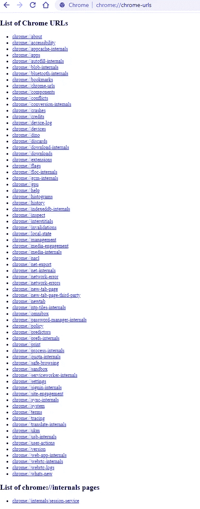

Chrome 的网址列表截图

我希望这篇文章对你有所帮助，或者至少是有趣的。感谢你阅读我！

保重！