# 21 个 VSCode 快捷键，让编码更快更有趣

> 原文：<https://betterprogramming.pub/21-vscode-shortcuts-to-make-coding-faster-and-more-fun-b18b25083def>

## 加速您的开发流程

作者:John Petalcurin @ Unsplash

所以你已经安装了一些很棒的工具或扩展来加速你的开发流程，并且过得很愉快。这很好，但是您可能会错过 VS code 提供的一些快捷方式。不是每个人都有时间浏览每一个快捷方式来找到帮助他们更快更有趣地编码的方式——有太多的！

此外，本文中列出的许多点都可以自定义绑定到键盘快捷键，所以请记住——您不需要在每次想要调用命令时使用*和*来打开命令面板。

在这篇文章中，我将列出我最喜欢的快捷方式，让我成为一个更快的编码者。我个人认为，当应用这些快捷方式时，编码变得有趣多了。看着我的时间被减少一半让我觉得很主动！

所以，这里有 21 个 VSCode 快捷键，让编码更快更有趣。

# 1.一次在所有文件中搜索文本

> Windows: Ctrl + Shift + F
> 
> Mac: Control + Shift + F

VS 代码中我最喜欢的特性之一是能够搜索项目目录中所有文件的匹配文本。最精彩的部分？简直是惊人的*快*！

要使用此功能，您可以按`Ctrl + Shift + F`打开视图。它会在编辑器的左侧显示这个侧栏:

通过键入文本并按下 *enter* ，VS code 将为您提供与文本匹配的结果列表，如下所示:

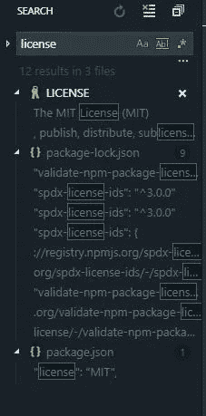

你也可以在一秒钟内一次替换每个结果文件中所有匹配的文本。如果您点击左侧的这个小箭头，它将在下方弹出第二个输入框，您可以在这里输入文本到*替换所有*，同时点击出现在右侧的小框:

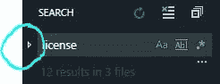

在时间最紧张的情况下，这个特性可以为您和您的团队节省大量时间。

# 2.设置选项卡的强调颜色(材料主题-非专有)

你是否厌倦了每天都看到相同的标签颜色？如果你正在使用 VS 代码的[素材主题](https://marketplace.visualstudio.com/items?itemName=Equinusocio.vsc-material-theme)扩展，你实际上可以为你的标签选择一个自定义的强调颜色，如下所示:

红色:

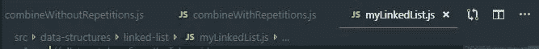

紫色:

黄色:

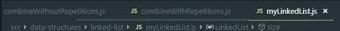

有 16 种不同的颜色可供选择！

因此，如果你有扩展，打开你的命令调色板(Ctrl + Shift + P)，选择*材质主题:设置强调色*并从列表中选择一种颜色，它将改变你的标签的下划线颜色，如下所示:

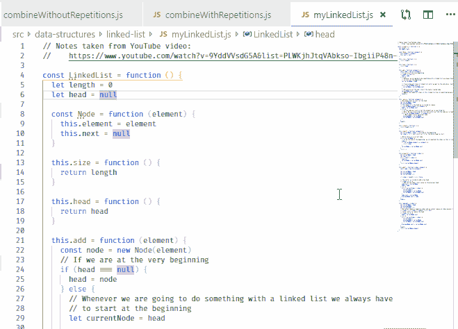

但是等一下…我在那个例子中没有使用材料主题。

这是因为安装了材质主题扩展，这个特性在你所有的主题中都是可用的。你不需要*使用*来使用材质主题来使用这个特性！

# 3.流程浏览器

你是否发现你的 VS 代码编辑器有时有点慢？有没有希望你能看一眼是什么在吞噬你的记忆？

如果你还不知道的话，VS code 有一个 Process Explorer 特性，它允许你打开一个这样的窗口:

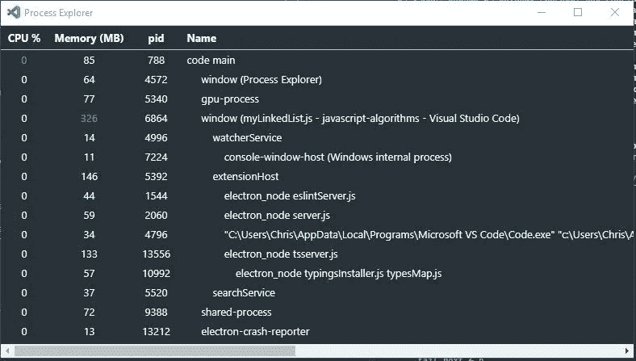

你觉得眼熟吗？

您可能已经从 windows [任务管理器](https://www.howtogeek.com/66622/stupid-geek-tricks-6-ways-to-open-windows-task-manager/)中看到了这一点，当您在 VS 代码编辑器的外按下 *Ctrl + Alt + Delete* **时，可以使用该任务管理器。**

# 4.展开括号选择

打开键盘快捷键，搜索*展开括号选择*

这是我花了一段时间才发现的事情之一，因为我根本猜不出这个特性的名字。

当我第一次从 YouTube 视频中看到有人使用它时，我知道我必须尽一切努力找到它，以便我可以分配一个键盘快捷键并在我的项目中使用它。

使用该功能将允许你自动选择整个*块，从开始的花括号到结束:*

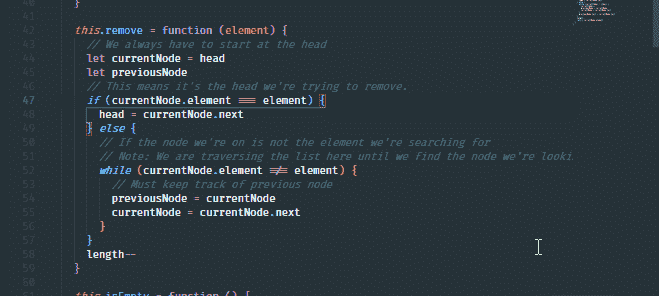

我发现这些在你想交换 if/else 块的情况下很有用。

# 5.重新打开关闭的编辑器

> 视窗:`Ctrl + Shift + T`
> 
> Mac: `Control + Shift + T`

当你在处理一个到处都是文件的大型项目时，当你不小心关闭了一个标签页，不得不在侧边菜单中再次搜索它时，这可能会有点令人沮丧，因为 VS 代码有自动扩展目录的习惯。

实际上，你可以通过按`Ctrl + Shift + T`来重新打开一个关闭的编辑器。你甚至可以打开之前的标签，甚至之前的标签，等等。这是标签专用的撤销功能。

# 6.通过匹配文本打开文件

> 视窗:`Ctrl + T`
> 
> 麦克:`Control + T`

说到搜索文件，您可以即时搜索和打开文件。这是我最喜欢的功能之一，因为你真的不需要手动点击目录来重新打开一个不再打开的文件。你不会相信这每天为我节省了多少时间。

我将键盘快捷键绑定到`Ctrl + T`来使用这个功能。当你按下这个按钮时，你可能会弹出一个*到文件*窗口中的符号。我从来没有真正使用过这个功能，所以我禁用了它。

如果您想将其绑定到热键，请打开键盘快捷键(文件>首选项>键盘快捷键)并搜索`workbence.action.quickOpen`。双击它并将`Ctrl + T`分配给它。

# 7.集成终端

你可以打开 VS code 的集成终端，按 Ctrl +`(反勾)就可以像普通 CLI 一样即时使用。永远不用离开你的 VS 代码编辑器的感觉是不是很棒？

# 8.运行扩展

你可以通过打开命令面板并输入“显示正在运行的扩展”来查看所有正在运行的扩展。

正如你可能已经猜到的，这将显示你正在运行的扩展列表。

…但这还不是全部。您还可以查看哪些扩展在激活时比其他扩展花费的时间更长。如果您曾经想知道为什么您的编辑器加载速度比平时慢，那么您的答案可能就在这个窗口中:

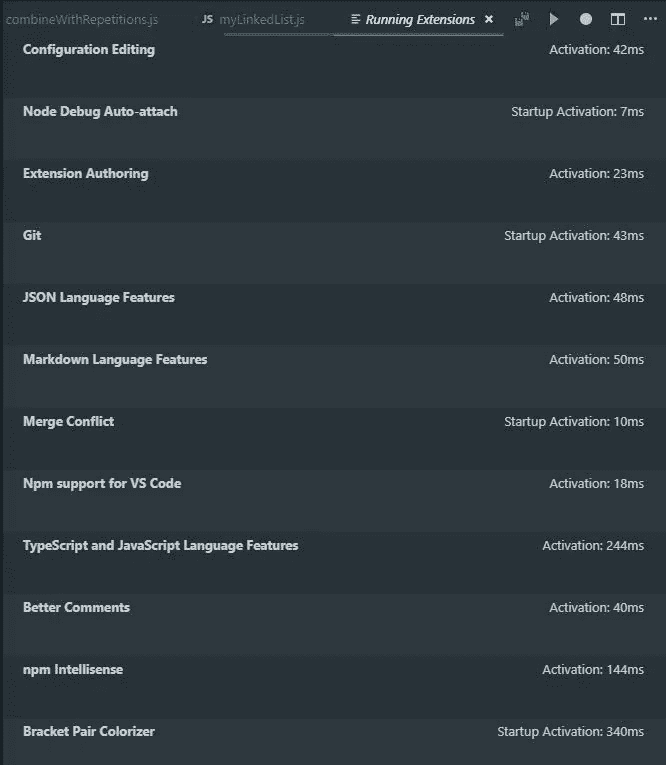

# 9.重新加载

我个人认为这是 VS 代码最酷的特性之一。它允许您在重新加载编辑器时将窗口保持在您的前面，同时具有与您关闭并重新打开它相同的效果。

按下`Ctrl + Alt + R`。(Mac: `Control + Option + R`)

# 10.交换选项卡以分离组

在我开发的时候，我有一个习惯，在错误的选项卡组中有一个选项卡。我也喜欢尽可能避免用鼠标来处理事情，因为这需要我把手从键盘上拿开。我的手很重——我想一直把它放在键盘上。

幸运的是，VS 代码有一种方法可以将一个选项卡转移到一个单独的选项卡组，通过按`Ctrl + Alt + Right Arrow` (Mac: `Control + Option + Right Arrow`)将一个选项卡移动到右边的组，或者按`Ctrl + Alt + Left Arrow` (Mac: `Control + Option + Left Arrow`)将一个选项卡移动到左边的组:

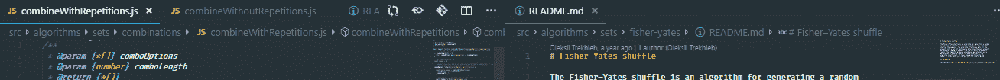

# 11.选择左侧/右侧的所有内容

有时你想删除光标左边或右边的所有内容。您可以选择光标右侧或左侧的所有内容。这提高了效率——它只是让事情变得更快。

例如，要选择右侧或左侧的所有内容:

windows:`Ctrl + Shift + Home/End`Mac:`Ctrl + Shift + Home/End`

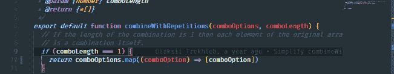

向右或向左选择*几乎*所有内容(将时间减半):

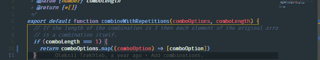

# 12.删除上一个单词

要删除前一个*字*，可以按`Ctrl + Backspace` (Mac: `Control + Delete`)。这在您犯了一个打字错误，并且您讨厌必须按住退格键才能找到您想要删除的部分的情况下非常有用:

你实际上可以在 vs 代码*之外的任何地方使用这个*:

# 13.启动性能

有时候，在试图找出为什么会出现性能问题的时候，缺少性能问题的细节真的很痛苦。

有时，如果你足够幸运，你会找到一个工具，给你所有的答案。在 VS 代码中，启动性能是重中之重。这就是为什么您能够弹出一个有用的窗口，奇迹般地显示您需要的所有信息:

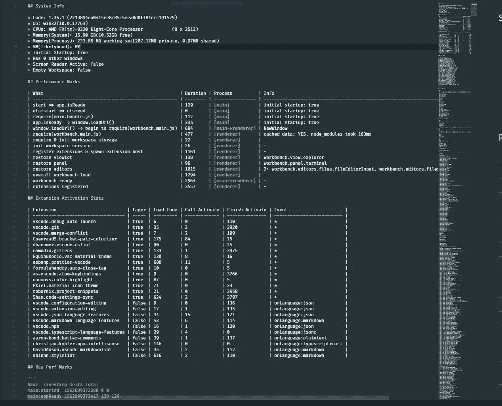

因此，请打开您的命令面板，搜索*启动性能*！

# 14.用词选择

您可以使用快捷键`Ctrl + Shift + Right Arrow` (Mac: `Control + Shift + Right Arrow`)和`Ctrl + Shift + Left Arrow` (Mac: `Control + Shift + Left Arrow`)逐字选择文本。

这对于快速选择单词非常有用:

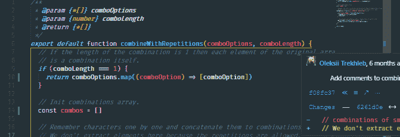

# 15.双线电路

一个非常强大和众所周知的功能是复制行的能力。只需按下`Ctrl + Shift + D` (Mac: `Control + Shift + D`):

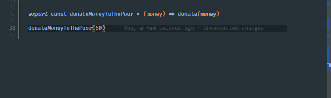

# 16.移动到文件的开头/结尾

将光标移动到文件的第一行或最后一行的最快方法是按`Ctrl + Home` (Mac: `Control + Home`)转到开头，按`Ctrl + End` (Mac: `Control + End`)转到结尾。

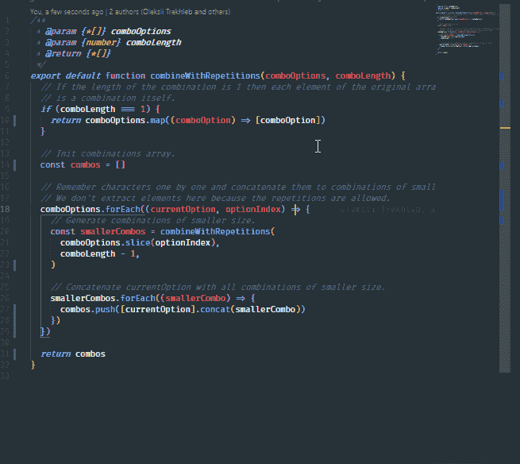

# 17.替换当前文件中所有匹配的文本

当我开始编码时，我不得不用鼠标手动选择匹配的事件。我很高兴那些日子已经过去了，因为 VS 代码提供了一个*改变所有事件*的特性。

您可以选择任何一组文本，如果该选择出现多次，您可以通过按`Ctrl + F2` (Mac: `Control + F2`)一次选择并修改所有出现的文本。个人觉得`Alt + F3` (Mac: `Option + F3`)在手腕上感觉稍微轻松一点。

# 18.向上/向下移动线条

每 10 分钟上下移动一行是很有用的。

按`Alt + Up Arrow` (Mac: `Option + Up Arrow`)上移，按`Alt + Down Arrow` (Mac: `Option + Down Arrow`)下移。

# 19.删除一行

有两种方法可以立即删除一行。

用`Ctrl + X`覆盖剪贴板(Mac: `Control + X`):

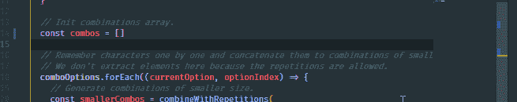

用`Ctrl + Shift + K` (Mac: `Control + Shift + K`)保存剪贴板。我个人比较喜欢`Ctrl + Alt + D` (Mac: `Control + Option + D`):

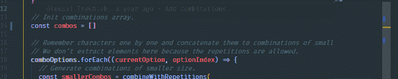

# 20.向左或向右移动编辑器

如果你像我一样，你可能会有一种无法控制的欲望，要对一个组中的选项卡进行重新排序，在这个组中，选项卡彼此相关，左边的选项卡是*高级*文件，而右边的文件是*低级*。

你可以通过使用命令`Move Editor Left`和`Move Editor Right`更容易地控制它。我将它们分别分配给`Ctrl + Num Pad 4` (Mac: `Control + Num Pad 4`)和`Ctrl + Num Pad 6` (Mac: `Control + Num Pad 6`)，这样对我来说更直观:

# 21.在上方/下方添加光标

复制游标可以说是 VS 代码中最节省时间的特性。这在类似 typescript 的情况下非常有用:

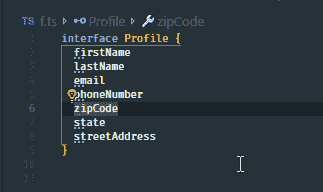

按`Ctrl + Alt + Up Arrow` (Mac: `Control + Option + Up Arrow`)将光标添加到上方，或按`Ctrl + Alt + Down Arrow` (Mac: `Control + Option + Down Arrow`)将光标添加到下方。

# 结论

这篇文章到此结束——我希望你找到了一个新的快捷方式！以后请留意我的帖子！